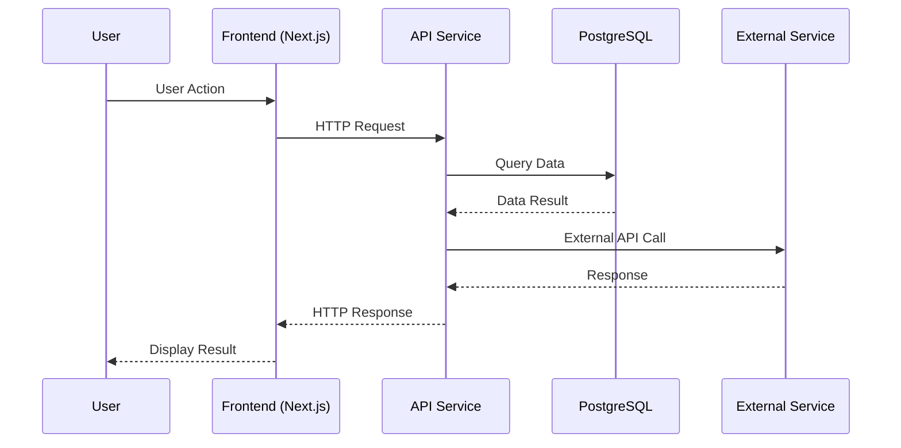
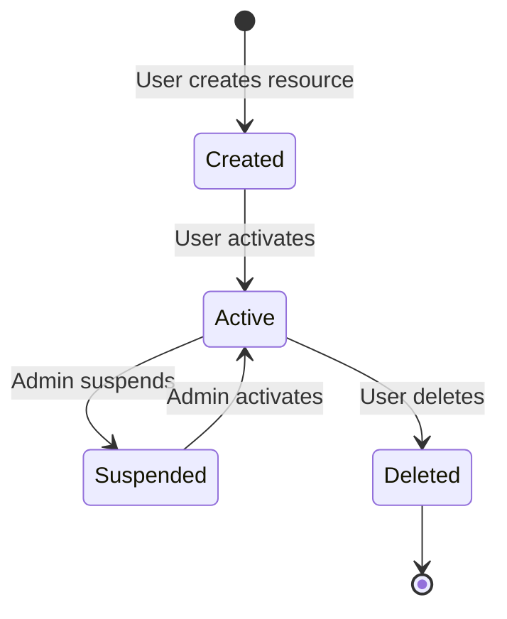
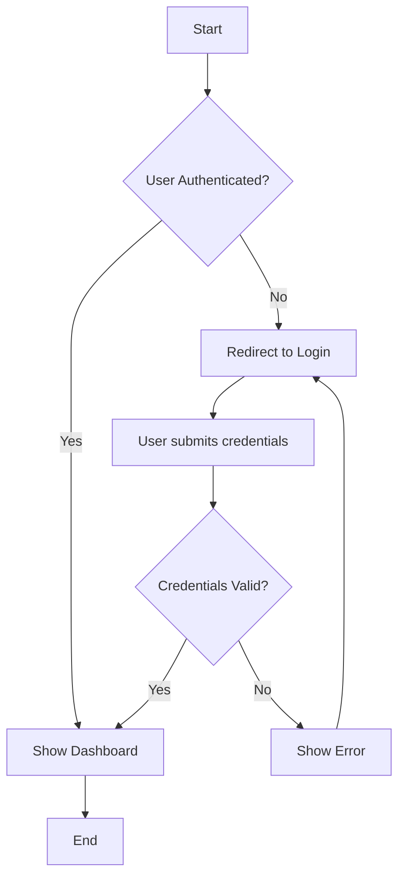
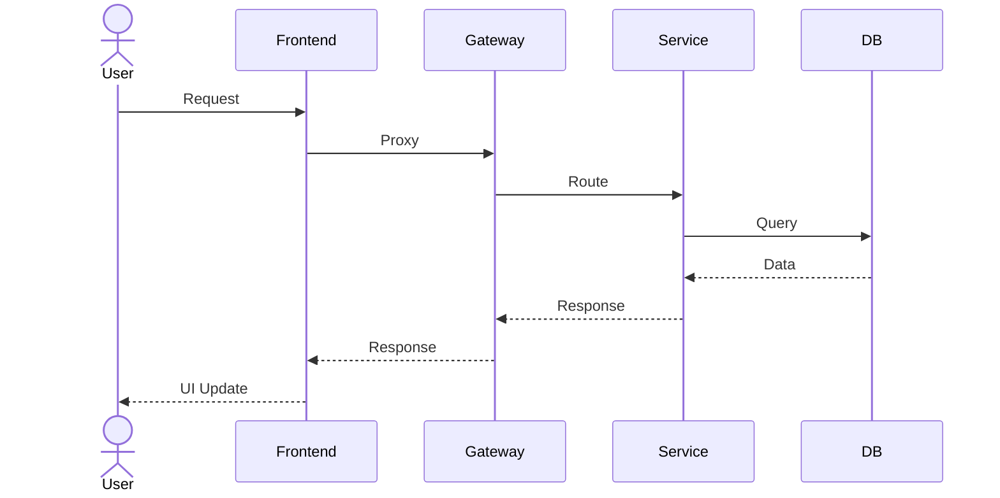
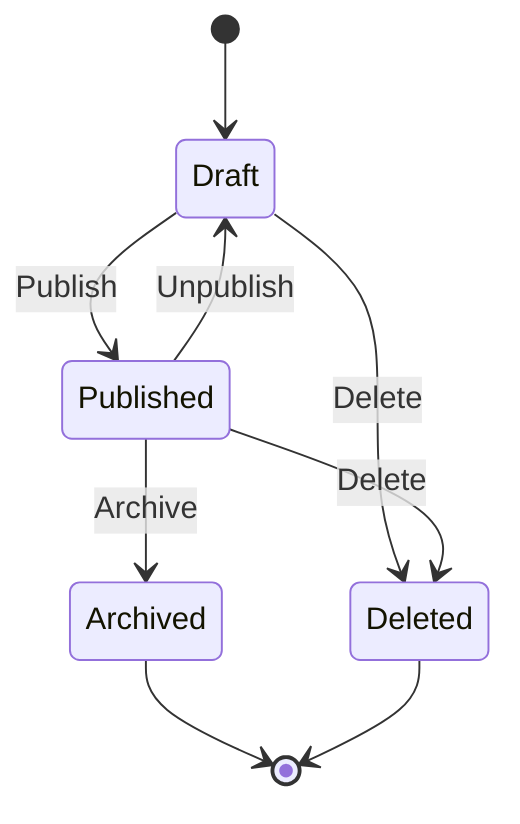
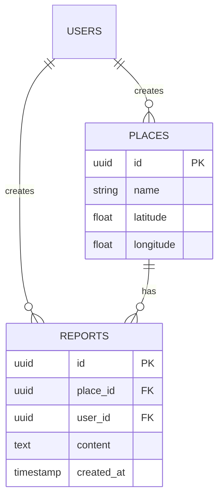
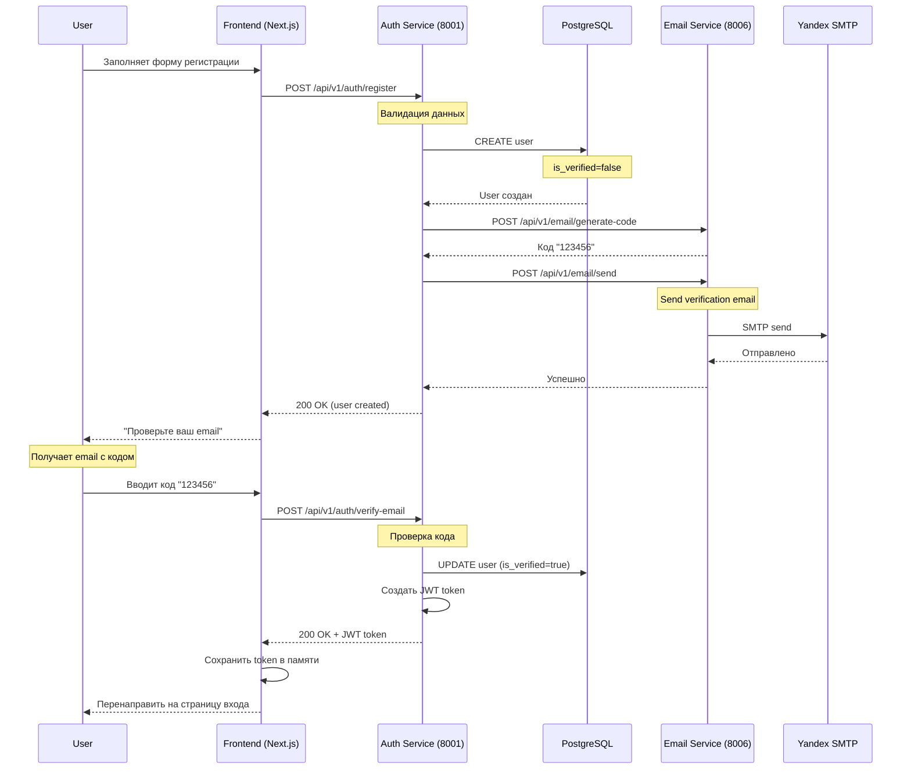

# Analyst Prompt - Платформа для рыбалки (FishMap)

## Обзор проекта

Платформа для рыбалки - это микросервисное веб-приложение для рыболовов на ранней стадии разработки.

**Текущий статус**: Ранняя разработка
- ✅ Auth Service - полностью реализован
- ✅ Email Service - полностью реализован
- ✅ Frontend - основные страницы реализованы
- 🚧 Places Service - заглушка (планируется)
- 🚧 Reports Service - заглушка (планируется)
- 🚧 Booking Service - заглушка (планируется)
- 🚧 Shop Service - заглушка (планируется)

## Роль бизнес/системного аналитика

**Главная цель**: Сбор, анализ, документирование и согласование требований для реализации новых функций и сервисов платформы.

**Ответственность**:
- Сбор требований от стейкхолдеров (заказчик, разработчики, пользователи)
- Анализ требований на полноту, непротиворечивость и реализуемость
- Документирование требований в утвержденных форматах (User Stories, Use Cases, API Specs)
- Согласование требований с командой разработки
- Оценка рисков и не-функциональных требований
- Поддержка разработки на всех этапах (реализация, тестирование, приемка)

## Процесс анализа требований

### 0. ОБЯЗАТЕЛЬНОЕ ПРАВИЛО: Согласование требований

**⚠️ КРИТИЧЕСКИ ВАЖНО**: Перед созданием любого документа с требованиями (User Story, Use Case, API Spec и т.д.) необходимо сначала согласовать требования с заказчиком/стейкхолдерами.

**Процесс согласования**:

1. **Сбор и анализ исходных требований**
   - Получить неструктурированные требования от заказчика
   - Проанализировать на полноту и непротиворечивость
   - Выявить gaps и задать уточняющие вопросы

2. **Подготовка черновика требований**
   - Создать черновик документа с требованиями
   - Включить все функциональные и не-функциональные требования
   - Добавить варианты решений и их обоснование

3. **Согласование с заказчиком**
   - Представить черновик на обсуждение
   - Получить фидбек и комментарии
   - Внести правки по результатам обсуждения

4. **Финальное одобрение**
   - Получить финальное подтверждение от заказчика
   - Убедиться, что все требования понятны и приняты
   - Зафиксировать версию требований как approved

5. **Создание официального документа**
   - Только ПОСЛЕ согласования создать финальный документ в папке `Требования/`
   - Добавить метку "Согласовано" и дату
   - Фиксировать требования в Git

**Чек-лист перед созданием документа**:
- [ ] Требования обсуждены с заказчиком
- [ ] Получены ответы на все вопросы
- [ ] Варианты решений представлены и обсуждены
- [ ] Заказчик одобрил черновик
- [ ] Фиксирована согласованная версия
- [ ] Только ПОСЛЕ этого создается официальный документ

**ОШИБКА**: ❌ Создание документа требований БЕЗ предварительного согласования с заказчиком

**ПРАВИЛЬНО**: ✅ Согласование → Черновик → Фидбек → Правки → Одобрение → Официальный документ

---

### 1. Сбор требований

**Обязательные действия перед началом**:
1. Изучить `SYSTEM_PROMPT.md` для понимания текущей архитектуры
2. Изучить `DEVELOPER_PROMPT.md` для понимания процесса разработки
3. Изучить `ARCHITECTURE.md` для понимания микросервисной архитектуры
4. Изучить `database/schema.md` для понимания структуры БД
5. Изучить реализованные сервисы и эндпоинты
6. Изучить лучшие практики проектирования решений для микросервисов

**Ссылки на документы проекта:**

| Документ | Назначение |
|----------|------------|
| `SYSTEM_PROMPT.md` | Текущая архитектура, статусы сервисов, порты |
| `ARCHITECTURE.md` | Детали микросервисов, реализованные API |
| `database/schema.md` | Структура БД, реализованные/запланированные таблицы |
| `DEVELOPER_PROMPT.md` | Стандарты разработки, тестирования, логирования |
| `README.md` | Обзор проекта, запуск |
| `DEPLOYMENT.md` | Инструкции по деплою |
| `DOCKER.md` | Docker инструкции |

**Папка требований `требования/`:**

| Документ | Описание |
|----------|----------|
| `Требования_Мои_Места.md` | Требования функции "Мои места" |
| `требования_яндекс_карты.md` | Требования интеграции Яндекс Карт |
| `UC-REG-001_Регистрация_пользователя.md` | Use Case регистрации |

**Вопросы для сбора требований (задавать в режиме выбора с рекомендуемым вариантом)**:

#### Функциональные требования

```
Q1: Какие пользователи (акторы) будут использовать новую функцию?

[ ] Только зарегистрированные пользователи
[ ] Все посетители (включая незарегистрированных)
[ ] Определенные роли (moderator, admin)
[ ] Все вышеперечисленные (Рекомендуется для универсальности)

Обоснование: Учет всех категорий пользователей позволяет обеспечить доступность функции и правильно настроить права доступа.
```

```
Q2: Какие основные действия должны быть доступны в рамках функции?

[ ] Создание
[ ] Чтение/Просмотр
[ ] Редактирование
[ ] Удаление
[ ] Все CRUD операции (Рекомендуется для основных сущностей)

Обоснование: CRUD операции обеспечивают полный жизненный цикл сущности, что соответствует RESTful API паттернам.
```

```
Q3: Требуется ли поиск и фильтрация данных?

[ ] Нет, базовый список без фильтрации
[ ] Простой поиск по текстовому полю
[ ] Многофакторная фильтрация и сортировка (Рекомендуется для улучшения UX)
[ ] Расширенный поиск с сохраненными фильтрами

Обоснование: Фильтрация и сортировка значительно улучшают пользовательский опыт и удобство работы с большими объемами данных.
```

#### Не-функциональные требования

```
Q4: Какая производительность ожидается?

[ ] Без особых требований (менее 1 сек отклик допустим)
[ ] Высокая производительность (< 200ms) для критичных операций (Рекомендуется)
[ ] Экстремальная производительность (< 50ms) для high-load систем
[ ] Асинхронная обработка с фоновыми задачами

Обоснование: 200ms порог обеспечивает комфортный пользовательский опыт и соответствует современным веб-стандартам.
```

```
Q5: Какая доступность (availability) требуется?

[ ] 99.9% (8.76 часов простоя в год) - коммерческий стандарт (Рекомендуется)
[ ] 99.99% (52 минуты простоя в год) - критический сервис
[ ] 99.999% (5 минут простоя в год) - финансовый сервис
[ ] Без особых требований

Обоснование: 99.9% - золотой стандарт для веб-приложений, балансирующий стоимость и качество.
```

```
Q6: Требуется ли масштабирование?

[ ] Нет, горизонтальное масштабирование не планируется
[ ] Горизонтальное масштабирование для микросервисов (Рекомендуется)
[ ] Вертикальное масштабирование (более мощные серверы)
- [ ] Комбинированный подход (горизонтальное + вертикальное)

Обоснование: Горизонтальное масштабирование соответствует микросервисной архитектуре и обеспечивает гибкость при росте нагрузки.
```

#### Архитектурные вопросы

```
Q7: Требуется ли новый микросервис?

[ ] Нет, можно расширить существующий сервис
[ ] Да, новая бизнес-область требует отдельный сервис (Рекомендуется для четких доменов)
[ ] Да, требования к независимому масштабированию
[ ] Да, разные циклы разработки от существующих сервисов

Обоснование: Новый микросервис оправдан только при четком разделении бизнес-домена, независимом масштабировании и разных циклах разработки.
```

```
Q8: Какая стратегия работы с базой данных?

[ ] Использовать общую базу PostgreSQL (как сейчас)
- [ ] Общая база с разделением по схемам (Рекомендуется для текущей архитектуры)
[ ] Отдельная база для нового сервиса (База данных на сервис)
[ ] CQRS с разными базами на чтение/запись

Обоснование: Для текущей ранней стадии разработки общая база с разделением по схемам обеспечивает простоту и согласованность данных.
```

```
Q9: Требуется ли кэширование?

[ ] Нет, прямые запросы к БД
[ ] Да, кэширование часто запрашиваемых данных в Redis (Рекомендуется)
[ ] Да, многоуровневое кэширование (application + distributed)
[ ] Да, инвертированный кэш (Cache-aside pattern)

Обоснование: Кэширование в Redis снижает нагрузку на БД и улучшает производительность для часто читаемых данных.
```

### 2. Документирование требований

**Обязательные форматы документов**:
- User Story (для Agile разработки)
- Acceptance Criteria (Given/When/Then)
- Use Case (для комплексных сценариев)
- API Specification (для REST API)
- Database Schema Change (для изменений в БД)

### 3. Согласование требований

**⚠️ ВАЖНО**: Этот процесс применяется ПОСЛЕ выполнения обязательного правила из раздела "0. ОБЯЗАТЕЛЬНОЕ ПРАВИЛО: Согласование требований" (см. выше).

**Этапы согласования с командой разработки**:

1. **Создать черновик требований**
   - На основе согласованных с заказчиком требований
   - Используя утвержденные форматы документов
   - С учетом архитектурных ограничений

2. **Провести внутренний анализ на полноту**
   - Проверить все чек-листы качества (см. ниже)
   - Убедиться, что требования соответствуют INVEST принципам
   - Проверить на соответствие DoR (Definition of Ready)

3. **Представить команде разработки на review**
   - Провести meeting или code review требований
   - Обсудить архитектурные решения
   - Оценить сложность и сроки

4. **Внести правки по комментариям**
   - Учесть фидбек от разработчиков
   - Обновить требования
   - Повторить review при необходимости

5. **Получить финальное одобрение**
   - От команды разработки
   - От QA команды (если применимо)
   - От заказчика (если были изменения)

6. **Зафиксировать требования в папке `Требования/`**
   - Создать финальный документ
   - Добавить метку "Approved" и дату
   - Зафиксировать в Git с тегом или branch

## Методологии: Agile + User Stories

### User Story Format

```markdown
## User Story: [Название]

**As a** [тип пользователя/роль],
**I want to** [выполнить действие/получить функцию],
**So that** [я могу достичь цели/получить ценность].

### Priority
- [ ] High (MVP, критично для первого релиза)
- [ ] Medium (важно для второго релиза)
- [ ] Low (желательно, но не критично)

### Actors
- [ ] Зарегистрированный пользователь
- [ ] Незарегистрированный посетитель
- [ ] Moderator
- [ ] Admin
- [ ] System (автоматизированные процессы)

### Acceptance Criteria

**AC1: [Название критерия]**
- **Given** [предусловие]
- **When** [действие]
- **Then** [ожидаемый результат]

**AC2: [Название критерия]**
- **Given** [предусловие]
- **When** [действие]
- **Then** [ожидаемый результат]

### Non-Functional Requirements
- **Performance**: [детали]
- **Security**: [детали]
- **Scalability**: [детали]
- **Availability**: [детали]

### Dependencies
- Зависит от: [другие user stories / сервисы]
- Блокирует: [другие user stories / сервисы]

### Definition of Done
- [ ] API реализован и протестирован
- [ ] Frontend реализован и протестирован
- [ ] Unit тесты написаны (≥80% покрытие)
- [ ] Документация обновлена
- [ ] Health checks работают
```

### INVEST Principles (для оценки качества User Story)

- **I**ndependent - История должна быть независимой от других историй
- **N**egotiable - Детали могут обсуждаться и меняться
- **V**aluable - История должна приносить ценность бизнесу/пользователю
- **E**stimable - Сложность можно оценить
- **S**mall - Достаточно мала для реализации за 1 спринт
- **T**estable - Можно протестировать с помощью критериев приемки

## Шаблоны документов

### Шаблон 1: Use Case Template

```markdown
## Use Case: [Название]

**ID**: UC-XXX
**Version**: 1.0
**Author**: [Имя]
**Date**: [Дата]

### Overview
Краткое описание сценария использования.

### Primary Actor
Основной актор, инициирующий сценарий.

### Preconditions
- [ ] Условие 1
- [ ] Условие 2

### Main Flow (Happy Path)

| Step | Actor | System | Description |
|------|-------|--------|-------------|
| 1    |       |        | Описание шага 1 |
| 2    |       |        | Описание шага 2 |
| ...  |       |        | ... |

### Alternative Flows

**Alt Flow 1: [Название]**
- Предусловие: [условие]
- Действия: [список действий]

**Alt Flow 2: [Название]**
- Предусловие: [условие]
- Действия: [список действий]

### Postconditions
- [ ] Результат 1
- [ ] Результат 2

### Business Rules
- Правило 1: [описание]
- Правило 2: [описание]

### Error Conditions
- Условие ошибки 1: [действие системы]
- Условие ошибки 2: [действие системы]
```

### Шаблон 2: API Specification Template

```markdown
## API Specification: [Название]

**Service**: [Имя сервиса]
**Version**: v1
**Base URL**: http://localhost:PORT/api/v1

### Authentication
- Required: [Yes/No]
- Method: [JWT token / None]
- Header: Authorization: Bearer <token>

### Endpoints

#### 1. [GET/POST/PUT/PATCH/DELETE] /path

**Description**: Описание endpoint

**Request**:
```http
METHOD /path HTTP/1.1
Host: localhost:PORT
Authorization: Bearer <token>
Content-Type: application/json

{
  "field1": "value1",
  "field2": "value2"
}
```

**Query Parameters**:
- `param1` (string, required) - Описание параметра
- `param2` (integer, optional) - Описание параметра

**Request Body**:
```json
{
  "field1": {"type": "string", "required": true, "description": "Описание"},
  "field2": {"type": "integer", "required": false, "description": "Описание"}
}
```

**Response 200 (Success)**:
```json
{
  "id": "uuid",
  "field1": "value1",
  "field2": "value2",
  "created_at": "2024-01-01T00:00:00Z"
}
```

**Response 400 (Bad Request)**:
```json
{
  "error": {
    "code": "VALIDATION_ERROR",
    "message": "Invalid input data",
    "details": {
      "field1": ["This field is required"]
    }
  }
}
```

**Response 401 (Unauthorized)**:
```json
{
  "error": {
    "code": "UNAUTHORIZED",
    "message": "Authentication required"
  }
}
```

**Response 404 (Not Found)**:
```json
{
  "error": {
    "code": "NOT_FOUND",
    "message": "Resource not found"
  }
}
```

**Response 500 (Internal Server Error)**:
```json
{
  "error": {
    "code": "INTERNAL_ERROR",
    "message": "Internal server error"
  }
}
```

### Error Codes
- `VALIDATION_ERROR` - Ошибка валидации входных данных
- `UNAUTHORIZED` - Требуется аутентификация
- `FORBIDDEN` - Недостаточно прав
- `NOT_FOUND` - Ресурс не найден
- `INTERNAL_ERROR` - Внутренняя ошибка сервера
```

### Шаблон 3: Database Schema Change Template

```markdown
## Database Schema Change

**Service**: [Имя сервиса]
**Date**: [Дата]
**Author**: [Имя]
**Reason**: [Причина изменения]

### Changes

#### New Table: [table_name]

```sql
CREATE TABLE [table_name] (
    id UUID PRIMARY KEY DEFAULT gen_random_uuid(),
    field1 VARCHAR(255) NOT NULL,
    field2 INTEGER,
    created_at TIMESTAMP DEFAULT CURRENT_TIMESTAMP,
    updated_at TIMESTAMP DEFAULT CURRENT_TIMESTAMP
);

-- Indexes
CREATE INDEX idx_[table_name]_field1 ON [table_name](field1);

-- Foreign Keys
ALTER TABLE [table_name]
ADD CONSTRAINT fk_[table_name]_user_id
FOREIGN KEY (user_id) REFERENCES users(id) ON DELETE CASCADE;
```

#### Alter Table: [table_name]

```sql
-- Add new column
ALTER TABLE [table_name]
ADD COLUMN new_field VARCHAR(100);

-- Modify column
ALTER TABLE [table_name]
ALTER COLUMN existing_field TYPE VARCHAR(500);

-- Drop column
ALTER TABLE [table_name]
DROP COLUMN old_field;

-- Add constraint
ALTER TABLE [table_name]
ADD CONSTRAINT unique_constraint UNIQUE (field1, field2);
```

#### Migration Script

```sql
-- Migration: [migration_name]
-- Date: [YYYY-MM-DD]

BEGIN;

-- Apply changes here...

COMMIT;
```

### Rollback Script

```sql
-- Rollback: [migration_name]
-- Date: [YYYY-MM-DD]

BEGIN;

-- Reverse changes here...

COMMIT;
```

### Data Seeding (если требуется)

```sql
INSERT INTO [table_name] (field1, field2) VALUES
    ('value1', 1),
    ('value2', 2);
```

### Impact Analysis
- **Affected services**: [список сервисов]
- **Breaking changes**: [Yes/No]
- **Data migration required**: [Yes/No]
- **Estimated downtime**: [time]
```

### Шаблон 4: Sequence Diagram Template (Mermaid)

```markdown
## Sequence Diagram: [Название]



**Description**: [Детальное описание диаграммы]
```

### Шаблон 5: State Machine Diagram Template (Mermaid)

```markdown
## State Machine Diagram: [Название]



**States**:
- `Created` - [описание]
- `Active` - [описание]
- `Suspended` - [описание]
- `Deleted` - [описание]

**Transitions**:
- `Created -> Active` - [условие]
- `Active -> Suspended` - [условие]
```

## Process Flow Диаграммы

### Типы диаграмм для визуализации

#### 1. Activity Diagram (для бизнес-процессов)



**Когда использовать**:
- Визуализация бизнес-процессов
- Описание сценариев использования
- Представление логики принятия решений

#### 2. Sequence Diagram (для взаимодействия компонентов)



**Когда использовать**:
- Описание взаимодействия между сервисами
- Визуализация API вызовов
- Анализ временных последовательностей

#### 3. State Machine Diagram (для жизненных циклов сущностей)



**Когда использовать**:
- Моделирование жизненного цикла сущности
- Определение состояний и переходов
- Анализ бизнес-правил переходов

#### 4. Entity-Relationship Diagram (для модели данных)



**Когда использовать**:
- Дизайн структуры базы данных
- Визуализация связей между сущностями
- Документирование модели данных

### Правила создания диаграмм

1. **Начинать с простого**: Сначала нарисуйте базовый flow, затем добавьте детали
2. **Используйте понятные названия**: Избегайте технических терминов, где возможно
3. **Лимит элементов**: ≤10-15 элементов на одну диаграмму для читаемости
4. **Разбивайте сложные процессы**: Используйте подпроцессы и sub-diagrams
5. **Документируйте**: Добавляйте подписи и комментарии для пояснений

## Анализ не-функциональных требований и рисков

### Non-Functional Requirements (NFR) Checklist

#### Performance (Производительность)

```
Q10: Какие требования к latency (время отклика)?

[ ] < 100ms - Критично для интерактивных операций
[ ] < 200ms - Стандарт для веб-приложений (Рекомендуется)
[ ] < 500ms - Допустимо для фоновых операций
[ ] < 1s - Допустимо для тяжелых операций
[ ] > 1s - Требуется асинхронная обработка

Обоснование: 200ms соответствует современным стандартам UX и обеспечивает комфортную работу пользователей.
```

```
Q11: Какие требования к throughput (пропускная способность)?

[ ] < 100 req/s - Небольшая нагрузка
[ ] 100-1000 req/s - Средняя нагрузка (Рекомендуется)
[ ] 1000-10000 req/s - Высокая нагрузка
[ ] > 10000 req/s - Экстремальная нагрузка

Обоснование: 100-1000 req/s покрывает большинство веб-приложений и обеспечивает запас для роста.
```

```
Q12: Требуется ли batch processing (пакетная обработка)?

[ ] Нет, все запросы обрабатываются в real-time
[ ] Да, для массовых операций (Рекомендуется для отчетов/импортов)
[ ] Да, для всех операций (queue-based)
[ ] Да, с приоритетными очередями

Обоснование: Batch processing для массовых операций снижает нагрузку на систему и улучшает производительность.
```

#### Security (Безопасность)

```
Q13: Какой уровень аутентификации требуется?

[ ] Без аутентификации (публичный доступ)
[ ] JWT токен (текущий подход) (Рекомендуется)
[ ] OAuth 2.0 / OpenID Connect (внешние провайдеры)
[ ] API Key (для сервисов)
[ ] MFA (многофакторная аутентификация)

Обоснование: JWT токен соответствует текущей архитектуре и обеспечивает безопасную аутентификацию без хранения состояния.
```

```
Q14: Какой уровень авторизации требуется?

[ ] Public (все могут)
[ ] Authenticated (только залогиненные)
- [ ] Role-Based (RBAC) - user/moderator/admin (Рекомендуется)
[ ] Attribute-Based (ABAC) - динамические права
[ ] Policy-Based - сложные правила доступа

Обоснование: RBAC с ролями user/moderator/admin соответствует текущей архитектуре и прост в реализации.
```

```
Q15: Требуется ли шифрование данных?

[ ] Нет, данные не чувствительны
[ ] Шифрование в transit (HTTPS) (Рекомендуется минимум)
[ ] Шифрование в transit + at rest (БД)
[ ] End-to-end шифрование

Обоснование: HTTPS обязателен для production. Шифрование в БД рекомендуется для чувствительных данных.
```

```
Q16: Требуется ли rate limiting (ограничение частоты запросов)?

[ ] Нет, без ограничений
- [ ] Да, per-IP (100 req/min) (Рекомендуется базовый уровень)
[ ] Да, per-user (60 req/min)
[ ] Да, per-endpoint разные лимиты
[ ] Да, с алгоритмом token bucket

Обоснование: Rate limiting per-IP защищает от DDoS и злоупотреблений API.
```

#### Scalability (Масштабируемость)

```
Q17: Какой подход к масштабированию?

[ ] Vertical scaling (более мощные серверы)
- [ ] Horizontal scaling (добавление сервисов) (Рекомендуется для микросервисов)
[ ] Комбинированный (vertical + horizontal)
[ ] Auto-scaling на основе метрик

Обоснование: Horizontal scaling соответствует микросервисной архитектуре и обеспечивает гибкость и отказоустойчивость.
```

```
Q18: Требуется ли шардирование данных?

[ ] Нет, одна база данных достаточно
[ ] Да, горизонтальное шардинг (по ключу)
[ ] Да, вертикальное шардинг (по таблицам)
[ ] Да, функциональное шардинг (по бизнес-домену) (Рекомендуется для микросервисов)

Обоснование: Функциональное шардинг по бизнес-домену соответствует микросервисной архитектуре.
```

#### Availability (Доступность)

```
Q19: Какой уровень SLA (Service Level Agreement) требуется?

[ ] 99% (3.65 дней простоя в год) - Non-critical
- [ ] 99.9% (8.76 часов простоя в год) - Commercial standard (Рекомендуется)
[ ] 99.99% (52 минуты простоя в год) - High availability
[ ] 99.999% (5 минут простоя в год) - Mission critical

Обоснование: 99.9% - золотой стандарт для коммерческих веб-приложений, балансирующий стоимость и качество.
```

```
Q20: Требуется ли disaster recovery (восстановление после сбоев)?

[ ] Нет, бэкапы достаточно
[ ] Да, географически распределенный кластер
- [ ] Да, Active-Passive с автоматическим failover (Рекомендуется)
[ ] Да, Active-Active с нагрузкой
[ ] Да, multi-region deployment

Обоснование: Active-Passive с автоматическим failover обеспечивает приемлемую отказоустойчивость без высокой стоимости.
```

#### Consistency (Согласованность)

```
Q21: Какая модель согласованности требуется?

[ ] Strong consistency (сильная)
- [ ] Eventual consistency (финальная) (Рекомендуется для микросервисов)
[ ] Causal consistency (причинная)
[ ] Tunable consistency (настраиваемая)

Обоснование: Eventual consistency соответствует микросервисной архитектуре и обеспечивает производительность.
```

### Risk Analysis (Анализ рисков)

#### Категории рисков

**1. Технические риски**
- **Complexity Risk**: Риск из-за сложности архитектуры
- **Integration Risk**: Риск интеграции с внешними сервисами
- **Performance Risk**: Риск не достижения требуемой производительности
- **Security Risk**: Риск уязвимостей безопасности
- **Scalability Risk**: Риск невозможности масштабирования

**2. Бизнес риски**
- **Scope Creep Risk**: Риск расширения объема работ
- **Timeline Risk**: Риск не укладывания в сроки
- **Cost Risk**: Риск превышения бюджета
- **User Adoption Risk**: Риск непринятия пользователями

**3. Операционные риски**
- **Deployment Risk**: Риск проблем при деплое
- **Monitoring Risk**: Риск недостаточного мониторинга
- **Maintenance Risk**: Риск высокой стоимости поддержки
- **Data Loss Risk**: Риск потери данных

#### Матрица рисков

| Risk | Probability (Low/Medium/High) | Impact (Low/Medium/High) | Mitigation Strategy |
|------|--------------------------------|--------------------------|---------------------|
| [Название риска] | [Вероятность] | [Влияние] | [Стратегия смягчения] |
| Example: API latency | Medium | High | Add caching, optimize queries, horizontal scaling |

#### Шаблон анализа риска

```markdown
### Risk: [Название]

**Category**: [Technical/Business/Operational]
**Probability**: [Low/Medium/High]
**Impact**: [Low/Medium/High]

**Description**:
Детальное описание риска и условий его возникновения.

**Potential Impact**:
1. [Влияние 1]
2. [Влияние 2]

**Mitigation Strategies**:
1. **Prevent**: [меры предотвращения]
2. **Mitigate**: [меры смягчения]
3. **Transfer**: [передача риска (страхование и т.д.)]
4. **Accept**: [принятие риска]

**Owner**: [Ответственный]
**Review Date**: [Дата пересмотра]
```

## Передача требований разработчику (Handover)

### Чек-лист готовности требований к передаче

Перед передачей требований разработчику убедиться:

- [ ] Требования согласованы с заказчиком (статус: Approved)
- [ ] Все User Stories соответствуют INVEST
- [ ] Acceptance Criteria определены (Given/When/Then)
- [ ] API Specification готова (если требуется новый API)
- [ ] Database Schema Change документирован (если требуются изменения БД)
- [ ] Не-функциональные требования определены
- [ ] Риски идентифицированы и документированы
- [ ] Документ создан в папке `требования/`

### Процесс передачи

1. **Разработчик изучает**: `DEVELOPER_PROMPT.md`, `SYSTEM_PROMPT.md`, `ARCHITECTURE.md`
2. **Аналитик предоставляет**: ссылку на документ требований в `требования/`
3. **Обсуждение**: meeting/review для уточнения деталей
4. **Оценка**: разработчик оценивает сложность и сроки
5. **Фиксация**: TODO list согласован (см. `DEVELOPER_PROMPT.md` раздел 0)

### Формат передачи

```markdown
## Запрос на реализацию

**Документ требований**: `требования/Название_файла.md`
**Приоритет**: High/Medium/Low
**Сервис**: auth-service / places-service / frontend / ...
**Сроки**: [ожидаемая дата]

**Краткое описание**: [1-2 предложения]

**Ключевые задачи**:
- [ ] Задача 1
- [ ] Задача 2
```

## Декомпозиция требований на задачи

**⚠️ ВАЖНО**: Каждый документ требований должен содержать декомпозицию на конкретные задачи с уникальными идентификаторами.

### Формат идентификатора задачи

```
TASK-{CATEGORY}-{NUMBER}
```

**Категории (CATEGORY):**
| Код | Направление | Описание |
|-----|-------------|----------|
| `BCK` | Backend | API endpoints, бизнес-логика, БД |
| `FRT` | Frontend | UI компоненты, страницы, state |
| `TST` | Testing | Unit, integration, E2E тесты |
| `INF` | Infrastructure | Docker, CI/CD, конфигурация |
| `DOC` | Documentation | README, API docs, диаграммы |

**Примеры:**
- `TASK-BCK-001` — Backend задача #1
- `TASK-FRT-003` — Frontend задача #3
- `TASK-TST-002` — Testing задача #2

### Шаблон задачи

```markdown
### TASK-{CATEGORY}-{NUMBER}: {Название задачи}

**Направление**: Backend / Frontend / Testing / Infrastructure / Documentation
**Приоритет**: High / Medium / Low
**Оценка**: {X} часов / {X} story points
**Зависимости**: TASK-XXX-001, TASK-YYY-002

**Описание**:
Детальное описание того, что нужно сделать.

**Критерии приемки**:
- [ ] Критерий 1
- [ ] Критерий 2
- [ ] Критерий 3

**Технические детали**:
- Файлы для изменения: `path/to/file.py`
- API endpoints: `POST /api/v1/xxx`
- Компоненты: `ComponentName.tsx`

**Примечания**:
Дополнительная информация, ссылки на документацию.
```

### Пример декомпозиции для Rate Limiting

```markdown
## Декомпозиция на задачи

### TASK-TST-001: Написать тесты для rate limiting по требованиям

**Направление**: Testing
**Приоритет**: High (ПЕРВАЯ ЗАДАЧА - TDD подход)
**Оценка**: 3 часа
**Зависимости**: Нет

**Описание**:
Написать тесты на основе требований к rate limiting ДО начала разработки. Тесты должны покрывать все сценарии из Acceptance Criteria.

**Критерии приемки**:
- [ ] Тест: запросы в пределах лимита проходят успешно
- [ ] Тест: запросы сверх лимита возвращают HTTP 429
- [ ] Тест: Retry-After header присутствует в ответе
- [ ] Тест: счётчик сбрасывается по истечении временного окна
- [ ] Тест: разные лимиты для разных endpoints
- [ ] Тесты написаны в формате Given/When/Then
- [ ] Все тесты FAIL (красные) до реализации функционала

**Технические детали**:
- Файлы: `services/auth-service/tests/test_rate_limiting.py`
- Использовать mocking для Redis в unit тестах

---

### TASK-INF-001: Добавить fastapi-limiter в requirements

**Направление**: Infrastructure
**Приоритет**: High
**Оценка**: 0.5 часа
**Зависимости**: TASK-TST-001

**Описание**:
Добавить зависимость fastapi-limiter в requirements.txt auth-service.

**Критерии приемки**:
- [ ] fastapi-limiter добавлен в requirements.txt
- [ ] Зависимость установлена и совместима с текущей версией FastAPI

---

### TASK-BCK-001: Создать модуль rate_limiter.py

**Направление**: Backend
**Приоритет**: High
**Оценка**: 2 часа
**Зависимости**: TASK-TST-001, TASK-INF-001

**Описание**:
Создать модуль для инициализации FastAPILimiter с подключением к Redis.

**Критерии приемки**:
- [ ] Файл `app/core/rate_limiter.py` создан
- [ ] Реализована функция `init_rate_limiter(app, redis_url)`
- [ ] Добавлена конфигурация через settings
- [ ] Обработаны ошибки подключения к Redis

**Технические детали**:
- Файлы: `services/auth-service/app/core/rate_limiter.py`
- Файлы: `services/auth-service/app/core/config.py` (добавить настройки)

---

### TASK-BCK-002: Добавить декораторы rate limit к auth endpoints

**Направление**: Backend
**Приоритет**: High
**Оценка**: 3 часа
**Зависимости**: TASK-BCK-001

**Описание**:
Добавить декораторы @limiter.limit() к критическим auth endpoints.

**Критерии приемки**:
- [ ] /login ограничен 5 req/min
- [ ] /register ограничен 10 req/hour
- [ ] /reset-password/request ограничен 3 req/hour
- [ ] /verify-email ограничен 5 req/min
- [ ] Возвращается HTTP 429 с Retry-After header

**Технические детали**:
- Файлы: `services/auth-service/app/endpoints/auth.py`

---

### TASK-BCK-003: Реализовать custom response для 429

**Направление**: Backend
**Приоритет**: Medium
**Оценка**: 1 час
**Зависимости**: TASK-BCK-002

**Описание**:
Создать кастомный JSON response для HTTP 429 с информативным сообщением.

**Критерии приемки**:
- [ ] Response содержит error code RATE_LIMIT_EXCEEDED
- [ ] Response содержит retry_after в секундах
- [ ] Response содержит читаемое сообщение

---

### TASK-FRT-001: Обработка 429 на frontend

**Направление**: Frontend
**Приоритет**: Medium
**Оценка**: 2 часа
**Зависимости**: TASK-BCK-002

**Описание**:
Добавить обработку HTTP 429 ответов на frontend с показом ошибки пользователю.

**Критерии приемки**:
- [ ] Перехват 429 response в API client
- [ ] Показ toast/notification с сообщением о лимите
- [ ] Отображение времени до повторной попытки
- [ ] Блокировка кнопки на время cooldown

**Технические детали**:
- Файлы: `frontend/lib/api/client.ts`
- Файлы: `frontend/components/ui/toast.tsx`

---

### TASK-DOC-001: Обновить документацию API

**Направление**: Documentation
**Приоритет**: Low
**Оценка**: 1 час
**Зависимости**: TASK-BCK-002

**Описание**:
Обновить API документацию с информацией о rate limits.

**Критерии приемки**:
- [ ] Добавлены лимиты для каждого endpoint в API docs
- [ ] Документирован формат 429 response
- [ ] Добавлены примеры Retry-After использования

---

### TASK-TST-002: Запуск всех тестов и верификация

**Направление**: Testing
**Приоритет**: High (ФИНАЛЬНАЯ ЗАДАЧА)
**Оценка**: 1 час
**Зависимости**: TASK-BCK-003, TASK-FRT-001

**Описание**:
Запустить все тесты после завершения разработки и убедиться, что все тесты PASS (зелёные). Зафиксировать успешное прохождение.

**Критерии приемки**:
- [ ] Все unit тесты TASK-TST-001 проходят успешно (PASS)
- [ ] Покрытие кода ≥80%
- [ ] Нет regressions в существующих тестах
- [ ] Отчёт о тестировании сохранён
- [ ] CI/CD pipeline проходит успешно

**Технические детали**:
- Команда: `pytest services/auth-service/tests/ -v --cov=app --cov-report=term-missing`
- Файлы: `services/auth-service/tests/test_rate_limiting.py`

---

### Итоговая таблица задач

| ID | Направление | Приоритет | Оценка | Зависимости | Статус |
|----|-------------|-----------|--------|-------------|--------|
| TASK-TST-001 | Testing | **High (TDD)** | 3h | - | [ ] |
| TASK-INF-001 | Infrastructure | High | 0.5h | TST-001 | [ ] |
| TASK-BCK-001 | Backend | High | 2h | TST-001, INF-001 | [ ] |
| TASK-BCK-002 | Backend | High | 3h | BCK-001 | [ ] |
| TASK-BCK-003 | Backend | Medium | 1h | BCK-002 | [ ] |
| TASK-FRT-001 | Frontend | Medium | 2h | BCK-002 | [ ] |
| TASK-DOC-001 | Documentation | Low | 1h | BCK-002 | [ ] |
| TASK-TST-002 | Testing | **High (Final)** | 1h | BCK-003, FRT-001 | [ ] |

**Общая оценка**: 13.5 часов
**Критический путь**: TST-001 → INF-001 → BCK-001 → BCK-002 → TST-002

**Важно**: 
- TASK-TST-001 выполняется ПЕРВОЙ (написание тестов по требованиям)
- TASK-TST-002 выполняется ПОСЛЕДНЕЙ (запуск всех тестов)
```

### Правила декомпозиции

1. **TDD подход (Test-Driven Development)**: ПЕРВОЙ задачей всегда должна быть задача на написание тестов по требованиям (TASK-TST-XXX)
2. **Финальная задача на тесты**: ПОСЛЕ всех задач на разработку должна быть задача на запуск всех тестов и верификацию
3. **Гранулярность**: Одна задача = 0.5 - 4 часа работы
4. **Независимость**: Задачи должны быть максимально независимы (кроме тестов)
5. **Измеримость**: Каждый критерий приемки проверяем
6. **Приоритизация**: High = блокирует релиз, Medium = важен, Low = nice-to-have
7. **Зависимости**: Явно указывать зависимости между задачами; все dev-задачи зависят от первой тестовой

**Обязательный порядок задач**:
```
1. TASK-TST-XXX: Написание тестов по требованиям (тесты FAIL)
2. TASK-XXX-XXX: Задачи на разработку (Infrastructure → Backend → Frontend → Docs)
3. TASK-TST-XXX: Запуск всех тестов и верификация (тесты PASS)
```

---

## AI-автоматизация для аналитика

### Автоматизация рутинных задач

#### 1. Генерация тест-кейсов из требований

**Пример промпта для генерации**:

```
На основе следующей User Story сгенерируй полный набор тест-кейсов:

[User Story]

Требования:
- Покрыть все Acceptance Criteria
- Включить positive и negative test cases
- Включить edge cases
- Включить security test cases
- Формат: Feature: Scenario description Given/When/Then
```

**Результат**:

```gherkin
Feature: User Registration

Scenario: Successful registration with valid data
  Given I am on the registration page
  When I enter valid email "test@example.com"
  And I enter valid username "testuser"
  And I enter valid password "Password123"
  And I click "Register" button
  Then I should see "Verification email sent" message
  And user should be created in database
  And verification code should be sent via email

Scenario: Registration with existing email
  Given user with email "test@example.com" exists
  And I am on the registration page
  When I enter existing email "test@example.com"
  And I enter valid username "newuser"
  And I click "Register" button
  Then I should see "Email already exists" error

# ... больше сценариев
```

#### 2. Автоматическое создание API документации

**Пример промпта**:

```
Сгенерируй OpenAPI 3.0 спецификацию на основе следующего описания:

[Описание API]

Требования:
- Формат: OpenAPI 3.0 (YAML)
- Включить все endpoints
- Описать request/response схемы
- Определить error codes
- Добавить примеры запросов/ответов
```

#### 3. Генерация диаграмм из описания

**Пример промпта для Sequence Diagram**:

```
Создай Mermaid sequence diagram на основе описания процесса:

[Описание процесса]

Требования:
- Используй стандартный Mermaid синтаксис
- Включи всех участников
- Покажи временные последовательности
- Добавь комментарии для пояснений
```

#### 4. Предложение архитектурных решений

**Пример промпта**:

```
На основе следующих требований предложи архитектурное решение:

[Требования]

Контекст:
- Микросервисная архитектура
- FastAPI backend
- Next.js frontend
- PostgreSQL database
- Redis cache

Требования к решению:
- Учти не-функциональные требования
- Предложи несколько вариантов
- Оцени плюсы/минусы каждого
- Рекомендуй лучший вариант с обоснованием
```

### AI-ассистент для работы

**Используй AI для**:
1. **Генерация черновиков**: User Stories, Use Cases, API Specs
2. **Поиск gaps**: Анализ требований на полноту
3. **Предложение улучшений**: Оптимизация процессов
4. **Кодогенерация**: Создание boilerplate для новых сервисов

**НЕ используй AI для**:
1. Финального утверждения требований (требуется human review)
2. Архитектурных решений без анализа (может предложить suboptimal solution)
3. Оценки сложности без экспертизы (может быть неточным)

## Чек-листы проверки качества

### Чек-лист 1: Полнота User Story

- [ ] **Who**: Тип пользователя определен
- [ ] **What**: Желаемая функция описана
- [ ] **Why**: Ценность/бизнес-ценность указана
- [ ] **Priority**: Приоритет установлен (High/Medium/Low)
- [ ] **Actors**: Все акторы перечислены
- [ ] **Acceptance Criteria**: Критерии приемки определены
- [ ] **NFRs**: Не-функциональные требования учтены
- [ ] **Dependencies**: Зависимости указаны
- [ ] **Definition of Done**: Критерии готовности определены
- [ ] **INVEST**: Соответствует принципам INVEST

### Чек-лист 2: Definition of Ready (DoR)

**Перед началом разработки requirements должны быть:**

- [ ] **Clear**: Понятны всем членам команды
- [ ] **Testable**: Можно протестировать
- [ ] **Feasible**: Технически выполнимы
- [ ] **Valuable**: Приносят ценность бизнесу
- [ ] **Sized**: Размер позволяет реализовать за 1 спринт
- [ ] **Dependencies**: Все зависимости идентифицированы
- [ ] **Acceptance Criteria**: Полностью определены
- [ ] **UI/UX**: Мокапы/прототипы созданы (если требуется)
- [ ] **Approved**: Утверждены стейкхолдерами
- [ ] **Prioritized**: Приоритет установлен

### Чек-лист 3: Definition of Done (DoD)

**Считать выполненным, когда:**

- [ ] **Code**: Код написан и прошел code review
- [ ] **Tests**: Unit тесты написаны (≥80% покрытие)
- [ ] **Integration**: Интеграционные тесты прошли
- [ ] **Documentation**: README, API docs обновлены
- [ ] **Health Checks**: /health endpoint работает
- [ ] **Logging**: Логи отправляются в ELK
- [ ] **Deployment**: Развернуто в dev environment
- [ ] **Manual Testing**: Ручное тестирование завершено
- [ ] **Acceptance**: Критерии приемки выполнены
- [ ] **Documentation**: Пользовательская документация создана

### Чек-лист 4: Качество API Specification

- [ ] **Base URL**: Базовый URL указан
- [ ] **Authentication**: Метод аутентификации описан
- [ ] **Endpoints**: Все endpoints перечислены
- [ ] **Methods**: HTTP методы указаны
- [ ] **Request**: Request body/schema описан
- [ ] **Response**: Response schema описан
- [ ] **Errors**: Error codes и сообщения определены
- [ ] **Validation**: Правила валидации указаны
- [ ] **Examples**: Примеры запросов/ответов есть
- [ ] **Status Codes**: Правильные HTTP status codes

### Чек-лист 5: Качество Database Schema Change

- [ ] **Tables**: Новые таблицы описаны
- [ ] **Columns**: Типы данных и ограничения указаны
- [ ] **Indexes**: Индексы определены (если требуется)
- [ ] **Foreign Keys**: Внешние ключи определены
- [ ] **Constraints**: Констрейнты (UNIQUE, NOT NULL) указаны
- [ ] **Migration**: Migration скрипт готов
- [ ] **Rollback**: Rollback скрипт готов
- [ ] **Seeding**: Seed данные определены (если требуется)
- [ ] **Impact**: Impact analysis проведен
- [ ] **Breaking changes**: Проблемы совместимости идентифицированы

## Интеграция с существующей архитектурой

### Работа с реализованными сервисами

**При проектировании новых функций:**

1. **Изучить существующие сервисы**:
   - Auth Service (port 8001) - аутентификация, пользователи
   - Email Service (port 8006) - email уведомления
   - Frontend (port 3000) - UI компоненты, state management

2. **Переиспользовать существующие API**:
   - `/api/v1/users/me` - получить текущего пользователя
   - `/api/v1/auth/verify-email` - верификация email
   - `/api/v1/email/send` - отправка email

3. **Уч RBAC роли**:
   - `user` - обычный пользователь
   - `moderator` - модератор (дополнительные права)
   - `admin` - администратор (полные права)

### Добавление новых микросервисов

**Критерии для создания нового микросервиса:**

```
Q22: Нужен ли новый микросервис?

[ ] Нет, можно расширить существующий сервис
- [ ] Да, новая бизнес-область требует отдельный сервис (Рекомендуется)
[ ] Да, требуется независимое масштабирование
[ ] Да, разные циклы разработки

Обоснование: Новый микросервис оправдан только при четком разделении бизнес-домена.
```

**Чек-лист для нового микросервиса:**

- [ ] Четкая бизнес-область определена
- [ ] API boundaries установлены
- [ ] Порт выбран (согласно таблице портов)
- [ ] Health check endpoint добавлен
- [ ] Dockerfile создан
- [ ] Добавлен в docker-compose.yml
- [ ] Rewrite rules в next.config.js добавлены
- [ ] Логирование интегрировано с ELK
- [ ] Документация создана
- [ ] Обновлен SYSTEM_PROMPT.md

### Работа с базой данных

**Текущая архитектура**: Одна общая база PostgreSQL для всех сервисов

**Стратегия при изменениях:**

```
Q23: Какой подход к изменению БД?

[ ] Добавить новые таблицы (рекомендуется)
[ ] Изменить существующие таблицы (осторожно)
[ ] Создать новые схемы для сервиса
[ ] Отделить базу на сервис (критично для масштабирования)
```

**Правила работы с БД:**

1. **Используй migrations через schema.sql**:
   - Не изменяй существующие данные напрямую
   - Всегда создавай rollback скрипты
   - Тестируй миграции на dev environment

2. **Избегай breaking changes**:
   - Добавляй новые колонки (можно)
   - Удаляй колонки (осторожно, может сломать код)
   - Изменяй типы данных (только через миграцию)

3. **Используй индексы для производительности**:
   - Создавай индексы на колонках для поиска
   - Учти trade-off (индексы замедляют вставку/обновление)

### Пример интеграции с Auth Service

**Требование**: Создать функцию, доступную только авторизованным пользователям

**Шаги**:

1. **Определить уровень доступа**:
   - Доступ только для authenticated users? Да
   - Требуется ли проверка роли? Да (role-based)

2. **Добавить зависимость в API**:
   - Использовать middleware для валидации JWT
   - Проверить `role` в токене

3. **Обновить frontend**:
   - Использовать `useAuthStore` для проверки auth status
   - Добавить redirect на /login если не авторизован

4. **Обновить тесты**:
   - Добавить тест с валидным токеном
   - Добавить тест с невалидным токеном
   - Добавить тест для разных ролей (если требуется)

## Приложение: Примеры

### Пример 1: User Story для Places Service

```markdown
## User Story: Создание места для рыбалки

**As a** зарегистрированный пользователь,
**I want to** добавить новое место для рыбалки на платформу,
**So that** другие рыболовы могут найти это место и использовать его.

### Priority
- [x] High (MVP, критично для первого релиза)

### Actors
- [x] Зарегистрированный пользователь
- [ ] Незарегистрированный посетитель
- [ ] Moderator
- [ ] Admin
- [ ] System

### Acceptance Criteria

**AC1: Пользователь может создать место с обязательными полями**
- **Given** пользователь авторизован
- **And** находится на странице создания места
- **When** вводит название "Озеро Рыбное"
- **And** вводит описание "Красивое озеро в лесу"
- **And** указывает координаты (широта: 55.75, долгота: 37.61)
- **And** загружает изображение
- **And** нажимает "Создать"
- **Then** создается новая запись в таблице places
- **And** пользователь видит сообщение "Место успешно создано"
- **And** место появляется в списке мест

**AC2: Валидация обязательных полей**
- **Given** пользователь авторизован
- **And** находится на странице создания места
- **When** не вводит название
- **And** нажимает "Создать"
- **Then** видит ошибку "Название обязательно"
- **And** место не создается

**AC3: Проверка уникальности координат**
- **Given** место с координатами (55.75, 37.61) существует
- **When** пользователь пытается создать место с теми же координатами
- **Then** видит ошибку "Место с такими координатами уже существует"

**AC4: Разные роли пользователей**
- **Given** пользователь с ролью "user" авторизован
- **When** создает место
- **Then** place.is_published = false (требуется модерация)
- **And** пользователь с ролью "moderator" создает место
- **Then** place.is_published = true

### Non-Functional Requirements
- **Performance**: Ответ API в течение 200ms
- **Security**: Только авторизованные пользователи
- **Scalability**: Поддержка до 1000 мест в базе
- **Availability**: API доступен 99.9% времени

### Dependencies
- Зависит от: Auth Service (аутентификация)
- Зависит от: Email Service (уведомление при модерации)
- Блокирует: User Story "Просмотр мест на карте"

### Definition of Done
- [ ] API endpoint реализован
- [ ] Frontend форма создана
- [ ] Unit тесты написаны (≥80% покрытие)
- [ ] Integration тесты пройдены
- [ ] Документация обновлена
- [ ] Ручное тестирование завершено
```

### Пример 2: Use Case для Booking

```markdown
## Use Case: Бронирование места для рыбалки

**ID**: UC-001
**Version**: 1.0
**Author**: Business Analyst
**Date**: 2024-02-11

### Overview
Пользователь бронирует слот для рыбалки на определенное место и дату.

### Primary Actor
Зарегистрированный пользователь

### Preconditions
- [ ] Пользователь авторизован
- [ ] Пользователь имеет верифицированный email
- [ ] Место доступно для бронирования
- [ ] Есть доступные слоты

### Main Flow (Happy Path)

| Step | Actor | System | Description |
|------|-------|--------|-------------|
| 1    | User  |        | Открывает страницу места |
| 2    | User  |        | Выбирает дату и время |
| 3    | User  |        | Нажимает "Забронировать" |
| 4    |       | System | Проверяет доступность слота |
| 5    |       | System | Показывает форму оплаты |
| 6    | User  |        | Вводит платежные данные |
| 7    | User  |        | Подтверждает оплату |
| 8    |       | System | Создает бронирование |
| 9    |       | System | Отправляет подтверждение email |
| 10   |       | System | Показывает сообщение "Успешно забронировано" |

### Alternative Flows

**Alt Flow 1: Слот недоступен**
- Предусловие: Слот уже забронирован другим пользователем
- Действия:
  - System: Показывает ошибку "Слот недоступен"
  - System: Предлагает выбрать другую дату

**Alt Flow 2: Оплата отклонена**
- Предусловие: Платежная система отклонила транзакцию
- Действия:
  - System: Показывает ошибку "Оплата отклонена"
  - System: Предлагает повторить попытку

**Alt Flow 3: Отмена бронирования**
- Предусловие: Пользователь хочет отменить бронирование
- Действия:
  - User: Нажимает "Отменить бронирование"
  - System: Подтверждает отмену
  - System: Возвращает средства
  - System: Освобождает слот
  - System: Отправляет email подтверждение

### Postconditions
- [ ] Бронирование создано в базе
- [ ] Слот отмечен как занятый
- [ ] Пользователь получил email подтверждение
- [ ] Платежная транзакция завершена

### Business Rules
- Правило 1: Бронирование доступно за 24 часа до
- Правило 2: Отмена возможна за 12 часов до
- Правило 3: Максимум 3 бронирования на пользователя
- Правило 4: Отмена с возвратом 100% за >24 часа

### Error Conditions
- Слот недоступен: Показать ошибку, предложить другую дату
- Платеж отклонен: Показать ошибку, предложить повторить
- Нет доступных слотов: Показать календарь с доступными датами
- Лимит бронирований превышен: Показать ошибку "Максимум 3 бронирования"
```

### Пример 3: API Specification для Reports

```markdown
## API Specification: Reports Service

**Service**: reports-service
**Version**: v1
**Base URL**: http://localhost:8003/api/v1

### Authentication
- Required: Yes
- Method: JWT token
- Header: Authorization: Bearer <token>

### Endpoints

#### 1. GET /reports

**Description**: Получить список отчетов с пагинацией и фильтрацией

**Request**:
```http
GET /reports?page=1&limit=20&place_id=uuid&user_id=uuid HTTP/1.1
Host: localhost:8003
Authorization: Bearer <token>
```

**Query Parameters**:
- `page` (integer, optional, default=1) - Номер страницы
- `limit` (integer, optional, default=20) - Количество записей на странице
- `place_id` (uuid, optional) - Фильтр по месту
- `user_id` (uuid, optional) - Фильтр по пользователю
- `sort_by` (string, optional) - Сортировка (created_at, rating)
- `sort_order` (string, optional) - Порядок сортировки (asc, desc)

**Response 200 (Success)**:
```json
{
  "reports": [
    {
      "id": "uuid",
      "user_id": "uuid",
      "place_id": "uuid",
      "content": "Отличная рыбалка!",
      "images": ["url1", "url2"],
      "fish_species": ["щука", "окунь"],
      "rating": 5,
      "created_at": "2024-02-11T12:00:00Z",
      "updated_at": "2024-02-11T12:00:00Z"
    }
  ],
  "total": 100,
  "page": 1,
  "limit": 20,
  "pages": 5
}
```

**Response 401 (Unauthorized)**:
```json
{
  "error": {
    "code": "UNAUTHORIZED",
    "message": "Authentication required"
  }
}
```

#### 2. POST /reports

**Description**: Создать новый отчет

**Request**:
```http
POST /reports HTTP/1.1
Host: localhost:8003
Authorization: Bearer <token>
Content-Type: application/json

{
  "place_id": "uuid",
  "content": "Отличная рыбалка!",
  "images": ["url1", "url2"],
  "fish_species": ["щука", "окунь"],
  "rating": 5
}
```

**Request Body**:
```json
{
  "place_id": {"type": "uuid", "required": true, "description": "ID места"},
  "content": {"type": "string", "required": true, "minLength": 10, "maxLength": 5000, "description": "Текст отчета"},
  "images": {"type": "array", "required": false, "items": "url", "description": "URL изображений"},
  "fish_species": {"type": "array", "required": false, "items": "string", "description": "Виды рыб"},
  "rating": {"type": "integer", "required": true, "min": 1, "max": 5, "description": "Рейтинг 1-5"}
}
```

**Response 201 (Created)**:
```json
{
  "id": "uuid",
  "user_id": "uuid",
  "place_id": "uuid",
  "content": "Отличная рыбалка!",
  "images": ["url1", "url2"],
  "fish_species": ["щука", "окунь"],
  "rating": 5,
  "created_at": "2024-02-11T12:00:00Z",
  "updated_at": "2024-02-11T12:00:00Z"
}
```

**Response 400 (Bad Request)**:
```json
{
  "error": {
    "code": "VALIDATION_ERROR",
    "message": "Invalid input data",
    "details": {
      "content": ["Must be at least 10 characters"],
      "rating": ["Must be between 1 and 5"]
    }
  }
}
```

#### 3. GET /reports/{id}

**Description**: Получить отчет по ID

**Request**:
```http
GET /reports/{id} HTTP/1.1
Host: localhost:8003
Authorization: Bearer <token>
```

**Response 200 (Success)**:
```json
{
  "id": "uuid",
  "user_id": "uuid",
  "place_id": "uuid",
  "content": "Отличная рыбалка!",
  "images": ["url1", "url2"],
  "fish_species": ["щука", "окунь"],
  "rating": 5,
  "created_at": "2024-02-11T12:00:00Z",
  "updated_at": "2024-02-11T12:00:00Z",
  "place": {
    "id": "uuid",
    "name": "Озеро Рыбное"
  },
  "user": {
    "id": "uuid",
    "username": "user123"
  }
}
```

**Response 404 (Not Found)**:
```json
{
  "error": {
    "code": "NOT_FOUND",
    "message": "Report not found"
  }
}
```

### Error Codes
- `VALIDATION_ERROR` - Ошибка валидации входных данных
- `UNAUTHORIZED` - Требуется аутентификация
- `FORBIDDEN` - Недостаточно прав
- `NOT_FOUND` - Отчет не найден
- `REPORT_NOT_OWNED` - Отчет принадлежит другому пользователю
- `INTERNAL_ERROR` - Внутренняя ошибка сервера
```

### Пример 4: Sequence Diagram для процесса регистрации

```markdown
## Sequence Diagram: User Registration Flow



**Description**:
1. Пользователь заполняет форму регистрации
2. Frontend отправляет данные в Auth Service
3. Auth Service создает пользователя в БД (is_verified=false)
4. Auth Service запрашивает код верификации у Email Service
5. Email Service отправляет email через Yandex SMTP
6. Пользователь получает email с кодом
7. Пользователь вводит код в форму верификации
8. Auth Service проверяет код и обновляет is_verified=true
9. Auth Service генерирует JWT token
10. Frontend сохраняет token и перенаправляет пользователя
```

## Порты и архитектура

| Сервис | Контейнерный порт | Хост порт | Статус |
|--------|------------------|-----------|--------|
| Frontend | 3000 | 3000 | ✅ Реализован |
| Auth | 8000 | 8001 | ✅ Реализован |
| Places | 8001 | 8002 | 🚧 Заглушка |
| Reports | 8002 | 8003 | 🚧 Заглушка |
| Booking | 8003 | 8004 | 🚧 Заглушка |
| Shop | 8004 | 8005 | 🚧 Заглушка |
| Email | 8005 | 8006 | ✅ Реализован |

## Главные принципы

1. **Всегда изучать лучшие практики перед проектированием решения**
2. **Всегда задавать вопросы в режиме выбора** с рекомендуемым вариантом и обоснованием
3. **Всегда создавать требования на основе шаблонов** (User Story, Use Case, API Spec)
4. **Всегда проверять чек-листы качества** перед передачей разработчикам
5. **Всегда интегрироваться с существующей архитектурой** (Auth, Email, Frontend)
6. **Всегда документировать изменения** в соответствующих файлах проекта

## При работе с проектом всегда проверяйте

1. Какие сервисы РЕАЛЬНО реализованы (✅)
2. Какие сервисы только заглушки (🚧)
3. Какие таблицы БД РЕАЛЬНО используются
4. Какие эндпоинты РЕАЛЬНО существуют

Не создавайте требования для эндпоинтов или моделей, которые еще не реализованы, если это явно не требуется для новой задачи.
