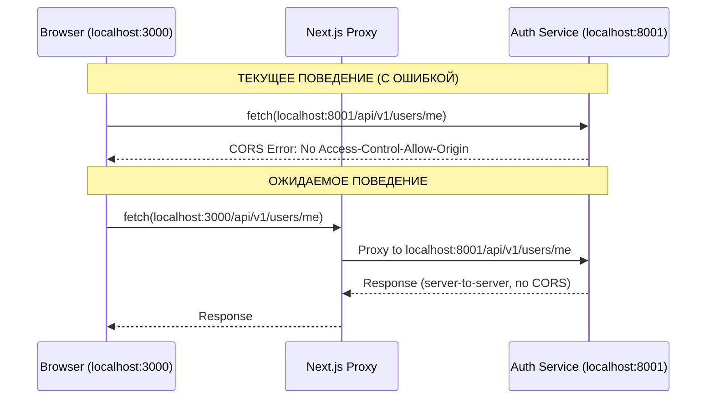

# BUG-CORS-001: Исправление CORS ошибки в личном кабинете

**ID**: BUG-CORS-001  
**Version**: 1.0  
**Author**: AI Analyst  
**Date**: 2025-03-03  
**Status**: Approved  
**Priority**: High (Блокирует функционал профиля)

---

## 1. Описание проблемы

### 1.1 Симптомы

После успешной авторизации и перехода в личный кабинет во вкладке "Профиль" при попытке заполнить данные о себе возникает ошибка:

```
Access to fetch at 'http://localhost:8001/api/v1/users/me' from origin 'http://localhost:3000' 
has been blocked by CORS policy: Response to preflight request doesn't pass access control check: 
No 'Access-Control-Allow-Origin' header is present on the requested resource.
```

### 1.2 Влияние на пользователей

- Пользователи не могут обновить свои данные в профиле
- Отображается ошибка "Пользователь не авторизован"
- Блокируется критический функционал личного кабинета

---

## 2. Анализ проблемы

### 2.1 Корневая причина #1: CORS конфигурация

**Проблема**: В `services/auth-service/.env` отсутствует переменная `ENVIRONMENT`, поэтому используется значение по умолчанию `"production"` из `config.py`:

```python
# services/auth-service/app/core/config.py
class Settings(BaseSettings):
    ENVIRONMENT: str = "production"  # Значение по умолчанию
```

**Следствие**: В режиме production метод `cors_origins_list()` не добавляет автоматически localhost origins:

```python
@property
def cors_origins_list(self) -> List[str]:
    origins: List[str] = []

    if self.ENVIRONMENT == "development":  # Это условие НЕ выполняется!
        origins.extend([
            "http://localhost:3000",
            "http://127.0.0.1:3000",
            "http://localhost:3001",
        ])
```

### 2.2 Корневая причина #2: Прямой запрос к backend

**Проблема**: В логах ошибка показывает запрос напрямую на `http://localhost:8001/api/v1/users/me`, а не через Next.js proxy на `http://localhost:3000/api/v1/users/me`.

**Ожидаемое поведение**: Все API запросы должны идти через Next.js rewrites, что устраняет необходимость в CORS.

### 2.3 Sequence Diagram проблемы



---

## 3. Требования к исправлению

### 3.1 User Story

**As a** зарегистрированный пользователь,
**I want to** иметь возможность редактировать свой профиль в личном кабинете,
**So that** я могу актуализировать свои персональные данные.

### 3.2 Acceptance Criteria

**AC1: CORS работает в development режиме**
- **Given** auth-service запущен в development окружении
- **When** frontend отправляет запрос с localhost:3000
- **Then** CORS заголовки корректно возвращаются

**AC2: Профиль обновляется через proxy**
- **Given** пользователь авторизован и находится в личном кабинете
- **When** пользователь заполняет данные профиля и нажимает "Сохранить"
- **Then** запрос идет через Next.js proxy (localhost:3000/api/v1/users/me)
- **And** данные успешно сохраняются

**AC3: Конфигурация ENVIRONMENT**
- **Given** файл `services/auth-service/.env`
- **When** сервис загружается
- **Then** переменная `ENVIRONMENT` читается из .env
- **And** если не указана, используется безопасное значение по умолчанию

---

## 4. Декомпозиция на задачи

### TASK-INF-001: Добавить ENVIRONMENT в auth-service .env

**Направление**: Infrastructure  
**Приоритет**: High  
**Оценка**: 0.5 часа  
**Зависимости**: Нет

**Описание**:
Добавить переменную `ENVIRONMENT=development` в файл `services/auth-service/.env` для корректной работы CORS в development окружении.

**Критерии приемки**:
- [ ] Добавлена строка `ENVIRONMENT=development` в `services/auth-service/.env`
- [ ] Auth-service корректно читает переменную при запуске
- [ ] CORS origins включают localhost:3000

**Технические детали**:
- Файлы: `services/auth-service/.env`
- Проверить через логи или health endpoint

---

### TASK-INF-002: Обновить .env.example для auth-service

**Направление**: Infrastructure  
**Приоритет**: Medium  
**Оценка**: 0.5 часа  
**Зависимости**: Нет

**Описание**:
Добавить переменную `ENVIRONMENT` в `services/auth-service/.env.example` с комментариями для документации.

**Критерии приемки**:
- [ ] Добавлена строка `ENVIRONMENT=development` в `.env.example`
- [ ] Добавлен комментарий с возможными значениями (development, production)

**Технические детали**:
- Файлы: `services/auth-service/.env.example`

---

### TASK-BCK-001: Улучшить значение по умолчанию ENVIRONMENT

**Направление**: Backend  
**Приоритет**: Medium  
**Оценка**: 1 час  
**Зависимости**: TASK-INF-001

**Описание**:
Изменить значение по умолчанию `ENVIRONMENT` с `"production"` на `"development"` для локальной разработки, с явным требованием указывать `production` в продакшене.

**Критерии приемки**:
- [ ] `ENVIRONMENT` по умолчанию = `"development"`
- [ ] Добавлено предупреждение в логах при запуске в production без явно указанного ENVIRONMENT
- [ ] Обновлена документация

**Технические детали**:
- Файлы: `services/auth-service/app/core/config.py`

**Примечания**:
Альтернатива: оставить `"production"` но требовать явное указание `ENVIRONMENT` в development. Это безопаснее, но менее удобно для разработчиков.

---

### TASK-FRT-001: Проверить использование API_ENDPOINTS

**Направление**: Frontend  
**Приоритет**: High  
**Оценка**: 1 час  
**Зависимости**: Нет

**Описание**:
Убедиться, что все API запросы в frontend используют `API_ENDPOINTS` из `frontend/app/lib/api.ts` и идут через Next.js proxy, а не напрямую к backend.

**Критерии приемки**:
- [ ] Проверены все файлы с fetch запросами
- [ ] Все запросы используют относительные пути или `API_ENDPOINTS`
- [ ] Нет прямых запросов к `localhost:8001`, `localhost:8002` и т.д.

**Технические детали**:
- Файлы: `frontend/app/profile/page.tsx`, `frontend/app/profile/components/ProfileTab.tsx`
- Файлы: `frontend/app/stores/useAuthStore.ts`
- Проверить через grep: `grep -r "localhost:800" frontend/`

---

### TASK-FRT-002: Унифицировать API клиент

**Направление**: Frontend  
**Приоритет**: Medium  
**Оценка**: 2 часа  
**Зависимости**: TASK-FRT-001

**Описание**:
Унифицировать использование API клиента - все запросы должны использовать `api` из `frontend/lib/api/client.ts` вместо прямых `fetch` вызовов.

**Критерии приемки**:
- [ ] ProfileTab.tsx использует `api.put()` вместо `fetch()`
- [ ] profile/page.tsx использует `api.get()` вместо `fetch()`
- [ ] Обработаны ошибки через `APIError`, `RateLimitError`, `CSRFError`

**Технические детали**:
- Файлы: `frontend/app/profile/page.tsx`
- Файлы: `frontend/app/profile/components/ProfileTab.tsx`
- Файлы: `frontend/lib/api/client.ts`

---

### TASK-TST-001: Тестирование CORS конфигурации

**Направление**: Testing  
**Приоритет**: High  
**Оценка**: 1 час  
**Зависимости**: TASK-INF-001

**Описание**:
Проверить, что CORS работает корректно в development режиме.

**Критерии приемки**:
- [ ] Тест: preflight OPTIONS запрос возвращает правильные заголовки
- [ ] Тест: запрос с localhost:3000 разрешается
- [ ] Тест: запрос с неизвестного origin блокируется (в production)

**Технические детали**:
- Файлы: `services/auth-service/tests/test_cors_config.py` (обновить или создать)

---

### TASK-DOC-001: Обновить документацию

**Направление**: Documentation  
**Приоритет**: Low  
**Оценка**: 0.5 часа  
**Зависимости**: TASK-INF-001, TASK-BCK-001

**Описание**:
Обновить README и ARCHITECTURE.md с информацией о переменной ENVIRONMENT.

**Критерии приемки**:
- [ ] README содержит информацию о ENVIRONMENT
- [ ] ARCHITECTURE.md описывает CORS конфигурацию

---

## 5. Итоговая таблица задач

| ID | Направление | Приоритет | Оценка | Зависимости | Статус |
|----|-------------|-----------|--------|-------------|--------|
| TASK-INF-001 | Infrastructure | High | 0.5h | - | [ ] |
| TASK-INF-002 | Infrastructure | Medium | 0.5h | - | [ ] |
| TASK-BCK-001 | Backend | Medium | 1h | INF-001 | [ ] |
| TASK-FRT-001 | Frontend | High | 1h | - | [ ] |
| TASK-FRT-002 | Frontend | Medium | 2h | FRT-001 | [ ] |
| TASK-TST-001 | Testing | High | 1h | INF-001 | [ ] |
| TASK-DOC-001 | Documentation | Low | 0.5h | INF-001, BCK-001 | [ ] |

**Общая оценка**: 6.5 часов  
**Критический путь**: INF-001 → FRT-001 → TST-001

---

## 6. Риски и митигация

| Риск | Вероятность | Влияние | Митигация |
|------|-------------|---------|-----------|
| Кэш браузера сохраняет старые CORS ошибки | Medium | Medium | Очистить кэш браузера после исправления |
| Другие сервисы имеют ту же проблему | Medium | Low | Проверить все сервисы, добавить ENVIRONMENT |
| ENVIRONMENT=development случайно попадет в production | Low | High | CI/CD проверка на production конфигурацию |

---

## 7. Non-Functional Requirements

### 7.1 Performance
- CORS preflight не должен добавлять задержку > 10ms
- Proxy не должен добавлять задержку > 50ms

### 7.2 Security
- В production режиме CORS origins должны быть явно указаны
- Wildcard (*) CORS origin запрещен в production

### 7.3 Maintainability
- Все environment переменные должны быть документированы
- .env.example должен содержать все необходимые переменные

---

## 8. План тестирования

### 8.1 Unit тесты
- Тест `cors_origins_list()` с разными значениями ENVIRONMENT
- Тест валидации origin

### 8.2 Integration тесты
- Тест полного flow обновления профиля
- Тест CORS preflight для /api/v1/users/me

### 8.3 E2E тесты (ручные)
1. Запустить auth-service с ENVIRONMENT=development
2. Открыть http://localhost:3000/profile
3. Заполнить данные профиля
4. Нажать "Сохранить"
5. Проверить успешное сохранение

---

## 9. Definition of Done

- [ ] TASK-INF-001 выполнен: ENVIRONMENT добавлен в .env
- [ ] TASK-FRT-001 выполнен: все запросы идут через proxy
- [ ] Тесты проходят
- [ ] Ручное тестирование успешно
- [ ] Документация обновлена
- [ ] Code review пройден

---

## 10. Связанные документы

- `ARCHITECTURE.md` - CORS Configuration section
- `SEC-003_Безопасная_конфигурация_CORS.md` - существующие требования по CORS
- `services/auth-service/app/core/config.py` - текущая конфигурация
