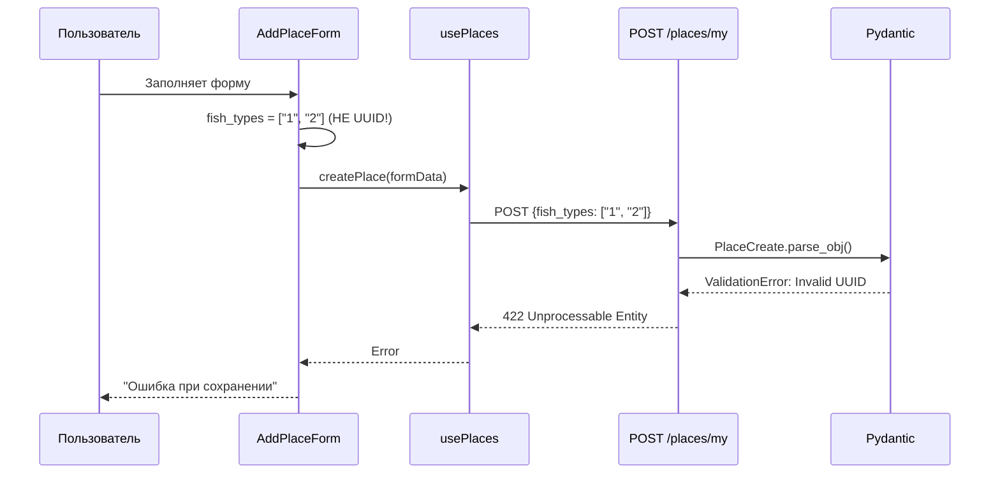

# Bug Fix: Ошибка сохранения места (422 Unprocessable Entity)

**ID**: BUG-PLACE-001  
**Version**: 1.0  
**Author**: System Analyst  
**Date**: 2026-02-12  
**Status**: Draft  
**Priority**: High

---

## 1. Описание проблемы

### 1.1 Симптомы
При попытке сохранить новое место рыбалки через форму "Добавить место" возникает ошибка:
- **HTTP Status**: 422 (Unprocessable Entity)
- **Endpoint**: `POST /api/v1/places/my`
- **Error Message**: `[object Object]` (повторяется 6 раз)

### 1.2 Логи ошибки
```
POST http://localhost:3000/api/v1/places/my 422 (Unprocessable Entity)
Failed to save place: Error: [object Object],[object Object],[object Object],[object Object],[object Object],[object Object]
```

### 1.3 Место воспроизведения
- **Страница**: `/profile` → вкладка "Мои места"
- **Действие**: Нажатие кнопки "Добавить место" → заполнение формы → "Сохранить"

---

## 2. Анализ корневой причины (Root Cause Analysis)

### 2.1 Технический анализ

#### Проблема 1: Невалидные UUID для fish_types

**Бэкенд (backend)** - `services/places-service/app/schemas/place.py:27-29`:
```python
fish_types: List[UUID] = Field(
    ..., min_length=1, description="Виды рыбы (минимум 1)"
)
```
- Ожидает список валидных UUID

**Фронтенд (frontend)** - `frontend/components/AddPlaceForm.tsx:42-53`:
```typescript
const FISH_TYPES: FishType[] = [
  { id: "1", name: "Щука", icon: "🐟", category: "predatory" },
  { id: "2", name: "Судак", icon: "🐟", category: "predatory" },
  // ... и т.д.
];
```
- Отправляет строки "1", "2", "3" и т.д., которые **НЕ являются валидными UUID**

**Результат**: Pydantic валидация на бэкенде отклоняет запрос с ошибкой 422.

#### Проблема 2: Хардкод vs API

Форма использует захардкоженный список `FISH_TYPES` вместо получения реальных данных из API `/api/v1/places/fish-types`, который уже реализован в бэкенде.

### 2.2 Диаграмма потока данных (проблемная)



### 2.3 Почему 6 ошибок в логах

Каждый `[object Object]` - это отдельная ошибка валидации для каждого выбранного типа рыбы. Если пользователь выбрал 6 видов рыбы, получаем 6 ошибок валидации UUID.

---

## 3. User Story: Исправление бага

**As a** зарегистрированный пользователь,  
**I want to** успешно сохранять новые места рыбалки через форму,  
**So that** я могу вести список своих любимых мест для рыбалки.

### Priority
- [x] High (MVP, критично для базовой функциональности)

### Actors
- [x] Зарегистрированный пользователь

---

## 4. Acceptance Criteria

### AC1: Успешное сохранение места с валидными fish_types

- **Given** пользователь авторизован и находится на странице "Мои места"
- **When** пользователь открывает форму добавления места
- **And** выбирает один или несколько видов рыбы
- **And** заполняет все обязательные поля
- **And** нажимает "Сохранить"
- **Then** место успешно сохраняется в базе данных
- **And** появляется в списке мест пользователя
- **And** отображается на карте

### AC2: Загрузка fish_types из API

- **Given** пользователь открывает форму добавления места
- **When** форма загружается
- **Then** список видов рыбы загружается из API `/api/v1/places/fish-types`
- **And** отображаются реальные данные из базы (не хардкод)

### AC3: Отображение понятных ошибок валидации

- **Given** пользователь отправляет форму с невалидными данными
- **When** сервер возвращает ошибку валидации (422)
- **Then** отображается понятное сообщение об ошибке
- **And** указывается какое поле содержит ошибку

---

## 5. Технические требования

### 5.1 Frontend (Changes Required)

#### 5.1.1 Изменить AddPlaceForm.tsx

**Файл**: `frontend/components/AddPlaceForm.tsx`

**Текущее состояние (проблема)**:
```typescript
// Строки 42-53: Хардкод ID
const FISH_TYPES: FishType[] = [
  { id: "1", name: "Щука", icon: "🐟", category: "predatory" },
  // ...
];
```

**Требуемое изменение**:
1. Удалить хардкод `FISH_TYPES`
2. Использовать `usePlaces().getFishTypes()` для загрузки данных
3. Отображать реальные данные из API

**Код для реализации**:
```typescript
// В компоненте AddPlaceForm:
const { getFishTypes } = usePlaces();

useEffect(() => {
  const loadFishTypes = async () => {
    try {
      const data = await getFishTypes();
      setFishTypes(data);
    } catch (err) {
      console.error("Failed to load fish types:", err);
    }
  };
  loadFishTypes();
}, []);
```

#### 5.1.2 Добавить обработку ошибок валидации

**Файл**: `frontend/hooks/usePlaces.ts`

**Текущее состояние (строки 107-109)**:
```typescript
if (!response.ok) {
  const errorData = await response.json().catch(() => ({ detail: "Unknown error" }));
  throw new Error(errorData.detail || "Failed to create place");
}
```

**Требуемое изменение**:
- Для 422 ошибки извлекать детали валидации из `response.json()`
- Форматировать ошибку в понятное сообщение

**Пример структуры ошибки 422 от FastAPI**:
```json
{
  "detail": [
    {
      "loc": ["body", "fish_types", 0],
      "msg": "Input should be a valid UUID, invalid length: expected length 32 for simple format, found 1",
      "type": "uuid_parsing"
    }
  ]
}
```

### 5.2 Backend (No Changes Required)

Бэкенд работает корректно - валидация UUID работает как предусмотрено.

**Проверить**: Убедиться что в базе данных есть seeded fish types с валидными UUID.

**Файл для проверки**: `database/schema.sql` или миграции

### 5.3 API Specification (для справки)

#### GET /api/v1/places/fish-types

**Уже реализован в**: `services/places-service/app/endpoints/fish_types.py`

**Response 200**:
```json
[
  {
    "id": "550e8400-e29b-41d4-a716-446655440000",
    "name": "Щука",
    "icon": "🐟",
    "category": "predatory",
    "is_active": true
  }
]
```

---

## 6. План реализации (Tasks)

### Frontend Tasks

- [ ] **TASK-1**: Удалить хардкод `FISH_TYPES` из `AddPlaceForm.tsx`
- [ ] **TASK-2**: Реализовать загрузку fish_types через `getFishTypes()` API
- [ ] **TASK-3**: Добавить состояние loading для списка видов рыбы
- [ ] **TASK-4**: Улучшить обработку ошибок 422 в `usePlaces.ts`
- [ ] **TASK-5**: Добавить отображение деталей валидации в форме

### Backend Tasks

- [ ] **TASK-6**: Проверить наличие seeded fish types с валидными UUID
- [ ] **TASK-7**: Добавить fish types в seed data если отсутствуют

### Testing Tasks

- [ ] **TASK-8**: Протестировать сохранение места с 1 видом рыбы
- [ ] **TASK-9**: Протестировать сохранение места с несколькими видами рыбы
- [ ] **TASK-10**: Протестировать отображение ошибок валидации

---

## 7. Non-Functional Requirements

### Performance
- Загрузка fish_types должна занимать < 200ms
- Можно добавить кэширование fish_types в localStorage (опционально)

### UX
- Показывать loading state при загрузке fish_types
- Не блокировать форму если fish_types не загрузились (показать retry)

---

## 8. Risk Analysis

| Risk | Probability | Impact | Mitigation |
|------|-------------|--------|------------|
| API fish-types недоступен | Low | Medium | Добавить retry и fallback на хардкод |
| Нет fish types в БД | Low | High | Добавить seed data в миграции |
| Изменение формата API | Low | Medium | Документировать контракт API |

---

## 9. Definition of Done

- [ ] Баг исправлен - места сохраняются успешно
- [ ] Fish types загружаются из API (не хардкод)
- [ ] Unit тесты обновлены
- [ ] Ручное тестирование пройдено
- [ ] Код прошел code review
- [ ] Документация обновлена (если требуется)

---

## 10. Связанные документы

- `требования/Требования_Мои_Места.md` - Основные требования функции
- `требования/US-PLACE-Улучшения_формы_добавления_места.md` - Улучшения формы
- `ANALYST_PROMPT.md` - Стандарты документирования

---

## 11. Приложение: Структура файлов

```
frontend/
├── components/
│   └── AddPlaceForm.tsx        <- ИЗМЕНИТЬ (убрать хардкод)
├── hooks/
│   └── usePlaces.ts            <- ИЗМЕНИТЬ (улучшить обработку ошибок)
└── types/
    └── place.ts                <- Проверить типы

services/places-service/
├── app/
│   ├── endpoints/
│   │   └── places.py           <- Без изменений
│   └── schemas/
│       └── place.py            <- Без изменений (валидация корректна)
```
