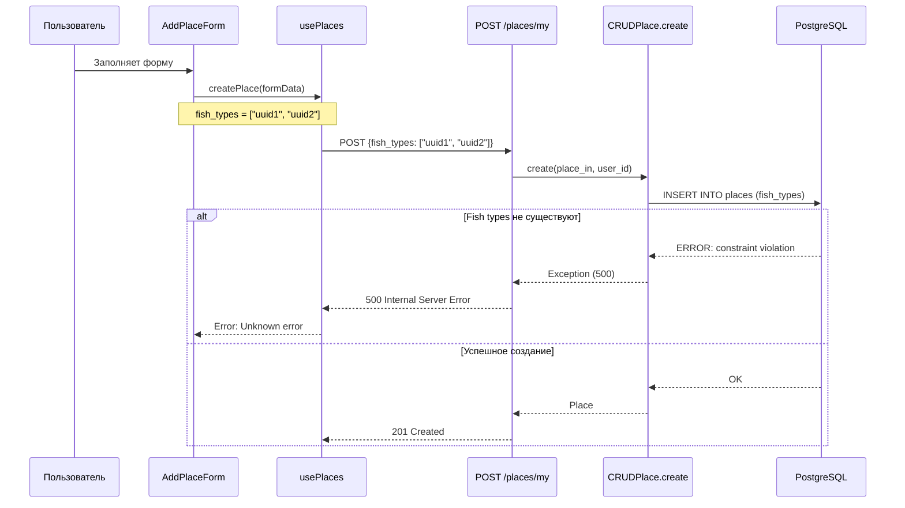

# Bug Fix: Ошибка сохранения места (500 Internal Server Error)

**ID**: BUG-PLACE-002  
**Version**: 1.0  
**Author**: System Analyst  
**Date**: 2026-02-13  
**Status**: Draft  
**Priority**: High

---

## 1. Описание проблемы

### 1.1 Симптомы
При попытке сохранить новое место рыбалки через форму "Добавить место" возникает критическая ошибка:
- **HTTP Status**: 500 (Internal Server Error)
- **Endpoint**: `POST /api/v1/places/my`
- **Error Message**: `Unknown error`

### 1.2 Логи ошибки (Frontend)
```
POST http://localhost:3000/api/v1/places/my 500 (Internal Server Error)
Failed to save place: Error: Unknown error
```

### 1.3 Место воспроизведения
- **Страница**: `/profile` → вкладка "Мои места"
- **Действие**: Нажатие кнопки "Добавить место" → заполнение формы → "Сохранить"

---

## 2. Root Cause Analysis (Анализ корневой причины)

### 2.1 Технический анализ

#### Гипотеза 1: Отсутствие seeded fish_types в БД

**Симптомы совпадают**: 500 ошибка возникает при попытке создать Place, но fish_types не существуют в БД.

**Код backend** - `services/places-service/app/crud/place.py:28-46`:
```python
async def create(self, db: AsyncSession, place_in: PlaceCreate, user_id: UUID) -> Place:
    try:
        place_dict = place_in.model_dump()
        place_dict["owner_id"] = user_id
        db_place = Place(**place_dict)
        db.add(db_place)
        await db.commit()
        await db.refresh(db_place)
        return db_place
    except Exception as e:
        logger.error("Error creating place", error=str(e), exc_info=True)
        await db.rollback()
        raise
```

**Проблема**: Если `fish_types` содержит UUID, которые не существуют в таблице `fish_types`, PostgreSQL может выбросить ошибку (если есть foreign key constraint или триггер).

**Seed data** - `services/places-service/app/seed_data.py`:
- Seed скрипт существует, но мог не быть запущен
- Fish types создаются с авто-генерируемыми UUID

#### Гипотеза 2: Ошибка сериализации UUID[] в PostgreSQL

**Модель** - `services/places-service/app/models/place.py:39`:
```python
fish_types = Column(PG_ARRAY(UUID(as_uuid=True)), nullable=False)
```

**Проблема**: Массив UUID может некорректно сериализоваться при передаче из Pydantic в SQLAlchemy.

**Schema** - `services/places-service/app/schemas/place.py:27-29`:
```python
fish_types: List[UUID] = Field(
    ..., min_length=1, description="Виды рыбы (минимум 1)"
)
```

#### Гипотеза 3: Отсутствие валидации fish_types на backend

**Проблема**: Backend не проверяет существование переданных `fish_types` UUID в базе данных перед созданием Place.

### 2.2 Диаграмма потока данных (проблемная)



### 2.3 Почему "Unknown error"

**Frontend** - `frontend/hooks/usePlaces.ts:136`:
```typescript
const errorData = await response.json().catch(() => ({ detail: "Unknown error" }));
```

При 500 ошибке backend может не вернуть JSON в правильном формате, либо FastAPI возвращает структурированную ошибку, которую frontend не обрабатывает.

---

## 3. User Story: Исправление бага

**As a** зарегистрированный пользователь,  
**I want to** успешно сохранять новые места рыбалки без внутренних ошибок сервера,  
**So that** я могу вести список своих любимых мест для рыбалки.

### Priority
- [x] High (MVP, критично для базовой функциональности)

### Actors
- [x] Зарегистрированный пользователь

---

## 4. Acceptance Criteria

### AC1: Успешное сохранение места

- **Given** пользователь авторизован
- **And** таблица fish_types содержит записи
- **When** пользователь заполняет форму добавления места с валидными fish_types UUID
- **And** нажимает "Сохранить"
- **Then** место успешно сохраняется (201 Created)
- **And** появляется в списке мест пользователя

### AC2: Понятное сообщение при ошибке

- **Given** возникает ошибка при сохранении
- **When** сервер возвращает 500 ошибку
- **Then** frontend отображает понятное сообщение
- **And** ошибка логируется с деталями

### AC3: Автоматический seed fish_types

- **Given** приложение запускается впервые
- **When** places-service стартует
- **Then** fish_types автоматически создаются если отсутствуют

### AC4: Валидация fish_types на backend

- **Given** пользователь отправляет fish_types UUID
- **When** UUID не существуют в БД
- **Then** возвращается 400 Bad Request с понятным сообщением
- **And** место не создается

---

## 5. Технические требования

### 5.1 Backend Changes (Priority: High)

#### 5.1.1 Автозапуск seed при старте сервиса

**Файл**: `services/places-service/app/main.py`

**Требование**: Добавить автоматический вызов `seed_all()` при первом запуске сервиса.

**Код**:
```python
from app.seed_data import seed_all

@app.on_event("startup")
async def startup_event():
    async for db in get_db():
        await seed_all()
        break
```

**Альтернатива**: Создать отдельный скрипт init_db.py для ручного запуска.

#### 5.1.2 Валидация fish_types перед созданием Place

**Файл**: `services/places-service/app/crud/place.py`

**Текущее состояние**: Нет проверки существования fish_types.

**Требуемое изменение**: Добавить валидацию.

**Код**:
```python
async def create(self, db: AsyncSession, place_in: PlaceCreate, user_id: UUID) -> Place:
    # Валидация fish_types
    for fish_type_id in place_in.fish_types:
        fish_type = await db.execute(
            select(FishType).where(FishType.id == fish_type_id)
        )
        if not fish_type.scalar_one_or_none():
            raise ValueError(f"Fish type with id {fish_type_id} not found")
    
    # Остальной код создания...
```

#### 5.1.3 Улучшенная обработка ошибок

**Файл**: `services/places-service/app/endpoints/places.py`

**Требование**: Оборачивать ошибки в понятные HTTPException.

**Код**:
```python
from fastapi import HTTPException

@router.post("/places/my", ...)
async def create_place(...):
    try:
        place = await crud_place_with_redis.create(...)
        return place
    except ValueError as e:
        raise HTTPException(
            status_code=status.HTTP_400_BAD_REQUEST,
            detail=str(e)
        )
    except Exception as e:
        logger.error("Unexpected error creating place", error=str(e), exc_info=True)
        raise HTTPException(
            status_code=status.HTTP_500_INTERNAL_SERVER_ERROR,
            detail="Internal server error. Please try again later."
        )
```

### 5.2 Frontend Changes (Priority: Medium)

#### 5.2.1 Улучшение обработки 500 ошибок

**Файл**: `frontend/hooks/usePlaces.ts`

**Текущее состояние** (строки 135-143):
```typescript
if (!response.ok) {
  const errorData = await response.json().catch(() => ({ detail: "Unknown error" }));
  
  if (response.status === 422 && Array.isArray(errorData.detail)) {
    throw new Error(formatValidationErrors(errorData.detail));
  }
  
  throw new Error(errorData.detail || "Failed to create place");
}
```

**Требуемое изменение**: Добавить обработку 500 ошибки.

**Код**:
```typescript
if (!response.ok) {
  const errorData = await response.json().catch(() => ({ detail: "Unknown error" }));
  
  if (response.status === 422 && Array.isArray(errorData.detail)) {
    throw new Error(formatValidationErrors(errorData.detail));
  }
  
  if (response.status === 500) {
    throw new Error("Ошибка сервера. Попробуйте позже или обратитесь в поддержку.");
  }
  
  if (response.status === 400) {
    throw new Error(errorData.detail || "Некорректные данные");
  }
  
  throw new Error(errorData.detail || "Failed to create place");
}
```

#### 5.2.2 Проверка загрузки fish_types

**Файл**: `frontend/components/AddPlaceForm.tsx`

**Текущее состояние**: Форма отображает ошибку если fish_types не загружены, но позволяет отправить форму.

**Требование**: Блокировать кнопку "Сохранить" если fish_types не загружены.

**Код**:
```typescript
<button
  type="submit"
  disabled={loading || fishTypesLoading || fishTypes.length === 0}
  className="..."
>
  {loading ? "Сохранение..." : "Сохранить"}
</button>
```

---

## 6. API Specification

### POST /api/v1/places/my

**Response 400 (Bad Request) - Invalid fish_types**:
```json
{
  "detail": "Fish type with id 550e8400-e29b-41d4-a716-446655440000 not found"
}
```

**Response 500 (Internal Server Error)**:
```json
{
  "detail": "Internal server error. Please try again later."
}
```

---

## 7. План реализации (Tasks)

### Backend Tasks (Priority: High)

- [ ] **TASK-B1**: Проверить seeded fish_types в БД
- [ ] **TASK-B2**: Добавить автозапуск seed при старте (или документировать ручной запуск)
- [ ] **TASK-B3**: Добавить валидацию fish_types в CRUDPlace.create()
- [ ] **TASK-B4**: Улучшить обработку ошибок в endpoint
- [ ] **TASK-B5**: Добавить логирование с деталями ошибки

### Frontend Tasks (Priority: Medium)

- [ ] **TASK-F1**: Улучшить обработку 500 ошибок в usePlaces.ts
- [ ] **TASK-F2**: Блокировать submit если fish_types не загружены
- [ ] **TASK-F3**: Добавить retry кнопку при ошибке загрузки fish_types

### Testing Tasks

- [ ] **TASK-T1**: Протестировать сохранение с валидными fish_types
- [ ] **TASK-T2**: Протестировать сохранение с невалидными fish_types (должна быть 400 ошибка)
- [ ] **TASK-T3**: Протестировать сохранение без fish_types (клиентская валидация)
- [ ] **TASK-T4**: Проверить seed данных при чистом старте

---

## 8. Non-Functional Requirements

### Performance
- Seed fish_types должен выполняться только если таблица пуста
- Валидация fish_types не должна значительно замедлять создание place

### Reliability
- Гарантировать наличие fish_types при первом запуске
- Понятные сообщения об ошибках для пользователя

### Logging
- Все ошибки 500 должны логироваться с полным stack trace
- Логи должны содержать context (user_id, place_name, fish_types)

---

## 9. Risk Analysis

| Risk | Probability | Impact | Mitigation |
|------|-------------|--------|------------|
| Seed не выполняется автоматически | Medium | High | Добавить health check для fish_types count |
| UUID serialization issue | Low | High | Тестирование с реальными UUID |
| Race condition при seed | Low | Medium | Использовать DB lock или idempotent seed |
| Frontend отправляет невалидные UUID | Low | Medium | Backend валидация + понятная ошибка |

---

## 10. Definition of Done

- [ ] Backend валидирует fish_types перед созданием place
- [ ] 500 ошибки обрабатываются gracefully
- [ ] Frontend показывает понятные сообщения
- [ ] Seed данные создаются автоматически или документирован процесс
- [ ] Unit тесты обновлены
- [ ] Ручное тестирование пройдено
- [ ] Код прошел code review

---

## 11. Связанные документы

- `требования/BUG-PLACE-001_Ошибка_сохранения_места_422.md` - Похожий баг с 422 ошибкой
- `требования/Требования_Мои_Места.md` - Основные требования функции
- `ANALYST_PROMPT.md` - Стандарты документирования
- `services/places-service/app/seed_data.py` - Seed script

---

## 12. Приложение: Диагностика

### Как проверить наличие fish_types в БД

```sql
SELECT COUNT(*) FROM fish_types;
SELECT * FROM fish_types LIMIT 5;
```

### Как запустить seed вручную

```bash
cd services/places-service
python -m app.seed_data
```

### Как проверить endpoint health

```bash
curl http://localhost:8002/api/v1/places/fish-types
```

---

## 13. Рекомендации по исправлению (пошагово)

### Шаг 1: Проверить seed данных
```bash
# Проверить есть ли fish_types в БД
docker exec -it <postgres_container> psql -U postgres -d fishmap -c "SELECT * FROM fish_types;"

# Если пусто - запустить seed
cd services/places-service
python -m app.seed_data
```

### Шаг 2: Добавить валидацию на backend
Добавить проверку fish_types в `crud_place.create()`

### Шаг 3: Улучшить обработку ошибок
Обернуть endpoint в try-catch с понятными HTTPException

### Шаг 4: Обновить frontend
Добавить обработку 400/500 ошибок с понятными сообщениями
