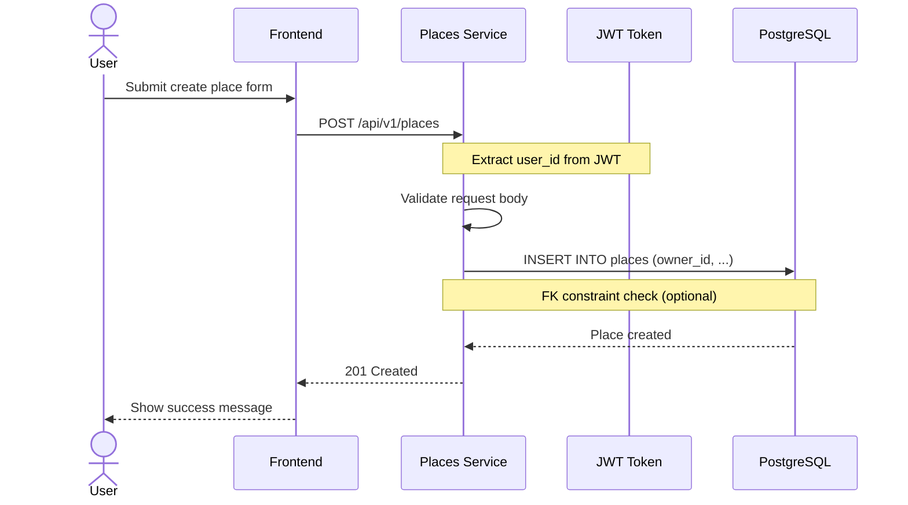

# Bug Fix: ForeignKey Constraint owner_id → users.id

**ID**: BUG-PLACE-003
**Version**: 1.0
**Status**: Approved
**Date**: 2026-02-13
**Priority**: High

---

## Problem Description

### Summary
При создании place с валидными данными возвращается HTTP 500 из-за ForeignKey constraint `owner_id → users.id`. Places-service не имеет доступа к таблице users в своей SQLAlchemy модели.

### Root Cause
Модель `Place` в places-service содержит ForeignKey к таблице `users`, но модель `User` не определена в places-service:

```python
# services/places-service/app/models/place.py:24-25
owner_id = Column(
    UUID(as_uuid=True), ForeignKey("users.id", ondelete="CASCADE"), nullable=False
)
```

Это создает:
1. Архитектурную зависимость places-service от auth-service
2. Проблемы при тестировании (таблица users не создается в тестах places-service)
3. Нарушение принципа microservices independence

### Impact
- Создание мест для рыбалки невозможно
- Тесты places-service могут проходить только если FK constraint отключен или users table существует

---

## User Story

**As a** зарегистрированный пользователь,
**I want to** создавать места для рыбалки,
**So that** я могу делиться своими рыболовными местами с сообществом.

### Priority
- [x] High (MVP, критично для работы сервиса)

### Actors
- [x] Зарегистрированный пользователь
- [ ] Незарегистрированный посетитель
- [ ] Moderator
- [ ] Admin

### Acceptance Criteria

**AC1: Успешное создание места**
- **Given** пользователь аутентифицирован с валидным JWT токеном
- **When** пользователь отправляет POST /api/v1/places с валидными данными
- **Then** место создается с owner_id из JWT токена, возвращается 201 Created

**AC2: Валидация owner_id через токен**
- **Given** пользователь аутентифицирован
- **When** создается place
- **Then** owner_id берется из JWT токена текущего пользователя, а не из request body

**AC3: Удаление FK из SQLAlchemy модели**
- **Given** модель Place в places-service
- **When** применяется фикс
- **Then** owner_id является простым UUID полем без ForeignKey()

**AC4: FK constraint в БД (опционально)**
- **Given** таблица places в PostgreSQL
- **When** создается запись
- **Then** FK constraint может быть оставлен или удален в зависимости от стратегии

---

## Non-Functional Requirements

- **Performance**: Без изменений (< 200ms)
- **Security**: owner_id всегда из JWT токена (защита от подмены)
- **Scalability**: Улучшает независимость сервисов
- **Availability**: 99.9%

---

## Database Schema Change

### Alter Model: Place (SQLAlchemy)

**File**: `services/places-service/app/models/place.py`

**Before**:
```python
owner_id = Column(
    UUID(as_uuid=True), ForeignKey("users.id", ondelete="CASCADE"), nullable=False
)
```

**After**:
```python
owner_id = Column(UUID(as_uuid=True), nullable=False)
```

### Alter Model: FavoritePlace (SQLAlchemy)

**File**: `services/places-service/app/models/favorite_place.py`

**Before**:
```python
user_id = Column(
    UUID(as_uuid=True), ForeignKey("users.id", ondelete="CASCADE"), nullable=False
)
```

**After**:
```python
user_id = Column(UUID(as_uuid=True), nullable=False)
```

### Database Migration (Optional)

**Option A: Оставить FK constraint в БД** (рекомендуется для referential integrity)

```sql
-- No migration needed
-- FK constraint остается на уровне PostgreSQL
-- SQLAlchemy не проверяет FK на уровне ORM
```

**Option B: Удалить FK constraint из БД**

```sql
-- Migration: remove_places_owner_fk
-- Date: 2026-02-13

BEGIN;

ALTER TABLE places DROP CONSTRAINT IF EXISTS places_owner_id_fkey;
ALTER TABLE favorite_places DROP CONSTRAINT IF EXISTS favorite_places_user_id_fkey;

COMMIT;
```

**Rollback Script**:
```sql
-- Rollback: remove_places_owner_fk
-- Date: 2026-02-13

BEGIN;

ALTER TABLE places
ADD CONSTRAINT places_owner_id_fkey
FOREIGN KEY (owner_id) REFERENCES users(id) ON DELETE CASCADE;

ALTER TABLE favorite_places
ADD CONSTRAINT favorite_places_user_id_fkey
FOREIGN KEY (user_id) REFERENCES users(id) ON DELETE CASCADE;

COMMIT;
```

### Impact Analysis
- **Affected services**: places-service
- **Breaking changes**: No (API остается прежним)
- **Data migration required**: No
- **Estimated downtime**: 0 (hot fix)

---

## Implementation Tasks

### Backend (places-service)

- [ ] **TASK-1**: Удалить `ForeignKey("users.id")` из `Place.owner_id` в модели
- [ ] **TASK-2**: Удалить `ForeignKey("users.id")` из `FavoritePlace.user_id` в модели
- [ ] **TASK-3**: Убедиться что owner_id берется из JWT токена в endpoint
- [ ] **TASK-4**: Обновить тесты для работы без FK
- [ ] **TASK-5**: Протестировать создание place через API

### Database (optional)

- [ ] **TASK-6**: Создать миграцию для удаления FK constraint (если выбран Option B)

### Documentation

- [ ] **TASK-7**: Обновить `database/schema.md` - отметить изменение в FK constraints (если FK удален из БД)
- [ ] **TASK-8**: Обновить `ARCHITECTURE.md` - добавить примечание об архитектурном решении (FK на уровне БД, но не ORM)
- [ ] **TASK-9**: Обновить `SYSTEM_PROMPT.md` - при необходимости уточнить статус places-service

---

## Documentation Updates

### database/schema.md

**Changes required**: Если выбран Option B (удаление FK из БД)

Добавить примечание в раздел Foreign Key Constraints:
```markdown
### Note: Cross-Service References
- places.owner_id → users.id: FK constraint removed at ORM level
- favorite_places.user_id → users.id: FK constraint removed at ORM level
- Referential integrity maintained at database level (optional) or via application logic
```

### ARCHITECTURE.md

**Changes required**: Добавить секцию о межсервисных зависимостях

```markdown
### Cross-Service Data References

**Strategy**: FK constraints at database level only, not at ORM level

**Rationale**:
- Microservices independence: Each service can operate without importing models from other services
- Referential integrity: PostgreSQL FK constraints ensure data consistency
- Validation: User existence validated via JWT token, not DB lookup

**Affected tables**:
- `places.owner_id` → references `users.id` (DB-level FK only)
- `favorite_places.user_id` → references `users.id` (DB-level FK only)
```

### SYSTEM_PROMPT.md

**Changes required**: Обновить статус places-service если применимо

---

## Sequence Diagram



---

## Risk Analysis

| Risk | Probability | Impact | Mitigation |
|------|-------------|--------|------------|
| Orphan records при удалении users | Low | Medium | Добавить cleanup job или оставить FK в БД |
| Тесты упадут после изменений | Low | Low | Обновить тесты |
| Регрессия в существующем функционале | Low | Medium | Integration тесты |

---

## Definition of Done

- [ ] ForeignKey удален из SQLAlchemy моделей Place и FavoritePlace
- [ ] API endpoint использует user_id из JWT токена
- [ ] Unit тесты обновлены и проходят
- [ ] Integration тест: создание place возвращает 201
- [ ] **Документация обновлена**:
  - [ ] `database/schema.md` - примечание о cross-service FK strategy
  - [ ] `ARCHITECTURE.md` - секция "Cross-Service Data References"
  - [ ] `SYSTEM_PROMPT.md` - при необходимости
- [ ] Code review пройден

---

## Dependencies

- Зависит от: Auth Service (JWT токены)
- Блокирует: Функционал создания мест для рыбалки

---

## Appendix: Code Changes

### services/places-service/app/models/place.py

```python
# Line 24-25: BEFORE
owner_id = Column(
    UUID(as_uuid=True), ForeignKey("users.id", ondelete="CASCADE"), nullable=False
)

# Line 24-25: AFTER
owner_id = Column(UUID(as_uuid=True), nullable=False)
```

### services/places-service/app/models/favorite_place.py

```python
# Line 13-15: BEFORE
user_id = Column(
    UUID(as_uuid=True), ForeignKey("users.id", ondelete="CASCADE"), nullable=False
)

# Line 13-15: AFTER
user_id = Column(UUID(as_uuid=True), nullable=False)
```

---

## Approved By

- [x] Business Analyst
- [ ] Tech Lead
- [ ] Product Owner
