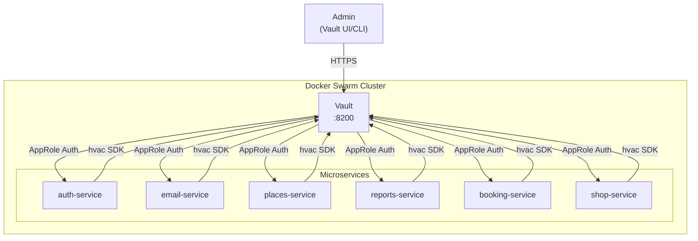

# SEC-001: Система управления секретами (HashiCorp Vault)

**ID:** SEC-001  
**Version:** 1.0  
**Status:** Approved  
**Author:** System Analyst  
**Date:** 2026-02-21  
**Priority:** Critical

---

## 1. Executive Summary

### 1.1 Проблема

Hardcoded секреты в `.env` файле создают критические риски безопасности:

| Секрет | Файл | Риск |
|--------|------|------|
| `SMTP_PASSWORD` | `.env:39` | Компрометация email аккаунта |
| `SECRET_KEY` | `.env:11` | Слабый ключ, подделка JWT токенов |
| `OPENWEATHERMAP_API_KEY` | `.env:48` | Несанкционированный доступ к внешнему API |

### 1.2 Решение

Внедрение HashiCorp Vault для централизованного управления секретами с:
- Автоматической ротацией каждые 90 дней
- AppRole аутентификацией для сервисов
- Аудитом git истории на наличие секретов

---

## 2. Scope

### 2.1 In Scope

- Развертывание HashiCorp Vault в Docker Swarm
- Миграция секретов из `.env` в Vault
- Интеграция со всеми микросервисами
- Автогенерация SECRET_KEY при деплое
- Аудит и очистка git истории
- Обновление проектной документации

### 2.2 Out of Scope

- Kubernetes миграция
- Автоматическая ротация внешних API ключей (только уведомления)
- MFA для доступа к Vault UI
- Multi-datacenter репликация

---

## 3. Архитектура решения

### 3.1 Диаграмма



### 3.2 Компоненты

| Компонент | Описание | Ресурсы |
|-----------|----------|---------|
| Vault Server | HashiCorp Vault в Docker | 1 CPU, 512MB RAM |
| Vault Storage | Raft (integrated storage) | Local volume |
| hvac Library | Python Vault client | - |

### 3.3 Порты и сети

| Сервис | Port | Network |
|--------|------|---------|
| Vault | 8200 | fishing-network (internal) |
| Vault Cluster | 8201 | fishing-network (internal) |

---

## 4. User Stories

### US1: Развертывание Vault

**As a** DevOps Engineer  
**I want to** развернуть HashiCorp Vault в Docker Swarm  
**So that** все секреты хранятся централизованно и безопасно

**Priority:** High  
**Actors:** DevOps Engineer, Admin

**Acceptance Criteria:**

**AC1.1: Vault запущен**
- Given Docker Swarm кластер работает
- When применен docker-compose с Vault
- Then Vault доступен на порту 8200
- And TLS сертификат валидный

**AC1.2: Unseal настроен**
- Given Vault запущен
- When администратор выполняет unseal
- Then Vault переходит в статус initialized
- And Shamir keys сохранены безопасно

---

### US2: Сервис получает секреты

**As a** Auth Service  
**I want to** получать SECRET_KEY из Vault при старте  
**So that** секреты не хранятся в `.env` файле

**Priority:** High  
**Actors:** Auth Service, Email Service, Places Service, Reports Service, Booking Service, Shop Service

**Acceptance Criteria:**

**AC2.1: Аутентификация через AppRole**
- Given Vault настроен с AppRole
- When сервис стартует с RoleID и SecretID
- Then сервис получает временный токен
- And токен имеет права только на нужные секреты

**AC2.2: Получение секретов**
- Given сервис аутентифицирован в Vault
- When сервис запрашивает секрет по пути
- Then возвращается актуальное значение секрета
- And ошибка логируется если секрет недоступен

**AC2.3: Fallback механизм**
- Given Vault недоступен
- When сервис стартует
- Then сервис использует cached секрет (если есть)
- And логируется warning о недоступности Vault

---

### US3: Автоматическая ротация секретов

**As a** Security Officer  
**I want to** автоматическую ротацию секретов каждые 90 дней  
**So that** снижается риск компрометации при утечке

**Priority:** Medium  
**Actors:** System (automated)

**Acceptance Criteria:**

**AC3.1: Ротация SECRET_KEY**
- Given SECRET_KEY создан 90 дней назад
- When rotation job запускается
- Then генерируется новый криптостойкий ключ (32+ символа)
- And старый ключ инвалидируется

**AC3.2: Уведомления о ротации внешних ключей**
- Given SMTP_PASSWORD или API ключ существует
- When подходит срок ротации (90 дней)
- Then отправляется уведомление администратору
- And ротация не выполняется автоматически

---

### US4: Аудит git истории

**As a** Security Officer  
**I want to** проверить git историю на наличие секретов  
**So that** удалить случайно закоммиченные секреты

**Priority:** High  
**Actors:** Security Officer, DevOps Engineer

**Acceptance Criteria:**

**AC4.1: Сканирование истории**
- Given репозиторий существует
- When запускается gitleaks/trufflehog
- Then формируется отчет о найденных секретах
- And отчет содержит коммит, файл и строку

**AC4.2: Очистка истории**
- Given секреты найдены в истории
- When выполняется BFG/git-filter-repo
- Then секреты удаляются из всех коммитов
- And история переписывается корректно

---

### US5: Обновление документации

**As a** Developer  
**I want to** актуальную документацию по управлению секретами  
**So that** могу корректно работать с секретами в проекте

**Priority:** Medium  
**Actors:** Developer, DevOps Engineer

**Acceptance Criteria:**

**AC5.1: Обновление README.md**
- Given Vault внедрен
- When разработчик читает README
- Then есть секция "Управление секретами"
- And описан процесс получения секретов

**AC5.2: Создание SECRETS.md**
- Given Vault внедрен
- When нужен runbook по секретам
- Then существует docs/SECRETS.md
- And содержит инструкции для всех сценариев

**AC5.3: Обновление ANALYST_PROMPT.md**
- Given Vault внедрен
- When аналитик создает требования
- Then ANALYST_PROMPT.md содержит секцию о секретах
- And описаны требования к новым секретам

---

## 5. Технические требования

### 5.1 Секреты для миграции

| Секрет | Путь в Vault | Ротация | Ответственный сервис |
|--------|--------------|---------|---------------------|
| `SECRET_KEY` | `secret/data/fishmap/auth/jwt` | 90 дней | auth-service |
| `POSTGRES_PASSWORD` | `secret/data/fishmap/database/postgres` | 90 дней | Все сервисы |
| `SMTP_PASSWORD` | `secret/data/fishmap/email/smtp` | Уведомление | email-service |
| `STRIPE_SECRET_KEY` | `secret/data/fishmap/payment/stripe` | Уведомление | booking, shop |
| `STRIPE_WEBHOOK_SECRET` | `secret/data/fishmap/payment/stripe-webhook` | Уведомление | booking, shop |
| `CLOUDINARY_API_SECRET` | `secret/data/fishmap/storage/cloudinary` | Уведомление | reports-service |
| `OPENWEATHERMAP_API_KEY` | `secret/data/fishmap/external/weather` | Уведомление | forecast-service |
| `MAPBOX_API_KEY` | `secret/data/fishmap/external/mapbox` | Уведомление | frontend |

### 5.2 AppRole Policies

```hcl
# Policy: auth-service
path "secret/data/fishmap/auth/*" {
  capabilities = ["read"]
}
path "secret/data/fishmap/database/postgres" {
  capabilities = ["read"]
}

# Policy: email-service
path "secret/data/fishmap/email/*" {
  capabilities = ["read"]
}
path "secret/data/fishmap/database/postgres" {
  capabilities = ["read"]
}

# Policy: places-service
path "secret/data/fishmap/external/mapbox" {
  capabilities = ["read"]
}
path "secret/data/fishmap/database/postgres" {
  capabilities = ["read"]
}
path "secret/data/fishmap/auth/jwt" {
  capabilities = ["read"]
}

# Policy: reports-service
path "secret/data/fishmap/storage/*" {
  capabilities = ["read"]
}
path "secret/data/fishmap/database/postgres" {
  capabilities = ["read"]
}

# Policy: booking-service / shop-service
path "secret/data/fishmap/payment/*" {
  capabilities = ["read"]
}
path "secret/data/fishmap/database/postgres" {
  capabilities = ["read"]
}
path "secret/data/fishmap/auth/jwt" {
  capabilities = ["read"]
}
```

### 5.3 Docker Compose изменения

```yaml
# Добавить в docker-compose.yml
services:
  vault:
    image: hashicorp/vault:1.15
    ports:
      - "8200:8200"
    environment:
      VAULT_DEV_ROOT_TOKEN_ID: "root"  # Только для dev!
      VAULT_ADDR: "http://0.0.0.0:8200"
    cap_add:
      - IPC_LOCK
    networks:
      - fishing-network
    volumes:
      - vault_data:/vault/data
      - vault_config:/vault/config
    command: server
    healthcheck:
      test: ["CMD", "vault", "status"]
      interval: 30s
      timeout: 5s
      retries: 3

volumes:
  vault_data:
  vault_config:
```

### 5.4 API Specification: Vault Client Wrapper

```python
# services/shared/vault_client.py

from typing import Optional
import hvac
from hvac.api.auth_methods import AppRole
import os
import logging

logger = logging.getLogger(__name__)


class VaultClient:
    _instance: Optional['VaultClient'] = None
    _client: Optional[hvac.Client] = None
    
    def __new__(cls):
        if cls._instance is None:
            cls._instance = super().__new__(cls)
        return cls._instance
    
    def __init__(self):
        if self._client is not None:
            return
            
        self.vault_addr = os.getenv('VAULT_ADDR', 'http://vault:8200')
        self.role_id = os.getenv('VAULT_ROLE_ID')
        self.secret_id = os.getenv('VAULT_SECRET_ID')
        
        if not all([self.role_id, self.secret_id]):
            raise ValueError("VAULT_ROLE_ID and VAULT_SECRET_ID must be set")
        
        self._client = hvac.Client(url=self.vault_addr)
        self._authenticate()
    
    def _authenticate(self) -> None:
        try:
            self._client.auth.approle.login(
                role_id=self.role_id,
                secret_id=self.secret_id
            )
            logger.info("Successfully authenticated with Vault")
        except Exception as e:
            logger.error(f"Failed to authenticate with Vault: {e}")
            raise
    
    def get_secret(self, path: str) -> dict:
        try:
            response = self._client.secrets.kv.v2.read_secret_version(
                path=path,
                mount_point='secret'
            )
            return response['data']['data']
        except Exception as e:
            logger.error(f"Failed to get secret at {path}: {e}")
            raise
    
    def get_database_credentials(self) -> tuple[str, str]:
        secret = self.get_secret('fishmap/database/postgres')
        return (
            os.getenv('POSTGRES_USER', 'postgres'),
            secret.get('password')
        )
    
    def get_jwt_secret(self) -> str:
        secret = self.get_secret('fishmap/auth/jwt')
        return secret.get('secret_key')
    
    def health_check(self) -> bool:
        try:
            return self._client.sys.is_initialized()
        except Exception:
            return False


def get_vault_client() -> VaultClient:
    return VaultClient()
```

### 5.5 Конфигурация сервисов

```python
# services/auth-service/app/core/config.py

from pydantic_settings import BaseSettings
from typing import Optional
from shared.vault_client import get_vault_client
import logging

logger = logging.getLogger(__name__)


class Settings(BaseSettings):
    # Vault configuration
    VAULT_ADDR: str = "http://vault:8200"
    VAULT_ROLE_ID: Optional[str] = None
    VAULT_SECRET_ID: Optional[str] = None
    USE_VAULT: bool = True
    
    # Secrets (loaded from Vault or env)
    SECRET_KEY: Optional[str] = None
    DATABASE_PASSWORD: Optional[str] = None
    
    # Other settings...
    ALGORITHM: str = "HS256"
    ACCESS_TOKEN_EXPIRE_MINUTES: int = 30
    
    def load_secrets_from_vault(self) -> None:
        if not self.USE_VAULT:
            logger.warning("Vault disabled, using environment secrets")
            return
            
        try:
            vault = get_vault_client()
            
            if not self.SECRET_KEY:
                self.SECRET_KEY = vault.get_jwt_secret()
            
            if not self.DATABASE_PASSWORD:
                _, self.DATABASE_PASSWORD = vault.get_database_credentials()
                
            logger.info("Secrets loaded from Vault")
        except Exception as e:
            logger.error(f"Failed to load secrets from Vault: {e}")
            if not self.SECRET_KEY:
                raise ValueError("SECRET_KEY not available from Vault or environment")


settings = Settings()
settings.load_secrets_from_vault()

# Validation
if not settings.SECRET_KEY or len(settings.SECRET_KEY) < 32:
    raise ValueError("SECRET_KEY must be at least 32 characters")
```

---

## 6. План реализации

### Фаза 1: Подготовка инфраструктуры (2 дня)

| # | Задача | Ответственный | Оценка |
|---|--------|---------------|--------|
| 1.1 | Добавить Vault в docker-compose.yml | DevOps | 2h |
| 1.2 | Настроить TLS сертификаты | DevOps | 2h |
| 1.3 | Создать init скрипт для Vault | DevOps | 4h |
| 1.4 | Настроить policies и AppRoles | DevOps | 4h |
| 1.5 | Тестирование в dev среде | DevOps | 2h |

### Фаза 2: Аудит git истории (1 день)

| # | Задача | Ответственный | Оценка |
|---|--------|---------------|--------|
| 2.1 | Установить gitleaks/trufflehog | DevOps | 1h |
| 2.2 | Запустить сканирование истории | DevOps | 2h |
| 2.3 | Анализ отчета | Security | 1h |
| 2.4 | Очистка истории (если нужно) | DevOps | 2h |
| 2.5 | Force push в remote | DevOps | 0.5h |

### Фаза 3: Интеграция библиотеки (3 дня)

| # | Задача | Ответственный | Оценка |
|---|--------|---------------|--------|
| 3.1 | Создать shared/vault_client.py | Backend | 4h |
| 3.2 | Добавить hvac в requirements.txt | Backend | 0.5h |
| 3.3 | Обновить config.py в auth-service | Backend | 2h |
| 3.4 | Обновить config.py в email-service | Backend | 2h |
| 3.5 | Обновить config.py в places-service | Backend | 2h |
| 3.6 | Обновить config.py в reports-service | Backend | 2h |
| 3.7 | Обновить config.py в booking-service | Backend | 2h |
| 3.8 | Обновить config.py в shop-service | Backend | 2h |
| 3.9 | Unit тесты для VaultClient | Backend | 4h |

### Фаза 4: Миграция секретов (2 дня)

| # | Задача | Ответственный | Оценка |
|---|--------|---------------|--------|
| 4.1 | Создать скрипт загрузки секретов | DevOps | 2h |
| 4.2 | Загрузить секреты в Vault (dev) | DevOps | 1h |
| 4.3 | Обновить .env.example | DevOps | 0.5h |
| 4.4 | Удалить секреты из .env (dev) | DevOps | 0.5h |
| 4.5 | Интеграционное тестирование (dev) | QA | 4h |
| 4.6 | Загрузить секреты в Vault (staging) | DevOps | 1h |
| 4.7 | Тестирование (staging) | QA | 2h |
| 4.8 | Загрузить секреты в Vault (prod) | DevOps | 1h |
| 4.9 | Production deployment | DevOps | 2h |

### Фаза 5: Настройка ротации (1 день)

| # | Задача | Ответственный | Оценка |
|---|--------|---------------|--------|
| 5.1 | Создать rotation policy | DevOps | 2h |
| 5.2 | Настроить rotation job | DevOps | 2h |
| 5.3 | Настроить уведомления | DevOps | 2h |
| 5.4 | Тестирование ротации | DevOps | 2h |

### Фаза 6: Обновление документации (1 день)

| # | Задача | Ответственный | Оценка |
|---|--------|---------------|--------|
| 6.1 | Создать docs/SECRETS.md | Analyst | 2h |
| 6.2 | Обновить README.md | Analyst | 1h |
| 6.3 | Обновить ANALYST_PROMPT.md | Analyst | 1h |
| 6.4 | Обновить DEVELOPER_PROMPT.md | Analyst | 1h |
| 6.5 | Обновить DEPLOYMENT.md | DevOps | 1h |
| 6.6 | Создать runbook для операторов | DevOps | 2h |

---

## 7. Риски и митигация

| Риск | Вероятность | Влияние | Митигация |
|------|-------------|---------|-----------|
| Vault недоступен при старте сервиса | Medium | High | Circuit breaker, retry с exponential backoff, cached secrets |
| Потеря master key / unseal keys | Low | Critical | Shamir keys у 5 ответственных, offline backup в безопасном месте |
| Утечка SecretID | Medium | High | Short TTL (1h), single-use tokens, аудит логов |
| Сервис не может переподключиться к Vault | Low | Medium | Graceful degradation на cached secret с alerting |
| Ротация сломала продакшн | Low | High | Staging тестирование, rollback план, canary deployment |

### План отката (Rollback)

1. **Откат к Docker Secrets:** Если Vault критически недоступен
   - Восстановить docker-compose.yml с `*_FILE` переменными
   - Перезапустить сервисы
   
2. **Откат к .env:** Экстренный случай
   - Восстановить .env из backup
   - Установить `USE_VAULT=false`

---

## 8. Non-Functional Requirements

### 8.1 Performance

| Метрика | Требование |
|---------|------------|
| Latency получения секрета | < 50ms (p99) |
| Vault startup time | < 30s |
| Service startup с Vault | +5s максимум к текущему времени |

### 8.2 Availability

| Метрика | Требование |
|---------|------------|
| Vault Uptime | 99.9% |
| Failover время | < 60s (prod) |
| Backup RPO | 24h |
| Backup RTO | 4h |

### 8.3 Security

| Требование | Значение |
|------------|----------|
| TLS версия | 1.2+ |
| AppRole TTL | 1h |
| SecretID TTL | Single-use |
| Audit logging | Обязательно |
| Secret rotation | 90 дней |

### 8.4 Scalability

| Требование | Значение |
|------------|----------|
| Concurrent requests | 1000/sec |
| Secrets count | Unlimited |
| Multi-DC | Out of scope |

---

## 9. Тестирование

### 9.1 Unit Tests

- [ ] `VaultClient.__init__` - инициализация с валидными параметрами
- [ ] `VaultClient.__init__` - ошибка при отсутствии RoleID/SecretID
- [ ] `VaultClient.get_secret` - успешное получение секрета
- [ ] `VaultClient.get_secret` - ошибка при неверном пути
- [ ] `VaultClient.get_database_credentials` - возвращает tuple
- [ ] `VaultClient.get_jwt_secret` - возвращает строку
- [ ] `VaultClient.health_check` - true при доступности
- [ ] `VaultClient.health_check` - false при недоступности

### 9.2 Integration Tests

- [ ] Сервис стартует с Vault
- [ ] Сервис падает при недоступности Vault и отсутствии cached secret
- [ ] Сервис использует cached secret при недоступности Vault
- [ ] Ротация секрета обновляет значение
- [ ] AppRole token истекает через TTL

### 9.3 Security Tests

- [ ] Секреты недоступны без аутентификации
- [ ] Сервис не может читать чужие секреты
- [ ] Audit log записывает все запросы
- [ ] TLS обязателен для всех соединений

---

## 10. Definition of Done

### DoD для реализации

- [ ] Vault развернут в Docker Swarm (dev/staging/prod)
- [ ] Все сервисы интегрированы с Vault
- [ ] .env не содержит реальных секретов
- [ ] Git история очищена от секретов
- [ ] Unit тесты написаны (покрытие ≥80%)
- [ ] Integration тесты пройдены
- [ ] Security тесты пройдены
- [ ] Ротация настроена и протестирована
- [ ] Monitoring и alerting настроены

### DoD для документации

- [ ] docs/SECRETS.md создан
- [ ] README.md обновлен (секция "Управление секретами")
- [ ] ANALYST_PROMPT.md обновлен (требования к новым секретам)
- [ ] DEVELOPER_PROMPT.md обновлен (работа с Vault)
- [ ] DEPLOYMENT.md обновлен (инструкции по секретам)
- [ ] Runbook для операторов создан
- [ ] SECURITY_AUDIT.md обновлен (статус исправления)

---

## 11. Зависимости

### Зависит от

- Docker Swarm кластер
- Сеть fishing-network
- TLS сертификаты

### Блокирует

- Полное устранение уязвимости #1 из SECURITY_AUDIT.md
- Production deployment без hardcoded секретов
- PCI DSS compliance (для платежей)

---

## 12. Контакты

| Роль | Контакт |
|------|---------|
| Product Owner | [TBD] |
| Tech Lead | [TBD] |
| DevOps | [TBD] |
| Security Officer | [TBD] |

---

## 13. История изменений

| Версия | Дата | Автор | Изменения |
|--------|------|-------|-----------|
| 1.0 | 2026-02-21 | System Analyst | Initial version |

---

**Статус:** Approved  
**Дата согласования:** 2026-02-21  
**Согласовано с:** Заказчик
