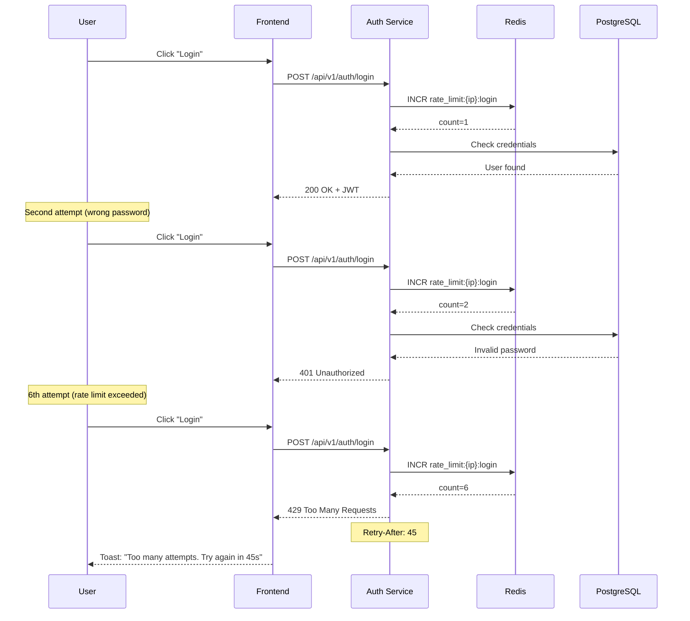

# SEC-004: Rate Limiting для Auth Endpoints

**ID:** SEC-004  
**Version:** 1.0  
**Status:** Approved  
**Author:** System Analyst  
**Date:** 2026-02-24  
**Priority:** Critical  
**Approved Date:** 2026-02-24

---

## 1. Executive Summary

### 1.1 Проблема

Отсутствие ограничений на количество запросов к критическим auth endpoints создает следующие риски:

| Endpoint | Риск | Угроза |
|----------|------|--------|
| `/api/v1/auth/login` | Brute-force паролей | Компрометация аккаунтов |
| `/api/v1/auth/register` | Массовая регистрация | Спам, фейковые аккаунты |
| `/api/v1/auth/reset-password/request` | Email flooding | DoS email сервиса |
| `/api/v1/auth/verify-email` | Перебор кодов | Обход верификации |

**Отсылка к аудиту:** SECURITY_AUDIT.md, раздел 4 "Отсутствие Rate Limiting"

### 1.2 Решение

Реализовать rate limiting на базе Redis с использованием библиотеки `fastapi-limiter`:

| Компонент | Решение |
|-----------|---------|
| Библиотека | fastapi-limiter (async, Redis-based) |
| Алгоритм | Sliding Window |
| Ключ | client_ip + endpoint_path |
| Response | HTTP 429 + Retry-After header |

---

## 2. Scope

### 2.1 In Scope

- Интеграция fastapi-limiter в auth-service
- Настройка лимитов для критических endpoints
- Конфигурация через переменные окружения
- Обработка 429 response на frontend
- Unit и integration тесты

### 2.2 Out of Scope

- Rate limiting для других сервисов (places, reports, etc.)
- Глобальный rate limiting на уровне Traefik
- CAPTCHA интеграция
- DDoS защита на уровне инфраструктуры

---

## 3. User Stories

### US1: Защита login от brute-force

**As a** Security Engineer  
**I want to** ограничить количество попыток входа  
**So that** предотвратить перебор паролей

**Priority:** High  
**Actors:** Attacker, Security Engineer

**Acceptance Criteria:**

**AC1.1: Лимит на login**
- Given пользователь делает запросы к `/api/v1/auth/login`
- When делает более 5 запросов в минуту с одного IP
- Then получает HTTP 429 Too Many Requests
- And response содержит `Retry-After` header

**AC1.2: Информативное сообщение**
- Given пользователь превысил лимит
- When получает 429 response
- Then видит сообщение "Too many login attempts. Please try again in X seconds."

---

### US2: Защита register от массовой регистрации

**As a** Security Engineer  
**I want to** ограничить количество регистраций  
**So that** предотвратить создание фейковых аккаунтов

**Priority:** High  
**Actors:** Attacker, Security Engineer

**Acceptance Criteria:**

**AC2.1: Лимит на register**
- Given пользователь делает запросы к `/api/v1/auth/register`
- When делает более 10 запросов в час с одного IP
- Then получает HTTP 429 Too Many Requests

---

### US3: Защита password reset от email flooding

**As a** Security Engineer  
**I want to** ограничить запросы сброса пароля  
**So that** предотвратить спам через email сервис

**Priority:** High  
**Actors:** Attacker, Security Engineer

**Acceptance Criteria:**

**AC3.1: Лимит на reset-password/request**
- Given пользователь делает запросы к `/api/v1/auth/reset-password/request`
- When делает более 3 запросов в час с одного IP
- Then получает HTTP 429 Too Many Requests

---

### US4: Защита verify-email от перебора кодов

**As a** Security Engineer  
**I want to** ограничить попытки верификации email  
**So that** предотвратить перебор verification codes

**Priority:** High  
**Actors:** Attacker, Security Engineer

**Acceptance Criteria:**

**AC4.1: Лимит на verify-email**
- Given пользователь делает запросы к `/api/v1/auth/verify-email`
- When делает более 5 запросов в минуту с одного IP
- Then получает HTTP 429 Too Many Requests

---

### US5: Обработка 429 на frontend

**As a** User  
**I want to** видеть понятное сообщение при превышении лимита  
**So that** знаю когда могу повторить попытку

**Priority:** Medium  
**Actors:** User

**Acceptance Criteria:**

**AC5.1: Toast notification**
- Given API возвращает 429
- When frontend получает response
- Then показывается toast с сообщением о лимите
- And отображается время до повторной попытки

**AC5.2: Блокировка кнопки**
- Given пользователь превысил лимит
- When видит форму
- Then кнопка submit заблокирована
- And показывается countdown timer

---

## 4. Технические требования

### 4.1 Выбранные лимиты

| Endpoint | Лимит | Окно | Обоснование |
|----------|-------|------|-------------|
| `/login` | 5 req | 1 min | Защита от brute-force паролей |
| `/register` | 10 req | 1 hour | Защита от массовой регистрации |
| `/reset-password/request` | 3 req | 1 hour | Защита от email flooding |
| `/verify-email` | 5 req | 1 min | Защита от перебора кодов |

### 4.2 Переменные окружения

```bash
# .env
RATE_LIMIT_ENABLED=true
RATE_LIMIT_LOGIN=5/minute
RATE_LIMIT_REGISTER=10/hour
RATE_LIMIT_RESET_PASSWORD=3/hour
RATE_LIMIT_VERIFY_EMAIL=5/minute
```

### 4.3 Структура файлов

```
services/auth-service/
├── requirements.txt           # + fastapi-limiter
├── app/
│   ├── core/
│   │   ├── config.py         # + rate limit settings
│   │   └── rate_limiter.py   # NEW: FastAPILimiter init
│   └── endpoints/
│       └── auth.py           # + @limiter.limit() decorators
```

### 4.4 Конфигурация Settings

```python
# services/auth-service/app/core/config.py

class Settings(BaseSettings):
    RATE_LIMIT_ENABLED: bool = True
    RATE_LIMIT_LOGIN: str = "5/minute"
    RATE_LIMIT_REGISTER: str = "10/hour"
    RATE_LIMIT_RESET_PASSWORD: str = "3/hour"
    RATE_LIMIT_VERIFY_EMAIL: str = "5/minute"
```

### 4.5 Модуль rate_limiter.py

```python
# services/auth-service/app/core/rate_limiter.py

from fastapi import FastAPI, Request
from fastapi_limiter import FastAPILimiter
from fastapi_limiter.depends import RateLimiter
import redis.asyncio as redis
from app.core.config import settings
from app.core.logging_config import get_logger

logger = get_logger(__name__)


async def init_rate_limiter(app: FastAPI) -> None:
    if not settings.RATE_LIMIT_ENABLED:
        logger.info("Rate limiting is disabled")
        return
    
    try:
        redis_client = redis.from_url(
            settings.REDIS_URL,
            encoding="utf-8",
            decode_responses=True
        )
        await FastAPILimiter.init(redis_client)
        logger.info("Rate limiter initialized successfully")
    except Exception as e:
        logger.error(f"Failed to initialize rate limiter: {e}")
        raise


def get_client_ip(request: Request) -> str:
    forwarded = request.headers.get("X-Forwarded-For")
    if forwarded:
        return forwarded.split(",")[0].strip()
    return request.client.host if request.client else "unknown"
```

### 4.6 429 Response Format

```json
{
  "error": {
    "code": "RATE_LIMIT_EXCEEDED",
    "message": "Too many requests. Please try again later.",
    "details": {
      "retry_after": 45,
      "limit": "5/minute",
      "endpoint": "/api/v1/auth/login"
    }
  }
}
```

### 4.7 Response Headers

| Header | Value | Description |
|--------|-------|-------------|
| `X-RateLimit-Limit` | 5 | Maximum requests per window |
| `X-RateLimit-Remaining` | 3 | Remaining requests in window |
| `X-RateLimit-Reset` | 1708789200 | Unix timestamp of window reset |
| `Retry-After` | 45 | Seconds until retry is allowed |

---

## 5. Sequence Diagram



---

## 6. Декомпозиция на задачи

### TASK-INF-001: Добавить fastapi-limiter в requirements

**Направление:** Infrastructure  
**Приоритет:** High  
**Оценка:** 0.5 часа  
**Зависимости:** Нет

**Описание:**
Добавить зависимость fastapi-limiter в requirements.txt auth-service.

**Критерии приемки:**
- [ ] `fastapi-limiter>=0.1.5` добавлен в requirements.txt
- [ ] Зависимость установлена и совместима с текущей версией FastAPI
- [ ] Docker build проходит успешно

**Технические детали:**
- Файлы: `services/auth-service/requirements.txt`

---

### TASK-BCK-001: Создать модуль rate_limiter.py

**Направление:** Backend  
**Приоритет:** High  
**Оценка:** 2 часа  
**Зависимости:** TASK-INF-001

**Описание:**
Создать модуль для инициализации FastAPILimiter с подключением к Redis.

**Критерии приемки:**
- [ ] Файл `app/core/rate_limiter.py` создан
- [ ] Реализована функция `init_rate_limiter(app)`
- [ ] Добавлена функция `get_client_ip(request)` для извлечения IP
- [ ] Обработаны ошибки подключения к Redis
- [ ] Логирование инициализации

**Технические детали:**
- Файлы: `services/auth-service/app/core/rate_limiter.py`

---

### TASK-BCK-002: Добавить настройки rate limit в config.py

**Направление:** Backend  
**Приоритет:** High  
**Оценка:** 1 час  
**Зависимости:** Нет

**Описание:**
Добавить переменные конфигурации для rate limiting в Settings.

**Критерии приемки:**
- [ ] Добавлен `RATE_LIMIT_ENABLED: bool`
- [ ] Добавлены лимиты для каждого endpoint
- [ ] Добавлены переменные в `.env.example`

**Технические детали:**
- Файлы: `services/auth-service/app/core/config.py`
- Файлы: `.env.example`

---

### TASK-BCK-003: Инициализировать rate limiter в main.py

**Направление:** Backend  
**Приоритет:** High  
**Оценка:** 1 час  
**Зависимости:** TASK-BCK-001

**Описание:**
Добавить инициализацию FastAPILimiter в startup event приложения.

**Критерии приемки:**
- [ ] `init_rate_limiter` вызывается в lifespan/startup
- [ ] Rate limiter инициализируется до обработки запросов
- [ ] Graceful degradation если Redis недоступен (опционально)

**Технические детали:**
- Файлы: `services/auth-service/app/main.py`

---

### TASK-BCK-004: Добавить декораторы rate limit к auth endpoints

**Направление:** Backend  
**Приоритет:** High  
**Оценка:** 3 часа  
**Зависимости:** TASK-BCK-001, TASK-BCK-002, TASK-BCK-003

**Описание:**
Добавить декораторы `@limiter.limit()` к критическим auth endpoints.

**Критерии приемки:**
- [ ] `/login` ограничен 5 req/min
- [ ] `/register` ограничен 10 req/hour
- [ ] `/reset-password/request` ограничен 3 req/hour
- [ ] `/verify-email` ограничен 5 req/min
- [ ] Rate limiter использует IP клиента как ключ

**Технические детали:**
- Файлы: `services/auth-service/app/endpoints/auth.py`

---

### TASK-BCK-005: Реализовать custom 429 response handler

**Направление:** Backend  
**Приоритет:** Medium  
**Оценка:** 1.5 часа  
**Зависимости:** TASK-BCK-004

**Описание:**
Создать кастомный exception handler для HTTP 429 с информативным JSON response.

**Критерии приемки:**
- [ ] Response содержит error code `RATE_LIMIT_EXCEEDED`
- [ ] Response содержит `retry_after` в секундах
- [ ] Response содержит информацию о лимите
- [ ] Headers содержат `Retry-After`, `X-RateLimit-*`

**Технические детали:**
- Файлы: `services/auth-service/app/main.py`
- Файлы: `services/auth-service/app/core/exceptions.py`

---

### TASK-FRT-001: Обработка 429 response в API client

**Направление:** Frontend  
**Приоритет:** Medium  
**Оценка:** 2 часа  
**Зависимости:** TASK-BCK-004

**Описание:**
Добавить обработку HTTP 429 ответов в API client с извлечением Retry-After.

**Критерии приемки:**
- [ ] Перехват 429 response в fetch/axios interceptor
- [ ] Извлечение `Retry-After` header
- [ ] Парсинг JSON body для получения деталей
- [ ] Возврат структурированной ошибки

**Технические детали:**
- Файлы: `frontend/lib/api/client.ts`

---

### TASK-FRT-002: UI компонент для rate limit ошибки

**Направление:** Frontend  
**Приоритет:** Medium  
**Оценка:** 2 часа  
**Зависимости:** TASK-FRT-001

**Описание:**
Создать UI компонент для отображения ошибки rate limit с countdown timer.

**Критерии приемки:**
- [ ] Toast notification с сообщением о лимите
- [ ] Countdown timer до повторной попытки
- [ ] Блокировка submit кнопки на время cooldown
- [ ] Автоматическое разблокирование по истечении времени

**Технические детали:**
- Файлы: `frontend/components/auth/RateLimitToast.tsx`
- Файлы: `frontend/components/auth/LoginForm.tsx` (интеграция)

---

### TASK-TST-001: Unit тесты для rate limiter модуля

**Направление:** Testing  
**Приоритет:** High  
**Оценка:** 2 часа  
**Зависимости:** TASK-BCK-001

**Описание:**
Написать unit тесты для модуля rate_limiter.py.

**Критерии приемки:**
- [ ] Тест: `get_client_ip` извлекает IP из X-Forwarded-For
- [ ] Тест: `get_client_ip` fallback на direct IP
- [ ] Тест: `init_rate_limiter` успешно инициализирует
- [ ] Тест: `init_rate_limiter` обрабатывает ошибку Redis

**Технические детали:**
- Файлы: `services/auth-service/tests/test_rate_limiter.py`

---

### TASK-TST-002: Integration тесты для auth endpoints с rate limiting

**Направление:** Testing  
**Приоритет:** High  
**Оценка:** 3 часа  
**Зависимости:** TASK-BCK-004

**Описание:**
Написать integration тесты для проверки rate limiting на auth endpoints.

**Критерии приемки:**
- [ ] Тест: `/login` - запросы в пределах лимита проходят
- [ ] Тест: `/login` - 6-й запрос возвращает 429
- [ ] Тест: 429 response содержит `Retry-After` header
- [ ] Тест: счётчик сбрасывается по истечении окна
- [ ] Тест: разные endpoints имеют независимые лимиты
- [ ] Тест: разные IPs имеют независимые лимиты

**Технические детали:**
- Файлы: `services/auth-service/tests/test_rate_limiting_integration.py`
- Требуется: mock Redis или test Redis container

---

### TASK-TST-003: Frontend тесты для rate limit handling

**Направление:** Testing  
**Приоритет:** Medium  
**Оценка:** 2 часа  
**Зависимости:** TASK-FRT-001, TASK-FRT-002

**Описание:**
Написать тесты для frontend обработки rate limit.

**Критерии приемки:**
- [ ] Тест: API client корректно парсит 429 response
- [ ] Тест: Toast отображается с правильным сообщением
- [ ] Тест: Countdown timer работает корректно
- [ ] Тест: Кнопка блокируется и разблокируется

**Технические детали:**
- Файлы: `frontend/__tests__/api/rateLimit.test.ts`
- Файлы: `frontend/__tests__/components/RateLimitToast.test.tsx`

---

### TASK-DOC-001: Обновить SECURITY_AUDIT.md

**Направление:** Documentation  
**Приоритет:** Medium  
**Оценка:** 0.5 часа  
**Зависимости:** TASK-BCK-004

**Описание:**
Обновить статус уязвимости #4 в SECURITY_AUDIT.md.

**Критерии приемки:**
- [ ] Статус изменен на "ИСПРАВЛЕНО"
- [ ] Добавлена дата исправления
- [ ] Добавлена ссылка на реализацию

**Технические детали:**
- Файлы: `SECURITY_AUDIT.md`

---

### TASK-DOC-002: Обновить ARCHITECTURE.md

**Направление:** Documentation  
**Приоритет:** Low  
**Оценка:** 0.5 часа  
**Зависимости:** TASK-BCK-004

**Описание:**
Добавить секцию о Rate Limiting в ARCHITECTURE.md.

**Критерии приемки:**
- [ ] Добавлена секция "Rate Limiting"
- [ ] Документированы лимиты для каждого endpoint
- [ ] Добавлена информация о Redis зависимости

**Технические детали:**
- Файлы: `ARCHITECTURE.md`

---

## 7. Итоговая таблица задач

| ID | Название | Направление | Приоритет | Оценка | Зависимости |
|----|----------|-------------|-----------|--------|-------------|
| TASK-INF-001 | fastapi-limiter в requirements | Infrastructure | High | 0.5h | - |
| TASK-BCK-001 | Модуль rate_limiter.py | Backend | High | 2h | INF-001 |
| TASK-BCK-002 | Настройки в config.py | Backend | High | 1h | - |
| TASK-BCK-003 | Инициализация в main.py | Backend | High | 1h | BCK-001 |
| TASK-BCK-004 | Декораторы на endpoints | Backend | High | 3h | BCK-001, BCK-002, BCK-003 |
| TASK-BCK-005 | Custom 429 handler | Backend | Medium | 1.5h | BCK-004 |
| TASK-FRT-001 | API client 429 handling | Frontend | Medium | 2h | BCK-004 |
| TASK-FRT-002 | Rate limit UI компонент | Frontend | Medium | 2h | FRT-001 |
| TASK-TST-001 | Unit тесты rate_limiter | Testing | High | 2h | BCK-001 |
| TASK-TST-002 | Integration тесты | Testing | High | 3h | BCK-004 |
| TASK-TST-003 | Frontend тесты | Testing | Medium | 2h | FRT-001, FRT-002 |
| TASK-DOC-001 | SECURITY_AUDIT.md | Documentation | Medium | 0.5h | BCK-004 |
| TASK-DOC-002 | ARCHITECTURE.md | Documentation | Low | 0.5h | BCK-004 |

**Общая оценка:** 21 час

**Критический путь (Backend):**
```
INF-001 (0.5h) → BCK-001 (2h) → BCK-003 (1h) → BCK-004 (3h) → TST-002 (3h)
```
**Длительность критического пути:** 9.5 часов

---

## 8. Риски и митигация

| Риск | Вероятность | Влияние | Митигация |
|------|-------------|---------|-----------|
| Redis недоступен | Medium | High | Graceful degradation, логирование |
| Legitimate users блокируются | Low | Medium | Настройка адекватных лимитов, whitelist для admin |
| IP spoofing через X-Forwarded-For | Medium | Medium | Валидация header, доверие только к proxy |
| Несовместимость версий | Low | Low | Тестирование на dev environment |

---

## 9. Non-Functional Requirements

### 9.1 Performance

| Метрика | Требование |
|---------|------------|
| Overhead на request | < 5ms |
| Redis latency | < 2ms |
| Memory overhead | < 10MB |

### 9.2 Availability

| Требование | Значение |
|------------|----------|
| Degradation при Redis down | Запросы проходят без rate limiting |
| Logging | Warning при недоступности Redis |

### 9.3 Security

| Требование | Значение |
|------------|----------|
| Key format | `rate_limit:{ip}:{endpoint}` |
| TTL | Соответствует окну лимита |
| IP extraction | X-Forwarded-For → client.host |

---

## 10. Definition of Done

### DoD Backend

- [ ] fastapi-limiter установлен и инициализирован
- [ ] Все 4 endpoint защищены декораторами
- [ ] Custom 429 response реализован
- [ ] Unit тесты написаны (≥80% покрытие)
- [ ] Integration тесты пройдены

### DoD Frontend

- [ ] API client обрабатывает 429
- [ ] Toast notification реализован
- [ ] Countdown timer работает
- [ ] Тесты написаны

### DoD Documentation

- [ ] SECURITY_AUDIT.md обновлен
- [ ] ARCHITECTURE.md обновлен
- [ ] .env.example обновлен

---

## 11. Зависимости

### Зависит от

- Redis (уже развернут в docker-compose.yml)
- AUTH_SERVICE (port 8000)

### Блокирует

- Полное устранение уязвимости #4 из SECURITY_AUDIT.md

---

## 12. История изменений

| Версия | Дата | Автор | Изменения |
|--------|------|-------|-----------|
| 1.0 | 2026-02-24 | System Analyst | Initial version |

---

**Статус:** ✅ Approved  
**Дата согласования:** 2026-02-24  
**Согласовано с:** Заказчик
