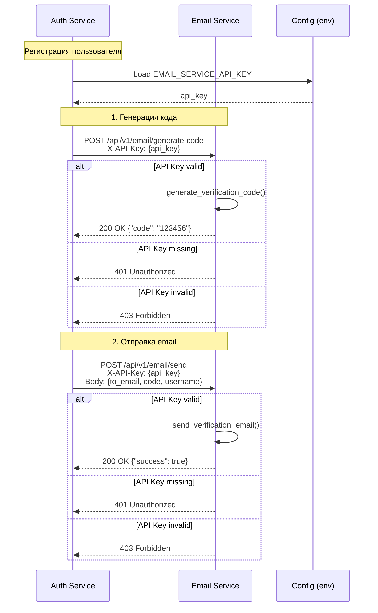

# SEC-005: Защита Email Service API

**ID:** SEC-005  
**Version:** 1.1  
**Status:** Approved  
**Author:** System Analyst  
**Date:** 2026-02-24  
**Priority:** Critical  
**Approved Date:** 2026-02-27

---

## 1. Executive Summary

### 1.1 Проблема

Публичный доступ к email-service endpoints создает следующие риски:

| Endpoint | Проблема | Риск |
|----------|----------|------|
| `/api/v1/email/generate-code` | ❌ Без аутентификации | Генерация кодов любым клиентом |
| `/api/v1/email/send` | ❌ Без аутентификации | Спам через email сервис |

**Random генерация:** ✅ `secrets.randbelow()` - криптографически безопасно

**Отсылка к аудиту:** SECURITY_AUDIT.md, раздел 5 "Публичный endpoint генерации кодов"

### 1.2 Решение

Реализовать API Key аутентификацию для межсервисного взаимодействия:

| Компонент | Решение |
|-----------|---------|
| Метод аутентификации | API Key через заголовок `X-API-Key` |
| Хранение ключа | Environment variable (`EMAIL_SERVICE_API_KEY`) |
| Валидация | Dependency injection в FastAPI |
| Rate Limiting | Не требуется (внутренняя сеть) |

---

## 2. Scope

### 2.1 In Scope

- API Key аутентификация для `/api/v1/email/generate-code`
- API Key аутентификация для `/api/v1/email/send`
- Конфигурация через переменные окружения
- Обновление auth-service для передачи API key
- Unit тесты
- Документация

### 2.2 Out of Scope

- Rate limiting (достаточно API key для внутренней сети)
- JWT-based service authentication
- mTLS
- API key rotation mechanism

---

## 3. User Stories

### US1: Защита generate-code endpoint

**As a** Security Engineer  
**I want to** ограничить доступ к генерации кодов  
**So that** только авторизованные сервисы могут использовать endpoint

**Priority:** High  
**Actors:** auth-service, Security Engineer

**Acceptance Criteria:**

**AC1.1: Требование API Key**
- Given сервис вызывает `/api/v1/email/generate-code`
- When запрос без заголовка `X-API-Key`
- Then получает HTTP 401 Unauthorized
- And response содержит error code `API_KEY_REQUIRED`

**AC1.2: Валидация API Key**
- Given сервис вызывает `/api/v1/email/generate-code`
- When запрос с неверным `X-API-Key`
- Then получает HTTP 403 Forbidden
- And response содержит error code `INVALID_API_KEY`

**AC1.3: Успешная генерация**
- Given auth-service вызывает `/api/v1/email/generate-code`
- When запрос с корректным `X-API-Key`
- Then получает HTTP 200 OK
- And response содержит сгенерированный код

---

### US2: Интеграция auth-service

**As a** Developer  
**I want to** auth-service передавал API key при вызове email-service  
**So that** запросы проходят аутентификацию

**Priority:** High  
**Actors:** Developer, auth-service

**Acceptance Criteria:**

**AC2.1: Передача X-API-Key**
- Given auth-service вызывает email-service
- When отправляет HTTP запрос
- Then добавляется заголовок `X-API-Key` с корректным значением

---

### US3: Защита send endpoint

**As a** Security Engineer  
**I want to** ограничить доступ к отправке email  
**So that** предотвратить использование email сервиса для спама

**Priority:** High  
**Actors:** auth-service, Security Engineer

**Acceptance Criteria:**

**AC3.1: Требование API Key для /send**
- Given сервис вызывает `/api/v1/email/send`
- When запрос без заголовка `X-API-Key`
- Then получает HTTP 401 Unauthorized
- And response содержит error code `API_KEY_REQUIRED`

**AC3.2: Успешная отправка**
- Given auth-service вызывает `/api/v1/email/send`
- When запрос с корректным `X-API-Key`
- Then email отправляется получателю
- And response содержит HTTP 200 OK

---

## 4. Технические требования

### 4.1 Переменные окружения

```bash
# .env
EMAIL_SERVICE_API_KEY=your-secure-api-key-min-32-chars-here
```

```bash
# .env.example
EMAIL_SERVICE_API_KEY=your-secure-api-key-change-me
```

### 4.2 Структура файлов

```
services/email-service/
├── app/
│   ├── core/
│   │   ├── config.py              # + EMAIL_SERVICE_API_KEY
│   │   └── dependencies.py        # NEW: verify_api_key()
│   └── api/v1/
│       └── router.py              # + Depends(verify_api_key)

services/auth-service/
├── app/
│   └── core/
│       └── email_client.py        # + X-API-Key header
```

### 4.3 Конфигурация Settings

```python
# services/email-service/app/core/config.py

class Settings(BaseSettings):
    EMAIL_SERVICE_API_KEY: str
    
    @validator("EMAIL_SERVICE_API_KEY")
    def validate_api_key(cls, v: str) -> str:
        if len(v) < 32:
            raise ValueError("EMAIL_SERVICE_API_KEY must be at least 32 characters")
        return v
```

### 4.4 API Key Dependency

```python
# services/email-service/app/core/dependencies.py

from fastapi import Depends, HTTPException, Request
from app.core.config import settings

async def verify_api_key(request: Request) -> str:
    api_key = request.headers.get("X-API-Key")
    
    if not api_key:
        raise HTTPException(
            status_code=401,
            detail={
                "code": "API_KEY_REQUIRED",
                "message": "X-API-Key header is required"
            }
        )
    
    if api_key != settings.EMAIL_SERVICE_API_KEY:
        raise HTTPException(
            status_code=403,
            detail={
                "code": "INVALID_API_KEY",
                "message": "Invalid API key"
            }
        )
    
    return api_key
```

### 4.5 Защищенные Endpoints

```python
# services/email-service/app/api/v1/router.py

from app.core.dependencies import verify_api_key

@router.post("/generate-code", response_model=GenerateCodeResponse)
async def generate_code(_: str = Depends(verify_api_key)):
    code = generate_verification_code()
    return GenerateCodeResponse(code=code)


@router.post("/send", response_model=EmailSendResponse)
async def send_email(
    request: EmailSendRequest,
    _: str = Depends(verify_api_key)
):
    success = await send_verification_email(
        to_email=request.to_email,
        verification_code=request.verification_code,
        username=request.username
    )
    # ... rest of implementation
```

### 4.6 Auth Service Client

```python
# services/auth-service/app/endpoints/auth.py

import httpx
from app.core.config import settings

API_HEADERS = {"X-API-Key": settings.EMAIL_SERVICE_API_KEY}

# В функции регистрации:
async with httpx.AsyncClient() as client:
    # Generate code
    response = await client.post(
        f"{settings.EMAIL_SERVICE_URL}/api/v1/email/generate-code",
        headers=API_HEADERS,
        timeout=10.0,
    )
    code = response.json()["code"]

    # Send email
    await client.post(
        f"{settings.EMAIL_SERVICE_URL}/api/v1/email/send",
        json={
            "to_email": request.email,
            "verification_code": code,
            "username": request.username,
        },
        headers=API_HEADERS,
        timeout=30.0,
    )
```

### 4.7 Error Responses

**401 Unauthorized (API Key Required):**
```json
{
  "detail": {
    "code": "API_KEY_REQUIRED",
    "message": "X-API-Key header is required"
  }
}
```

**403 Forbidden (Invalid API Key):**
```json
{
  "detail": {
    "code": "INVALID_API_KEY",
    "message": "Invalid API key"
  }
}
```

---

## 5. Sequence Diagram



---

## 6. Декомпозиция на задачи

### TASK-INF-001: Добавить EMAIL_SERVICE_API_KEY в конфигурацию

**Направление:** Infrastructure  
**Приоритет:** High  
**Оценка:** 0.5 часа  
**Зависимости:** Нет

**Описание:**
Добавить переменную `EMAIL_SERVICE_API_KEY` в `.env`, `.env.example` и `docker-compose.yml`.

**Критерии приемки:**
- [ ] `EMAIL_SERVICE_API_KEY` добавлен в `.env.example`
- [ ] Переменная добавлена в `docker-compose.yml` для email-service и auth-service
- [ ] Документировано требование к длине ключа (min 32 chars)

**Технические детали:**
- Файлы: `.env.example`, `docker-compose.yml`

---

### TASK-BCK-001: Добавить EMAIL_SERVICE_API_KEY в email-service config

**Направление:** Backend  
**Приоритет:** High  
**Оценка:** 0.5 часа  
**Зависимости:** TASK-INF-001

**Описание:**
Добавить настройку API key в Settings класса email-service.

**Критерии приемки:**
- [ ] `EMAIL_SERVICE_API_KEY: str` добавлен в Settings
- [ ] Валидация длины ключа (min 32 chars)
- [ ] Ошибка при отсутствии ключа в production

**Технические детали:**
- Файлы: `services/email-service/app/core/config.py`

---

### TASK-BCK-002: Создать dependencies.py с verify_api_key

**Направление:** Backend  
**Приоритет:** High  
**Оценка:** 1 час  
**Зависимости:** TASK-BCK-001

**Описание:**
Создать модуль dependencies.py с функцией verify_api_key для валидации API key.

**Критерии приемки:**
- [ ] Файл `app/core/dependencies.py` создан
- [ ] Функция `verify_api_key(request: Request)` реализована
- [ ] Возвращает 401 если заголовок отсутствует
- [ ] Возвращает 403 если ключ неверный
- [ ] Логирование failed attempts (warning level)

**Технические детали:**
- Файлы: `services/email-service/app/core/dependencies.py`

---

### TASK-BCK-003: Защитить email endpoints

**Направление:** Backend  
**Приоритет:** High  
**Оценка:** 1 час  
**Зависимости:** TASK-BCK-002

**Описание:**
Добавить зависимость `verify_api_key` к endpoints `/generate-code` и `/send`.

**Критерии приемки:**
- [ ] `Depends(verify_api_key)` добавлен в `/generate-code`
- [ ] `Depends(verify_api_key)` добавлен в `/send`
- [ ] Оба endpoint возвращают 401 без API key
- [ ] Оба endpoint возвращают 403 с неверным API key
- [ ] Оба endpoint работают корректно с валидным API key

**Технические детали:**
- Файлы: `services/email-service/app/api/v1/router.py`

---

### TASK-BCK-004: Добавить EMAIL_SERVICE_API_KEY в auth-service config

**Направление:** Backend  
**Приоритет:** High  
**Оценка:** 0.5 часа  
**Зависимости:** TASK-INF-001

**Описание:**
Добавить настройку API key в Settings класса auth-service.

**Критерии приемки:**
- [ ] `EMAIL_SERVICE_API_KEY: str` добавлен в Settings
- [ ] Переменная загружается из окружения

**Технические детали:**
- Файлы: `services/auth-service/app/core/config.py`

---

### TASK-BCK-005: Обновить email client в auth-service

**Направление:** Backend  
**Приоритет:** High  
**Оценка:** 1 час  
**Зависимости:** TASK-BCK-004

**Описание:**
Добавить заголовок `X-API-Key` при вызове email-service из auth-service.

**Критерии приемки:**
- [ ] Заголовок `X-API-Key` добавляется ко всем запросам
- [ ] Обработка ошибок 401/403 от email-service
- [ ] Логирование failed requests

**Технические детали:**
- Файлы: `services/auth-service/app/endpoints/auth.py` (или email client module)

---

### TASK-TST-001: Unit тесты для verify_api_key

**Направление:** Testing  
**Приоритет:** High  
**Оценка:** 1.5 часа  
**Зависимости:** TASK-BCK-002

**Описание:**
Написать unit тесты для функции verify_api_key.

**Критерии приемки:**
- [ ] Тест: валидный API key возвращает успех
- [ ] Тест: отсутствующий заголовок возвращает 401
- [ ] Тест: неверный API key возвращает 403
- [ ] Тест: error response содержит правильный code

**Технические детали:**
- Файлы: `services/email-service/tests/test_dependencies.py`

---

### TASK-TST-002: Integration тесты для email endpoints

**Направление:** Testing  
**Приоритет:** High  
**Оценка:** 2 часа  
**Зависимости:** TASK-BCK-003

**Описание:**
Написать integration тесты для защищенных endpoints.

**Критерии приемки:**
- [ ] Тест: `/generate-code` с валидным API key возвращает 200
- [ ] Тест: `/generate-code` без API key возвращает 401
- [ ] Тест: `/generate-code` с неверным API key возвращает 403
- [ ] Тест: `/send` с валидным API key возвращает 200
- [ ] Тест: `/send` без API key возвращает 401
- [ ] Тест: `/send` с неверным API key возвращает 403

**Технические детали:**
- Файлы: `services/email-service/tests/test_email_api.py`

---

### TASK-TST-003: Тесты auth-service → email-service интеграции

**Направление:** Testing  
**Приоритет:** Medium  
**Оценка:** 1 час  
**Зависимости:** TASK-BCK-005

**Описание:**
Протестировать передачу API key от auth-service к email-service.

**Критерии приемки:**
- [ ] Тест: auth-service передает X-API-Key header
- [ ] Тест: успешная генерация кода
- [ ] Тест: обработка ошибок от email-service

**Технические детали:**
- Файлы: `services/auth-service/tests/test_email_integration.py`

---

### TASK-DOC-001: Обновить SECURITY_AUDIT.md

**Направление:** Documentation  
**Приоритет:** Medium  
**Оценка:** 0.5 часа  
**Зависимости:** TASK-BCK-003

**Описание:**
Обновить статус уязвимости #5 в SECURITY_AUDIT.md.

**Критерии приемки:**
- [ ] Статус изменен на "ИСПРАВЛЕНО"
- [ ] Добавлена дата исправления
- [ ] Добавлена ссылка на документ требований

**Технические детали:**
- Файлы: `SECURITY_AUDIT.md`

---

### TASK-DOC-002: Обновить ARCHITECTURE.md

**Направление:** Documentation  
**Приоритет:** Low  
**Оценка:** 0.5 часа  
**Зависимости:** TASK-BCK-003

**Описание:**
Добавить секцию о Service-to-Service Authentication в ARCHITECTURE.md.

**Критерии приемки:**
- [ ] Добавлена секция "Service Authentication"
- [ ] Документирован механизм API Key
- [ ] Добавлена диаграмма взаимодействия сервисов

**Технические детали:**
- Файлы: `ARCHITECTURE.md`

---

## 7. Итоговая таблица задач

| ID | Название | Направление | Приоритет | Оценка | Зависимости |
|----|----------|-------------|-----------|--------|-------------|
| TASK-INF-001 | Конфигурация API key | Infrastructure | High | 0.5h | - |
| TASK-BCK-001 | email-service config | Backend | High | 0.5h | INF-001 |
| TASK-BCK-002 | dependencies.py | Backend | High | 1h | BCK-001 |
| TASK-BCK-003 | Защита endpoints (/generate-code, /send) | Backend | High | 1h | BCK-002 |
| TASK-BCK-004 | auth-service config | Backend | High | 0.5h | INF-001 |
| TASK-BCK-005 | email client update | Backend | High | 1h | BCK-004 |
| TASK-TST-001 | Unit тесты verify_api_key | Testing | High | 1.5h | BCK-002 |
| TASK-TST-002 | Integration тесты (оба endpoints) | Testing | High | 2h | BCK-003 |
| TASK-TST-003 | Auth-email интеграция | Testing | Medium | 1h | BCK-005 |
| TASK-DOC-001 | SECURITY_AUDIT.md | Documentation | Medium | 0.5h | BCK-003 |
| TASK-DOC-002 | ARCHITECTURE.md | Documentation | Low | 0.5h | BCK-003 |

**Общая оценка:** 10.5 часов

**Критический путь (Backend):**
```
INF-001 (0.5h) → BCK-001 (0.5h) → BCK-002 (1h) → BCK-003 (1h) → TST-002 (2h)
```
**Длительность критического пути:** 5 часов

---

## 8. Риски и митигация

| Риск | Вероятность | Влияние | Митигация |
|------|-------------|---------|-----------|
| API key утечка | Low | High | Хранение в Docker Secrets, rotation policy |
| API key в логах | Medium | Medium | Маскирование в logging middleware |
| Несовпадение ключей | Low | Medium | Единый источник переменной в docker-compose |
| Backward compatibility | Low | Low | Endpoint не используется извне |

---

## 9. Non-Functional Requirements

### 9.1 Performance

| Метрика | Требование |
|---------|------------|
| Overhead на validation | < 1ms |
| Memory overhead | Negligible |

### 9.2 Security

| Требование | Значение |
|------------|----------|
| Key length | Min 32 characters |
| Storage | Environment variable / Docker Secret |
| Transmission | Header (HTTPS only) |
| Logging | Mask key in logs |

### 9.3 Maintainability

| Требование | Значение |
|------------|----------|
| Configuration | Via environment variables |
| Key rotation | Manual, requires restart |

---

## 10. Definition of Done

### DoD Backend

- [ ] API key validation реализована
- [ ] Endpoint `/generate-code` защищен
- [ ] Endpoint `/send` защищен
- [ ] auth-service передает API key для обоих вызовов
- [ ] Unit тесты написаны (≥80% покрытие)
- [ ] Integration тесты пройдены

### DoD Infrastructure

- [ ] Переменные добавлены в `.env.example`
- [ ] Docker compose обновлен

### DoD Documentation

- [ ] SECURITY_AUDIT.md обновлен
- [ ] ARCHITECTURE.md обновлен (опционально)

---

## 11. Зависимости

### Зависит от

- Нет внешних зависимостей

### Блокирует

- Полное устранение уязвимости #5 из SECURITY_AUDIT.md

---

## 12. История изменений

| Версия | Дата | Автор | Изменения |
|--------|------|-------|-----------|
| 1.0 | 2026-02-24 | System Analyst | Initial version |
| 1.1 | 2026-02-27 | System Analyst | Добавлена защита `/send` endpoint; обновлены оценки |

---

**Статус:** ✅ Approved  
**Дата согласования:** 2026-02-27  
**Согласовано с:** Заказчик
