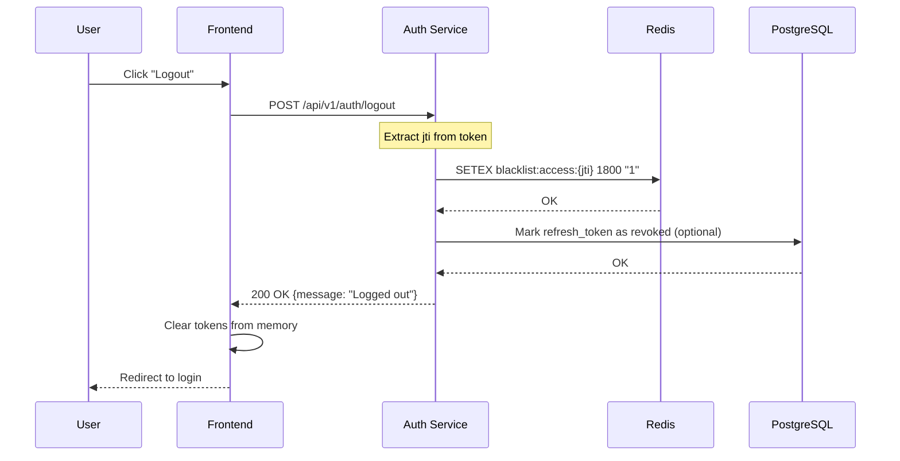
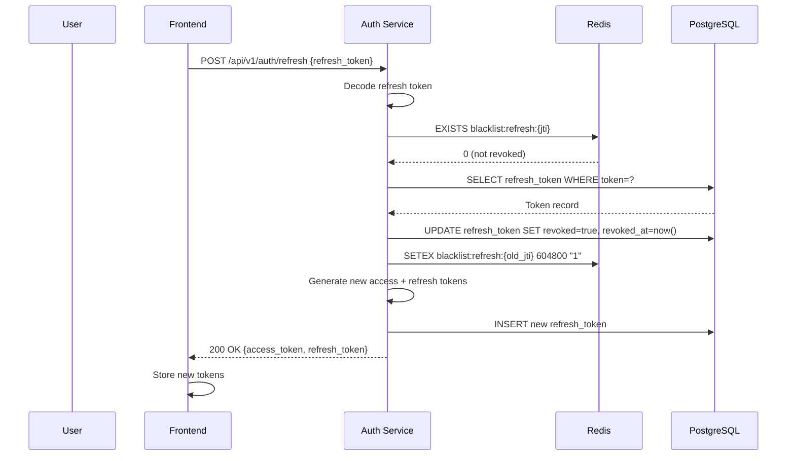
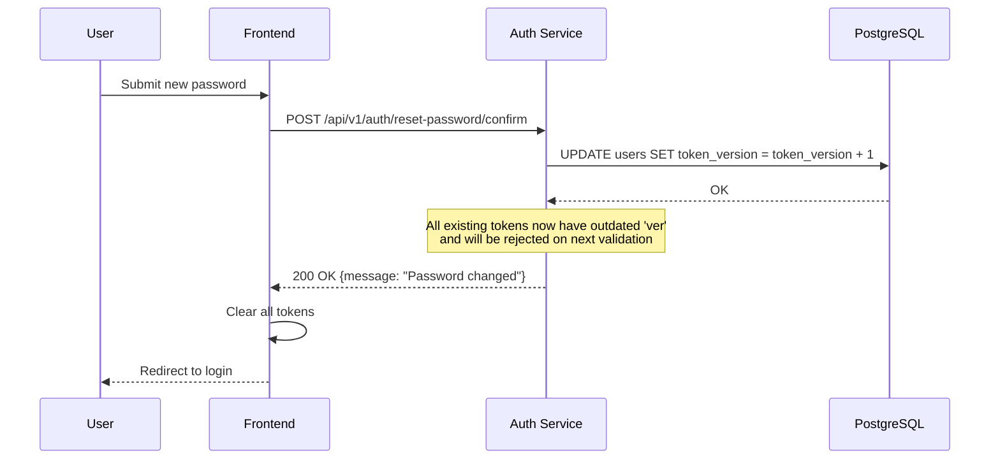

# SEC-006: JWT Blacklist / Token Invalidation

**ID:** SEC-006  
**Version:** 1.0  
**Status:** Approved  
**Author:** System Analyst  
**Date:** 2026-02-24  
**Priority:** High  
**Approved Date:** 2026-02-24

---

## 1. Executive Summary

### 1.1 Проблема

Отсутствие механизма отзыва JWT токенов создает следующие риски:

| Сценарий | Риск | Последствие |
|----------|------|-------------|
| Кража access token | Токен валиден до 30 минут | Несанкционированный доступ |
| Logout пользователя | Токен остается валидным | Невозможность отозвать сессию |
| Смена пароля | Старые токены валидны | Компрометация аккаунта |
| Кража refresh token | Бессрочный доступ | Полная компрометация |

**Отсылка к аудиту:** SECURITY_AUDIT.md, раздел 6 "Отсутствие JWT blacklist / token invalidation"

### 1.2 Решение

Реализовать token invalidation через Redis blacklist + refresh token rotation:

| Компонент | Решение |
|-----------|---------|
| Access Token Blacklist | Redis SET с TTL = access_token_expire |
| Refresh Token Rotation | Новая пара access+refresh при каждом refresh |
| User Token Version | Поле в БД для инвалидации всех токенов |
| Logout Endpoint | Добавление jti в blacklist |

---

## 2. Scope

### 2.1 In Scope

- Добавление `jti` (JWT ID) в access и refresh токены
- Redis blacklist для отозванных токенов
- Endpoint `/api/v1/auth/logout`
- Endpoint `/api/v1/auth/refresh` с rotation
- Инвалидация всех токенов при смене пароля
- Token version в таблице users
- Unit и integration тесты

### 2.2 Out of Scope

- Admin endpoint для инвалидации токенов пользователей
- Detection suspicious activity
- Multi-device session management UI
- Webhook notifications о компрометации

---

## 3. User Stories

### US1: Logout пользователя

**As a** User  
**I want to** выйти из системы и отозвать токен  
**So that** никто не сможет использовать мою сессию

**Priority:** High  
**Actors:** User

**Acceptance Criteria:**

**AC1.1: Logout инвалидирует токен**
- Given пользователь авторизован
- When отправляет POST /api/v1/auth/logout
- Then access token добавляется в blacklist
- And response возвращает 200 OK
- And последующие запросы с этим токеном возвращают 401

**AC1.2: Logout без токена**
- Given запрос без Authorization header
- When отправляет POST /api/v1/auth/logout
- Then response возвращает 401 Unauthorized

---

### US2: Refresh Token Rotation

**As a** User  
**I want to** обновить access token через refresh token  
**So that** поддерживать сессию без повторного логина

**Priority:** High  
**Actors:** User

**Acceptance Criteria:**

**AC2.1: Успешный refresh**
- Given валидный refresh token
- When отправляет POST /api/v1/auth/refresh
- Then response возвращает новую пару access + refresh
- And старый refresh token инвалидирован
- And старый refresh token нельзя использовать повторно

**AC2.2: Повторное использование refresh token**
- Given refresh token уже был использован
- When отправляет POST /api/v1/auth/refresh
- Then response возвращает 401 Unauthorized
- And error code = REFRESH_TOKEN_REVOKED

**AC2.3: Истекший refresh token**
- Given refresh token истек
- When отправляет POST /api/v1/auth/refresh
- Then response возвращает 401 Unauthorized
- And error code = REFRESH_TOKEN_EXPIRED

---

### US3: Инвалидация при смене пароля

**As a** User  
**I want to** чтобы при смене пароля все мои токены стали невалидными  
**So that** если аккаунт был скомпрометирован, attacker потеряет доступ

**Priority:** High  
**Actors:** User

**Acceptance Criteria:**

**AC3.1: Смена пароля инвалидирует все токены**
- Given пользователь имеет активные токены
- When меняет пароль через /reset-password/confirm или /users/me/password
- Then token_version инкрементируется
- And все access токены становятся невалидными
- And все refresh токены становятся невалидными
- And пользователь должен заново логиниться

---

### US4: Login возвращает refresh token

**As a** User  
**I want to** получать refresh token при логине  
**So that** могу обновлять access token без повторного ввода пароля

**Priority:** High  
**Actors:** User

**Acceptance Criteria:**

**AC4.1: Login возвращает оба токена**
- Given валидные credentials
- When отправляет POST /api/v1/auth/login
- Then response содержит access_token
- And response содержит refresh_token
- And response содержит expires_in для access token

**AC4.2: Verify-email возвращает оба токена**
- Given валидный verification code
- When отправляет POST /api/v1/auth/verify-email
- Then response содержит access_token
- And response содержит refresh_token

---

## 4. Технические требования

### 4.1 Изменения в JWT Payload

```json
{
  "sub": "user_uuid",
  "jti": "unique_token_id",
  "type": "access|refresh",
  "ver": 1,
  "exp": 1708789200,
  "iat": 1708787400
}
```

| Поле | Описание |
|------|----------|
| `sub` | User ID (существующее) |
| `jti` | JWT ID - уникальный идентификатор токена (NEW) |
| `type` | Тип токена: `access` или `refresh` (NEW) |
| `ver` | Token version - для инвалидации всех токенов (NEW) |
| `exp` | Expiration time (существующее) |
| `iat` | Issued at time (существующее) |

### 4.2 Изменения в таблице users

```sql
ALTER TABLE users ADD COLUMN token_version INTEGER DEFAULT 1;
```

### 4.3 Изменения в таблице refresh_tokens

```sql
ALTER TABLE refresh_tokens ADD COLUMN revoked BOOLEAN DEFAULT FALSE;
ALTER TABLE refresh_tokens ADD COLUMN revoked_at TIMESTAMP;
ALTER TABLE refresh_tokens ADD COLUMN replaced_by VARCHAR(36);
```

### 4.4 Redis Key Format

| Key Pattern | Value | TTL | Описание |
|-------------|-------|-----|----------|
| `blacklist:access:{jti}` | `1` | ACCESS_TOKEN_EXPIRE_MINUTES | Отозванный access token |
| `blacklist:refresh:{jti}` | `1` | REFRESH_TOKEN_EXPIRE_DAYS * 86400 | Отозванный refresh token |

### 4.5 Переменные окружения

```bash
ACCESS_TOKEN_EXPIRE_MINUTES=30
REFRESH_TOKEN_EXPIRE_DAYS=7
```

### 4.6 Структура файлов

```
services/auth-service/
├── app/
│   ├── core/
│   │   ├── security.py          # + jti, type, ver в токены
│   │   ├── token_blacklist.py   # NEW: Redis blacklist operations
│   │   └── config.py            # + token settings
│   ├── crud/
│   │   └── refresh_token.py     # + revoke, rotation logic
│   ├── endpoints/
│   │   └── auth.py              # + /logout, /refresh endpoints
│   ├── models/
│   │   └── user.py              # + token_version field
│   └── schemas/
│       └── auth.py              # + RefreshTokenResponse
```

### 4.7 API Specification

#### POST /api/v1/auth/logout

**Request:**
```http
POST /api/v1/auth/logout HTTP/1.1
Authorization: Bearer <access_token>
```

**Response 200:**
```json
{
  "message": "Successfully logged out"
}
```

**Response 401:**
```json
{
  "error": {
    "code": "UNAUTHORIZED",
    "message": "Authentication required"
  }
}
```

---

#### POST /api/v1/auth/refresh

**Request:**
```http
POST /api/v1/auth/refresh HTTP/1.1
Content-Type: application/json

{
  "refresh_token": "eyJhbGciOiJIUzI1NiIsInR5cCI6IkpXVCJ9..."
}
```

**Response 200:**
```json
{
  "access_token": "eyJhbGciOiJIUzI1NiIsInR5cCI6IkpXVCJ9...",
  "refresh_token": "eyJhbGciOiJIUzI1NiIsInR5cCI6IkpXVCJ9...",
  "token_type": "bearer",
  "expires_in": 1800
}
```

**Response 401 (expired):**
```json
{
  "error": {
    "code": "REFRESH_TOKEN_EXPIRED",
    "message": "Refresh token has expired"
  }
}
```

**Response 401 (revoked):**
```json
{
  "error": {
    "code": "REFRESH_TOKEN_REVOKED",
    "message": "Refresh token has been revoked"
  }
}
```

---

#### Modified: POST /api/v1/auth/login

**Response 200:**
```json
{
  "success": true,
  "message": "Login successful",
  "access_token": "eyJhbGciOiJIUzI1NiIsInR5cCI6IkpXVCJ9...",
  "refresh_token": "eyJhbGciOiJIUzI1NiIsInR5cCI6IkpXVCJ9...",
  "token_type": "bearer",
  "expires_in": 1800
}
```

---

### 4.8 Module: token_blacklist.py

```python
# services/auth-service/app/core/token_blacklist.py

import redis.asyncio as redis
from app.core.config import settings
from app.core.logging_config import get_logger
import uuid

logger = get_logger(__name__)


class TokenBlacklist:
    def __init__(self, redis_client: redis.Redis):
        self.redis = redis_client
        self.access_prefix = "blacklist:access"
        self.refresh_prefix = "blacklist:refresh"
    
    async def add_access_token(self, jti: str, expires_in_seconds: int) -> bool:
        key = f"{self.access_prefix}:{jti}"
        await self.redis.setex(key, expires_in_seconds, "1")
        logger.info("Access token blacklisted", jti=jti)
        return True
    
    async def add_refresh_token(self, jti: str, expires_in_seconds: int) -> bool:
        key = f"{self.refresh_prefix}:{jti}"
        await self.redis.setex(key, expires_in_seconds, "1")
        logger.info("Refresh token blacklisted", jti=jti)
        return True
    
    async def is_access_token_revoked(self, jti: str) -> bool:
        key = f"{self.access_prefix}:{jti}"
        return await self.redis.exists(key) > 0
    
    async def is_refresh_token_revoked(self, jti: str) -> bool:
        key = f"{self.refresh_prefix}:{jti}"
        return await self.redis.exists(key) > 0
```

---

## 5. Sequence Diagrams

### 5.1 Logout Flow



### 5.2 Refresh Token Rotation Flow



### 5.3 Password Reset - Invalidate All Tokens



---

## 6. Декомпозиция на задачи

### TASK-BCK-001: Добавить token_version в User model

**Направление:** Backend  
**Приоритет:** High  
**Оценка:** 1 час  
**Зависимости:** Нет

**Описание:**
Добавить поле token_version в модель User и создать migration.

**Критерии приемки:**
- [ ] Поле `token_version: int = 1` добавлено в User model
- [ ] Migration скрипт создан
- [ ] Migration применена к БД
- [ ] Значение по умолчанию = 1

**Технические детали:**
- Файлы: `services/auth-service/app/models/user.py`
- Файлы: `services/auth-service/migrations/add_token_version.py`

---

### TASK-BCK-002: Обновить refresh_tokens таблицу

**Направление:** Backend  
**Приоритет:** High  
**Оценка:** 1 час  
**Зависимости:** Нет

**Описание:**
Добавить поля для отслеживания статуса refresh token.

**Критерии приемки:**
- [ ] Поле `revoked: bool = False` добавлено
- [ ] Поле `revoked_at: datetime` добавлено
- [ ] Поле `replaced_by: str` добавлено (jti нового токена)
- [ ] Migration применена

**Технические детали:**
- Файлы: `services/auth-service/app/models/refresh_token.py`

---

### TASK-BCK-003: Обновить JWT payload с jti, type, ver

**Направление:** Backend  
**Приоритет:** High  
**Оценка:** 2 часа  
**Зависимости:** TASK-BCK-001

**Описание:**
Модифицировать create_access_token для включения jti, type, ver в payload.

**Критерии приемки:**
- [ ] `jti` генерируется как UUID4
- [ ] `type` = "access" или "refresh"
- [ ] `ver` берется из user.token_version
- [ ] create_refresh_token() функция создана

**Технические детали:**
- Файлы: `services/auth-service/app/core/security.py`

---

### TASK-BCK-004: Создать модуль token_blacklist.py

**Направление:** Backend  
**Приоритет:** High  
**Оценка:** 2 часа  
**Зависимости:** Нет

**Описание:**
Создать класс TokenBlacklist для работы с Redis blacklist.

**Критерии приемки:**
- [ ] Класс TokenBlacklist создан
- [ ] Метод `add_access_token(jti, ttl)`
- [ ] Метод `add_refresh_token(jti, ttl)`
- [ ] Метод `is_access_token_revoked(jti)`
- [ ] Метод `is_refresh_token_revoked(jti)`
- [ ] Обработка ошибок Redis connection

**Технические детали:**
- Файлы: `services/auth-service/app/core/token_blacklist.py`

---

### TASK-BCK-005: Реализовать /logout endpoint

**Направление:** Backend  
**Приоритет:** High  
**Оценка:** 2 часа  
**Зависимости:** TASK-BCK-003, TASK-BCK-004

**Описание:**
Создать endpoint для logout с добавлением токена в blacklist.

**Критерии приемки:**
- [ ] POST /api/v1/auth/logout реализован
- [ ] Токен извлекается из Authorization header
- [ ] jti добавляется в Redis blacklist
- [ ] Response 200 OK с сообщением
- [ ] Response 401 если токен невалиден

**Технические детали:**
- Файлы: `services/auth-service/app/endpoints/auth.py`

---

### TASK-BCK-006: Реализовать /refresh endpoint с rotation

**Направление:** Backend  
**Приоритет:** High  
**Оценка:** 3 часа  
**Зависимости:** TASK-BCK-002, TASK-BCK-003, TASK-BCK-004

**Описание:**
Создать endpoint для refresh token rotation.

**Критерии приемки:**
- [ ] POST /api/v1/auth/refresh реализован
- [ ] Валидация refresh token (signature, expiry, type)
- [ ] Проверка token_version
- [ ] Проверка blacklist/revoked статуса
- [ ] Генерация новой пары access + refresh
- [ ] Старый refresh помечается как revoked
- [ ] Старый refresh jti добавляется в blacklist
- [ ] Новый refresh сохраняется в БД

**Технические детали:**
- Файлы: `services/auth-service/app/endpoints/auth.py`
- Файлы: `services/auth-service/app/crud/refresh_token.py`

---

### TASK-BCK-007: Обновить /login для возврата refresh token

**Направление:** Backend  
**Приоритет:** High  
**Оценка:** 2 часа  
**Зависимости:** TASK-BCK-003

**Описание:**
Модифицировать login endpoint для возврата refresh token.

**Критерии приемки:**
- [ ] Генерируется refresh token при логине
- [ ] Refresh token сохраняется в БД
- [ ] Response содержит access_token, refresh_token, expires_in
- [ ] Схема LoginResponse обновлена

**Технические детали:**
- Файлы: `services/auth-service/app/endpoints/auth.py`
- Файлы: `services/auth-service/app/schemas/auth.py`
- Файлы: `services/auth-service/app/crud/refresh_token.py`

---

### TASK-BCK-008: Обновить /verify-email для возврата refresh token

**Направление:** Backend  
**Приоритет:** Medium  
**Оценка:** 1 час  
**Зависимости:** TASK-BCK-007

**Описание:**
Модифицировать verify-email endpoint для возврата refresh token.

**Критерии приемки:**
- [ ] Генерируется refresh token при верификации
- [ ] Response содержит refresh_token

**Технические детали:**
- Файлы: `services/auth-service/app/endpoints/auth.py`

---

### TASK-BCK-009: Инвалидация токенов при смене пароля

**Направление:** Backend  
**Приоритет:** High  
**Оценка:** 2 часа  
**Зависимости:** TASK-BCK-001

**Описание:**
Инкрементировать token_version при смене пароля.

**Критерии приемки:**
- [ ] /reset-password/confirm инкрементирует token_version
- [ ] /users/me/password (если есть) инкрементирует token_version
- [ ] Все старые токены становятся невалидными

**Технические детали:**
- Файлы: `services/auth-service/app/endpoints/auth.py`
- Файлы: `services/auth-service/app/crud/user.py`

---

### TASK-BCK-010: Добавить проверку token_version и blacklist

**Направление:** Backend  
**Приоритет:** High  
**Оценка:** 2 часа  
**Зависимости:** TASK-BCK-003, TASK-BCK-004

**Описание:**
Добавить проверку token_version и blacklist при валидации токена.

**Критерии приемки:**
- [ ] decode_access_token проверяет ver == user.token_version
- [ ] decode_access_token проверяет jti не в blacklist
- [ ] При несовпадении возвращается ошибка TOKEN_REVOKED

**Технические детали:**
- Файлы: `services/auth-service/app/core/security.py`

---

### TASK-FRT-001: Обновить API client для refresh token

**Направление:** Frontend  
**Приоритет:** High  
**Оценка:** 2 часа  
**Зависимости:** TASK-BCK-007

**Описание:**
Обновить API client для хранения и использования refresh token.

**Критерии приемки:**
- [ ] Хранение refresh_token в memory/sessionStorage
- [ ] Автоматический refresh при 401 с кодом TOKEN_EXPIRED
- [ ] Retry оригинального запроса после успешного refresh
- [ ] Logout при неудачном refresh

**Технические детали:**
- Файлы: `frontend/lib/api/client.ts`
- Файлы: `frontend/stores/authStore.ts`

---

### TASK-FRT-002: Реализовать logout на frontend

**Направление:** Frontend  
**Приоритет:** Medium  
**Оценка:** 1 час  
**Зависимости:** TASK-BCK-005, TASK-FRT-001

**Описание:**
Добавить вызов /logout API и очистку токенов.

**Критерии приемки:**
- [ ] Вызов POST /api/v1/auth/logout при logout
- [ ] Очистка access_token из памяти
- [ ] Очистка refresh_token из памяти
- [ ] Redirect на /login

**Технические детали:**
- Файлы: `frontend/stores/authStore.ts`
- Файлы: `frontend/components/layout/Header.tsx`

---

### TASK-TST-001: Unit тесты для token_blacklist.py

**Направление:** Testing  
**Приоритет:** High  
**Оценка:** 2 часа  
**Зависимости:** TASK-BCK-004

**Описание:**
Unit тесты для TokenBlacklist класса.

**Критерии приемки:**
- [ ] Тест: add_access_token добавляет в Redis
- [ ] Тест: is_access_token_revoked возвращает True/False
- [ ] Тест: TTL корректно устанавливается
- [ ] Тест: обработка Redis connection error

**Технические детали:**
- Файлы: `services/auth-service/tests/test_token_blacklist.py`

---

### TASK-TST-002: Integration тесты для /logout

**Направление:** Testing  
**Приоритет:** High  
**Оценка:** 2 часа  
**Зависимости:** TASK-BCK-005

**Описание:**
Integration тесты для logout endpoint.

**Критерии приемки:**
- [ ] Тест: logout добавляет токен в blacklist
- [ ] Тест: после logout токен невалиден
- [ ] Тест: logout без токена возвращает 401

**Технические детали:**
- Файлы: `services/auth-service/tests/test_auth_logout.py`

---

### TASK-TST-003: Integration тесты для /refresh

**Направление:** Testing  
**Приоритет:** High  
**Оценка:** 3 часа  
**Зависимости:** TASK-BCK-006

**Описание:**
Integration тесты для refresh token rotation.

**Критерии приемки:**
- [ ] Тест: успешный refresh возвращает новую пару
- [ ] Тест: старый refresh токен инвалидирован
- [ ] Тест: повторное использование старого refresh возвращает 401
- [ ] Тест: истекший refresh возвращает 401
- [ ] Тест: refresh с несовпадающим token_version возвращает 401

**Технические детали:**
- Файлы: `services/auth-service/tests/test_auth_refresh.py`

---

### TASK-TST-004: Integration тесты для password reset invalidation

**Направление:** Testing  
**Приоритет:** Medium  
**Оценка:** 2 часа  
**Зависимости:** TASK-BCK-009

**Описание:**
Тесты для инвалидации токенов при смене пароля.

**Критерии приемки:**
- [ ] Тест: смена пароля инкрементирует token_version
- [ ] Тест: старые токены невалидны после смены пароля
- [ ] Тест: новый логин создает токены с новым ver

**Технические детали:**
- Файлы: `services/auth-service/tests/test_password_reset_invalidation.py`

---

### TASK-DOC-001: Обновить SECURITY_AUDIT.md

**Направление:** Documentation  
**Приоритет:** Medium  
**Оценка:** 0.5 часа  
**Зависимости:** TASK-BCK-005, TASK-BCK-006, TASK-BCK-009

**Описание:**
Обновить статус уязвимости #6 в SECURITY_AUDIT.md.

**Критерии приемки:**
- [ ] Статус изменен на "ИСПРАВЛЕНО"
- [ ] Добавлена дата исправления
- [ ] Добавлена ссылка на SEC-006

**Технические детали:**
- Файлы: `SECURITY_AUDIT.md`

---

### TASK-DOC-002: Обновить ARCHITECTURE.md

**Направление:** Documentation  
**Приоритет:** Low  
**Оценка:** 1 час  
**Зависимости:** Все backend задачи

**Описание:**
Обновить документацию архитектуры с информацией о token invalidation.

**Критерии приемки:**
- [ ] Добавлена секция о JWT Blacklist
- [ ] Документированы новые endpoints
- [ ] Обновлена схема Authentication Flow
- [ ] Добавлена информация о Redis ключах

**Технические детали:**
- Файлы: `ARCHITECTURE.md`

---

## 7. Итоговая таблица задач

| ID | Название | Направление | Приоритет | Оценка | Зависимости |
|----|----------|-------------|-----------|--------|-------------|
| TASK-BCK-001 | token_version в User model | Backend | High | 1h | - |
| TASK-BCK-002 | Обновить refresh_tokens таблицу | Backend | High | 1h | - |
| TASK-BCK-003 | JWT payload с jti, type, ver | Backend | High | 2h | BCK-001 |
| TASK-BCK-004 | Модуль token_blacklist.py | Backend | High | 2h | - |
| TASK-BCK-005 | /logout endpoint | Backend | High | 2h | BCK-003, BCK-004 |
| TASK-BCK-006 | /refresh endpoint с rotation | Backend | High | 3h | BCK-002, BCK-003, BCK-004 |
| TASK-BCK-007 | /login возвращает refresh | Backend | High | 2h | BCK-003 |
| TASK-BCK-008 | /verify-email возвращает refresh | Backend | Medium | 1h | BCK-007 |
| TASK-BCK-009 | Инвалидация при смене пароля | Backend | High | 2h | BCK-001 |
| TASK-BCK-010 | Проверка token_version и blacklist | Backend | High | 2h | BCK-003, BCK-004 |
| TASK-FRT-001 | API client для refresh token | Frontend | High | 2h | BCK-007 |
| TASK-FRT-002 | Logout на frontend | Frontend | Medium | 1h | BCK-005, FRT-001 |
| TASK-TST-001 | Unit тесты token_blacklist | Testing | High | 2h | BCK-004 |
| TASK-TST-002 | Integration тесты /logout | Testing | High | 2h | BCK-005 |
| TASK-TST-003 | Integration тесты /refresh | Testing | High | 3h | BCK-006 |
| TASK-TST-004 | Integration тесты password reset | Testing | Medium | 2h | BCK-009 |
| TASK-DOC-001 | SECURITY_AUDIT.md | Documentation | Medium | 0.5h | BCK-005, BCK-006, BCK-009 |
| TASK-DOC-002 | ARCHITECTURE.md | Documentation | Low | 1h | All backend |

**Общая оценка:** 31.5 часов

**Критический путь (Backend):**
```
BCK-001 (1h) → BCK-003 (2h) → BCK-005 (2h) → BCK-006 (3h) → TST-003 (3h)
```
**Длительность критического пути:** 11 часов

---

## 8. Риски и митигация

| Риск | Вероятность | Влияние | Митигация |
|------|-------------|---------|-----------|
| Redis недоступен | Medium | High | Graceful degradation, логирование, fallback на проверку token_version |
| Race condition при refresh | Low | Medium | Транзакции БД, atomic операции в Redis |
| Memory overhead в Redis | Low | Low | TTL auto-cleanup, мониторинг memory usage |
| Token reuse detection false positive | Low | Medium | Логирование для анализа, adjustable TTL |

---

## 9. Non-Functional Requirements

### 9.1 Performance

| Метрика | Требование |
|---------|------------|
| Overhead на request (blacklist check) | < 3ms |
| Redis latency | < 2ms |
| Refresh token operation | < 50ms |

### 9.2 Availability

| Требование | Значение |
|------------|----------|
| Degradation при Redis down | Проверка только token_version |
| Logging | Warning при недоступности Redis |

### 9.3 Security

| Требование | Значение |
|------------|----------|
| JTI format | UUID4 |
| Blacklist TTL | Соответствует token expire |
| Refresh token storage | Hashed в БД |

---

## 10. Definition of Done

### DoD Backend

- [ ] token_version добавлен в users
- [ ] JWT содержит jti, type, ver
- [ ] TokenBlacklist класс реализован
- [ ] /logout endpoint работает
- [ ] /refresh endpoint с rotation работает
- [ ] Login/verify-email возвращают refresh token
- [ ] Смена пароля инвалидирует все токены
- [ ] Проверка token_version при валидации
- [ ] Unit тесты ≥80% покрытие
- [ ] Integration тесты пройдены

### DoD Frontend

- [ ] API client хранит refresh token
- [ ] Auto-refresh при 401
- [ ] Logout вызывает /logout API
- [ ] Тесты написаны

### DoD Documentation

- [ ] SECURITY_AUDIT.md обновлен
- [ ] ARCHITECTURE.md обновлен

---

## 11. Зависимости

### Зависит от

- Redis (уже развернут в docker-compose.yml)
- PostgreSQL (существующая БД)
- Auth Service (port 8000)

### Блокирует

- Полное устранение уязвимости #6 из SECURITY_AUDIT.md

---

## 12. История изменений

| Версия | Дата | Автор | Изменения |
|--------|------|-------|-----------|
| 1.0 | 2026-02-24 | System Analyst | Initial version |

---

**Статус:** ✅ Approved  
**Дата согласования:** 2026-02-24  
**Согласовано с:** Заказчик
