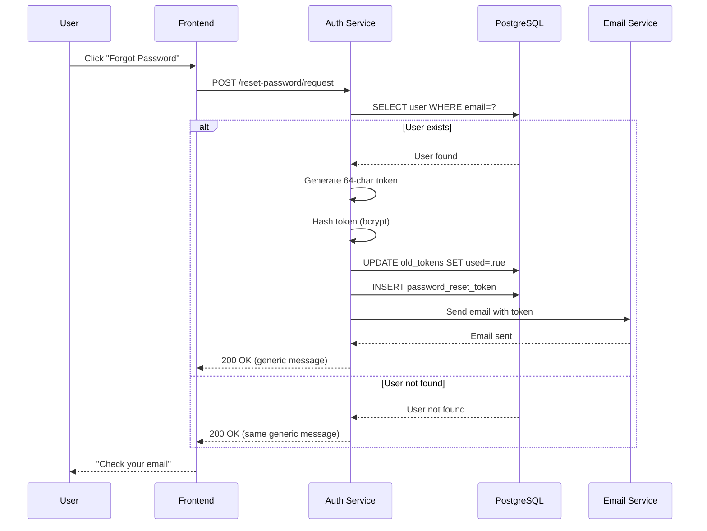
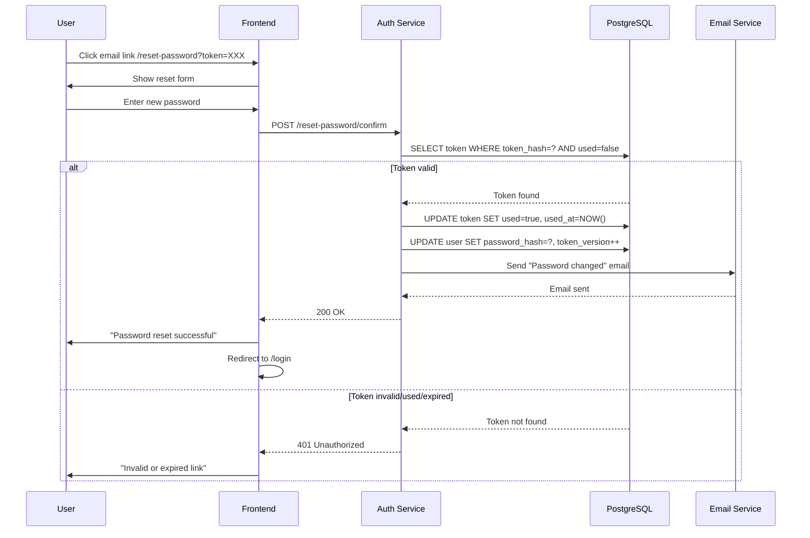

# SEC-008: Password Reset Token Invalidation

**ID:** SEC-008  
**Version:** 1.0  
**Status:** Approved  
**Author:** System Analyst  
**Date:** 2026-03-03  
**Priority:** High  
**Approved Date:** 2026-03-03  

---

## 1. Executive Summary

### 1.1 Проблема

Текущая реализация password reset не инвалидирует токен после использования:

| Сценарий | Риск | Последствие |
|----------|------|-------------|
| Повторное использование токена | Токен валиден 1 час после первого использования | Атакующий может сбросить пароль повторно |
| Перехват ссылки | JWT токен не отзывается | Компрометация аккаунта |
| Отсутствие audit trail | Нет истории сбросов пароля | Невозможность расследования инцидентов |

**Отсылка к аудиту:** SECURITY_AUDIT.md, раздел 8 "Password reset token не инвалидируется"

### 1.2 Решение

Реализовать database-based password reset tokens с guaranteed invalidation:

| Компонент | Решение |
|-----------|---------|
| Password Reset Tokens Table | PostgreSQL таблица для хранения токенов |
| Token Hashing | bcrypt хеширование токена перед сохранением |
| Single Active Token | При создании нового токена старые инвалидируются |
| Email Notification | Уведомление после успешного сброса пароля |
| Frontend Page | Страница /reset-password?token=XXX |

---

## 2. Scope

### 2.1 In Scope

- ✅ Таблица `password_reset_tokens` в PostgreSQL
- ✅ CRUD операции для password reset tokens
- ✅ Модификация `/reset-password/request` - генерация DB-based токена
- ✅ Модификация `/reset-password/confirm` - проверка и инвалидация токена
- ✅ Инвалидация старых токенов при создании нового (max 1 активный)
- ✅ Email уведомление после успешного сброса пароля
- ✅ Frontend страница сброса пароля
- ✅ Unit и integration тесты

### 2.2 Out of Scope

- ❌ Admin endpoint для просмотра истории сбросов пароля
- ❌ SMS уведомления
- ❌ Multi-factor authentication при сбросе пароля
- ❌ Геолокационные проверки
- ❌ Rate limiting (уже реализовано в SEC-004)

---

## 3. User Stories

### US1: Запрос сброса пароля

**As a** User  
**I want to** запросить сброс пароля по email  
**So that** я могу восстановить доступ к аккаунту

**Priority:** High  
**Actors:** User (зарегистрированный)

**Acceptance Criteria:**

**AC1.1: Успешный запрос сброса пароля**
- Given пользователь с email "user@example.com" существует
- When отправляет POST /api/v1/auth/reset-password/request с email
- Then генерируется криптографически стойкий токен (64 chars)
- Then хеш токена сохраняется в БД с `used=false`, `ip_address`, `user_agent`
- Then все старые токены пользователя инвалидируются (`used=true`)
- Then отправляется email с ссылкой `/reset-password?token=XXX`
- Then response возвращает 200 OK
- And response содержит generic сообщение (не раскрывает существование email)

**AC1.2: Email не существует**
- Given пользователя с email "nonexistent@example.com" не существует
- When отправляет POST /api/v1/auth/reset-password/request с email
- Then response возвращает 200 OK
- And response содержит ТО ЖЕ сообщение что и для существующего email
- And email НЕ отправляется

**AC1.3: Rate limiting**
- Given пользователь отправил 4-й запрос за час
- When отправляет POST /api/v1/auth/reset-password/request
- Then response возвращает 429 Too Many Requests
- And response содержит `retry_after` в секундах

---

### US2: Подтверждение сброса пароля

**As a** User  
**I want to** сбросить пароль по токену из email  
**So that** я могу войти с новым паролем

**Priority:** High  
**Actors:** User (зарегистрированный)

**Acceptance Criteria:**

**AC2.1: Успешный сброс пароля**
- Given валидный токен из email (не использован, не истек)
- When отправляет POST /api/v1/auth/reset-password/confirm с token и new_password
- Then токен проверяется в БД (существует, не использован, не истек)
- Then токен помечается `used=true`, `used_at=NOW()`
- Then сохраняется `ip_address` и `user_agent` запроса
- Then пароль пользователя обновляется
- Then инкрементируется `token_version` (инвалидация всех JWT)
- Then отправляется email уведомление "Пароль успешно изменен" (простой текст)
- Then response возвращает 200 OK

**AC2.2: Токен уже использован**
- Given токен был использован ранее (`used=true`)
- When отправляет POST /api/v1/auth/reset-password/confirm
- Then response возвращает 401 Unauthorized
- And response содержит "Invalid or expired token"
- And email НЕ отправляется

**AC2.3: Токен истек**
- Given токен старше 1 часа (`expires_at < NOW()`)
- When отправляет POST /api/v1/auth/reset-password/confirm
- Then response возвращает 401 Unauthorized
- And response содержит "Invalid or expired token"

**AC2.4: Токен не существует**
- Given токен не найден в БД
- When отправляет POST /api/v1/auth/reset-password/confirm
- Then response возвращает 401 Unauthorized
- And response содержит "Invalid or expired token"

**AC2.5: Пароль не соответствует требованиям**
- Given пароль "123" (слишком слабый)
- When отправляет POST /api/v1/auth/reset-password/confirm
- Then response возвращает 400 Bad Request
- And response содержит детали валидации пароля

---

### US3: Frontend страница сброса пароля

**As a** User  
**I want to** увидеть форму сброса пароля по ссылке из email  
**So that** я могу удобно ввести новый пароль

**Priority:** High  
**Actors:** User

**Acceptance Criteria:**

**AC3.1: Страница сброса пароля**
- Given пользователь переходит по ссылке `/reset-password?token=XXX`
- When страница загружается
- Then отображается форма с полями:
  - New Password (password input)
  - Confirm Password (password input)
  - Кнопка "Reset Password"
- And токен извлекается из URL query parameter

**AC3.2: Успешный сброс пароля**
- Given пользователь ввел пароль "NewSecurePassword123!"
- When нажимает "Reset Password"
- Then отправляется POST /api/v1/auth/reset-password/confirm
- Then отображается success message "Пароль успешно изменен"
- Then редирект на /login через 3 секунды

**AC3.3: Ошибка сброса пароля**
- Given токен невалидный или истек
- When нажимает "Reset Password"
- Then отображается error message "Ссылка недействительна или истекла"
- Then отображается ссылка "Запросить новую ссылку"

**AC3.4: Валидация пароля на frontend**
- Given пользователь ввел пароли не совпадающие
- When нажимает "Reset Password"
- Then отображается error "Пароли не совпадают"
- Then запрос НЕ отправляется на backend

---

## 4. Database Schema Changes

### 4.1 New Table: password_reset_tokens

```sql
CREATE TABLE password_reset_tokens (
    id UUID PRIMARY KEY DEFAULT gen_random_uuid(),
    user_id UUID NOT NULL REFERENCES users(id) ON DELETE CASCADE,
    token_hash VARCHAR(255) NOT NULL UNIQUE,
    used BOOLEAN DEFAULT FALSE NOT NULL,
    expires_at TIMESTAMP NOT NULL,
    created_at TIMESTAMP DEFAULT CURRENT_TIMESTAMP NOT NULL,
    used_at TIMESTAMP,
    ip_address VARCHAR(45),
    user_agent TEXT
);

-- Indexes
CREATE INDEX idx_password_reset_tokens_user ON password_reset_tokens(user_id);
CREATE INDEX idx_password_reset_tokens_token_hash ON password_reset_tokens(token_hash);
CREATE INDEX idx_password_reset_tokens_expires ON password_reset_tokens(expires_at) WHERE used = FALSE;

-- Foreign Key
ALTER TABLE password_reset_tokens
ADD CONSTRAINT fk_password_reset_tokens_user
FOREIGN KEY (user_id) REFERENCES users(id) ON DELETE CASCADE;
```

**Обоснование:**
- `token_hash` - bcrypt хеш токена (не сам токен!)
- `used` - флаг использования для guaranteed invalidation
- `expires_at` - время истечения (1 час)
- `used_at` - время использования для audit trail
- `ip_address` - IP адрес запросившего сброс пароля (IPv4/IPv6)
- `user_agent` - User Agent браузера для audit trail
- Partial index `WHERE used = FALSE` для быстрого поиска активных токенов

---

### 4.2 Migration Script

```sql
-- Migration: create_password_reset_tokens_table
-- Date: 2026-03-03

BEGIN;

CREATE TABLE password_reset_tokens (
    id UUID PRIMARY KEY DEFAULT gen_random_uuid(),
    user_id UUID NOT NULL REFERENCES users(id) ON DELETE CASCADE,
    token_hash VARCHAR(255) NOT NULL UNIQUE,
    used BOOLEAN DEFAULT FALSE NOT NULL,
    expires_at TIMESTAMP NOT NULL,
    created_at TIMESTAMP DEFAULT CURRENT_TIMESTAMP NOT NULL,
    used_at TIMESTAMP,
    ip_address VARCHAR(45),
    user_agent TEXT
);

CREATE INDEX idx_password_reset_tokens_user ON password_reset_tokens(user_id);
CREATE INDEX idx_password_reset_tokens_token_hash ON password_reset_tokens(token_hash);
CREATE INDEX idx_password_reset_tokens_expires ON password_reset_tokens(expires_at) WHERE used = FALSE;

ALTER TABLE password_reset_tokens
ADD CONSTRAINT fk_password_reset_tokens_user
FOREIGN KEY (user_id) REFERENCES users(id) ON DELETE CASCADE;

COMMIT;
```

### 4.3 Rollback Script

```sql
-- Rollback: create_password_reset_tokens_table
-- Date: 2026-03-03

BEGIN;

DROP TABLE IF EXISTS password_reset_tokens CASCADE;

COMMIT;
```

---

## 5. API Specification

### 5.1 POST /api/v1/auth/reset-password/request

**Description:** Запрос сброса пароля (модификация существующего endpoint)

**Authentication:** Not required

**Request:**
```http
POST /api/v1/auth/reset-password/request HTTP/1.1
Host: localhost:8002
Content-Type: application/json

{
  "email": "user@example.com"
}
```

**Response 200 (Success):**
```json
{
  "message": "Если этот email зарегистрирован, инструкция по сбросу пароля будет отправлена"
}
```

**Response 429 (Too Many Requests):**
```json
{
  "error": {
    "code": "RATE_LIMIT_EXCEEDED",
    "message": "Too many password reset requests",
    "retry_after": 3600
  }
}
```

**Changes from current implementation:**
- ❌ Remove: JWT token generation
- ✅ Add: Generate 64-char cryptographic token
- ✅ Add: Hash token with bcrypt, save to `password_reset_tokens`
- ✅ Add: Invalidate old tokens (`UPDATE used=true WHERE user_id=... AND used=false`)
- ✅ Add: Send email with DB-based token (not JWT)

---

### 5.2 POST /api/v1/auth/reset-password/confirm

**Description:** Подтверждение сброса пароля (модификация существующего endpoint)

**Authentication:** Not required

**Request:**
```http
POST /api/v1/auth/reset-password/confirm HTTP/1.1
Host: localhost:8002
Content-Type: application/json

{
  "token": "abc123...64-char-token...xyz789",
  "new_password": "NewSecurePassword123!"
}
```

**Request Body:**
```json
{
  "token": {
    "type": "string",
    "required": true,
    "min_length": 64,
    "max_length": 64,
    "description": "64-char cryptographic token from email"
  },
  "new_password": {
    "type": "string",
    "required": true,
    "min_length": 8,
    "description": "New password (must meet complexity requirements)"
  }
}
```

**Response 200 (Success):**
```json
{
  "message": "Пароль успешно изменен"
}
```

**Response 400 (Bad Request - Validation Error):**
```json
{
  "error": {
    "code": "VALIDATION_ERROR",
    "message": "Invalid input data",
    "details": {
      "new_password": ["Password must be at least 8 characters"]
    }
  }
}
```

**Response 401 (Unauthorized - Invalid Token):**
```json
{
  "error": {
    "code": "INVALID_TOKEN",
    "message": "Invalid or expired token"
  }
}
```

**Changes from current implementation:**
- ❌ Remove: JWT token verification
- ✅ Add: Verify token against `password_reset_tokens` table
- ✅ Add: Check `used=false` and `expires_at > NOW()`
- ✅ Add: Mark token as `used=true`, `used_at=NOW()`
- ✅ Add: Send email notification "Password changed successfully"

---

## 6. Non-Functional Requirements

### 6.1 Security

| Requirement | Value | Justification |
|-------------|-------|---------------|
| Token Length | 64 chars | Криптографически стойкий (256 bits entropy) |
| Token Hashing | bcrypt | Защита от утечки токенов при компрометации БД |
| Token Expiration | 1 hour | Баланс между удобством и безопасностью |
| Single Use | Guaranteed | `used` flag в БД обеспечивает atomic invalidation |
| Token Version Increment | Yes | Инвалидация всех JWT при смене пароля |
| Email in Error Message | No | Не раскрывать существование email |

### 6.2 Performance

| Metric | Target | Justification |
|--------|--------|---------------|
| Request Latency | < 200ms | Стандарт для auth операций |
| Token Lookup | < 10ms | Index on `token_hash` |
| Token Invalidation | < 20ms | Batch update старых токенов |

### 6.3 Reliability

| Requirement | Value |
|-------------|-------|
| Email Delivery | Best effort (не блокирует операцию) |
| Token Invalidation | Atomic DB transaction |
| Fallback на JWT | ❌ Нет (полная замена на DB-based) |

---

## 7. Sequence Diagrams

### 7.1 Password Reset Request Flow



### 7.2 Password Reset Confirm Flow



---

## 8. Декомпозиция на задачи

### TASK-DB-001: Создать таблицу password_reset_tokens

**Направление:** Database  
**Приоритет:** High  
**Оценка:** 0.5 часа  
**Зависимости:** Нет

**Описание:**
Создать migration для добавления таблицы `password_reset_tokens`.

**Критерии приемки:**
- [ ] Migration файл создан
- [ ] Таблица создана с правильной структурой
- [ ] Индексы созданы
- [ ] Foreign key constraint добавлен
- [ ] Rollback script работает

**Технические детали:**
- Файлы: `database/migrations/00X_create_password_reset_tokens.sql`
- Выполнить: `psql -U postgres -d fishmap < migration.sql`

---

### TASK-BCK-001: Создать PasswordResetToken CRUD

**Направление:** Backend  
**Приоритет:** High  
**Оценка:** 2 часа  
**Зависимости:** TASK-DB-001

**Описание:**
Создать SQLAlchemy модель и CRUD операции для `password_reset_tokens`.

**Критерии приемки:**
- [ ] Модель `PasswordResetToken` создана
- [ ] CRUD класс `PasswordResetTokenCRUD` создан
- [ ] Метод `create(user_id, token_hash, expires_at)`
- [ ] Метод `get_by_token_hash(token_hash)`
- [ ] Метод `mark_as_used(token_id)`
- [ ] Метод `invalidate_user_tokens(user_id)`

**Технические детали:**
- Файлы: 
  - `services/auth-service/app/models/password_reset_token.py`
  - `services/auth-service/app/crud/password_reset_token.py`

---

### TASK-BCK-002: Модифицировать /reset-password/request

**Направление:** Backend  
**Приоритет:** High  
**Оценка:** 3 часа  
**Зависимости:** TASK-BCK-001

**Описание:**
Изменить endpoint `/reset-password/request` для использования DB-based токенов вместо JWT.

**Критерии приемки:**
- [ ] Удалена генерация JWT токена
- [ ] Добавлена генерация 64-char токена (secrets.token_urlsafe)
- [ ] Токен хешируется bcrypt перед сохранением
- [ ] Токен сохраняется в БД с `used=false`, `ip_address`, `user_agent`
- [ ] Старые токены пользователя инвалидируются
- [ ] Email отправляется с DB-based токеном (не JWT)
- [ ] Generic response для существующих и несуществующих email

**Технические детали:**
- Файлы: `services/auth-service/app/endpoints/auth.py`
- Endpoint: `POST /api/v1/auth/reset-password/request`

---

### TASK-BCK-003: Модифицировать /reset-password/confirm

**Направление:** Backend  
**Приоритет:** High  
**Оценка:** 3 часа  
**Зависимости:** TASK-BCK-001

**Описание:**
Изменить endpoint `/reset-password/confirm` для проверки DB-based токенов.

**Критерии приемки:**
- [ ] Удалена JWT верификация
- [ ] Добавлена проверка токена в БД
- [ ] Проверка `used=false`
- [ ] Проверка `expires_at > NOW()`
- [ ] Токен помечается `used=true`, `used_at=NOW()` после использования
- [ ] Сохраняется `ip_address` и `user_agent` запроса
- [ ] Инкрементируется `token_version` пользователя
- [ ] Отправляется простое текстовое email уведомление "Password changed"
- [ ] Валидация пароля (длина, сложность)

**Технические детали:**
- Файлы: `services/auth-service/app/endpoints/auth.py`
- Endpoint: `POST /api/v1/auth/reset-password/confirm`

---

### TASK-BCK-004: Добавить email уведомление

**Направление:** Backend  
**Приоритет:** Medium  
**Оценка:** 1.5 часа  
**Зависимости:** TASK-BCK-003

**Описание:**
Реализовать отправку простого текстового email уведомления после успешного сброса пароля.

**Критерии приемки:**
- [ ] Простой текстовый email template "Password Changed" создан
- [ ] Email отправляется через Email Service
- [ ] Email содержит дату/время изменения
- [ ] Email содержит IP адрес, с которого был сброшен пароль
- [ ] Ошибка отправки email НЕ блокирует операцию

**Технические детали:**
- Файлы: 
  - `services/auth-service/app/endpoints/auth.py`
  - Email content: простой текст (без HTML template)

---

### TASK-FRT-001: Создать страницу /reset-password

**Направление:** Frontend  
**Приоритет:** High  
**Оценка:** 4 часа  
**Зависимости:** TASK-BCK-003

**Описание:**
Создать frontend страницу для сброса пароля.

**Критерии приемки:**
- [ ] Страница `/reset-password` создана
- [ ] Токен извлекается из URL query parameter
- [ ] Форма с полями: New Password, Confirm Password
- [ ] Валидация на frontend (пароли совпадают)
- [ ] Отображение strength meter для пароля
- [ ] Success state с редиректом на /login
- [ ] Error state с ссылкой "Request new link"
- [ ] Responsive design (mobile-friendly)

**Технические детали:**
- Файлы: 
  - `frontend/app/reset-password/page.tsx`
  - `frontend/components/auth/ResetPasswordForm.tsx`
  - `frontend/lib/validations/password.ts`

---

### TASK-TST-001: Unit тесты для PasswordResetToken CRUD

**Направление:** Testing  
**Приоритет:** High  
**Оценка:** 2 часа  
**Зависимости:** TASK-BCK-001

**Описание:**
Написать unit тесты для CRUD операций `PasswordResetTokenCRUD`.

**Критерии приемки:**
- [ ] Тест: create token
- [ ] Тест: get_by_token_hash (found/not found)
- [ ] Тест: mark_as_used
- [ ] Тест: invalidate_user_tokens
- [ ] Тест: expired token check
- [ ] Покрытие кода ≥90%

**Технические детали:**
- Файлы: `services/auth-service/tests/crud/test_password_reset_token.py`

---

### TASK-TST-002: Unit тесты для /reset-password endpoints

**Направление:** Testing  
**Приоритет:** High  
**Оценка:** 3 часа  
**Зависимости:** TASK-BCK-002, TASK-BCK-003

**Описание:**
Написать unit тесты для password reset endpoints.

**Критерии приемки:**
- [ ] Тест: request - user exists
- [ ] Тест: request - user not found
- [ ] Тест: request - old tokens invalidated
- [ ] Тест: confirm - valid token
- [ ] Тест: confirm - invalid token
- [ ] Тест: confirm - used token
- [ ] Тест: confirm - expired token
- [ ] Тест: confirm - weak password
- [ ] Тест: confirm - token_version incremented
- [ ] Покрытие кода ≥90%

**Технические детали:**
- Файлы: `services/auth-service/tests/endpoints/test_password_reset.py`

---

### TASK-TST-003: Integration тесты для password reset flow

**Направление:** Testing  
**Приоритет:** Medium  
**Оценка:** 2 часа  
**Зависимости:** TASK-TST-002

**Описание:**
Написать integration тесты для полного flow сброса пароля.

**Критерии приемки:**
- [ ] Тест: Full flow (request -> email link -> confirm)
- [ ] Тест: Token cannot be reused
- [ ] Тест: Old tokens invalidated on new request
- [ ] Тест: JWT tokens invalidated after password reset
- [ ] Тест: Rate limiting works

**Технические детали:**
- Файлы: `services/auth-service/tests/integration/test_password_reset_flow.py`

---

### TASK-DOC-001: Обновить API документацию

**Направление:** Documentation  
**Приоритет:** Low  
**Оценка:** 1 час  
**Зависимости:** TASK-BCK-002, TASK-BCK-003

**Описание:**
Обновить API документацию с новыми endpoint specifications.

**Критерии приемки:**
- [ ] OpenAPI schema обновлен
- [ ] Добавлены примеры request/response
- [ ] Документированы error codes
- [ ] Добавлена диаграмма flow

**Технические детали:**
- Файлы: `docs/api/auth-api.md`

---

## 9. Итоговая таблица задач

| ID | Направление | Приоритет | Оценка | Зависимости |
|----|-------------|-----------|--------|-------------|
| TASK-DB-001 | Database | High | 0.5h | - |
| TASK-BCK-001 | Backend | High | 2h | DB-001 |
| TASK-BCK-002 | Backend | High | 3h | BCK-001 |
| TASK-BCK-003 | Backend | High | 3h | BCK-001 |
| TASK-BCK-004 | Backend | Medium | 1.5h | BCK-003 |
| TASK-FRT-001 | Frontend | High | 4h | BCK-003 |
| TASK-TST-001 | Testing | High | 2h | BCK-001 |
| TASK-TST-002 | Testing | High | 3h | BCK-002, BCK-003 |
| TASK-TST-003 | Testing | Medium | 2h | TST-002 |
| TASK-DOC-001 | Documentation | Low | 1h | BCK-002, BCK-003 |

**Общая оценка:** 22 часа  
**Критический путь:** DB-001 → BCK-001 → BCK-002/003 → TST-002

---

## 10. Риски и митигация

| Риск | Вероятность | Влияние | Митигация |
|------|-------------|---------|-----------|
| Email delivery failure | Medium | Low | Не блокировать операцию, логировать ошибки |
| DB performance при batch invalidate | Low | Medium | Ограничить количество токенов (max 10 на пользователя) |
| Токен перехвачен до использования | Medium | High | Короткий TTL (1 hour), HTTPS обязательный |
| User confusion (старые ссылки) | Medium | Low | Ясные error messages, ссылка на новый запрос |
| Frontend token leakage в logs | Low | High | Не логировать токены, sanitize logs |

---

## 11. Definition of Done

- [ ] Database migration выполнена
- [ ] Backend endpoints реализованы
- [ ] Email уведомления работают
- [ ] Frontend страница реализована
- [ ] Unit тесты написаны (≥90% покрытие)
- [ ] Integration тесты проходят
- [ ] API документация обновлена
- [ ] Code review пройден
- [ ] Manual testing выполнен
- [ ] SECURITY_AUDIT.md обновлен (статус: ✅ ИСПРАВЛЕНО)

---

## 12. Вопросы для согласования

**Статус:** ✅ Одобрено заказчиком (2026-03-03)

### Решенные вопросы:
1. ✅ Вариант реализации: **Database-based tokens**
2. ✅ Email уведомление: **Да, отправлять**
3. ✅ Лимит активных токенов: **Максимум 1 активный**
4. ✅ Frontend реализация: **Да, создать страницу**
5. ✅ Email template: **Простой текстовый email**
6. ✅ Captcha: **Нет, не требуется**
7. ✅ IP Logging: **Да, логировать IP, user agent, timestamp**

---

## 13. Ссылки

- **Аудит:** `SECURITY_AUDIT.md`, раздел 8
- **Текущая реализация:** `services/auth-service/app/endpoints/auth.py:598-669`
- **Похожая задача:** `SEC-006_JWT_Blacklist_Token_Invalidation.md`
- **OWASP Guide:** [Password Reset Cheat Sheet](https://cheatsheetseries.owasp.org/cheatsheets/Forgot_Password_Cheat_Sheet.html)

---

**Следующий шаг:** Получить одобрение заказчика → Создать финальный документ SEC-008_Password_Reset_Token_Invalidation.md
