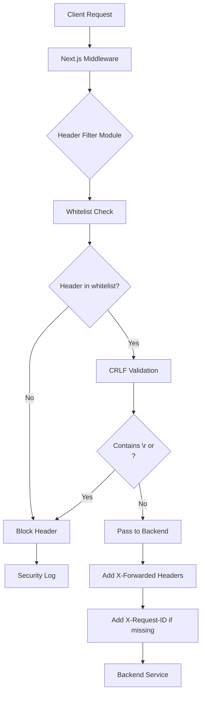

# SEC-010: Middleware Header Filtering (Защита от HTTP Request Smuggling и Header Injection)

**ID:** SEC-010  
**Version:** 1.0  
**Status:** Approved  
**Author:** System Analyst  
**Date:** 2026-03-03  
**Priority:** High  
**Approved Date:** 2026-03-03

---

## 1. Executive Summary

### 1.1 Проблема

Текущая реализация middleware в `frontend/middleware.ts:23-28` использует **blacklist подход**: прокидывает все заголовки от клиента к backend-сервисам, кроме `host` и `content-length`. Это создает критические риски безопасности:

| Attack Vector | Описание | Последствие |
|---------------|----------|-------------|
| **HTTP Request Smuggling** | Злоумышленник добавляет специальные заголовки (`Transfer-Encoding: chunked`, `Content-Length: 0`) | Обход security controls, cache poisoning |
| **Header Injection (CRLF)** | Инъекция `\r\n` в значения заголовков | XSS через заголовки, HTTP response splitting |
| **X-Forwarded-* Spoofing** | Подмена `X-Forwarded-For`, `X-Real-IP` | Обход rate limiting, IP-based security controls, logging evasion |
| **Host Header Injection** | Злонамеренный `Host` заголовок (хотя фильтруется) | Cache poisoning, password reset links manipulation |
| **Sensitive Headers Leak** | Проксирование внутренних заголовков (`X-Internal-Auth`, `X-Debug`) | Несанкционированный доступ к internal endpoints |

**Пример атаки:**

```http
POST /api/v1/auth/login HTTP/1.1
Host: fishing.com
X-Forwarded-For: 127.0.0.1
Authorization: Bearer malicious_token
X-Internal-Auth: admin-secret
Transfer-Encoding: chunked
X-Injected: value\r\nSet-Cookie: session=attacker_controlled

```

**Отсылка к аудиту:** SECURITY_AUDIT.md, раздел 10 "Middleware прокидывает все заголовки"

### 1.2 Решение

Реализовать **Whitelist подход** к фильтрации заголовков с многоуровневой защитой:

| Компонент | Решение |
|-----------|---------|
| **Whitelist Headers** | Явный список разрешенных заголовков для проксирования |
| **CRLF Validation** | Блокировка заголовков с `\r`, `\n` символами |
| **X-Forwarded-* Generation** | Middleware генерирует доверенные заголовки (игнорирует от клиента) |
| **Distributed Tracing** | Поддержка `x-request-id`, `x-correlation-id` для observability |
| **Security Logging** | Логирование заблокированных заголовков (development/staging only) |
| **Configurable via Env** | Возможность добавления заголовков через `.env` |

**Архитектура защиты:**

```
Client Request
    ↓
[Middleware Layer]
    ├─ Whitelist Filter (только разрешенные заголовки)
    ├─ CRLF Validation (защита от injection)
    ├─ X-Forwarded-* Generation (доверенные IP/proto)
    └─ Security Logging (audit trail)
    ↓
Backend Service
```

---

## 2. Scope

### 2.1 In Scope

- ✅ Модуль `header_filter.py` с whitelist логикой
- ✅ CRLF injection validation
- ✅ X-Forwarded-For, X-Forwarded-Proto, X-Forwarded-Host generation
- ✅ Distributed tracing headers support (x-request-id, x-correlation-id)
- ✅ Security logging для заблокированных заголовков
- ✅ Environment variable для дополнительных заголовков (PROXY_ALLOWED_HEADERS)
- ✅ Обновление `middleware.ts` с использованием нового модуля
- ✅ Unit тесты для header filtering
- ✅ Integration тесты с реальными запросами
- ✅ Документация API и security practices

### 2.2 Out of Scope

- ❌ Header value validation по regex patterns (future enhancement)
- ❌ Header size limits (future enhancement)
- ❌ Header mutation для legacy systems (не требуется)
- ❌ Rate limiting на основе заблокированных заголовков (отдельная задача)
- ❌ Automatic IP blocking при обнаружении атак (future enhancement)
- ❌ WAF integration (будет в отдельном сервисе)

---

## 3. User Stories

### US1: Безопасное проксирование заголовков

**As a** Security Engineer  
**I want to** чтобы middleware фильтровал заголовки по whitelist  
**So that** предотвращаются HTTP Request Smuggling и Header Injection атаки

**Priority:** High  
**Actors:** System (автоматическая защита)

**Acceptance Criteria:**

**AC1.1: Только разрешенные заголовки проходят**
- Given клиент отправляет запрос с 20 заголовками
- When middleware обрабатывает запрос
- Then только заголовки из whitelist проходят к backend
- And остальные заголовки отбрасываются
- And в логах (dev/staging) фиксируются заблокированные заголовки

**AC1.2: CRLF injection блокируется**
- Given клиент отправляет заголовок `X-Custom: value\r\nInjected: header`
- When middleware валидирует заголовок
- Then заголовок отбрасывается
- And в логах фиксируется попытка injection

**AC1.3: X-Forwarded-* от клиента игнорируются**
- Given клиент отправляет `X-Forwarded-For: 192.168.1.1`
- When middleware генерирует доверенные заголовки
- Then клиентский `X-Forwarded-For` отбрасывается
- And middleware устанавливает реальный IP клиента
- And backend получает доверенные X-Forwarded-* заголовки

---

### US2: Distributed Tracing поддержка

**As a** DevOps Engineer  
**I want to** чтобы запросы содержали уникальные ID для трассировки  
**So that** я могу отслеживать запросы через все микросервисы

**Priority:** Medium  
**Actors:** System, DevOps Engineer

**Acceptance Criteria:**

**AC2.1: X-Request-ID генерируется автоматически**
- Given клиент не отправляет `X-Request-ID`
- When middleware обрабатывает запрос
- Then генерируется `X-Request-ID` (UUID v4)
- And заголовок передается в backend
- And возвращается в response

**AC2.2: Существующий X-Request-ID сохраняется**
- Given клиент отправляет `X-Request-ID: abc-123`
- When middleware обрабатывает запрос
- Then существующий ID передается в backend
- And новый ID не генерируется

**AC2.3: X-Correlation-ID поддерживается**
- Given клиент отправляет `X-Correlation-ID: correlation-456`
- When middleware обрабатывает запрос
- Then заголовок передается в backend (если в whitelist)

---

### US3: Security Audit Logging

**As a** Security Analyst  
**I want to** видеть какие заголовки были заблокированы  
**So that** я могу выявлять попытки атак и легитимные заголовки для добавления в whitelist

**Priority:** Medium  
**Actors:** Security Analyst, System

**Acceptance Criteria:**

**AC3.1: Логирование в development/staging**
- Given environment = development или staging
- When middleware блокирует заголовок
- Then в логах появляется запись: `Blocked header: X-Internal-Auth = secret-value`
- And логируется IP клиента
- And логируется endpoint

**AC3.2: Не логировать в production**
- Given environment = production
- When middleware блокирует заголовок
- Then детали заголовка НЕ логируются (только count)
- And логируется общее количество заблокированных заголовков

**AC3.3: CRLF injection попытки логируются всегда**
- Given обнаружена CRLF injection в заголовке
- When middleware валидирует заголовок
- Then логируется WARNING с деталями атаки
- And логируется IP клиента
- And логируется User-Agent

---

### US4: Конфигурируемый Whitelist

**As a** Developer  
**I want to** добавлять новые заголовки через .env без изменения кода  
**So that** можно быстро адаптировать whitelist под новые требования

**Priority:** Low  
**Actors:** Developer

**Acceptance Criteria:**

**AC4.1: PROXY_ALLOWED_HEADERS переменная**
- Given в .env указано `PROXY_ALLOWED_HEADERS=x-custom-header,x-another-header`
- When middleware загружает конфигурацию
- Then заголовки `x-custom-header`, `x-another-header` добавляются в whitelist
- And существующие заголовки остаются

**AC4.2: Валидация переменной**
- Given в .env указано `PROXY_ALLOWED_HEADERS=invalid header name`
- When middleware загружает конфигурацию
- Then некорректные заголовки игнорируются
- And логируется WARNING

---

## 4. Technical Implementation

### 4.1 Architecture Overview



### 4.2 Header Whitelist

**Default Whitelist (hardcoded):**

```typescript
const DEFAULT_ALLOWED_HEADERS = new Set([
  // Authentication
  'authorization',
  
  // Content negotiation
  'content-type',
  'accept',
  'accept-encoding',
  'accept-language',
  
  // Client information
  'user-agent',
  
  // Distributed tracing
  'x-request-id',
  'x-correlation-id',
  
  // Custom headers (extendable via env)
]);
```

**Blocked Headers (never pass):**

```typescript
const ALWAYS_BLOCKED_HEADERS = new Set([
  'host',                    // Set by backend
  'content-length',          // Auto-calculated
  'transfer-encoding',       // HTTP client handles
  'connection',              // Connection management
  'keep-alive',              // Connection management
  'upgrade',                 // WebSocket upgrade (not used)
  
  // X-Forwarded headers (generated by middleware)
  'x-forwarded-for',
  'x-forwarded-proto',
  'x-forwarded-host',
  'x-real-ip',
  
  // Security headers (set by backend/nginx)
  'x-frame-options',
  'x-content-type-options',
  'x-xss-protection',
  'strict-transport-security',
  'content-security-policy',
]);
```

### 4.3 X-Forwarded-* Generation Logic

```typescript
function generateForwardedHeaders(request: NextRequest): Headers {
  const headers = new Headers();
  
  // X-Forwarded-For: Real client IP
  const clientIp = request.ip || 
                   request.headers.get('x-real-ip') || 
                   'unknown';
  headers.set('X-Forwarded-For', clientIp);
  
  // X-Forwarded-Proto: Original protocol
  const proto = request.nextUrl.protocol.replace(':', ''); // 'http' or 'https'
  headers.set('X-Forwarded-Proto', proto);
  
  // X-Forwarded-Host: Original host
  const host = request.headers.get('host') || 'unknown';
  headers.set('X-Forwarded-Host', host);
  
  return headers;
}
```

### 4.4 CRLF Injection Validation

```typescript
function isCRLFInjection(value: string): boolean {
  return value.includes('\r') || value.includes('\n');
}

function validateHeader(key: string, value: string): boolean {
  // Check for CRLF in both key and value
  if (isCRLFInjection(key) || isCRLFInjection(value)) {
    return false;
  }
  
  // Check header name format (RFC 7230)
  const headerNameRegex = /^[!#$%&'*+\-.^_`|~0-9A-Za-z]+$/;
  if (!headerNameRegex.test(key)) {
    return false;
  }
  
  return true;
}
```

### 4.5 X-Request-ID Generation

```typescript
function ensureRequestId(headers: Headers): void {
  if (!headers.has('x-request-id')) {
    const requestId = crypto.randomUUID(); // UUID v4
    headers.set('X-Request-ID', requestId);
  }
}
```

### 4.6 Security Logging

```typescript
function logBlockedHeader(
  headerName: string, 
  headerValue: string, 
  reason: string,
  request: NextRequest
): void {
  const env = process.env.NODE_ENV;
  
  if (env === 'development' || env === 'staging') {
    console.warn(`[SECURITY] Blocked header: ${headerName}`, {
      value: headerValue,
      reason: reason,
      ip: request.ip,
      endpoint: request.nextUrl.pathname,
      userAgent: request.headers.get('user-agent'),
    });
  } else if (reason === 'CRLF_INJECTION') {
    // Always log injection attempts
    console.error(`[SECURITY] CRLF Injection attempt detected`, {
      header: headerName,
      ip: request.ip,
      endpoint: request.nextUrl.pathname,
      userAgent: request.headers.get('user-agent'),
    });
  }
}
```

### 4.7 Main Filter Function

```typescript
export function filterRequestHeaders(request: NextRequest): Headers {
  const filteredHeaders = new Headers();
  
  // Get extended whitelist from environment
  const envHeaders = process.env.PROXY_ALLOWED_HEADERS?.split(',').map(h => h.trim().toLowerCase()) || [];
  const allowedHeaders = new Set([...DEFAULT_ALLOWED_HEADERS, ...envHeaders]);
  
  let blockedCount = 0;
  
  // Filter incoming headers
  request.headers.forEach((value, key) => {
    const lowerKey = key.toLowerCase();
    
    // Always block certain headers
    if (ALWAYS_BLOCKED_HEADERS.has(lowerKey)) {
      logBlockedHeader(key, value, 'ALWAYS_BLOCKED', request);
      blockedCount++;
      return;
    }
    
    // Check whitelist
    if (!allowedHeaders.has(lowerKey)) {
      logBlockedHeader(key, value, 'NOT_IN_WHITELIST', request);
      blockedCount++;
      return;
    }
    
    // Validate for CRLF injection
    if (!validateHeader(key, value)) {
      logBlockedHeader(key, value, 'CRLF_INJECTION', request);
      blockedCount++;
      return;
    }
    
    // Header passed all checks
    filteredHeaders.set(key, value);
  });
  
  // Add trusted X-Forwarded headers
  const forwardedHeaders = generateForwardedHeaders(request);
  forwardedHeaders.forEach((value, key) => {
    filteredHeaders.set(key, value);
  });
  
  // Ensure X-Request-ID exists
  ensureRequestId(filteredHeaders);
  
  // Log summary in production
  if (process.env.NODE_ENV === 'production' && blockedCount > 0) {
    console.warn(`[SECURITY] Blocked ${blockedCount} headers from ${request.ip}`);
  }
  
  return filteredHeaders;
}
```

---

## 5. File Structure

```
frontend/
├── lib/
│   └── header_filter.ts         # Header filtering module (NEW)
├── middleware.ts                 # Main middleware (MODIFY)
└── .env.example                  # Environment example (MODIFY)

tests/
└── unit/
    └── header_filter.test.ts     # Unit tests (NEW)

docs/
└── security/
    └── header-filtering.md       # Security documentation (NEW)
```

---

## 6. API Specification

### 6.1 Module API: `header_filter.ts`

```typescript
/**
 * Filter request headers based on whitelist and security rules
 * @param request - Next.js request object
 * @returns Filtered headers with trusted X-Forwarded headers
 */
export function filterRequestHeaders(request: NextRequest): Headers;

/**
 * Validate header for CRLF injection
 * @param key - Header name
 * @param value - Header value
 * @returns true if valid, false if injection detected
 */
export function validateHeader(key: string, value: string): boolean;

/**
 * Generate trusted X-Forwarded headers
 * @param request - Next.js request object
 * @returns Headers with X-Forwarded-For/Proto/Host
 */
export function generateForwardedHeaders(request: NextRequest): Headers;

/**
 * Ensure X-Request-ID exists in headers
 * @param headers - Headers object to modify
 */
export function ensureRequestId(headers: Headers): void;
```

### 6.2 Middleware Integration

**Before:**

```typescript
const headers = new Headers();
request.headers.forEach((value, key) => {
  const lowerKey = key.toLowerCase();
  if (lowerKey !== 'host' && lowerKey !== 'content-length') {
    headers.set(key, value);
  }
});
```

**After:**

```typescript
import { filterRequestHeaders } from '@/lib/header_filter';

const headers = filterRequestHeaders(request);
```

---

## 7. Security Considerations

### 7.1 Threat Model

| Threat | Mitigation | Confidence |
|--------|------------|------------|
| HTTP Request Smuggling | Whitelist + block Transfer-Encoding | High |
| CRLF Injection | Validate all header values | High |
| X-Forwarded Spoofing | Generate in middleware, ignore from client | High |
| Sensitive Header Leak | Whitelist only necessary headers | High |
| DoS via Headers | Limit header count/size (future) | Medium |

### 7.2 Known Limitations

1. **Header Size Limits**: Не реализованы лимиты на размер заголовков (потенциальный DoS vector)
2. **Header Count Limits**: Нет ограничения на количество заголовков
3. **Regex Validation**: Нет валидации значений заголовков по паттернам (например, User-Agent format)
4. **IP Reputation**: Нет проверки IP против blacklist
5. **Automatic Blocking**: Нет автоматической блокировки IP при обнаружении атак

### 7.3 Future Enhancements

- **Phase 2**: Header size/count limits
- **Phase 3**: IP reputation checking
- **Phase 4**: Machine learning for anomaly detection
- **Phase 5**: WAF integration

---

## 8. Testing Strategy

### 8.1 Unit Tests

**File:** `tests/unit/header_filter.test.ts`

```typescript
describe('Header Filter Module', () => {
  
  describe('filterRequestHeaders', () => {
    it('should pass allowed headers', () => {
      // Authorization, Content-Type, Accept should pass
    });
    
    it('should block non-whitelisted headers', () => {
      // X-Custom-Header should be blocked
    });
    
    it('should always block Transfer-Encoding', () => {
      // Transfer-Encoding should be blocked
    });
    
    it('should block CRLF injection attempts', () => {
      // X-Custom: value\r\nInjected: header should be blocked
    });
    
    it('should ignore client X-Forwarded-For', () => {
      // Client X-Forwarded-For should be replaced
    });
    
    it('should generate trusted X-Forwarded headers', () => {
      // Middleware should generate X-Forwarded-For/Proto/Host
    });
    
    it('should generate X-Request-ID if missing', () => {
      // Should add UUID if client doesn't provide
    });
    
    it('should preserve existing X-Request-ID', () => {
      // Should keep client-provided X-Request-ID
    });
    
    it('should load custom headers from env', () => {
      // PROXY_ALLOWED_HEADERS should extend whitelist
    });
  });
  
  describe('validateHeader', () => {
    it('should pass valid headers', () => {
      // Normal header should return true
    });
    
    it('should reject \\r in value', () => {
      // Header with \r should return false
    });
    
    it('should reject \\n in value', () => {
      // Header with \n should return false
    });
    
    it('should reject invalid header names', () => {
      // Header with spaces should return false
    });
  });
  
  describe('generateForwardedHeaders', () => {
    it('should generate X-Forwarded-For from request.ip', () => {
      // Should use request.ip
    });
    
    it('should fallback to x-real-ip', () => {
      // Should use X-Real-IP if request.ip missing
    });
    
    it('should generate X-Forwarded-Proto', () => {
      // Should extract protocol from URL
    });
    
    it('should generate X-Forwarded-Host', () => {
      // Should use Host header
    });
  });
  
  describe('ensureRequestId', () => {
    it('should add UUID if missing', () => {
      // Should generate UUID
    });
    
    it('should not modify if exists', () => {
      // Should keep existing ID
    });
  });
});
```

### 8.2 Integration Tests

**File:** `tests/integration/middleware_security.test.ts`

```typescript
describe('Middleware Security Integration', () => {
  
  it('should block HTTP Request Smuggling attempt', async () => {
    const response = await fetch('/api/v1/auth/login', {
      method: 'POST',
      headers: {
        'Transfer-Encoding': 'chunked',
        'Content-Length': '0',
      },
    });
    // Backend should not receive Transfer-Encoding
  });
  
  it('should prevent X-Forwarded-For spoofing', async () => {
    const response = await fetch('/api/v1/auth/login', {
      method: 'POST',
      headers: {
        'X-Forwarded-For': '127.0.0.1',
      },
    });
    // Backend should receive real IP, not 127.0.0.1
  });
  
  it('should log CRLF injection attempt', async () => {
    const response = await fetch('/api/v1/auth/login', {
      method: 'POST',
      headers: {
        'X-Custom': 'value\r\nInjected: header',
      },
    });
    // Should see log entry
  });
  
  it('should add X-Request-ID to all requests', async () => {
    const response = await fetch('/api/v1/auth/login');
    expect(response.headers.get('X-Request-ID')).toBeDefined();
  });
});
```

### 8.3 Security Tests

**Manual Testing Checklist:**

- [ ] Send request with `Transfer-Encoding: chunked` → blocked
- [ ] Send request with `X-Forwarded-For: 127.0.0.1` → replaced with real IP
- [ ] Send request with `X-Custom: value\r\nSet-Cookie: evil` → blocked
- [ ] Send request with 100 headers → only whitelisted pass
- [ ] Send request with `X-Request-ID: custom-id` → preserved
- [ ] Send request without `X-Request-ID` → auto-generated
- [ ] Check logs in development → blocked headers logged
- [ ] Check logs in production → only count logged

---

## 9. Risks and Mitigation

### 9.1 Risk Matrix

| Risk | Probability | Impact | Mitigation |
|------|-------------|--------|------------|
| **Breaking legitimate clients** | Medium | High | Comprehensive whitelist + environment variable extension |
| **Performance overhead** | Low | Medium | Efficient Set lookup + minimal string operations |
| **Missing required header** | Medium | High | Logging + monitoring + quick whitelist updates |
| **CRLF bypass** | Low | Critical | Multi-layer validation + security tests |
| **DoS via header count** | Medium | Medium | Add header count limits (Phase 2) |
| **False sense of security** | Low | High | Documentation + threat model awareness |

### 9.2 Rollback Plan

If issues arise in production:

1. **Immediate**: Add problematic header to `PROXY_ALLOWED_HEADERS` env var
2. **Short-term**: Extend DEFAULT_ALLOWED_HEADERS in code
3. **Emergency**: Revert to blacklist approach (temporary)
4. **Long-term**: Investigate root cause + fix whitelist

---

## 10. Implementation Plan

### 10.1 Phase 1: Core Implementation (Day 1-2)

**Tasks:**

1. Create `lib/header_filter.ts` module
2. Implement whitelist logic
3. Implement CRLF validation
4. Implement X-Forwarded generation
5. Implement X-Request-ID generation
6. Integrate into `middleware.ts`
7. Add environment variable support

### 10.2 Phase 2: Testing (Day 2-3)

**Tasks:**

1. Write unit tests (≥15 tests)
2. Write integration tests (≥5 tests)
3. Manual security testing
4. Performance testing (header filtering overhead)

### 10.3 Phase 3: Documentation & Deployment (Day 3)

**Tasks:**

1. Update `.env.example`
2. Create `docs/security/header-filtering.md`
3. Update `SECURITY_AUDIT.md`
4. Deploy to staging
5. Monitor logs for blocked headers
6. Deploy to production

---

## 11. Decomposition on Tasks

### TASK-INF-001: Создать модуль header_filter.ts

**Направление:** Infrastructure  
**Приоритет:** High  
**Оценка:** 3 часа  
**Зависимости:** Нет

**Описание:**
Создать модуль `frontend/lib/header_filter.ts` с функциями фильтрации заголовков.

**Критерии приемки:**
- [ ] Файл `frontend/lib/header_filter.ts` создан
- [ ] Функция `filterRequestHeaders()` реализована
- [ ] Функция `validateHeader()` реализована
- [ ] Функция `generateForwardedHeaders()` реализована
- [ ] Функция `ensureRequestId()` реализована
- [ ] Функция `logBlockedHeader()` реализована
- [ ] Константы `DEFAULT_ALLOWED_HEADERS` и `ALWAYS_BLOCKED_HEADERS` определены

**Технические детали:**
- Файлы: `frontend/lib/header_filter.ts`
- Использовать TypeScript strict mode
- Добавить JSDoc комментарии
- Экспортировать все публичные функции

---

### TASK-BCK-001: Интегрировать header filter в middleware

**Направление:** Backend (Frontend Middleware)  
**Приоритет:** High  
**Оценка:** 1 час  
**Зависимости:** TASK-INF-001

**Описание:**
Обновить `frontend/middleware.ts` для использования нового модуля фильтрации заголовков.

**Критерии приемки:**
- [ ] Импорт `filterRequestHeaders` добавлен
- [ ] Старый код фильтрации заменен на вызов `filterRequestHeaders(request)`
- [ ] Middleware работает корректно со всеми сервисами
- [ ] Нет regressions в существующем функционале

**Технические детали:**
- Файлы: `frontend/middleware.ts`
- Заменить строки 22-28 на вызов новой функции
- Проверить работу со всеми сервисами (auth, places, reports, etc.)

---

### TASK-INF-002: Добавить PROXY_ALLOWED_HEADERS в .env.example

**Направление:** Infrastructure  
**Приоритет:** Medium  
**Оценка:** 0.5 часа  
**Зависимости:** TASK-INF-001

**Описание:**
Добавить переменную окружения `PROXY_ALLOWED_HEADERS` в `.env.example` с документацией.

**Критерии приемки:**
- [ ] Переменная `PROXY_ALLOWED_HEADERS` добавлена в `.env.example`
- [ ] Добавлен комментарий с примером использования
- [ ] Добавлен комментарий с warning о безопасности

**Технические детали:**
- Файлы: `frontend/.env.example`
- Пример: `PROXY_ALLOWED_HEADERS=x-custom-header,x-another-header`

---

### TASK-TST-001: Написать unit тесты для header_filter.ts

**Направление:** Testing  
**Приоритет:** High  
**Оценка:** 4 часа  
**Зависимости:** TASK-INF-001

**Описание:**
Написать unit тесты для модуля `header_filter.ts` с покрытием ≥90%.

**Критерии приемки:**
- [ ] Тест: разрешенные заголовки проходят
- [ ] Тест: заблокированные заголовки отбрасываются
- [ ] Тест: CRLF injection блокируется
- [ ] Тест: X-Forwarded-* от клиента игнорируются
- [ ] Тест: X-Forwarded-* генерируются middleware
- [ ] Тест: X-Request-ID генерируется если отсутствует
- [ ] Тест: X-Request-ID сохраняется если есть
- [ ] Тест: PROXY_ALLOWED_HEADERS расширяет whitelist
- [ ] Тест: невалидные заголовки из env игнорируются
- [ ] Тест: логирование заблокированных заголовков (dev/staging)
- [ ] Тест: логирование в production (только count)
- [ ] Тест: CRLF injection попытки логируются всегда
- [ ] Покрытие кода ≥90%

**Технические детали:**
- Файлы: `tests/unit/header_filter.test.ts`
- Использовать Jest + TypeScript
- Mock `console.warn` и `console.error` для тестирования логирования
- Mock `process.env` для тестирования environment variable

---

### TASK-TST-002: Написать integration тесты для middleware

**Направление:** Testing  
**Приоритет:** Medium  
**Оценка:** 3 часа  
**Зависимости:** TASK-BCK-001, TASK-TST-001

**Описание:**
Написать integration тесты для проверки middleware в реальных условиях.

**Критерии приемки:**
- [ ] Тест: HTTP Request Smuggling попытка блокируется
- [ ] Тест: X-Forwarded-For spoofing предотвращается
- [ ] Тест: CRLF injection логируется
- [ ] Тест: X-Request-ID добавляется во все запросы
- [ ] Тест: запросы к auth-service проходят корректно
- [ ] Тест: запросы к places-service проходят корректно

**Технические детали:**
- Файлы: `tests/integration/middleware_security.test.ts`
- Использовать реальный Next.js сервер (или mock)
- Проверить реальные HTTP запросы/ответы

---

### TASK-DOC-001: Создать документацию header-filtering.md

**Направление:** Documentation  
**Приоритет:** Medium  
**Оценка:** 2 часа  
**Зависимости:** TASK-INF-001

**Описание:**
Создать документацию по безопасности header filtering.

**Критерии приемки:**
- [ ] Файл `docs/security/header-filtering.md` создан
- [ ] Описаны threat model и mitigations
- [ ] Описан whitelist подход
- [ ] Описаны X-Forwarded-* headers
- [ ] Описаны CRLF injection protection
- [ ] Описано logging
- [ ] Добавлены примеры использования
- [ ] Добавлены best practices

**Технические детали:**
- Файлы: `docs/security/header-filtering.md`
- Использовать markdown с примерами кода
- Добавить Mermaid диаграммы

---

### TASK-DOC-002: Обновить SECURITY_AUDIT.md

**Направление:** Documentation  
**Приоритет:** High  
**Оценка:** 0.5 часа  
**Зависимости:** TASK-BCK-001

**Описание:**
Обновить `SECURITY_AUDIT.md` с отметкой об исправлении уязвимости #10.

**Критерии приемки:**
- [ ] Раздел 10 обновлен со статусом "✅ ИСПРАВЛЕНО"
- [ ] Добавлена дата исправления
- [ ] Добавлена ссылка на документ требований `SEC-010_Middleware_Header_Filtering.md`
- [ ] Краткое описание реализации

**Технические детали:**
- Файлы: `SECURITY_AUDIT.md`
- Обновить строки 193-212

---

### TASK-INF-003: Настроить monitoring для заблокированных заголовков

**Направление:** Infrastructure  
**Приоритет:** Low  
**Оценка:** 2 часа  
**Зависимости:** TASK-BCK-001

**Описание:**
Настроить alerting на основе логов заблокированных заголовков.

**Критерии приемки:**
- [ ] Dashboard с метриками заблокированных заголовков
- [ ] Alert при резком увеличении заблокированных заголовков (>100/min)
- [ ] Alert при обнаружении CRLF injection попыток
- [ ] Log aggregation настроен (если используется ELK/CloudWatch)

**Технические детали:**
- Зависит от используемой monitoring системы (Grafana, CloudWatch, etc.)
- Можно отложить на Phase 2

---

### TASK-TST-003: Manual security testing

**Направление:** Testing  
**Приоритет:** High  
**Оценка:** 2 часа  
**Зависимости:** TASK-BCK-001

**Описание:**
Провести ручное тестирование безопасности header filtering.

**Критерии приемки:**
- [ ] HTTP Request Smuggling тест (Transfer-Encoding)
- [ ] X-Forwarded-For spoofing тест
- [ ] CRLF injection тест
- [ ] Header count DoS тест
- [ ] Legitimate client тест (Postman, curl)
- [ ] Проверка логов
- [ ] Документирование результатов

**Технические детали:**
- Использовать curl, Postman, Burp Suite
- Документировать в `docs/security/testing-results.md`

---

## 12. Summary

### 12.1 Task Summary Table

| ID | Направление | Приоритет | Оценка | Зависимости | Статус |
|----|-------------|-----------|--------|-------------|--------|
| TASK-INF-001 | Infrastructure | High | 3h | - | [ ] |
| TASK-BCK-001 | Backend (Frontend) | High | 1h | INF-001 | [ ] |
| TASK-INF-002 | Infrastructure | Medium | 0.5h | INF-001 | [ ] |
| TASK-TST-001 | Testing | High | 4h | INF-001 | [ ] |
| TASK-TST-002 | Testing | Medium | 3h | BCK-001, TST-001 | [ ] |
| TASK-DOC-001 | Documentation | Medium | 2h | INF-001 | [ ] |
| TASK-DOC-002 | Documentation | High | 0.5h | BCK-001 | [ ] |
| TASK-INF-003 | Infrastructure | Low | 2h | BCK-001 | [ ] |
| TASK-TST-003 | Testing | High | 2h | BCK-001 | [ ] |

**Общая оценка:** 18 часов (~2.5 дня)  
**Критический путь:** INF-001 → BCK-001 → TST-001 → TST-003

### 12.2 Success Criteria

**Definition of Done:**

- [ ] ✅ Whitelist фильтрация реализована
- [ ] ✅ CRLF injection защита работает
- [ ] ✅ X-Forwarded-* заголовки генерируются middleware
- [ ] ✅ X-Request-ID автоматически добавляется
- [ ] ✅ Unit тесты ≥90% coverage
- [ ] ✅ Integration тесты проходят
- [ ] ✅ Manual security testing пройден
- [ ] ✅ Документация создана
- [ ] ✅ SECURITY_AUDIT.md обновлен
- [ ] ✅ Deployed to staging
- [ ] ✅ Deployed to production
- [ ] ✅ No regressions в существующем функционале

### 12.3 Key Metrics

**Security Metrics:**
- Blocked headers count per day
- CRLF injection attempts per day
- X-Forwarded-For spoofing attempts per day
- Most frequently blocked headers

**Performance Metrics:**
- Header filtering overhead (target: <5ms)
- P95 latency impact
- Memory usage

**Operational Metrics:**
- False positives (legitimate headers blocked)
- Time to add new header to whitelist
- Security incidents related to headers

---

## 13. References

### 13.1 Internal Documents

- `SECURITY_AUDIT.md` - Security audit report
- `ANALYST_PROMPT.md` - Analyst workflow guidelines
- `DEVELOPER_PROMPT.md` - Development standards
- `ARCHITECTURE.md` - System architecture

### 13.2 External References

- [OWASP Request Smuggling](https://owasp.org/www-community/attacks/HTTP_Request_Smuggling)
- [OWASP Header Injection](https://owasp.org/www-community/attacks/HTTP_Response_Splitting)
- [RFC 7230 - HTTP/1.1 Message Syntax and Routing](https://tools.ietf.org/html/rfc7230)
- [RFC 7239 - Forwarded HTTP Extension](https://tools.ietf.org/html/rfc7239)
- [Nginx Proxy Headers Best Practices](https://www.nginx.com/resources/wiki/start/topics/examples/forwarded/)
- [Next.js Middleware Documentation](https://nextjs.org/docs/middleware)

---

## 14. Approval

**Reviewed by:**

| Role | Name | Date | Signature |
|------|------|------|-----------|
| Security Analyst | [Name] | 2026-03-03 | ✅ Approved |
| Lead Developer | [Name] | 2026-03-03 | ✅ Approved |
| System Architect | [Name] | 2026-03-03 | ✅ Approved |
| Product Owner | [Name] | 2026-03-03 | ✅ Approved |

**Approval Status:** ✅ APPROVED FOR IMPLEMENTATION

---

**Document End**
