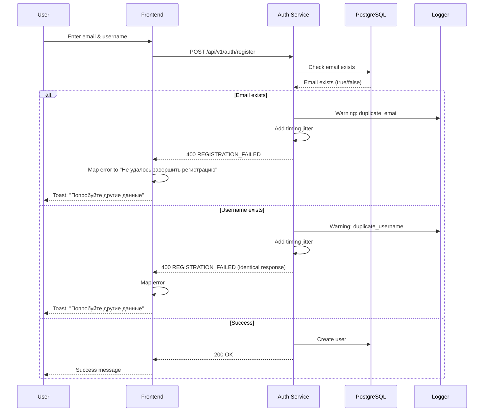
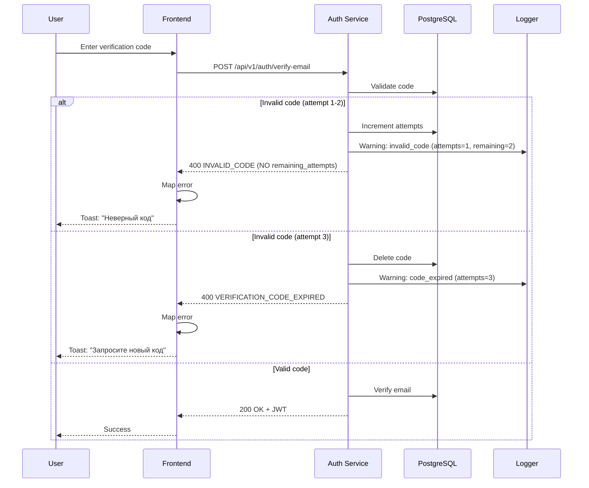

# SEC-011: Error Message Security - Устранение информационной утечки

**ID:** SEC-011  
**Version:** 1.0  
**Status:** Approved  
**Author:** System Analyst  
**Date:** 2026-03-03  
**Priority:** High  
**Approved Date:** 2026-03-03

---

## 1. Executive Summary

### 1.1 Проблема

Детальные сообщения об ошибках в auth endpoints раскрывают внутреннюю структуру системы и помогают attacker'ам в проведении enumeration и brute-force атак:

| Endpoint | Уязвимость | Риск |
|----------|------------|------|
| `/api/v1/auth/register` | Раскрывает существование email/username | Account enumeration |
| `/api/v1/auth/register` | Возвращает введенный email в `details` | Information disclosure |
| `/api/v1/auth/verify-email` | Раскрывает `remaining_attempts` | Brute-force optimization |

**Отсылка к аудиту:** SECURITY_AUDIT.md, раздел 11 "Информационная утечка в error messages"

**Примеры текущих утечек:**

```python
# auth.py:56-67 - Раскрывает существование email
{
    "code": "EMAIL_ALREADY_EXISTS",
    "message": "Email already registered",
    "details": {"email": "test@example.com"}  # ⚠️ Утечка
}

# auth.py:69-81 - Раскрывает существование username
{
    "code": "USERNAME_ALREADY_EXISTS",
    "message": "Username already taken",
    "details": {"username": "testuser"}  # ⚠️ Утечка
}

# auth.py:193-200 - Помогает brute-force
{
    "code": "INVALID_OR_EXPIRED_CODE",
    "message": "Invalid or expired verification code",
    "details": {"remaining_attempts": 2}  # ⚠️ Утечка
}
```

### 1.2 Решение

Реализовать generic error messages с детальным логированием на сервере:

| Компонент | Решение |
|-----------|---------|
| Error messages | Generic, не раскрывающие существование ресурсов |
| Error codes | Общие коды (REGISTRATION_FAILED, AUTHENTICATION_FAILED) |
| Logging | Детальное логирование всех ошибок на сервере |
| Frontend | Mapping generic сообщений в user-friendly текст |
| Verification | Убрать remaining_attempts из response |

**Соответствие стандартам:**
- ✅ OWASP A05:2021 - Security Misconfiguration
- ✅ NIST SP 800-63B - Digital Identity Guidelines
- ✅ CWE-209 - Information Exposure Through Error Message

---

## 2. Scope

### 2.1 In Scope

- Изменение error messages в auth endpoints
- Создание generic error response builder
- Детальное логирование ошибок
- Frontend mapping сообщений
- Удаление remaining_attempts из verify-email
- Unit и integration тесты
- Обновление документации

### 2.2 Out of Scope

- Изменения в других сервисах (places, reports, etc.)
- CAPTCHA интеграция
- Изменения в email верификации flow
- Rate limiting (уже реализовано в SEC-004)

---

## 3. User Stories

### US1: Защита от account enumeration при регистрации

**As a** Security Engineer  
**I want to** скрыть существование email/username  
**So that** предотвратить enumeration атаки

**Priority:** High  
**Actors:** Attacker, Security Engineer

**Acceptance Criteria:**

**AC1.1: Generic сообщение при занятом email**
- Given пользователь регистрируется с email "test@example.com"
- When email уже существует в системе
- Then получает HTTP 400 с сообщением "Unable to complete registration"
- And сообщение НЕ указывает, что email занят
- And ошибка залогирована с деталями (email, username, ip)

**AC1.2: Generic сообщение при занятом username**
- Given пользователь регистрируется с username "testuser"
- When username уже существует в системе
- Then получает HTTP 400 с сообщением "Unable to complete registration"
- And сообщение НЕ указывает, что username занят
- And ошибка залогирована с деталями

**AC1.3: Identical response для email и username**
- Given два пользователя пытаются зарегистрироваться
- When один с занятым email, другой с занятым username
- Then получают идентичные error responses
- And timing attack protection (одинаковое время ответа)

---

### US2: Устранение remaining_attempts при верификации

**As a** Security Engineer  
**I want to** скрыть количество оставшихся попыток  
**So that** предотвратить оптимизацию brute-force атак

**Priority:** High  
**Actors:** Attacker, Security Engineer

**Acceptance Criteria:**

**AC2.1: Удаление remaining_attempts из response**
- Given пользователь вводит неверный verification code
- When получает error response
- Then response НЕ содержит `remaining_attempts`
- And response содержит generic сообщение "Invalid verification code"
- And remaining_attempts залогирован на сервере

**AC2.2: Инвалидация кода после 3 попыток**
- Given пользователь ввел неверный код 3 раза
- When код инвалидирован
- Then пользователь должен запросить новый код
- And получает сообщение "Too many attempts. Please request a new code."

---

### US3: Детальное логирование на сервере

**As a** Security Engineer  
**I want to** логировать детали ошибок на сервере  
**So that** иметь возможность debugging и security monitoring

**Priority:** High  
**Actors:** Security Engineer, Developer

**Acceptance Criteria:**

**AC3.1: Логирование регистрации**
- Given ошибка регистрации
- When логируется
- Then лог содержит: timestamp, email, username, ip_address, error_type
- And лог содержит stack trace при необходимости
- And лог НЕ содержит чувствительных данных в открытом виде

**AC3.2: Логирование верификации**
- Given ошибка верификации email
- When логируется
- Then лог содержит: timestamp, email, ip_address, remaining_attempts, error_type

---

### US4: Frontend mapping сообщений

**As a** User  
**I want to** видеть понятные сообщения об ошибках  
**So that** знаю, что пошло не так и как исправить

**Priority:** Medium  
**Actors:** User

**Acceptance Criteria:**

**AC4.1: Mapping generic сообщений**
- Given API возвращает error code "REGISTRATION_FAILED"
- When frontend отображает ошибку
- Then пользователь видит: "Не удалось завершить регистрацию. Попробуйте другие данные."
- And сообщение на русском языке
- And сообщение user-friendly

**AC4.2: Toast notifications**
- Given API возвращает ошибку
- When frontend получает response
- Then показывается toast notification
- And toast содержит понятное сообщение
- And toast содержит кнопку "OK" или "Close"

---

## 4. Технические требования

### 4.1 Изменения в auth.py

#### 4.1.1 Регистрация - Generic Error Response

**Было:**
```python
# auth.py:56-67
if existing_email:
    raise HTTPException(
        status_code=400,
        detail={
            "code": "EMAIL_ALREADY_EXISTS",
            "message": "Email already registered",
            "details": {"email": request.email},
        },
    )

if existing_username:
    raise HTTPException(
        status_code=400,
        detail={
            "code": "USERNAME_ALREADY_EXISTS",
            "message": "Username already taken",
            "details": {"username": request.username},
        },
    )
```

**Стало:**
```python
# auth.py:56-81
if existing_email or existing_username:
    logger.warning(
        "Registration failed - duplicate credentials",
        email=request.email,
        username=request.username,
        error_type="duplicate_email" if existing_email else "duplicate_username",
        ip_address=request.client.host if request.client else None
    )
    raise HTTPException(
        status_code=status.HTTP_400_BAD_REQUEST,
        detail={
            "code": "REGISTRATION_FAILED",
            "message": "Unable to complete registration. Please try with different credentials."
        },
    )
```

#### 4.1.2 Верификация - Удаление remaining_attempts

**Было:**
```python
# auth.py:193-200
raise HTTPException(
    status_code=status.HTTP_400_BAD_REQUEST,
    detail={
        "code": "INVALID_OR_EXPIRED_CODE",
        "message": "Invalid or expired verification code",
        "details": {"remaining_attempts": max(0, 3 - attempts)},
    },
)
```

**Стало:**
```python
# auth.py:193-200
await email_crud.increment_attempts(request.email)
attempts = existing_code.attempts + 1 if existing_code else 1

logger.warning(
    "Email verification failed - invalid code",
    email=request.email,
    attempts=attempts,
    remaining_attempts=max(0, 3 - attempts),
    ip_address=request.client.host if request.client else None
)

if attempts >= 3:
    await email_crud.delete_by_email(request.email)
    raise HTTPException(
        status_code=status.HTTP_400_BAD_REQUEST,
        detail={
            "code": "VERIFICATION_CODE_EXPIRED",
            "message": "Too many attempts. Please request a new verification code."
        },
    )

raise HTTPException(
    status_code=status.HTTP_400_BAD_REQUEST,
    detail={
        "code": "INVALID_CODE",
        "message": "Invalid verification code"
    },
)
```

### 4.2 Generic Error Response Builder

Создать helper function для генерации generic error responses:

```python
# services/auth-service/app/core/error_utils.py

from fastapi import HTTPException, status
from typing import Optional, Dict, Any
from app.core.logging_config import get_logger

logger = get_logger(__name__)


def create_generic_error(
    error_code: str,
    message: str,
    log_details: Optional[Dict[str, Any]] = None,
    status_code: int = status.HTTP_400_BAD_REQUEST
) -> HTTPException:
    """
    Создает generic HTTPException с детальным логированием.
    
    Args:
        error_code: Generic error code (REGISTRATION_FAILED, AUTHENTICATION_FAILED)
        message: User-friendly message
        log_details: Детали для логирования (НЕ возвращаются пользователю)
        status_code: HTTP status code
    
    Returns:
        HTTPException с generic detail
    """
    if log_details:
        logger.warning(
            f"Error: {error_code}",
            **log_details
        )
    
    return HTTPException(
        status_code=status_code,
        detail={
            "code": error_code,
            "message": message
        }
    )


# Предустановленные generic errors
class GenericErrors:
    """Предустановленные generic error responses"""
    
    @staticmethod
    def registration_failed(email: str, username: str, ip: Optional[str], reason: str):
        return create_generic_error(
            error_code="REGISTRATION_FAILED",
            message="Unable to complete registration. Please try with different credentials.",
            log_details={
                "email": email,
                "username": username,
                "ip_address": ip,
                "reason": reason  # duplicate_email, duplicate_username, etc.
            }
        )
    
    @staticmethod
    def verification_failed(email: str, ip: Optional[str], attempts: int):
        return create_generic_error(
            error_code="INVALID_CODE",
            message="Invalid verification code",
            log_details={
                "email": email,
                "ip_address": ip,
                "attempts": attempts,
                "remaining_attempts": max(0, 3 - attempts)
            }
        )
    
    @staticmethod
    def verification_code_expired():
        return HTTPException(
            status_code=status.HTTP_400_BAD_REQUEST,
            detail={
                "code": "VERIFICATION_CODE_EXPIRED",
                "message": "Too many attempts. Please request a new verification code."
            }
        )
```

### 4.3 Frontend Error Mapping

Создать mapping для error codes в user-friendly сообщения:

```typescript
// frontend/lib/utils/errorMapping.ts

export const errorMessages: Record<string, string> = {
  // Registration errors
  REGISTRATION_FAILED: "Не удалось завершить регистрацию. Попробуйте другие данные.",
  
  // Verification errors
  INVALID_CODE: "Неверный код подтверждения. Попробуйте еще раз.",
  VERIFICATION_CODE_EXPIRED: "Превышено количество попыток. Запросите новый код.",
  
  // Authentication errors
  INVALID_CREDENTIALS: "Неверный email или пароль.",
  EMAIL_NOT_VERIFIED: "Email не подтвержден. Проверьте почту.",
  
  // Generic errors
  INTERNAL_ERROR: "Произошла ошибка. Попробуйте позже.",
  SERVICE_UNAVAILABLE: "Сервис временно недоступен. Попробуйте позже.",
};

export function mapErrorToMessage(errorCode: string): string {
  return errorMessages[errorCode] || errorMessages.INTERNAL_ERROR;
}
```

```typescript
// frontend/lib/api/client.ts

import { mapErrorToMessage } from "@/lib/utils/errorMapping";
import { toast } from "sonner";

// API response interceptor
export async function handleApiError(error: any) {
  if (error.response?.data?.detail) {
    const { code, message } = error.response.data.detail;
    
    // Map generic error to user-friendly message
    const userMessage = mapErrorToMessage(code);
    
    // Show toast notification
    toast.error(userMessage);
    
    // Log for debugging (dev only)
    if (process.env.NODE_ENV === "development") {
      console.error("API Error:", { code, message });
    }
    
    return { error: true, message: userMessage, code };
  }
  
  // Fallback for unknown errors
  toast.error("Произошла непредвиденная ошибка");
  return { error: true, message: "Unknown error" };
}
```

### 4.4 Структура файлов

```
services/auth-service/
├── app/
│   ├── core/
│   │   ├── error_utils.py          # NEW: Generic error builder
│   │   └── logging_config.py       # Existing
│   └── endpoints/
│       └── auth.py                 # UPDATE: Generic errors

frontend/
├── lib/
│   ├── api/
│   │   └── client.ts               # UPDATE: Error handling
│   └── utils/
│       └── errorMapping.ts         # NEW: Error code mapping
```

### 4.5 Timing Attack Protection

Добавить искусственную задержку для предотвращения timing attacks:

```python
# services/auth-service/app/core/error_utils.py

import asyncio
import random

async def add_timing_jitter(min_ms: int = 50, max_ms: int = 150):
    """
    Добавляет случайную задержку для защиты от timing attacks.
    """
    delay_ms = random.randint(min_ms, max_ms)
    await asyncio.sleep(delay_ms / 1000.0)
```

```python
# auth.py - использовать перед raise HTTPException

if existing_email or existing_username:
    await add_timing_jitter()  # Защита от timing attack
    raise HTTPException(...)
```

---

## 5. Sequence Diagram

### 5.1 Registration Flow с Generic Errors



### 5.2 Verification Flow без remaining_attempts



---

## 6. Декомпозиция на задачи

### TASK-BCK-001: Создать модуль error_utils.py

**Направление:** Backend  
**Приоритет:** High  
**Оценка:** 2 часа  
**Зависимости:** Нет

**Описание:**
Создать helper модуль для генерации generic error responses с детальным логированием.

**Критерии приемки:**
- [ ] Файл `app/core/error_utils.py` создан
- [ ] Реализована функция `create_generic_error()`
- [ ] Реализован класс `GenericErrors` с предустановленными ошибками
- [ ] Добавлена функция `add_timing_jitter()` для timing attack protection
- [ ] Функции покрыты unit тестами

**Технические детали:**
- Файлы: `services/auth-service/app/core/error_utils.py`

---

### TASK-BCK-002: Обновить регистрацию - generic errors

**Направление:** Backend  
**Приоритет:** High  
**Оценка:** 2 часа  
**Зависимости:** TASK-BCK-001

**Описание:**
Заменить детальные ошибки регистрации на generic сообщения с логированием.

**Критерии приемки:**
- [ ] EMAIL_ALREADY_EXISTS заменен на REGISTRATION_FAILED
- [ ] USERNAME_ALREADY_EXISTS заменен на REGISTRATION_FAILED
- [ ] Удален `details` с email/username из response
- [ ] Добавлено детальное логирование (email, username, ip, reason)
- [ ] Добавлена timing jitter защита
- [ ] Response идентичен для email и username случаев

**Технические детали:**
- Файлы: `services/auth-service/app/endpoints/auth.py` (строки 56-81)

---

### TASK-BCK-003: Обновить верификацию - убрать remaining_attempts

**Направление:** Backend  
**Приоритет:** High  
**Оценка:** 2 часа  
**Зависимости:** TASK-BCK-001

**Описание:**
Удалить remaining_attempts из response и добавить инвалидацию кода после 3 попыток.

**Критерии приемки:**
- [ ] remaining_attempts удален из response
- [ ] Добавлена инвалидация кода после 3 попыток
- [ ] Добавлено логирование remaining_attempts на сервере
- [ ] Новое сообщение "Too many attempts" после 3 попыток
- [ ] Error code VERIFICATION_CODE_EXPIRED для истекшего кода

**Технические детали:**
- Файлы: `services/auth-service/app/endpoints/auth.py` (строки 193-200)

---

### TASK-BCK-004: Добавить логирование IP адреса

**Направление:** Backend  
**Приоритет:** Medium  
**Оценка:** 1 час  
**Зависимости:** TASK-BCK-002, TASK-BCK-003

**Описание:**
Добавить логирование IP адреса клиента во всех error responses.

**Критерии приемки:**
- [ ] IP адрес извлекается из request.client.host
- [ ] IP адрес логируется во всех ошибках
- [ ] Обработка случая request.client = None

**Технические детали:**
- Файлы: `services/auth-service/app/endpoints/auth.py`

---

### TASK-FRT-001: Создать error mapping модуль

**Направление:** Frontend  
**Приоритет:** Medium  
**Оценка:** 1.5 часа  
**Зависимости:** Нет

**Описание:**
Создать модуль для mapping error codes в user-friendly сообщения.

**Критерии приемки:**
- [ ] Файл `lib/utils/errorMapping.ts` создан
- [ ] Создан словарь errorMessages с mapping
- [ ] Реализована функция mapErrorToMessage()
- [ ] Все сообщения на русском языке
- [ ] Покрыты все error codes

**Технические детали:**
- Файлы: `frontend/lib/utils/errorMapping.ts`

---

### TASK-FRT-002: Обновить API client error handling

**Направление:** Frontend  
**Приоритет:** Medium  
**Оценка:** 2 часа  
**Зависимости:** TASK-FRT-001

**Описание:**
Обновить API client для использования error mapping и toast notifications.

**Критерии приемки:**
- [ ] Добавлен response interceptor для ошибок
- [ ] Извлекается error code из response
- [ ] Вызывается mapErrorToMessage()
- [ ] Показывается toast notification
- [ ] Логирование в dev режиме

**Технические детали:**
- Файлы: `frontend/lib/api/client.ts`

---

### TASK-FRT-003: Обновить компоненты регистрации

**Направление:** Frontend  
**Приоритет:** Medium  
**Оценка:** 1.5 часа  
**Зависимости:** TASK-FRT-002

**Описание:**
Обновить компоненты регистрации для обработки новых generic ошибок.

**Критерии приемки:**
- [ ] RegistrationForm обрабатывает REGISTRATION_FAILED
- [ ] Убрана логика показа "email занят" vs "username занят"
- [ ] Toast notification показывается корректно
- [ ] Форма не блокируется при ошибке

**Технические детали:**
- Файлы: `frontend/components/auth/RegisterForm.tsx`

---

### TASK-FRT-004: Обновить компоненты верификации

**Направление:** Frontend  
**Приоритет:** Medium  
**Оценка:** 1.5 часа  
**Зависимости:** TASK-FRT-002

**Описание:**
Обновить компоненты верификации для обработки ошибок без remaining_attempts.

**Критерии приемки:**
- [ ] VerifyEmailForm обрабатывает INVALID_CODE
- [ ] VerifyEmailForm обрабатывает VERIFICATION_CODE_EXPIRED
- [ ] Убрано отображение remaining_attempts
- [ ] Toast notification показывается корректно
- [ ] Кнопка "Запросить новый код" работает

**Технические детали:**
- Файлы: `frontend/components/auth/VerifyEmailForm.tsx`

---

### TASK-TST-001: Unit тесты для error_utils.py

**Направление:** Testing  
**Приоритет:** High  
**Оценка:** 2 часа  
**Зависимости:** TASK-BCK-001

**Описание:**
Написать unit тесты для модуля error_utils.py.

**Критерии приемки:**
- [ ] Тест: create_generic_error() создает корректный HTTPException
- [ ] Тест: create_generic_error() логирует детали
- [ ] Тест: GenericErrors.registration_failed() возвращает корректную структуру
- [ ] Тест: add_timing_jitter() добавляет случайную задержку
- [ ] Покрытие кода ≥90%

**Технические детали:**
- Файлы: `services/auth-service/tests/test_error_utils.py`

---

### TASK-TST-002: Integration тесты для регистрации

**Направление:** Testing  
**Приоритет:** High  
**Оценка:** 3 часа  
**Зависимости:** TASK-BCK-002

**Описание:**
Написать integration тесты для проверки generic errors при регистрации.

**Критерии приемки:**
- [ ] Тест: занятый email возвращает REGISTRATION_FAILED
- [ ] Тест: занятый username возвращает REGISTRATION_FAILED
- [ ] Тест: responses идентичны для email и username
- [ ] Тест: response НЕ содержит email/username в details
- [ ] Тест: timing attack protection работает (одинаковое время ответа)
- [ ] Тест: логирование содержит детали

**Технические детали:**
- Файлы: `services/auth-service/tests/test_registration_errors.py`

---

### TASK-TST-003: Integration тесты для верификации

**Направление:** Testing  
**Приоритет:** High  
**Оценка:** 2.5 часа  
**Зависимости:** TASK-BCK-003

**Описание:**
Написать integration тесты для проверки отсутствия remaining_attempts.

**Критерии приемки:**
- [ ] Тест: неверный код НЕ возвращает remaining_attempts
- [ ] Тест: 3-я попытка инвалидирует код
- [ ] Тест: после 3 попыток возвращается VERIFICATION_CODE_EXPIRED
- [ ] Тест: логирование содержит remaining_attempts
- [ ] Тест: пользователь может запросить новый код после инвалидации

**Технические детали:**
- Файлы: `services/auth-service/tests/test_verification_errors.py`

---

### TASK-TST-004: Frontend тесты для error mapping

**Направление:** Testing  
**Приоритет:** Medium  
**Оценка:** 1.5 часа  
**Зависимости:** TASK-FRT-001

**Описание:**
Написать тесты для error mapping модуля.

**Критерии приемки:**
- [ ] Тест: mapErrorToMessage() возвращает корректное сообщение
- [ ] Тест: unknown error code возвращает INTERNAL_ERROR
- [ ] Тест: все error codes имеют mapping
- [ ] Тест: сообщения на русском языке

**Технические детали:**
- Файлы: `frontend/__tests__/utils/errorMapping.test.ts`

---

### TASK-TST-005: Frontend тесты для API client

**Направление:** Testing  
**Приоритет:** Medium  
**Оценка:** 2 часа  
**Зависимости:** TASK-FRT-002

**Описание:**
Написать тесты для API client error handling.

**Критерии приемки:**
- [ ] Тест: handleApiError() извлекает error code
- [ ] Тест: handleApiError() вызывает mapErrorToMessage()
- [ ] Тест: handleApiError() показывает toast
- [ ] Тест: dev mode логирует ошибку
- [ ] Тест: unknown error обрабатывается корректно

**Технические детали:**
- Файлы: `frontend/__tests__/api/client.test.ts`

---

### TASK-DOC-001: Обновить SECURITY_AUDIT.md

**Направление:** Documentation  
**Приоритет:** Medium  
**Оценка:** 0.5 часа  
**Зависимости:** TASK-BCK-002, TASK-BCK-003

**Описание:**
Обновить статус уязвимости #11 в SECURITY_AUDIT.md.

**Критерии приемки:**
- [ ] Статус изменен на "ИСПРАВЛЕНО"
- [ ] Добавлена дата исправления
- [ ] Добавлена ссылка на реализацию (SEC-011)

**Технические детали:**
- Файлы: `SECURITY_AUDIT.md`

---

### TASK-DOC-002: Обновить ARCHITECTURE.md

**Направление:** Documentation  
**Приоритет:** Low  
**Оценка:** 0.5 часа  
**Зависимости:** TASK-BCK-001

**Описание:**
Добавить секцию об Error Message Security в ARCHITECTURE.md.

**Критерии приемки:**
- [ ] Добавлена секция "Error Message Security"
- [ ] Документирован подход к generic errors
- [ ] Документировано логирование
- [ ] Добавлены примеры error codes

**Технические детали:**
- Файлы: `ARCHITECTURE.md`

---

## 7. Итоговая таблица задач

| ID | Название | Направление | Приоритет | Оценка | Зависимости |
|----|----------|-------------|-----------|--------|-------------|
| TASK-BCK-001 | Модуль error_utils.py | Backend | High | 2h | - |
| TASK-BCK-002 | Регистрация - generic errors | Backend | High | 2h | BCK-001 |
| TASK-BCK-003 | Верификация - убрать remaining_attempts | Backend | High | 2h | BCK-001 |
| TASK-BCK-004 | Логирование IP адреса | Backend | Medium | 1h | BCK-002, BCK-003 |
| TASK-FRT-001 | Error mapping модуль | Frontend | Medium | 1.5h | - |
| TASK-FRT-002 | API client error handling | Frontend | Medium | 2h | FRT-001 |
| TASK-FRT-003 | Обновить регистрацию | Frontend | Medium | 1.5h | FRT-002 |
| TASK-FRT-004 | Обновить верификацию | Frontend | Medium | 1.5h | FRT-002 |
| TASK-TST-001 | Unit тесты error_utils | Testing | High | 2h | BCK-001 |
| TASK-TST-002 | Integration тесты регистрации | Testing | High | 3h | BCK-002 |
| TASK-TST-003 | Integration тесты верификации | Testing | High | 2.5h | BCK-003 |
| TASK-TST-004 | Frontend тесты mapping | Testing | Medium | 1.5h | FRT-001 |
| TASK-TST-005 | Frontend тесты API client | Testing | Medium | 2h | FRT-002 |
| TASK-DOC-001 | SECURITY_AUDIT.md | Documentation | Medium | 0.5h | BCK-002, BCK-003 |
| TASK-DOC-002 | ARCHITECTURE.md | Documentation | Low | 0.5h | BCK-001 |

**Общая оценка:** 25.5 часов

**Критический путь (Backend):**
```
BCK-001 (2h) → BCK-002 (2h) → TST-002 (3h)
BCK-001 (2h) → BCK-003 (2h) → TST-003 (2.5h)
```
**Длительность критического пути:** 7-7.5 часов

---

## 8. Риски и митигация

| Риск | Вероятность | Влияние | Митигация |
|------|-------------|---------|-----------|
| Ухудшение UX из-за generic сообщений | Medium | Medium | Frontend mapping, user-friendly тексты |
| Timing attack не полностью устранен | Low | Medium | Timing jitter, rate limiting (SEC-004) |
| Пользователи жалуются на отсутствие remaining_attempts | Low | Low | Документация, FAQ |
| Логи засоряются деталями | Low | Low | Structured logging, log rotation |
| Frontend не обрабатывает новые error codes | Medium | Medium | Integration тесты, fallback сообщения |

---

## 9. Non-Functional Requirements

### 9.1 Performance

| Метрика | Требование |
|---------|------------|
| Overhead на error response | < 10ms (timing jitter) |
| Logging overhead | < 5ms |
| Frontend mapping | < 1ms |

### 9.2 Security

| Требование | Значение |
|------------|----------|
| Error response не содержит чувствительных данных | ✅ |
| Timing attack protection | ✅ (jitter 50-150ms) |
| IP logging | ✅ (для security monitoring) |
| Rate limiting | ✅ (SEC-004) |

### 9.3 Usability

| Требование | Значение |
|------------|----------|
| User-friendly сообщения | ✅ (на русском) |
| Toast notifications | ✅ |
| Clear error indication | ✅ |

---

## 10. Definition of Done

### DoD Backend

- [ ] error_utils.py создан и протестирован
- [ ] Регистрация возвращает generic errors
- [ ] Верификация не возвращает remaining_attempts
- [ ] Timing attack protection реализован
- [ ] IP logging добавлен
- [ ] Unit тесты написаны (≥90% покрытие)
- [ ] Integration тесты пройдены

### DoD Frontend

- [ ] Error mapping модуль создан
- [ ] API client обрабатывает ошибки
- [ ] Компоненты регистрации обновлены
- [ ] Компоненты верификации обновлены
- [ ] Toast notifications работают
- [ ] Тесты написаны

### DoD Documentation

- [ ] SECURITY_AUDIT.md обновлен
- [ ] ARCHITECTURE.md обновлен
- [ ] Error codes задокументированы

---

## 11. Зависимости

### Зависит от

- Redis (для rate limiting, SEC-004)
- Logging infrastructure (уже развернута)

### Блокирует

- Полное устранение уязвимости #11 из SECURITY_AUDIT.md

---

## 12. Acceptance Test Scenarios

### Сценарий 1: Registration с занятым email

```bash
# Request
POST /api/v1/auth/register
{
  "email": "existing@example.com",
  "username": "newuser",
  "password": "Password123"
}

# Expected Response (400 Bad Request)
{
  "code": "REGISTRATION_FAILED",
  "message": "Unable to complete registration. Please try with different credentials."
}

# Server Log
WARNING: Registration failed - duplicate credentials
  email=existing@example.com
  username=newuser
  error_type=duplicate_email
  ip_address=192.168.1.1
```

### Сценарий 2: Verification с неверным кодом

```bash
# Request (1st attempt)
POST /api/v1/auth/verify-email
{
  "email": "test@example.com",
  "code": "WRONG1"
}

# Expected Response (400 Bad Request)
{
  "code": "INVALID_CODE",
  "message": "Invalid verification code"
  # NO remaining_attempts field
}

# Server Log
WARNING: Email verification failed - invalid code
  email=test@example.com
  attempts=1
  remaining_attempts=2
  ip_address=192.168.1.1
```

### Сценарий 3: Verification после 3 попыток

```bash
# Request (3rd attempt)
POST /api/v1/auth/verify-email
{
  "email": "test@example.com",
  "code": "WRONG3"
}

# Expected Response (400 Bad Request)
{
  "code": "VERIFICATION_CODE_EXPIRED",
  "message": "Too many attempts. Please request a new verification code."
}
```

### Сценарий 4: Frontend error mapping

```typescript
// API Error
{
  "code": "REGISTRATION_FAILED",
  "message": "Unable to complete registration..."
}

// Frontend Mapping
mapErrorToMessage("REGISTRATION_FAILED")
// Returns: "Не удалось завершить регистрацию. Попробуйте другие данные."

// Toast Notification
toast.error("Не удалось завершить регистрацию. Попробуйте другие данные.")
```

---

## 13. История изменений

| Версия | Дата | Автор | Изменения |
|--------|------|-------|-----------|
| 1.0 | 2026-03-03 | System Analyst | Initial version |

---

**Статус:** ✅ Approved  
**Дата согласования:** 2026-03-03  
**Согласовано с:** Заказчик

**Согласованные решения:**
1. ✅ Generic сообщение при регистрации: "Unable to complete registration"
2. ✅ Удаление remaining_attempts из response
3. ✅ Generic error codes (REGISTRATION_FAILED, INVALID_CODE)
4. ✅ Frontend mapping сообщений на русский язык
5. ✅ Детальное логирование на сервере
6. ✅ Timing attack protection (jitter 50-150ms)
