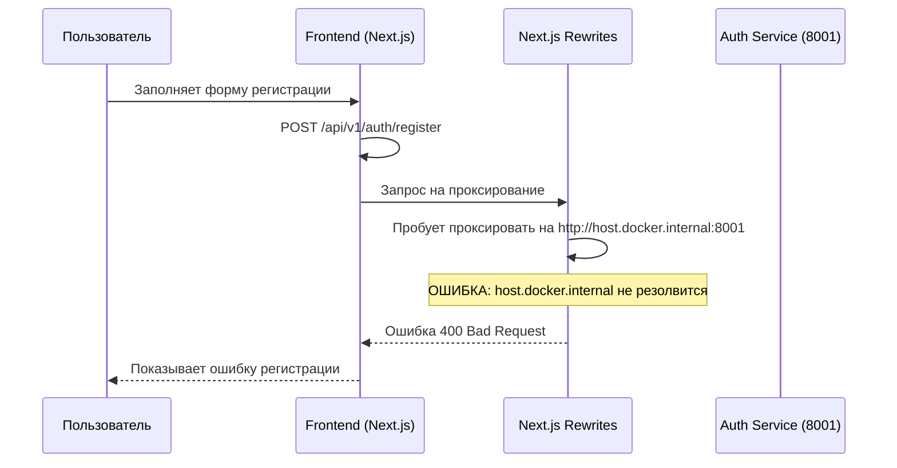
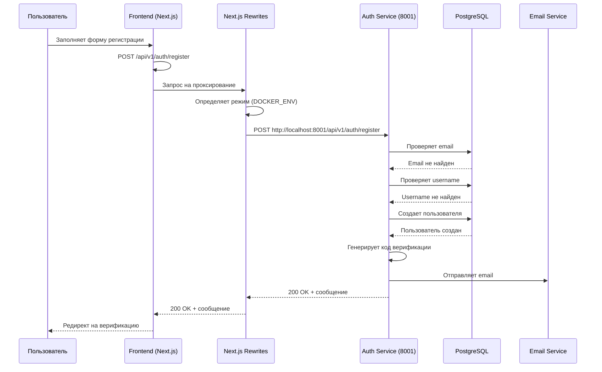
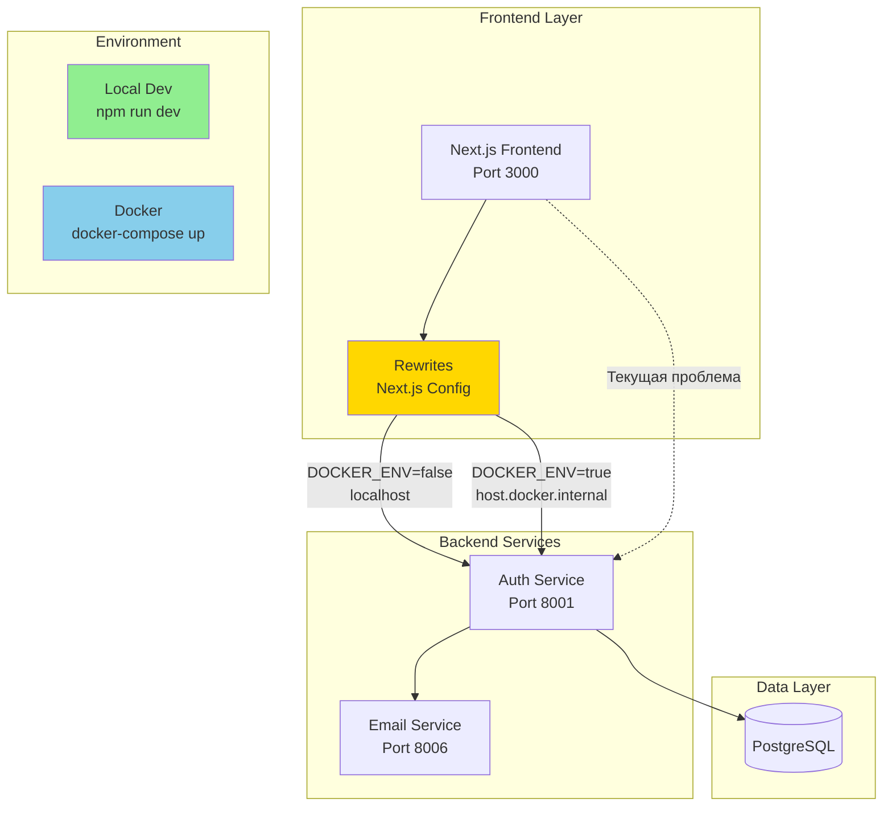

# Use Case: User Registration (Bug Fix Context)

**ID**: UC-REG-001
**Version**: 1.0
**Author**: System Analyst
**Date**: 2026-02-12

## Overview

Пользователь регистрируется на платформе для получения доступа ко всем функциям. Данный use case описывает процесс регистрации и контекст текущего бага.

## Primary Actor

Незарегистрированный пользователь (посетитель)

## Preconditions

- Frontend и backend сервисы запущены
- База данных PostgreSQL доступна
- Пользователь имеет доступ к интернету (для отправки email верификации, если включено)

## Main Flow (Happy Path)

| Step | Actor | System | Description |
|------|-------|--------|-------------|
| 1 | Пользователь | - | Открывает страницу регистрации `/register` |
| 2 | Пользователь | - | Вводит email |
| 3 | Пользователь | - | Вводит username (минимум 3 символа) |
| 4 | Пользователь | - | Вводит пароль (минимум 8 символов) |
| 5 | Пользователь | Frontend | Нажимает кнопку "Создать аккаунт" |
| 6 | - | Frontend | Отправляет POST запрос на `/api/v1/auth/register` |
| 7 | - | Next.js | Проксирует запрос на Auth Service (порт 8001) |
| 8 | - | Auth Service | Валидирует входные данные |
| 9 | - | Auth Service | Проверяет, что email не зарегистрирован |
| 10 | - | Auth Service | Проверяет, что username не занят |
| 11 | - | Auth Service | Хеширует пароль |
| 12 | - | Auth Service | Создает пользователя в базе данных |
| 13 | - | Auth Service | Генерирует код верификации email |
| 14 | - | Email Service | Отправляет email с кодом верификации |
| 15 | - | Auth Service | Сохраняет код верификации в базе данных |
| 16 | - | Frontend | Получает успешный ответ |
| 17 | - | Frontend | Показывает сообщение об успешной регистрации |
| 18 | - | Frontend | Редиректит на страницу верификации email через 2 секунды |

## Alternative Flows

**Alt Flow 1: Email уже зарегистрирован**
- Предусловие: Пользователь вводит уже зарегистрированный email
- Действия:
  - Auth Service обнаруживает существующего пользователя с таким email
  - Auth Service возвращает ошибку `400 Bad Request` с кодом `EMAIL_ALREADY_EXISTS`
  - Frontend показывает пользователю сообщение "Email already registered"

**Alt Flow 2: Username уже занят**
- Предусловие: Пользователь вводит уже занятый username
- Действия:
  - Auth Service обнаруживает существующего пользователя с таким username
  - Auth Service возвращает ошибку `400 Bad Request` с кодом `USERNAME_ALREADY_EXISTS`
  - Frontend показывает пользователю сообщение "Username already taken"

**Alt Flow 3: Некорректные данные**
- Предусловие: Пользователь вводит некорректные данные (слишком короткий username/пароль, некорректный email)
- Действия:
  - Pydantic валидация на стороне Auth Service возвращает ошибку `422 Unprocessable Entity`
  - Frontend показывает пользователю сообщение об ошибке валидации

**Alt Flow 4: Ошибка отправки email (если включено ENABLE_EMAIL_SENDING)**
- Предусловие: Email Service недоступен или возвращает ошибку
- Действия:
  - Auth Service ловит исключение при отправке email
  - Auth Service логирует ошибку, но продолжает процесс регистрации
  - Auth Service использует тестовый код "123456"
  - Пользователь может зарегистрироваться, но email с кодом не будет отправлен

**Alt Flow 5: Отключена отправка email (ENABLE_EMAIL_SENDING=false)**
- Предусловие: В конфигурации Auth Service отключена отправка email
- Действия:
  - Auth Service пропускает шаг отправки email
  - Auth Service использует тестовый код "123456"
  - Пользователь регистрируется с тестовым кодом

## Postconditions

- Пользователь создан в базе данных
- Пользователь имеет статус `is_verified=false`
- Код верификации email сохранен в базе данных (срок действия согласно `EMAIL_CODE_EXPIRE_MINUTES`)
- Пароль хеширован и сохранен в базе данных
- Пользователь имеет роль `user`

## Business Rules

**BR1**: Email должен быть уникальным в системе

**BR2**: Username должен быть уникальным в системе (минимум 3 символа, максимум 100)

**BR3**: Пароль должен содержать минимум 8 символов

**BR4**: Пароль должен быть хеширован перед сохранением в базу данных

**BR5**: После регистрации пользователь должен верифицировать email

**BR6**: Код верификации email имеет ограниченный срок действия

**BR7**: Код верификации имеет ограниченное количество попыток ввода (максимум 3)

## Error Conditions

| Ошибка | Код | HTTP Status | Действие системы |
|--------|-----|-------------|------------------|
| Email уже зарегистрирован | EMAIL_ALREADY_EXISTS | 400 | Возврат ошибки с деталями |
| Username уже занят | USERNAME_ALREADY_EXISTS | 400 | Возврат ошибки с деталями |
| Некорректные данные | VALIDATION_ERROR | 422 | Возврат ошибки с деталями |
| Внутренняя ошибка сервера | INTERNAL_ERROR | 500 | Логирование ошибки, возврат 500 |
| Пользователь не найден | USER_NOT_FOUND | 404 | Возврат ошибки с деталями |

## Bug Context: Проблема с проксированием запросов

### Описание текущей проблемы

При локальной разработке (frontend запущен через `npm run dev`, не в Docker) запросы к API не доходят до Auth Service из-за неправильной конфигурации проксирования в Next.js.

### Sequence Diagram (текущее нерабочее состояние)



### Sequence Diagram (после исправления)



## Диаграмма компонентов



## Приложение: Данные запроса/ответа

### Запрос регистрации

```http
POST /api/v1/auth/register HTTP/1.1
Host: localhost:3000
Content-Type: application/json

{
  "email": "test@example.com",
  "username": "testuser",
  "password": "Password123"
}
```

### Успешный ответ (200 OK)

```json
{
  "message": "Registration successful. Please check your email for verification code."
}
```

### Ошибка: Email уже существует (400 Bad Request)

```json
{
  "error": {
    "code": "EMAIL_ALREADY_EXISTS",
    "message": "Email already registered",
    "details": {
      "email": "test@example.com"
    }
  }
}
```

### Ошибка: Username уже занят (400 Bad Request)

```json
{
  "error": {
    "code": "USERNAME_ALREADY_EXISTS",
    "message": "Username already taken",
    "details": {
      "username": "testuser"
    }
  }
}
```

### Ошибка валидации (422 Unprocessable Entity)

```json
{
  "detail": [
    {
      "loc": ["body", "password"],
      "msg": "ensure this value has at least 8 characters",
      "type": "value_error.any_str.min_length",
      "ctx": {"limit_value": 8}
    }
  ]
}
```
