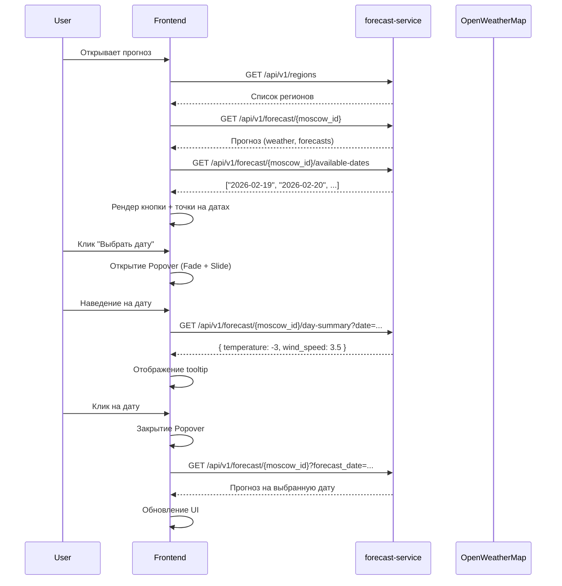

# User Story: Редизайн календаря прогноза клева

**ID**: US-FORECAST-CALENDAR-REDESIGN-006
**Version**: 1.0
**Author**: Business/System Analyst
**Date**: 2026-02-19
**Статус**: ✅ Согласовано

---

## История изменений

| Версия | Дата | Изменения |
|--------|------|-----------|
| 0.1 | 2026-02-19 | Черновик для согласования |
| 1.0 | 2026-02-19 | Финальная версия после согласования |

---

## 1. Обзор изменений

### 1.1. Проблема

Текущий календарь на странице прогноза клева:
1. **Слишком большой** - занимает много места inline
2. **Неудобный дизайн** - нет визуальной связи с лучшими практиками
3. **Не видно дни с прогнозом** - нет индикации доступных дат

### 1.2. Решение (Согласовано)

| Компонент | Решение | Обоснование |
|-----------|---------|-------------|
| Отображение календаря | **Popover при клике** | Современный паттерн (Airbnb, Booking, Google Flights) |
| Подсветка дней с прогнозом | **Точка/индикатор** | Как в Google Calendar - минималистично и понятно |
| Tooltip при наведении | **Температура** | Дополнительная информация без клика |
| Анимация появления | **Fade + Slide сверху** | Плавное появление, как в Airbnb |
| Кнопка закрытия | **Не нужна** | Клик вне области / Escape |
| Источник погоды | **OpenWeatherMap API** | Уже интегрирован, бесплатный тариф |

### 1.3. Бизнес-ценность

**Для пользователей**:
- Компактный интерфейс (больше места для контента)
- Понятная индикация дней с прогнозом
- Быстрый доступ к температуре через tooltip
- Современный UX по стандартам индустрии

**Для бизнеса**:
- Улучшение конверсии (удобнее планировать рыбалку)
- Соответствие современным дизайн-стандартам

---

## 2. User Stories

### US-1: Popover календарь при клике

**As a** пользователь,
**I want to** видеть календарь только при нажатии на кнопку "Выбрать дату",
**So that** интерфейс был компактным и современным.

#### Priority
- [x] High (MVP)

#### Actors
- [x] Зарегистрированный пользователь
- [x] Незарегистрированный посетитель

#### UI Design

**Кнопка-триггер** (всегда видна):
```
┌─────────────────────────────────────────┐
│ 📅  19 февраля 2026              ▼      │
└─────────────────────────────────────────┘
```

**Popover при клике**:
```
         ┌─────────────────────────────┐
         │      ◀   Февраль 2026   ▶   │
         │  Пн  Вт  Ср  Чт  Пт  Сб  Вс │
         │                      1   2  │
         │   3   4   5   6   7   8   9 │
         │  10  11  12  13  14  15  16 │
         │  17  18 [19]• 20•  21•  22  │
         │  23  24• 25  26  27  28     │
         └─────────────────────────────┘
              ↑
         Fade + Slide анимация

• = синяя точка (день с прогнозом)
[19] = выбранная дата (синий фон)
```

**Tooltip при наведении** (на дни с прогнозом):
```
┌────────────────┐
│ 19 февраля     │
│ ☀️ -3°C        │
│ Ветер: 3 м/с   │
└────────────────┘
```

#### Acceptance Criteria

**AC1: Кнопка-триггер отображается**
- **Given** я открываю блок прогноза
- **When** страница загружена
- **Then** вижу кнопку с текущей/выбранной датой
- **And** календарь скрыт
- **And** есть иконка календаря и стрелка вниз

**AC2: Открытие Popover**
- **Given** я вижу кнопку
- **When** кликаю на неё
- **Then** открывается Popover с календарем
- **And** Popover позиционируется под кнопкой
- **And** есть анимация Fade + Slide сверху (150ms)

**AC3: Закрытие Popover**
- **Given** Popover открыт
- **When** кликаю вне области Popover
- **Or** нажимаю Escape
- **Or** выбираю дату
- **Then** Popover закрывается с анимацией

**AC4: Выбор даты**
- **Given** вижу открытый календарь
- **When** кликаю на доступную дату
- **Then** дата выбирается (синий фон)
- **And** Popover закрывается
- **And** загружается прогноз на выбранную дату
- **And** выбранная дата отображается в кнопке

**AC5: Ограничение дат**
- **Given** вижу календарь
- **When** смотрю на даты
- **Then** доступны: сегодня - 30 дней ... сегодня + 3 дня
- **And** недоступные даты серые, не кликабельные

**AC6: Мобильная адаптация**
- **Given** открываю на мобильном устройстве (375px)
- **When** кликаю на кнопку
- **Then** Popover не выходит за границы экрана
- **And** корректное позиционирование (auto-flip)

**AC7: Навигация между месяцами**
- **Given** Popover открыт
- **When** кликаю на стрелки ◀ / ▶
- **Then** переключаюсь на предыдущий/следующий месяц

---

### US-2: Индикация дней с прогнозом

**As a** пользователь,
**I want to** видеть какие дни имеют прогноз,
**So that** я мог быстро выбрать интересующий день.

#### Priority
- [x] High (MVP)

#### Actors
- [x] Зарегистрированный пользователь
- [x] Незарегистрированный посетитель

#### UI Design - Точка/индикатор

**Стиль точки** (как Google Calendar):
- Размер: 4px (круг)
- Цвет: #3b82f6 (blue-500)
- Позиция: снизу по центру даты
- Для выбранной даты: белый цвет

```
   Февраль 2026
Пн Вт Ср Чт Пт Сб Вс
       1   2   3   4
 5   6   7•  8•  9• 10  11•
12• 13• 14• 15• 16• 17• 18•
[19]• 20• 21• 22  23  24• 25
26  27  28
```

#### Acceptance Criteria

**AC1: Отображение точки**
- **Given** для даты есть прогноз в базе
- **When** отображается календарь
- **Then** под датой видна синяя точка (4px)

**AC2: Нет прогноза - нет точки**
- **Given** для даты нет прогноза
- **When** отображается календарь
- **Then** точка не отображается
- **And** дата все равно доступна для выбора

**AC3: Выбранная дата с прогнозом**
- **Given** выбранная дата имеет прогноз
- **When** дата выбрана
- **Then** дата выделена синим фоном
- **And** точка белая (для контраста)

**AC4: Цвет точки по умолчанию**
- **Given** дата с прогнозом, не выбрана
- **When** отображается календарь
- **Then** точка синяя (#3b82f6)

---

### US-3: Tooltip с температурой

**As a** пользователь,
**I want to** видеть погоду при наведении на день,
**So that** я мог быстро оценить условия без клика.

#### Priority
- [x] Medium (Enhancement)

#### Actors
- [x] Зарегистрированный пользователь
- [x] Незарегистрированный посетитель

#### UI Design

**Содержимое tooltip**:
```
┌──────────────────┐
│ 19 февраля       │
│ ☀️ -3°C          │
│ Ветер: 3 м/с     │
└──────────────────┘
```

**Поведение**:
- Появляется через 300ms после наведения
- Исчезает при уводе курсора
- Не показывается на мобильных (touch устройства)

#### Acceptance Criteria

**AC1: Отображение tooltip**
- **Given** навожу на день с прогнозом
- **When** курсор задерживается 300ms
- **Then** появляется tooltip с погодой

**AC2: Содержимое tooltip**
- **Given** tooltip отображается
- **When** смотрю содержимое
- **Then** вижу: дата, температура, ветер

**AC3: Скрытие tooltip**
- **Given** tooltip отображается
- **When** уводлю курсор
- **Then** tooltip исчезает

**AC4: Нет прогноза**
- **Given** навожу на день без прогноза
- **When** курсор задерживается
- **Then** tooltip НЕ появляется

**AC5: Мобильные устройства**
- **Given** открываю на мобильном
- **When** тапаю на день
- **Then** tooltip НЕ появляется (touch device)

---

### US-4: Загрузка прогноза погоды для Москвы и Ленинградской области

**As a** система,
**I want to** загружать актуальные данные погоды по API,
**So that** пользователи видят реальный прогноз клева на 3 дня.

#### Priority
- [x] High (MVP)

#### Technical Details

**API**: OpenWeatherMap (уже интегрирован в `weather_collector.py`)

**Endpoints**:
- `GET /forecast` - прогноз на 5 дней (по 3 часа)

**Регионы для загрузки**:

| Регион | Latitude | Longitude | Code |
|--------|----------|-----------|------|
| Москва | 55.7558 | 37.6173 | MOW |
| Ленинградская область | 59.9390 | 30.3158 | LEN |

**Таблица БД**: `weather_data`

#### Acceptance Criteria

**AC1: Загрузка данных для Москвы**
- **Given** запущен weather collector
- **When** отправляется запрос к OpenWeatherMap
- **Then** получаем прогноз для координат Москвы
- **And** данные сохраняются в таблицу `weather_data`

**AC2: Загрузка данных для Ленинградской области**
- **Given** запущен weather collector
- **When** отправляется запрос к OpenWeatherMap
- **Then** получаем прогноз для координат СПб
- **And** данные сохраняются в таблицу `weather_data`

**AC3: Прогноз на 3 дня**
- **Given** данные погоды загружены
- **When** пользователь открывает прогноз
- **Then** видит прогноз клева на сегодня, завтра, послезавтра
- **And** на календаре эти дни отмечены точками

**AC4: Обработка ошибок API**
- **Given** OpenWeatherMap API недоступен
- **When** происходит ошибка
- **Then** логируется ошибка с context
- **And** используются кэшированные данные (если есть)
- **And** retry с экспоненциальной задержкой (3 попытки)

**AC5: Периодичность обновления**
- **Given** cron job настроен
- **When** наступает время обновления
- **Then** запускается `weather_collector.collect_all_regions(days=4)`

---

## 3. API Specification

### 3.1. Endpoint: GET /api/v1/forecast/{region_id}

**Существующий endpoint** - без изменений.

### 3.2. Endpoint: GET /api/v1/forecast/{region_id}/available-dates (NEW)

**Description**: Возвращает список дат с доступным прогнозом

**Response 200**:
```json
{
  "region_id": "uuid",
  "dates": [
    "2026-02-19",
    "2026-02-20",
    "2026-02-21",
    "2026-02-22"
  ]
}
```

### 3.3. Endpoint: GET /api/v1/forecast/{region_id}/day-summary (NEW)

**Description**: Возвращает краткую сводку погоды для tooltip

**Query Parameters**:
- `date` (string, required) - дата в формате YYYY-MM-DD

**Response 200**:
```json
{
  "date": "2026-02-19",
  "temperature": -3,
  "weather_icon": "01d",
  "wind_speed": 3.5
}
```

**Response 404**: День не найден

---

## 4. Technical Implementation

### 4.1. Frontend - Компонент CalendarPopover

**Файл**: `frontend/components/CalendarPopover.tsx` (новый)

```tsx
"use client";

import { useState, useRef, useEffect } from "react";
import { DayPicker } from "react-day-picker";
import { format } from "date-fns";
import { ru } from "date-fns/locale";
import "react-day-picker/style.css";

interface CalendarPopoverProps {
  selectedDate: string | null;
  onDateSelect: (date: string) => void;
  minDate: Date;
  maxDate: Date;
  availableDates: string[];
  daySummaries: Record<string, { temperature: number; wind_speed: number }>;
}

export default function CalendarPopover({
  selectedDate,
  onDateSelect,
  minDate,
  maxDate,
  availableDates,
  daySummaries,
}: CalendarPopoverProps) {
  const [isOpen, setIsOpen] = useState(false);
  const [hoveredDate, setHoveredDate] = useState<string | null>(null);
  const popoverRef = useRef<HTMLDivElement>(null);
  const buttonRef = useRef<HTMLButtonElement>(null);

  // Click outside to close
  useEffect(() => {
    const handleClickOutside = (event: MouseEvent) => {
      if (
        popoverRef.current &&
        !popoverRef.current.contains(event.target as Node) &&
        buttonRef.current &&
        !buttonRef.current.contains(event.target as Node)
      ) {
        setIsOpen(false);
      }
    };

    const handleEscape = (event: KeyboardEvent) => {
      if (event.key === "Escape") {
        setIsOpen(false);
      }
    };

    if (isOpen) {
      document.addEventListener("mousedown", handleClickOutside);
      document.addEventListener("keydown", handleEscape);
    }

    return () => {
      document.removeEventListener("mousedown", handleClickOutside);
      document.removeEventListener("keydown", handleEscape);
    };
  }, [isOpen]);

  const handleSelect = (date: Date | undefined) => {
    if (date) {
      onDateSelect(format(date, "yyyy-MM-dd"));
      setIsOpen(false);
    }
  };

  const modifiers = {
    hasForecast: availableDates.map((d) => new Date(d)),
  };

  return (
    <div className="relative">
      {/* Trigger Button */}
      <button
        ref={buttonRef}
        onClick={() => setIsOpen(!isOpen)}
        className="w-full flex items-center justify-between px-4 py-3 bg-white border border-gray-200 rounded-xl hover:border-blue-300 transition-colors"
      >
        <div className="flex items-center gap-2">
          <CalendarIcon className="w-5 h-5 text-gray-400" />
          <span className="text-gray-700">
            {selectedDate
              ? format(new Date(selectedDate), "d MMMM yyyy", { locale: ru })
              : "Выберите дату"}
          </span>
        </div>
        <ChevronDown
          className={`w-4 h-4 text-gray-400 transition-transform duration-200 ${
            isOpen ? "rotate-180" : ""
          }`}
        />
      </button>

      {/* Popover */}
      {isOpen && (
        <div
          ref={popoverRef}
          className="absolute z-50 mt-2 bg-white rounded-xl shadow-2xl border border-gray-100 p-4 animate-in fade-in slide-in-from-top-2 duration-150"
          style={{ minWidth: "280px" }}
        >
          <DayPicker
            mode="single"
            selected={selectedDate ? new Date(selectedDate) : undefined}
            onSelect={handleSelect}
            disabled={[{ before: minDate }, { after: maxDate }]}
            locale={ru}
            modifiers={modifiers}
            onDayMouseEnter={(date) => setHoveredDate(format(date, "yyyy-MM-dd"))}
            onDayMouseLeave={() => setHoveredDate(null)}
          />

          {/* Tooltip */}
          {hoveredDate && daySummaries[hoveredDate] && (
            <div className="absolute bg-gray-900 text-white text-xs rounded-lg px-3 py-2 shadow-lg -translate-x-1/2 left-1/2 bottom-2">
              <div className="font-medium">{format(new Date(hoveredDate), "d MMMM", { locale: ru })}</div>
              <div>🌡️ {daySummaries[hoveredDate].temperature}°C</div>
              <div>💨 {daySummaries[hoveredDate].wind_speed} м/с</div>
            </div>
          )}
        </div>
      )}
    </div>
  );
}
```

### 4.2. CSS стили для точки-индикатора

**Файл**: `frontend/app/globals.css`

```css
/* Day with forecast indicator */
.rdp-day_hasForecast::after {
  content: "";
  position: absolute;
  bottom: 2px;
  left: 50%;
  transform: translateX(-50%);
  width: 4px;
  height: 4px;
  border-radius: 50%;
  background-color: #3b82f6; /* blue-500 */
}

.rdp-day_hasForecast.rdp-day_selected::after {
  background-color: white;
}

/* Popover animation */
@keyframes fade-in {
  from { opacity: 0; }
  to { opacity: 1; }
}

@keyframes slide-in-from-top-2 {
  from { transform: translateY(-8px); }
  to { transform: translateY(0); }
}

.animate-in {
  animation: fade-in 150ms ease-out, slide-in-from-top-2 150ms ease-out;
}
```

### 4.3. Backend - Endpoint для дней с прогнозом

**Файл**: `services/forecast-service/app/endpoints/forecast.py`

```python
@router.get("/{region_id}/available-dates")
async def get_available_dates(
    region_id: UUID,
    db: AsyncSession = Depends(get_db),
) -> dict:
    """Возвращает список дат с доступным прогнозом"""
    result = await db.execute(
        select(WeatherData.forecast_date)
        .where(WeatherData.region_id == region_id)
        .distinct()
        .order_by(WeatherData.forecast_date)
    )
    dates = [str(row[0]) for row in result.all()]
    return {"region_id": str(region_id), "dates": dates}


@router.get("/{region_id}/day-summary")
async def get_day_summary(
    region_id: UUID,
    date: date = Query(..., description="Date in YYYY-MM-DD format"),
    db: AsyncSession = Depends(get_db),
) -> dict:
    """Возвращает сводку погоды для tooltip"""
    result = await db.execute(
        select(WeatherData)
        .where(
            WeatherData.region_id == region_id,
            WeatherData.forecast_date == date,
        )
        .limit(1)
    )
    weather = result.scalar_one_or_none()
    
    if not weather:
        raise HTTPException(status_code=404, detail="Day not found")
    
    return {
        "date": str(date),
        "temperature": float(weather.temperature) if weather.temperature else None,
        "weather_icon": weather.weather_icon,
        "wind_speed": float(weather.wind_speed) if weather.wind_speed else None,
    }
```

---

## 5. Non-Functional Requirements

### 5.1. Performance
| Метрика | Требование |
|---------|------------|
| Popover animation | < 150ms |
| Calendar rendering | < 50ms |
| Date selection + API call | < 200ms |
| Tooltip delay | 300ms |

### 5.2. UX
| Функция | Реализация |
|---------|------------|
| Click outside to close | ✅ |
| Escape key to close | ✅ |
| Focus trap | ✅ (Tab внутри Popover) |
| Screen reader | ✅ (ARIA labels) |

### 5.3. Mobile
| Требование | Реализация |
|------------|------------|
| Responsive Popover | ✅ auto-flip позиционирование |
| Touch targets | ✅ min 44px для дат |
| No tooltip on mobile | ✅ (touch device detection) |

### 5.4. Accessibility
| Требование | Реализация |
|------------|------------|
| Keyboard navigation | ✅ Стрелки для навигации по датам |
| Screen reader | ✅ aria-label для кнопки и дат |
| High contrast | ✅ Точка видна в high contrast mode |

---

## 6. Risks

| Risk | Probability | Impact | Mitigation |
|------|-------------|--------|------------|
| Popover выходит за границы экрана | Medium | Medium | auto-flip позиционирование |
| API погоды недоступен | Low | High | Кэширование, retry с backoff |
| Точки не видны на мобильных | Medium | Low | Увеличить размер до 5px на mobile |
| Tooltip перекрывает даты | Low | Low | Позиционирование tooltip снизу |

---

## 7. Dependencies

**Зависит от**:
- `frontend/components/FishingForecast.tsx` - интеграция компонента
- `frontend/types/forecast.ts` - типы
- `services/forecast-service` - API endpoints
- `react-day-picker` v9 - библиотека календаря

**Блокирует**: Нет

---

## 8. Definition of Done

### US-1: Popover календарь
- [ ] Кнопка с датой отображается
- [ ] Popover открывается при клике
- [ ] Popover закрывается по клику вне / Escape
- [ ] Анимация Fade + Slide работает
- [ ] Даты ограничены (-30, +3)
- [ ] Выбор даты работает
- [ ] Мобильная адаптация

### US-2: Индикация дней
- [ ] Точка под датами с прогнозом
- [ ] Цвет точки меняется при выборе
- [ ] Точка видна на mobile

### US-3: Tooltip
- [ ] Tooltip появляется через 300ms
- [ ] Содержимое: дата, температура, ветер
- [ ] Скрывается при уводе курсора
- [ ] Не показывается на mobile

### US-4: Загрузка погоды
- [ ] Москва загружается
- [ ] Ленинградская область загружается
- [ ] Прогноз на 3 дня
- [ ] Обработка ошибок API

### Общие
- [ ] Ручное тестирование
- [ ] Cross-browser тестирование
- [ ] Mobile тестирование
- [ ] Accessibility проверка

---

## 9. Definition of Ready

- [x] Требования собраны
- [x] User Stories соответствуют INVEST
- [x] Acceptance Criteria определены
- [x] API Specification готова
- [x] **Согласовано с заказчиком** (2026-02-19)
- [ ] Передано разработчику

---

## 10. Решения по согласованию

| Вопрос | Решение | Дата |
|--------|---------|------|
| Тип календаря | **Popover (Airbnb style)** | 2026-02-19 |
| API погоды | **OpenWeatherMap** | 2026-02-19 |
| Подсветка дней | **Точка/индикатор** | 2026-02-19 |
| Tooltip при наведении | **Да, с температурой** | 2026-02-19 |
| Анимация Popover | **Fade + Slide сверху** | 2026-02-19 |
| Кнопка "Закрыть" | **Не нужна** | 2026-02-19 |

---

## 11. Sequence Diagram



---

## 12. UI Mockup

### Desktop View

```
┌────────────────────────────────────────────────────────────┐
│                    Прогноз клева                           │
│                   19 февраля 2026                          │
├────────────────────────────────────────────────────────────┤
│                                                            │
│  📍 Москва                                          ▼      │
│                                                            │
│  ┌──────────────────────────────────────────────────────┐  │
│  │           Текущая погода                             │  │
│  │  🌡️ -3°C   |   760 мм   |   3 м/с   |   🌙 Полнолуние│  │
│  └──────────────────────────────────────────────────────┘  │
│                                                            │
│  🐟 ТОП клев сегодня                                       │
│  ├─ Щука     ████████████████░░░░  78%                    │
│  ├─ Окунь    ██████████████████░░  82%                    │
│  ├─ Судак    ██████████████░░░░░░  65%                    │
│  └─ Лещ      ████████████░░░░░░░░  55%                    │
│                                                            │
│  ┌─────────────────────────────────────────────────────┐   │
│  │ 📅  19 февраля 2026                         ▼       │   │
│  └─────────────────────────────────────────────────────┘   │
│                      ↓ (клик)                              │
│         ┌─────────────────────────────┐                    │
│         │    ◀   Февраль 2026    ▶    │                    │
│         │ Пн  Вт  Ср  Чт  Пт  Сб  Вс  │                    │
│         │                  1   2   3  │                    │
│         │  4   5   6   7   8   9  10  │                    │
│         │ 11  12  13  14  15  16  17  │                    │
│         │ 18 [19]• 20•  21•  22  23   │ ←─ Tooltip         │
│         │ 24• 25  26  27  28          │    при наведении   │
│         └─────────────────────────────┘                    │
│                                                            │
│  Прогноз на ближайшие дни                                  │
│  ┌──────────┬──────────┬──────────┐                        │
│  │ Сегодня  │  Завтра  │ Пятница  │                        │
│  │ 19 фев   │ 20 фев   │ 21 фев   │                        │
│  │ Щука 78% │ Окунь 82%│ Судак 65%│                        │
│  │ ████████ │ ████████ │ ██████   │                        │
│  └──────────┴──────────┴──────────┘                        │
│                                                            │
└────────────────────────────────────────────────────────────┘
```

---

**Документ создан**: 2026-02-19
**Статус**: ✅ Согласовано
**Готов к передаче разработчику**: Да
