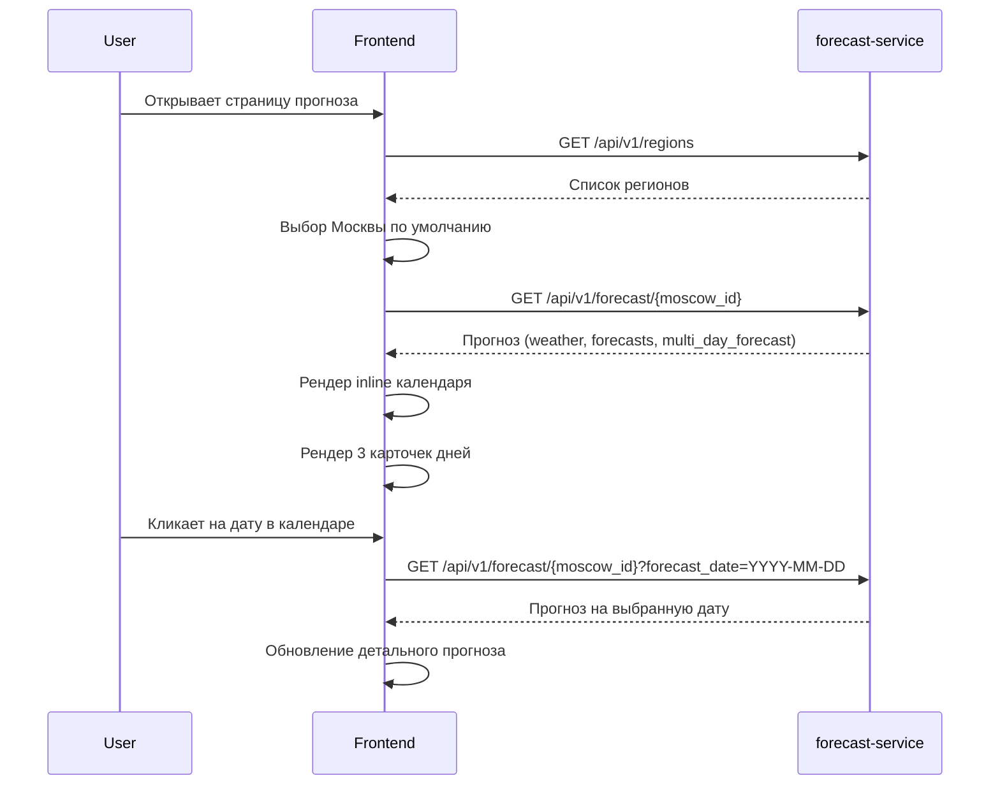

# User Story: Улучшения UI прогноза - Календарь inline и Прогноз на 3 дня

**ID**: US-FORECAST-UI-IMPROVEMENTS-005
**Version**: 1.0
**Author**: Business/System Analyst
**Date**: 2026-02-19
**Статус**: ✅ Согласовано (v1.0)
**Дата согласования**: 2026-02-19

---

## История изменений

| Версия | Дата | Изменения |
|--------|------|-----------|
| 1.0 | 2026-02-19 | Первоначальная версия. Inline календарь + прогноз на 3 дня |

---

## 1. Обзор

### 1.1. Описание

Данный документ описывает улучшения в разделе "Прогноз клева":

1. **IMPROVEMENT-1**: Календарь встроен в страницу (inline) вместо dropdown
2. **IMPROVEMENT-2**: Блок "Прогноз на ближайшие дни" всегда показывает 3 дня

### 1.2. Бизнес-ценность

**Для пользователей**:
- Упрощение выбора даты (календарь всегда виден)
- Предсказуемость прогноза (всегда 3 дня)

**Для бизнеса**:
- Улучшение UX и снижение фрустрации
- Повышение информативности прогноза

---

## 2. User Stories

### US-1: Inline календарь (IMPROVEMENT-1)

**As a** пользователь,
**I want to** видеть календарь всегда открытым на странице,
**So that** я могу быстро выбрать дату без дополнительных кликов.

#### Priority
- [x] High (MVP)

#### Actors
- [x] Зарегистрированный пользователь
- [x] Незарегистрированный посетитель

#### Problem Description

При клике на "Выбрать дату" календарь открывается как dropdown через Portal, что вызывает проблемы с позиционированием и UX.

**Текущее поведение**: Dropdown календарь через Portal
**Ожидаемое поведение**: Inline календарь, всегда виден в блоке

#### Best Practices для react-day-picker

Согласно лучшим практикам react-day-picker v9:

1. **Inline режим** - самый простой и надежный вариант
2. **Ограничение дат** - через `disabled` prop
3. **Локализация** - через `locale` prop
4. **Стилизация** - через CSS переменные или className

Пример inline календаря:
```tsx
<DayPicker
  mode="single"
  selected={selectedDate}
  onSelect={handleDateSelect}
  disabled={[{ before: minDate }, { after: maxDate }]}
  locale={ru}
  className="border-0"
/>
```

#### Acceptance Criteria

**AC1: Календарь всегда виден**
- **Given** я открываю блок прогноза
- **When** страница загружена
- **Then** вижу календарь в блоке "Выберите дату"
- **And** календарь встроен в страницу (не dropdown)

**AC2: Выбор даты**
- **Given** вижу календарь
- **When** кликаю на дату
- **Then** дата выбирается
- **And** загружается прогноз на выбранную дату

**AC3: Ограничение дат**
- **Given** вижу календарь
- **When** смотрю на доступные даты
- **Then** доступны даты: минус 30 дней от сегодня, плюс 3 дня вперед
- **And** недоступные даты неактивны (серые)

**AC4: Подсветка текущей даты**
- **Given** открываю прогноз
- **When** смотрю на календарь
- **Then** текущий день выделен визуально

**AC5: Адаптивность**
- **Given** открываю на мобильном устройстве
- **When** вижу календарь
- **Then** все элементы видны и кликабельны

#### Технические детали

**Frontend** (`frontend/components/FishingForecast.tsx`):

Удалить:
```tsx
// Удалить Portal логику
const [showCalendar, setShowCalendar] = useState(false);
const [calendarPosition, setCalendarPosition] = useState({ top: 0, left: 0 });
const calendarButtonRef = useRef<HTMLButtonElement>(null);
```

Изменить JSX:
```tsx
{/* Вместо кнопки и dropdown - сразу календарь */}
<div className="mt-3">
  <h5 className="text-sm font-medium text-gray-600 mb-2">Выберите дату</h5>
  <div className="bg-gray-50 rounded-xl p-3">
    <style jsx global>{`
      .rdp {
        --rdp-cell-size: 36px;
        --rdp-accent-color: #2563eb;
        --rdp-background-color: #eff6ff;
        margin: 0;
      }
      .rdp-table {
        width: 100%;
        border-collapse: collapse;
      }
      .rdp-day {
        display: flex;
        align-items: center;
        justify-content: center;
        width: 32px;
        height: 32px;
        font-size: 14px;
        font-weight: 500;
        color: #374151;
        border-radius: 50%;
        cursor: pointer;
        margin: 2px;
      }
      .rdp-day:hover:not(.rdp-day_selected):not(:disabled) {
        background-color: #eff6ff;
      }
      .rdp-day_selected {
        background-color: #2563eb;
        color: white;
      }
      .rdp-day_today:not(.rdp-day_selected) {
        border: 2px solid #2563eb;
      }
      .rdp-day_disabled {
        color: #9ca3af;
        cursor: not-allowed;
      }
    `}</style>
    <DayPicker
      mode="single"
      selected={selectedDate ? new Date(selectedDate) : undefined}
      onSelect={handleCalendarSelect}
      disabled={[{ before: minDate }, { after: maxDate }]}
      locale={ru}
      className="border-0"
    />
  </div>
</div>
```

Обновить обработчик:
```tsx
const handleCalendarSelect = (date: Date | undefined) => {
  if (date && selectedRegion) {
    const dateStr = format(date, "yyyy-MM-dd");
    loadForecast(selectedRegion.id, dateStr);
  }
  // Убрать setShowCalendar(false) - больше не нужен
};
```

---

### US-2: Прогноз на ближайшие дни - всегда 3 дня (IMPROVEMENT-2)

**As a** пользователь,
**I want to** видеть прогноз на 3 дня (сегодня, завтра, послезавтра),
**So that** я могу планировать рыбалку на ближайшие дни.

#### Priority
- [x] High (MVP)

#### Actors
- [x] Зарегистрированный пользователь
- [x] Незарегистрированный посетитель

#### Problem Description

Блок "Прогноз на ближайшие дни" может показывать меньше 3 дней или не показывать вообще.

**Текущее поведение**: Зависит от данных из API (`forecast.multi_day_forecast`)
**Ожидаемое поведение**: Всегда 3 карточки (сегодня, завтра, послезавтра)

#### Acceptance Criteria

**AC1: Всегда 3 дня**
- **Given** я смотрю блок "Прогноз на ближайшие дни"
- **When** данные загружены
- **Then** вижу ровно 3 карточки
- **And** первая карточка - "Сегодня"
- **And** вторая карточка - "Завтра"
- **And** третья карточка - название дня недели

**AC2: Регион по умолчанию**
- **Given** пользователь первый раз открывает прогноз
- **When** данные загружаются
- **Then** выбран регион Москва
- **And** показывается прогноз для Москвы

**AC3: Нет данных**
- **Given** для выбранного региона нет данных на конкретный день
- **When** отображается блок прогноза
- **Then** карточка дня показывает "Нет данных"
- **And** карточка все равно отображается

**AC4: Тестовые регионы**
- **Given** выбран тестовый регион (Москва или Ленинградская область)
- **When** загружается прогноз
- **Then** API возвращает данные на 3 дня
- **And** данные корректно отображаются

**AC5: Переключение между днями**
- **Given** вижу 3 карточки
- **When** кликаю на карточку дня
- **Then** загружается детальный прогноз на этот день

#### Технические детали

**Frontend** (`frontend/components/FishingForecast.tsx`):

Изменить логику отображения 3 дней:

```tsx
// Генерация 3 дней (сегодня, завтра, послезавтра)
const getThreeDaysForecast = () => {
  const today = new Date();
  const days = [];
  
  for (let i = 0; i < 3; i++) {
    const date = addDays(today, i);
    const dateStr = format(date, "yyyy-MM-dd");
    const dayData = forecast?.multi_day_forecast?.find(d => d.date === dateStr);
    
    days.push({
      date: dateStr,
      dayName: i === 0 ? "Сегодня" : i === 1 ? "Завтра" : format(date, "EEEE", { locale: ru }),
      formattedDate: formatDate(dateStr),
      bestFish: dayData?.best_fish || null,
    });
  }
  
  return days;
};

// В JSX:
<div className="grid grid-cols-3 gap-2">
  {getThreeDaysForecast().map((day) => {
    const isSelected = selectedDate === day.date;
    return (
      <button
        key={day.date}
        onClick={() => handleDayClick(day.date)}
        className={`
          bg-gray-50 rounded-xl p-2 text-center transition-all
          hover:bg-blue-50 hover:ring-2 hover:ring-blue-300 cursor-pointer
          ${isSelected ? 'ring-2 ring-blue-500 bg-blue-50' : ''}
        `}
      >
        <div className="text-xs font-medium text-gray-700">
          {day.dayName}
        </div>
        <div className="text-[10px] text-gray-500 mb-1">
          {day.formattedDate}
        </div>
        {day.bestFish && day.bestFish.length > 0 ? (
          <div className="space-y-1">
            {day.bestFish.slice(0, 1).map((fish, i) => (
              <div key={i}>
                <div className="flex items-center justify-between text-[10px] mb-0.5">
                  <span className="text-gray-600 truncate">{fish.name}</span>
                  <span className={`font-medium ${getBiteScoreTextColor(fish.score)}`}>{fish.score}%</span>
                </div>
                <div className="h-1 bg-gray-200 rounded-full overflow-hidden">
                  <div
                    className={`h-full ${getBiteScoreColor(fish.score)} transition-all duration-500`}
                    style={{ width: `${fish.score}%` }}
                  />
                </div>
              </div>
            ))}
          </div>
        ) : (
          <div className="text-[10px] text-gray-400">Нет данных</div>
        )}
      </button>
    );
  })}
</div>
```

**Выбор региона по умолчанию** (уже реализовано):
```tsx
// В loadRegions:
if (!defaultRegionId && !latitude && response.regions.length > 0) {
  const moscow = response.regions.find((r) => r.code === "MOW");
  setSelectedRegion(moscow || response.regions[0]);
}
```

---

## 3. API Specification

### Endpoint: GET /api/v1/forecast/{region_id}

**Существующий endpoint** - изменений не требуется.

**Query Parameters**:
- `forecast_date` (string, optional) - дата прогноза в формате YYYY-MM-DD

**Response**:
```json
{
  "region": {
    "id": "uuid",
    "name": "Москва",
    "code": "MOW"
  },
  "forecast_date": "2026-02-19",
  "weather": { ... },
  "forecasts": [ ... ],
  "multi_day_forecast": [
    {
      "date": "2026-02-19",
      "best_fish": [{ "name": "Щука", "score": 78 }]
    },
    {
      "date": "2026-02-20",
      "best_fish": [{ "name": "Окунь", "score": 82 }]
    },
    {
      "date": "2026-02-21",
      "best_fish": [{ "name": "Судак", "score": 65 }]
    }
  ]
}
```

---

## 4. Non-Functional Requirements

### 4.1. Performance
- **Calendar Rendering**: < 50ms
- **3-Day Forecast Display**: Мгновенно (без доп. запросов)

### 4.2. UX
- **Visual Feedback**: Hover эффекты на днях
- **Selection**: Выбранный день визуально выделен
- **Mobile**: Карточки дней адаптивны

### 4.3. Compatibility
- **Browsers**: Chrome, Firefox, Safari, Edge (последние 2 версии)
- **Mobile**: iOS Safari, Chrome Android

---

## 5. Risks

| Risk | Probability | Impact | Mitigation |
|------|-------------|--------|------------|
| API не возвращает данные на 3 дня | Low | Medium | Показывать "Нет данных" в карточках |
| Inline календарь занимает много места | Low | Low | Оптимизировать размер ячеек |
| Нет данных для региона | Medium | Low | Показывать сообщение "Нет данных" |

---

## 6. Dependencies

- Зависит от: `frontend/components/FishingForecast.tsx` - основной компонент
- Зависит от: `frontend/types/forecast.ts` - типы
- Зависит от: API `/api/v1/forecast/{region_id}` - прогноз
- Блокирует: Нет

---

## 7. Definition of Done

### US-1: Inline календарь
- [ ] Календарь всегда виден в блоке
- [ ] Нет dropdown/Portal логики
- [ ] Даты ограничены (-30 дней, +3 дня)
- [ ] Выбор даты работает
- [ ] Текущий день выделен
- [ ] Работает на мобильных

### US-2: Прогноз на 3 дня
- [ ] Всегда 3 карточки
- [ ] "Сегодня", "Завтра", день недели
- [ ] Москва по умолчанию
- [ ] "Нет данных" если API не вернул
- [ ] Клик переключает прогноз

### Общие
- [ ] Ручное тестирование пройдено
- [ ] Проверено на разных браузерах
- [ ] Проверено на мобильных устройствах

---

## 8. Definition of Ready

- [x] Требования собраны
- [x] User Stories соответствуют INVEST
- [x] Acceptance Criteria определены
- [x] **Согласовано с заказчиком** (2026-02-19)
- [ ] **Передано разработчику**

---

## 9. Решения по согласованию

| Вопрос | Решение заказчика | Дата |
|--------|-------------------|------|
| Способ отображения календаря | **Inline (встроенный)** - всегда виден | 2026-02-19 |
| Источник тестовых данных | **Существующий API forecast-service** | 2026-02-19 |
| Регион по умолчанию | **Москва** | 2026-02-19 |
| Поведение при отсутствии данных | **Сообщение "Нет данных"** | 2026-02-19 |

---

## 10. Описание изменений

### 10.1. Календарь (IMPROVEMENT-1)

**Файлы для изменения**:
- `frontend/components/FishingForecast.tsx` - компонент календаря

**Изменения**:
1. Удалить `showCalendar` state
2. Удалить `calendarPosition` state
3. Удалить `calendarButtonRef` ref
4. Удалить Portal логику (`createPortal`)
5. Разместить DayPicker inline в блоке
6. Обновить стили для inline отображения
7. Добавить подсветку текущего дня (`rdp-day_today`)

### 10.2. Прогноз на 3 дня (IMPROVEMENT-2)

**Файлы для изменения**:
- `frontend/components/FishingForecast.tsx` - блок прогноза

**Изменения**:
1. Создать функцию `getThreeDaysForecast()`
2. Всегда генерировать 3 карточки
3. Добавить fallback "Нет данных"
4. Проверить выбор Москвы по умолчанию

---

## 11. Sequence Diagram



---

**Документ создан**: 2026-02-19
**Обновлен**: 2026-02-19
**Согласовано**: 2026-02-19
**Статус**: ✅ Готов к передаче разработчику
**Следующий шаг**: Передача разработчику для реализации
