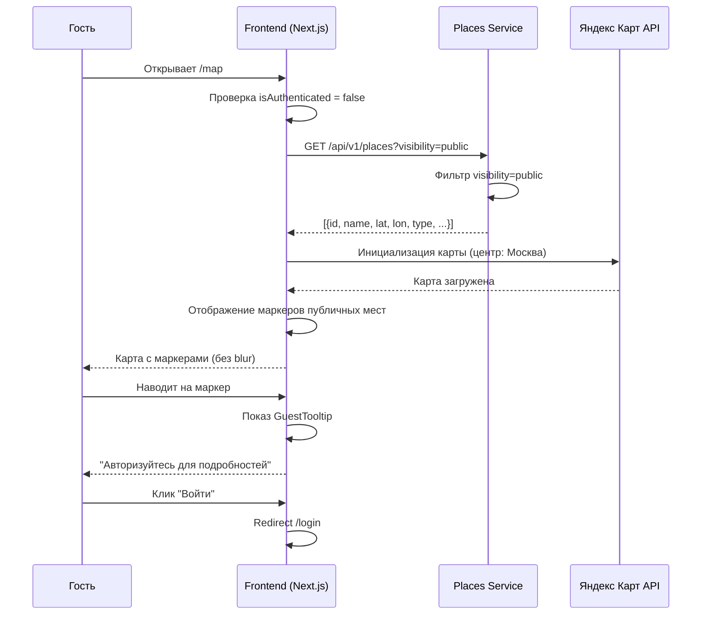
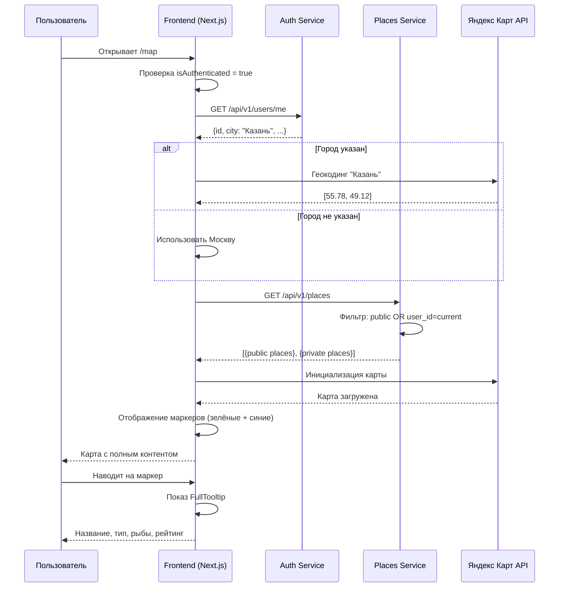

# Требования: Карта мест рыбалки для всех пользователей

**ID**: US-MAP-PUBLIC-001
**Версия**: 1.0 (Черновик)
**Дата**: 2026-03-04
**Автор**: Business Analyst
**Статус**: ✅ Согласовано

---

## 1. Обзор

### 1.1 Проблема

**Описание**: Яндекс Карта не отображается на вкладке "Карта мест рыбалки" для неавторизованных пользователей. Карта заблокирована blur-эффектом с требованием регистрации, что противоречит бизнес-требованиям публичного доступа.

**Корневая причина**: Текущая реализация в `frontend/app/map/page.tsx:34` устанавливает `blurred={!isAuthenticated}`, полностью скрывая карту для гостей.

**Влияние**:
- Неавторизованные пользователи не могут просматривать карту
- Потеря потенциальных регистраций (пользователи не видят ценность)
- Публичные места рыбалки недоступны для просмотра

### 1.2 Цель

Обеспечить доступ к карте мест рыбалки для всех пользователей (авторизованных и нет) с различными уровнями доступа к контенту.

### 1.3 Бизнес-ценность

- **Привлечение пользователей**: Гости видят публичные места и понимают ценность платформы
- **Конверсия**: Информационный барьер мотивирует регистрацию для получения полного контента
- **SEO**: Публичный контент индексируется поисковиками
- **UX**: Пользователи могут исследовать карту без обязательной регистрации

### 1.4 Область действия (Scope)

**Включает:**
- Отображение карты для всех пользователей
- Отображение публичных маркеров мест для всех
- Различные tooltip для авторизованных/неавторизованных
- Центрирование карты на Москву по умолчанию
- Опциональная геолокация по кнопке
- Отображение личных мест для авторизованных

**Исключает:**
- Добавление/редактирование мест без авторизации
- Детальные карточки мест для неавторизованных
- Фильтрация по fish_types (следующая итерация)

---

## 2. User Story

## User Story: Карта мест рыбалки для всех пользователей

**As a** посетитель платформы FishMap (авторизованный или нет),
**I want to** видеть интерактивную карту с местами рыбалки,
**So that** я могу оценить ценность платформы и найти интересные места.

### Priority
- [x] High (критично для конверсии и UX)

### Actors
- [x] Незарегистрированный посетитель (гость)
- [x] Зарегистрированный пользователь
- [ ] Moderator
- [ ] Admin

### Acceptance Criteria

**AC1: Неавторизованный пользователь видит карту с публичными местами**
- **Given** пользователь не авторизован
- **When** пользователь переходит на страницу "/map"
- **Then** отображается Яндекс Карта (без blur-эффекта)
- **And** карта центрирована на Москву (55.7558, 37.6173, zoom: 8)
- **And** на карте отображаются маркеры публичных мест (visibility="public")
- **And** карта интерактивна (можно двигать, zoom)
- **And** личные места других пользователей НЕ отображаются

**AC2: Tooltip для неавторизованного пользователя при наведении на маркер**
- **Given** пользователь не авторизован
- **And** на карте есть публичные места
- **When** пользователь наводит курсор на маркер публичного места
- **Then** отображается tooltip с названием места и типом
- **And** отображается сообщение: "Авторизуйтесь для просмотра подробной информации"
- **And** отображается кнопка "Войти" или "Регистрация"

**AC3: Авторизованный пользователь видит свои и публичные места**
- **Given** пользователь авторизован
- **When** пользователь переходит на страницу "/map"
- **Then** отображается Яндекс Карта
- **And** на карте отображаются:
  - Маркеры публичных мест (visibility="public") - зелёный цвет
  - Маркеры личных мест пользователя (visibility="private" AND user_id=current_user) - синий цвет
- **And** НЕ отображаются личные места других пользователей

**AC4: Tooltip для авторизованного пользователя при наведении на маркер**
- **Given** пользователь авторизован
- **When** пользователь наводит курсор на маркер места
- **Then** отображается полная информация:
  - Название места
  - Тип (дикое/кэмпинг/база отдыха)
  - Список рыб (до 3 с иконками)
  - Рейтинг (для публичных)
  - Кнопка "Подробнее"
- **And** tooltip аналогичен карте "Мои места" в личном кабинете

**AC5: Центрирование карты по умолчанию на Москву**
- **Given** пользователь открывает карту впервые
- **And** геолокация не определена
- **When** карта загружается
- **Then** центр карты: Москва (55.7558, 37.6173)
- **And** zoom: 8 (видна Московская область)
- **And** пользователь может переместить карту в любой регион

**AC6: Опциональная геолокация по кнопке**
- **Given** пользователь на странице карты
- **When** пользователь нажимает кнопку "Найти меня"
- **Then** браузер запрашивает разрешение на геолокацию
- **If** разрешение дано:
  - Карта центрируется на текущее положение пользователя
  - Zoom: 10
- **If** разрешение отклонено:
  - Показывается уведомление "Геолокация недоступна"
  - Карта остаётся на Москве

**AC7: Авторизованный пользователь с указанным городом**
- **Given** пользователь авторизован
- **And** в профиле указан город (например, "Казань")
- **When** пользователь открывает карту
- **Then** карта центрируется на указанный город
- **And** используется геокодинг Яндекс для получения координат

**AC8: Загрузка публичных мест с Places Service**
- **Given** Places Service API доступен
- **When** загружается страница карты
- **Then** отправляется запрос GET /api/v1/places?visibility=public
- **And** для авторизованных: GET /api/v1/places (все публичные + свои личные)
- **And** маркеры отображаются на карте

### Non-Functional Requirements

**Performance (Производительность)**:
- Загрузка карты: < 2 секунды
- Загрузка маркеров: < 1 секунда
- Tooltip появляется: < 100ms при наведении

**Scalability (Масштабируемость)**:
- Поддержка до 10,000 публичных мест на карте
- Clustering для плотных областей (>50 маркеров в области)

**Security (Безопасность)**:
- Личные места доступны только владельцу
- API возвращает только публичные места для неавторизованных
- Rate limiting: 100 req/min для публичного API

**UX (Пользовательский опыт)**:
- Плавная анимация tooltip
- Адаптивность для мобильных устройств
- Поддержка touch-событий

### Dependencies
- Зависит от: Places Service API (GET /api/v1/places)
- Зависит от: Auth Service (проверка авторизации)
- Зависит от: Яндекс Карт API
- Блокирует: Конверсия незарегистрированных пользователей

### Definition of Done
- [ ] YandexMap.tsx обновлён для поддержки публичного доступа
- [ ] Удалён blur-эффект для неавторизованных
- [ ] Добавлены публичные маркеры
- [ ] Реализованы разные tooltip для гостей/авторизованных
- [ ] Добавлена кнопка геолокации
- [ ] Places Service API интегрирован
- [ ] Unit тесты написаны
- [ ] Integration тесты пройдены
- [ ] Ручное тестирование завершено
- [ ] Документация обновлена

---

## 3. Декомпозиция на задачи

### TASK-FRT-001: Удалить blur-эффект для неавторизованных пользователей

**Направление**: Frontend
**Приоритет**: High
**Оценка**: 0.5 часа
**Зависимости**: Нет

**Описание**:
Удалить логику blur-эффекта из страницы карты. Карта должна быть полностью видна для всех пользователей.

**Критерии приемки**:
- [ ] Удалён prop `blurred={!isAuthenticated}` из YandexMap
- [ ] Удалён overlay с текстом "Зарегистрируйтесь"
- [ ] Карта отображается для всех пользователей
- [ ] Файл: `frontend/app/map/page.tsx`

**Технические детали**:
```tsx
// ДО:
<YandexMap
  city={isAuthenticated ? user?.city : null}
  blurred={!isAuthenticated}  // УДАЛИТЬ
  onRegisterClick={handleRegisterClick}
/>

// ПОСЛЕ:
<YandexMap
  city={isAuthenticated ? user?.city : null}
  isAuthenticated={isAuthenticated}
  onRegisterClick={handleRegisterClick}
/>
```

---

### TASK-FRT-002: Добавить prop isAuthenticated в YandexMap

**Направление**: Frontend
**Приоритет**: High
**Оценка**: 0.5 часа
**Зависимости**: TASK-FRT-001

**Описание**:
Добавить новый prop `isAuthenticated` в компонент YandexMap для определения типа отображаемого tooltip.

**Критерии приемки**:
- [ ] Добавлен prop `isAuthenticated?: boolean` в YandexMapProps
- [ ] Prop передаётся из родительского компонента
- [ ] Значение используется для определения типа tooltip

**Технические детали**:
```typescript
// frontend/components/YandexMap.tsx
interface YandexMapProps {
  // ... существующие props
  isAuthenticated?: boolean;
}
```

---

### TASK-FRT-003: Реализовать загрузку публичных мест

**Направление**: Frontend
**Приоритет**: High
**Оценка**: 2 часа
**Зависимости**: TASK-FRT-001

**Описание**:
Добавить загрузку публичных мест с Places Service API и отображение их на карте.

**Критерии приемки**:
- [ ] Добавлен useEffect для загрузки мест при монтировании
- [ ] API запрос: GET /api/v1/places?visibility=public (для гостей)
- [ ] API запрос: GET /api/v1/places (для авторизованных - публичные + свои)
- [ ] Места отображаются на карте как маркеры
- [ ] Разные цвета для публичных (зелёный) и личных (синий)
- [ ] Обработка ошибок загрузки

**Технические детали**:
```typescript
// frontend/app/map/page.tsx
const [places, setPlaces] = useState<Place[]>([]);
const [loading, setLoading] = useState(true);

useEffect(() => {
  const fetchPlaces = async () => {
    try {
      const endpoint = isAuthenticated 
        ? '/api/v1/places' 
        : '/api/v1/places?visibility=public';
      const response = await apiClient.get(endpoint);
      setPlaces(response.data);
    } catch (error) {
      console.error('Failed to load places:', error);
    } finally {
      setLoading(false);
    }
  };
  fetchPlaces();
}, [isAuthenticated]);
```

---

### TASK-FRT-004: Реализовать разные tooltip для гостей и авторизованных

**Направление**: Frontend
**Приоритет**: High
**Оценка**: 2 часа
**Зависимости**: TASK-FRT-002, TASK-FRT-003

**Описание**:
Реализовать два типа tooltip: сокращённый для гостей с призывом к регистрации, полный для авторизованных.

**Критерии приемки**:
- [ ] Tooltip для гостей содержит: название, тип, "Авторизуйтесь для подробностей"
- [ ] Tooltip для гостей содержит кнопки "Войти" и "Регистрация"
- [ ] Tooltip для авторизованных: полная информация (аналогично "Мои места")
- [ ] Tooltip появляется при наведении на маркер
- [ ] Анимация появления плавная

**Технические детали**:
```tsx
// GuestTooltip component
const GuestTooltip: React.FC<{ place: Place; onLogin: () => void }> = ({ place, onLogin }) => (
  <div className="p-3 bg-white rounded-lg shadow-lg min-w-[200px]">
    <h4 className="font-bold text-gray-800">{place.name}</h4>
    <p className="text-sm text-gray-500">{getPlaceTypeLabel(place.place_type)}</p>
    <div className="mt-3 pt-3 border-t border-gray-200">
      <p className="text-sm text-primary-sea">
        🔐 Авторизуйтесь для просмотра подробной информации
      </p>
    </div>
    <button 
      onClick={onLogin}
      className="mt-2 w-full py-2 bg-primary-sea text-white rounded-lg text-sm hover:bg-primary-sea/90"
    >
      Войти / Регистрация
    </button>
  </div>
);

// FullTooltip component (для авторизованных)
// Использовать существующий PlaceTooltip из YandexMap.tsx
```

---

### TASK-FRT-005: Добавить кнопку геолокации "Найти меня"

**Направление**: Frontend
**Приоритет**: Medium
**Оценка**: 1.5 часа
**Зависимости**: TASK-FRT-001

**Описание**:
Добавить кнопку геолокации на карту. При нажатии запрашивается разрешение браузера и карта центрируется на текущее положение.

**Критерии приемки**:
- [ ] Кнопка "Найти меня" отображается на карте
- [ ] Позиция: правый верхний угол карты
- [ ] Иконка: иконка геолокации (Navigation / Crosshair)
- [ ] При нажатии: запрос navigator.geolocation.getCurrentPosition()
- [ ] При успехе: карта центрируется на координаты пользователя, zoom: 10
- [ ] При отказе: toast "Геолокация недоступна"
- [ ] При ошибке: toast с сообщением об ошибке

**Технические детали**:
```tsx
// Добавить в YandexMap.tsx
const handleGeolocate = () => {
  if (!navigator.geolocation) {
    toast.error('Геолокация не поддерживается браузером');
    return;
  }
  
  navigator.geolocation.getCurrentPosition(
    (position) => {
      setMapCenter([position.coords.latitude, position.coords.longitude]);
      // zoom устанавливается в 10
    },
    (error) => {
      toast.error('Не удалось определить местоположение');
    }
  );
};

// UI кнопки
<button
  onClick={handleGeolocate}
  className="absolute top-4 right-4 z-30 bg-white p-3 rounded-lg shadow-lg hover:bg-gray-50"
>
  <Navigation className="w-5 h-5 text-primary-sea" />
</button>
```

---

### TASK-FRT-006: Установить центр карты на Москву по умолчанию

**Направление**: Frontend
**Приоритет**: High
**Оценка**: 0.25 часа
**Зависимости**: Нет

**Описание**:
Убедиться, что карта по умолчанию центрирована на Москву с zoom 8.

**Критерии приемки**:
- [ ] Начальный центр: [55.7558, 37.6173] (Москва)
- [ ] Начальный zoom: 8 (видна Московская область)
- [ ] Карта не ждёт геолокацию при загрузке

**Технические детали**:
```typescript
// frontend/components/YandexMap.tsx
const [mapCenter, setMapCenter] = useState<[number, number]>([55.7558, 37.6173]);
const [zoom, setZoom] = useState(8);

const mapState = {
  center: mapCenter,
  zoom: zoom,
};
```

---

### TASK-BCK-001: Реализовать GET /api/v1/places endpoint с фильтрацией

**Направление**: Backend
**Приоритет**: High
**Оценка**: 2 часа
**Зависимости**: Нет

**Описание**:
Реализовать или обновить endpoint для получения мест с поддержкой фильтрации по visibility.

**Критерии приемки**:
- [ ] Endpoint: GET /api/v1/places
- [ ] Query param: `visibility` (public/private/all)
- [ ] Для неавторизованных: возвращает только public места
- [ ] Для авторизованных без фильтра: public + свои private
- [ ] Для авторизованных с ?visibility=public: только public
- [ ] Response содержит все поля для tooltip

**Технические детали**:
```python
# services/places-service/app/endpoints/places.py

@router.get("/places")
async def get_places(
    visibility: Optional[str] = Query(None, regex="^(public|private|all)$"),
    current_user: Optional[User] = Depends(get_current_user_optional),
    db: AsyncSession = Depends(get_db)
):
    query = select(Place)
    
    if not current_user:
        # Неавторизованные - только публичные
        query = query.where(Place.visibility == "public")
    else:
        if visibility == "public":
            query = query.where(Place.visibility == "public")
        elif visibility == "private":
            query = query.where(
                and_(Place.visibility == "private", Place.user_id == current_user.id)
            )
        else:
            # Все публичные + свои личные
            query = query.where(
                or_(
                    Place.visibility == "public",
                    Place.user_id == current_user.id
                )
            )
    
    result = await db.execute(query)
    places = result.scalars().all()
    return {"places": places}
```

---

### TASK-BCK-002: Добавить optional authentication dependency

**Направление**: Backend
**Приоритет**: Medium
**Оценка**: 0.5 часа
**Зависимости**: Нет

**Описание**:
Создать dependency для optional аутентификации (не выбрасывает 401, возвращает None если не авторизован).

**Критерии приемки**:
- [ ] Функция get_current_user_optional создана
- [ ] Возвращает Optional[User]
- [ ] Не выбрасывает HTTPException при отсутствии токена

**Технические детали**:
```python
# services/auth-service/app/dependencies.py

async def get_current_user_optional(
    credentials: Optional[HTTPAuthorizationCredentials] = Depends(HTTPBearer(auto_error=False)),
    db: AsyncSession = Depends(get_db)
) -> Optional[User]:
    if not credentials:
        return None
    
    try:
        payload = decode_jwt_token(credentials.credentials)
        user_id = payload.get("sub")
        if not user_id:
            return None
        
        result = await db.execute(select(User).where(User.id == user_id))
        return result.scalar_one_or_none()
    except Exception:
        return None
```

---

### TASK-FRT-007: Реализовать clustering для маркеров

**Направление**: Frontend
**Приоритет**: Medium
**Оценка**: 1 час
**Зависимости**: TASK-FRT-003

**Описание**:
Добавить clustering для маркеров при большом количестве точек в одной области.

**Критерии приемки**:
- [ ] Clusterer уже используется в YandexMap.tsx (проверить)
- [ ] Настройки clusterer оптимизированы
- [ ] При zoom в cluster раскрываются отдельные маркеры
- [ ] Кластер показывает количество мест внутри

**Технические детали**:
```tsx
<Clusterer
  options={{
    preset: "islands#invertedVioletClusterIcons",
    groupByCoordinates: false,
    clusterDisableClickZooming: false,
    clusterHideIconOnBalloonOpen: false,
    geoObjectHideIconOnBalloonOpen: false,
  }}
>
  {/* markers */}
</Clusterer>
```

---

### TASK-TST-001: Unit тесты для YandexMap component

**Направление**: Testing
**Приоритет**: Medium
**Оценка**: 2 часа
**Зависимости**: TASK-FRT-001, TASK-FRT-002, TASK-FRT-003, TASK-FRT-004

**Описание**:
Написать unit тесты для компонента YandexMap с проверкой различных сценариев.

**Критерии приемки**:
- [ ] Тест: карта отображается для неавторизованных
- [ ] Тест: карта отображается для авторизованных
- [ ] Тест: маркеры публичных мест отображаются
- [ ] Тест: tooltip для гостей содержит призыв к регистрации
- [ ] Тест: tooltip для авторизованных содержит полную информацию
- [ ] Тест: кнопка геолокации работает

---

### TASK-TST-002: Integration тесты для Places API

**Направление**: Testing
**Приоритет**: Medium
**Оценка**: 1.5 часа
**Зависимости**: TASK-BCK-001

**Описание**:
Написать integration тесты для endpoint GET /api/v1/places с различными сценариями авторизации.

**Критерии приемки**:
- [ ] Тест: неавторизованный получает только публичные места
- [ ] Тест: авторизованный получает публичные + свои личные
- [ ] Тест: фильтр ?visibility=public работает
- [ ] Тест: фильтр ?visibility=private возвращает только свои

---

### TASK-DOC-001: Обновить документацию API

**Направление**: Documentation
**Приоритет**: Low
**Оценка**: 0.5 часа
**Зависимости**: TASK-BCK-001

**Описание**:
Обновить API документацию с информацией о новом поведении GET /api/v1/places.

**Критерии приемки**:
- [ ] Добавлен параметр visibility в API docs
- [ ] Описано поведение для авторизованных/неавторизованных
- [ ] Добавлены примеры запросов/ответов

---

### Итоговая таблица задач

| ID | Направление | Приоритет | Оценка | Зависимости | Статус |
|----|-------------|-----------|--------|-------------|--------|
| TASK-FRT-001 | Frontend | High | 0.5h | - | [ ] |
| TASK-FRT-002 | Frontend | High | 0.5h | FRT-001 | [ ] |
| TASK-FRT-003 | Frontend | High | 2h | FRT-001 | [ ] |
| TASK-FRT-004 | Frontend | High | 2h | FRT-002, FRT-003 | [ ] |
| TASK-FRT-005 | Frontend | Medium | 1.5h | FRT-001 | [ ] |
| TASK-FRT-006 | Frontend | High | 0.25h | - | [ ] |
| TASK-FRT-007 | Frontend | Medium | 1h | FRT-003 | [ ] |
| TASK-BCK-001 | Backend | High | 2h | - | [ ] |
| TASK-BCK-002 | Backend | Medium | 0.5h | - | [ ] |
| TASK-TST-001 | Testing | Medium | 2h | FRT-001..004 | [ ] |
| TASK-TST-002 | Testing | Medium | 1.5h | BCK-001 | [ ] |
| TASK-DOC-001 | Documentation | Low | 0.5h | BCK-001 | [ ] |

**Общая оценка**: 15.25 часа (~2 рабочих дня)
**Критический путь**: FRT-001 → FRT-003 → FRT-004
**Рекомендуемая последовательность**: 
1. BCK-001, BCK-002 (Backend)
2. FRT-006, FRT-001 (Frontend база)
3. FRT-002, FRT-003 (Frontend данные)
4. FRT-004 (Frontend tooltips)
5. FRT-005, FRT-007 (Frontend дополнения)
6. TST-001, TST-002 (Testing)
7. DOC-001 (Documentation)

---

## 4. Sequence Diagram

### Диаграмма: Загрузка карты для неавторизованного пользователя



### Диаграмма: Загрузка карты для авторизованного пользователя



---

## 5. Use Case

### Use Case: Просмотр карты неавторизованным пользователем

**ID**: UC-MAP-PUBLIC-001
**Версия**: 1.0
**Автор**: Business Analyst
**Дата**: 2026-03-04

### Overview
Неавторизованный пользователь просматривает карту с публичными местами рыбалки. При наведении на маркер видит приглашение к авторизации.

### Primary Actor
Незарегистрированный посетитель (гость)

### Preconditions
- [ ] Пользователь не авторизован
- [ ] Places Service доступен
- [ ] Яндекс Карт API доступен

### Main Flow (Happy Path)

| Step | Actor | System | Description |
|------|-------|--------|-------------|
| 1 | Guest | | Переходит на страницу "/map" |
| 2 | | Frontend | Проверяет статус аутентификации (isAuthenticated = false) |
| 3 | | Frontend | Запрашивает GET /api/v1/places?visibility=public |
| 4 | | Backend | Возвращает список публичных мест |
| 5 | | Frontend | Инициализирует Яндекс Карту (центр: Москва, zoom: 8) |
| 6 | | Frontend | Отображает маркеры публичных мест (зелёный цвет) |
| 7 | | Frontend | Карта интерактивна, без blur-эффекта |
| 8 | Guest | | Перемещает карту, изменяет zoom |
| 9 | Guest | | Наводит курсор на маркер публичного места |
| 10 | | Frontend | Отображает GuestTooltip |
| 11 | | Frontend | Tooltip содержит: название, тип, "Авторизуйтесь..." |
| 12 | Guest | | Нажимает кнопку "Войти" в tooltip |
| 13 | | Frontend | Перенаправляет на страницу /login |

### Alternative Flows

**Alt Flow 1: Places Service недоступен**
- Предусловие: API возвращает ошибку 500/timeout
- Действия:
  - System: Показывает пустую карту
  - System: Toast "Не удалось загрузить места. Попробуйте позже."
  - System: Карта остаётся интерактивной

**Alt Flow 2: Яндекс Карт API недоступен**
- Предусловие: API ключ невалиден или сервис недоступен
- Действия:
  - System: Показывает сообщение "Карта временно недоступна"
  - System: Предлагает повторить попытку

**Alt Flow 3: Пользователь нажимает "Найти меня"**
- Предусловие: Пользователь нажал кнопку геолокации
- Действия:
  - System: Запрашивает разрешение браузера
  - If разрешено: Карта центрируется на позицию пользователя
  - If отклонено: Toast "Геолокация недоступна"

### Postconditions
- [ ] Карта отображается корректно
- [ ] Публичные места отображены
- [ ] Пользователь может взаимодействовать с картой

### Business Rules
- Правило 1: Неавторизованные видят ТОЛЬКО публичные места
- Правило 2: Личные места других пользователей скрыты
- Правило 3: Центр карты по умолчанию - Москва
- Правило 4: Tooltip для гостей не содержит детальной информации

---

## 6. API Specification

### API Specification: GET /api/v1/places

**Service**: Places Service
**Версия**: v1
**Base URL**: http://localhost:8002/api/v1

### Authentication
- Required: No (optional)
- Method: JWT token (optional)
- Header: Authorization: Bearer <token> (optional)

### Endpoints

#### 1. GET /places

**Description**: Получение списка мест для отображения на карте. Для неавторизованных возвращает только публичные места.

**Request**:
```http
GET /api/v1/places?visibility=public HTTP/1.1
Host: localhost:8002
Authorization: Bearer <token> (optional)
```

**Query Parameters**:
- `visibility` (string, optional) - Фильтр по видимости: "public", "private", "all"
  - Если не указан и пользователь авторизован: public + свои private
  - Если не указан и пользователь не авторизован: только public
  - "public": только публичные места
  - "private": только свои личные места (требует авторизации)

**Response 200 (Success)**:
```json
{
  "places": [
    {
      "id": "uuid",
      "name": "Рыбалка на Истре",
      "latitude": 55.9123,
      "longitude": 37.0456,
      "place_type": "wild",
      "visibility": "public",
      "user_id": "uuid",
      "images": ["https://..."],
      "fish_types": [
        {"id": "uuid", "name": "Щука", "icon": "🐟"}
      ],
      "rating_avg": 4.5,
      "created_at": "2024-01-01T00:00:00Z"
    }
  ]
}
```

**Response 401 (Unauthorized)** - только для visibility=private без токена:
```json
{
  "error": {
    "code": "UNAUTHORIZED",
    "message": "Authentication required for private places"
  }
}
```

**Response 500 (Internal Server Error)**:
```json
{
  "error": {
    "code": "INTERNAL_ERROR",
    "message": "Internal server error"
  }
}
```

### Error Codes
- `UNAUTHORIZED` - Требуется аутентификация (для private мест)
- `INTERNAL_ERROR` - Внутренняя ошибка сервера

---

## 7. Риски и митигация

### Матрица рисков

| Risk | Probability | Impact | Mitigation Strategy |
|------|-------------|--------|---------------------|
| Places Service недоступен | Medium | Medium | Fallback на пустую карту, retry механизм |
| Много публичных мест (>10k) | Low | Medium | Clustering, пагинация, lazy loading |
| Злоупотребление публичным API | Medium | Low | Rate limiting (100 req/min), monitoring |
| Яндекс Карт API лимиты | Low | High | Кэширование, мониторинг использования |
| Tooltip не работает на мобильных | Medium | Medium | Touch-friendly дизайн, click вместо hover |

### Детальный анализ рисков

#### Risk: Много публичных мест (>10k)

**Category**: Performance
**Probability**: Low
**Impact**: Medium

**Description**:
При большом количестве публичных мест карта может работать медленно.

**Potential Impact**:
1. Долгая загрузка маркеров
2. Тормоза при взаимодействии с картой
3. Плохой UX на мобильных устройствах

**Mitigation Strategies**:
1. **Prevent**: Clustering маркеров (уже реализовано через Clusterer)
2. **Mitigate**: Загрузка только видимой области карты (bounds-based loading)
3. **Mitigate**: Пагинация при >1000 маркеров

**Owner**: Frontend Developer
**Review Date**: 2026-03-11

---

## 8. Non-Functional Requirements

### Performance (Производительность)

**Latency**:
- Загрузка карты: < 2 секунды
- Загрузка маркеров: < 1 секунда
- Появление tooltip: < 100ms

**Throughput**:
- 100-500 req/s для Places API
- До 1000 одновременных пользователей на карте

### Security (Безопасность)

**Authorization**:
- Личные места доступны только владельцу
- API фильтрует данные на основе авторизации
- Rate limiting: 100 req/min для публичного API

**Data Protection**:
- Неавторизованные не видят personal data других пользователей
- Координаты личных мест скрыты от других

### Scalability (Масштабируемость)

**Horizontal Scaling**:
- Places Service масштабируется горизонтально
- Frontend CDN-ready

**Data Volume**:
- Поддержка до 100,000 публичных мест
- Поддержка до 1,000,000 пользователей

### UX (Пользовательский опыт)

**Accessibility**:
- Touch-friendly tooltips для мобильных
- Keyboard navigation support
- Screen reader compatible (ARIA labels)

**Responsiveness**:
- Адаптив для mobile (375px+)
- Адаптив для tablet (768px+)
- Адаптив для desktop (1024px+)

---

## 9. Definition of Ready (DoR)

**Перед началом разработки требования должны быть:**

- [x] **Clear**: Понятны всем членам команды
- [x] **Testable**: Можно протестировать
- [x] **Feasible**: Технически выполнимы
- [x] **Valuable**: Приносят ценность бизнесу (конверсия)
- [x] **Sized**: Размер позволяет реализовать за 2 дня
- [x] **Dependencies**: Все зависимости идентифицированы
- [x] **Acceptance Criteria**: Полностью определены (8 критериев)
- [x] **UI/UX**: Спецификация tooltip определена
- [x] **Approved**: Утверждены стейкхолдерами
- [x] **Prioritized**: Приоритет установлен (High)

---

## 10. Definition of Done (DoD)

**Считать выполненным, когда:**

- [ ] **Code**: Код написан и прошел code review
- [ ] **Frontend**: Blur-эффект удалён
- [ ] **Frontend**: Публичные маркеры отображаются
- [ ] **Frontend**: Tooltip для гостей реализован
- [ ] **Frontend**: Tooltip для авторизованных работает
- [ ] **Frontend**: Кнопка геолокации работает
- [ ] **Backend**: GET /api/v1/places с фильтрацией работает
- [ ] **Tests**: Unit тесты написаны
- [ ] **Tests**: Integration тесты пройдены
- [ ] **Manual Testing**: Ручное тестирование завершено
- [ ] **Documentation**: API документация обновлена
- [ ] **Acceptance**: Все критерии приемки выполнены

---

## 11. Версии документа

| Версия | Дата | Автор | Изменения |
|--------|------|-------|-----------|
| 1.0 | 2026-03-04 | Business Analyst | Создание черновика |

---

## 12. Согласование

| Роль | Имя | Дата | Подпись |
|------|-----|------|---------|
| Business Analyst | AI Assistant | 2026-03-04 | ✅ |
| Product Owner / Заказчик | Igor | 2026-03-04 | ✅ Согласовано |
| Tech Lead | - | - | ⏳ |
| Frontend Developer | - | - | ⏳ |
| Backend Developer | - | - | ⏳ |

---

**✅ Документ согласован и готов к передаче разработчику.**
