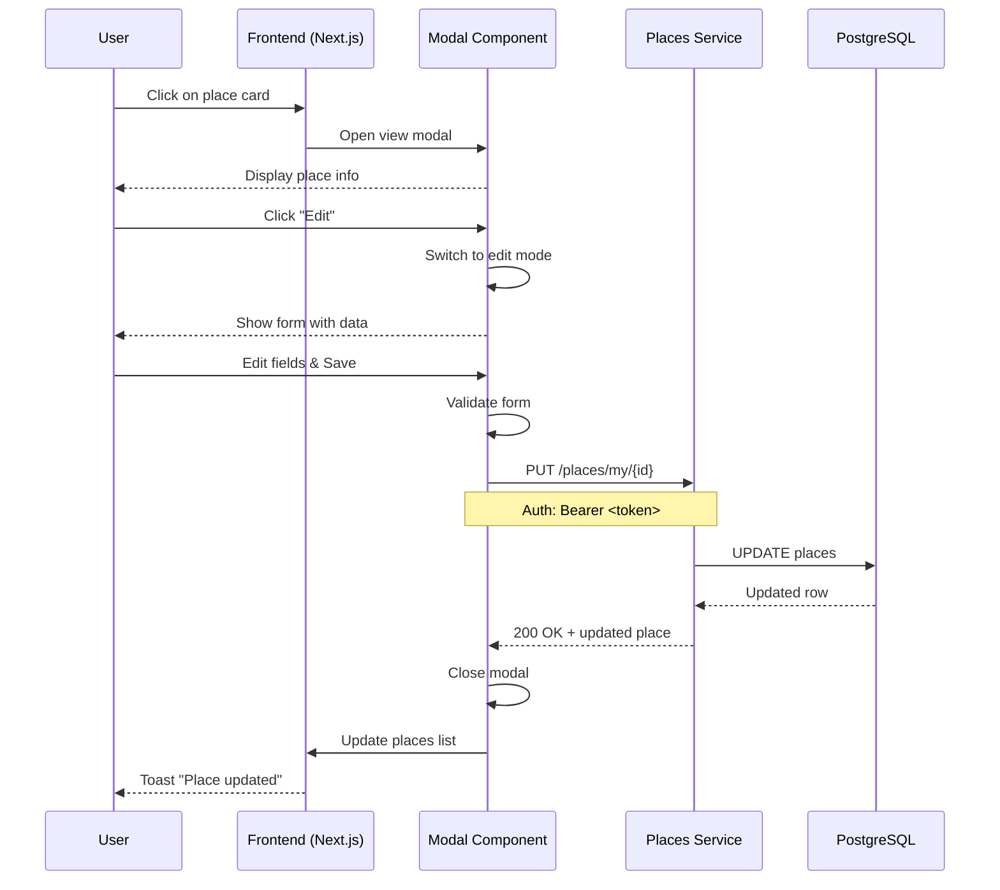
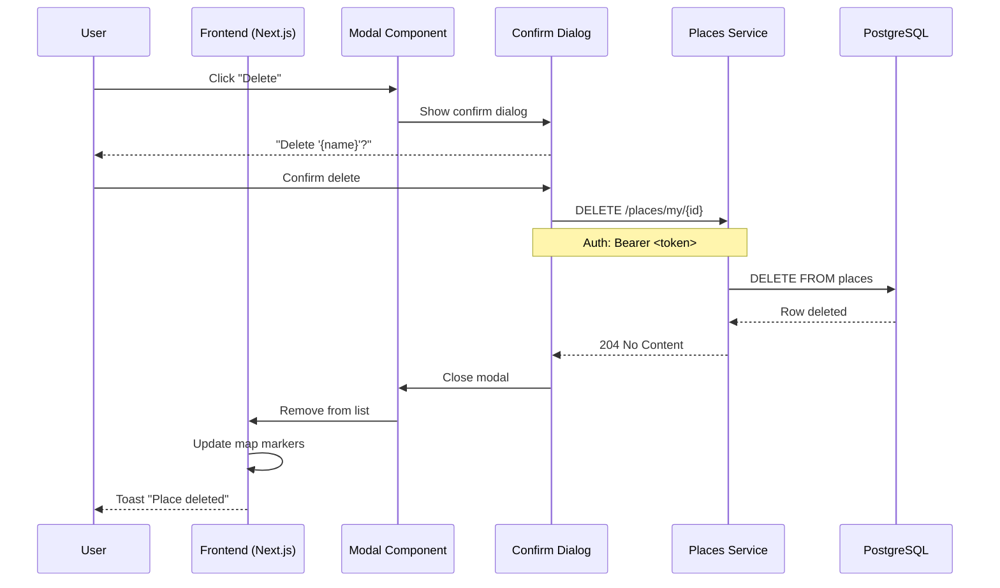

# User Story: Просмотр, редактирование и удаление места рыбалки

**ID**: US-PLACE-EDIT-001
**Version**: 1.0
**Author**: Business Analyst
**Date**: 2024-02-17
**Status**: Approved

---

## Overview

Расширение функциональности вкладки "Мои места" для полного управления местами рыбалки: детальный просмотр информации, редактирование и удаление мест.

**Текущий статус реализации:**
- Backend API: Полностью реализован (GET, POST, PUT, DELETE)
- Frontend: Реализованы просмотр списка и добавление, НЕТ редактирования и удаления

---

## User Stories

### US-6: Полный просмотр информации о месте

**As a** зарегистрированный пользователь,
**I want to** видеть полную информацию о моем месте рыбалки в модальном окне,
**So that** я могу оценить все детали перед принятием решения о редактировании или удалении.

### Priority
- [x] High (MVP)

### Actors
- [x] Зарегистрированный пользователь (владелец места)
- [ ] Moderator
- [ ] Admin

### Acceptance Criteria

**AC1: Отображение полной информации**
- **Given** пользователь авторизован и имеет место
- **When** кликает на карточку места в списке
- **Then** открывается модальное окно с полной информацией:
  - Название места
  - Описание (если есть)
  - Адрес
  - Координаты (широта, долгота)
  - Тип места (дикое/кэмпинг/база отдыха)
  - Тип подъезда (машина/лодка/пешком)
  - Тип водоема (река/озеро/море)
  - Виды рыб (с иконками)
  - Сезонность (если указана)
  - Видимость (личное/публичное)
  - Фотографии (карусель или сетка)
  - Дата создания и обновления

**AC2: Управление фотографиями**
- **Given** у места есть несколько фотографий
- **When** пользователь просматривает модальное окно
- **Then** фотографии отображаются в виде карусели или сетки
- **And** можно переключать фотографии

**AC3: Отсутствие данных**
- **Given** у места нет описания
- **When** открывается модальное окно
- **Then** вместо описания отображается "Описание отсутствует"

---

### US-7: Редактирование места рыбалки

**As a** владелец места,
**I want to** редактировать свое место в модальном окне,
**So that** я могу поддерживать актуальность информации о месте.

### Priority
- [x] High (MVP)

### Actors
- [x] Зарегистрированный пользователь (только свои места)
- [ ] Moderator (все места)
- [ ] Admin (все места)

### Acceptance Criteria

**AC1: Переход в режим редактирования**
- **Given** пользователь просматривает свое место в модальном окне
- **When** нажимает кнопку "Редактировать"
- **Then** модальное окно переключается в режим редактирования
- **And** все поля предзаполнены текущими значениями
- **And** кнопки меняются на "Сохранить" и "Отмена"

**AC2: Форма редактирования**
- **Given** модальное окно в режиме редактирования
- **When** отображается форма
- **Then** доступны те же поля что и при создании:
  - Название (обязательное)
  - Описание
  - Координаты (редактируемые через карту)
  - Адрес
  - Тип места
  - Тип подъезда
  - Тип водоема
  - Виды рыб (множественный выбор)
  - Сезонность
  - Видимость
  - Фотографии (добавление/удаление)

**AC3: Успешное сохранение**
- **Given** пользователь изменил данные в форме
- **When** нажимает "Сохранить"
- **Then** отправляется PUT запрос к API
- **And** при успехе модальное окно закрывается
- **And** данные обновляются в списке мест
- **And** отображается уведомление "Место успешно обновлено"

**AC4: Валидация при редактировании**
- **Given** пользователь оставил обязательное поле пустым
- **When** нажимает "Сохранить"
- **Then** отображается ошибка валидации
- **And** запрос не отправляется

**AC5: Отмена редактирования**
- **Given** пользователь в режиме редактирования
- **When** нажимает "Отмена"
- **Then** модальное окно возвращается в режим просмотра
- **And** несохраненные изменения отбрасываются

**AC6: Ошибка при сохранении**
- **Given** пользователь пытается сохранить изменения
- **When** API возвращает ошибку
- **Then** отображается сообщение об ошибке
- **And** модальное окно остается открытым с введенными данными

---

### US-8: Удаление места рыбалки

**As a** владелец места,
**I want to** удалить место с подтверждением,
**So that** я могу убрать неактуальные или ошибочно добавленные места.

### Priority
- [x] High (MVP)

### Actors
- [x] Зарегистрированный пользователь (только свои места)
- [ ] Moderator (все места)
- [ ] Admin (все места)

### Acceptance Criteria

**AC1: Кнопка удаления**
- **Given** пользователь просматривает свое место в модальном окне
- **When** отображается модальное окно
- **Then** доступна кнопка "Удалить" (красного цвета)

**AC2: Диалог подтверждения**
- **Given** пользователь нажал "Удалить"
- **When** открывается диалог подтверждения
- **Then** отображается текст: "Вы уверены, что хотите удалить место '{name}'? Это действие нельзя отменить."
- **And** кнопки "Отмена" и "Удалить" (красная)

**AC3: Успешное удаление**
- **Given** пользователь подтвердил удаление
- **When** API успешно удалил место
- **Then** модальное окно закрывается
- **And** место удаляется из списка
- **And** маркер исчезает с карты
- **And** отображается уведомление "Место успешно удалено"

**AC4: Отмена удаления**
- **Given** диалог подтверждения открыт
- **When** пользователь нажимает "Отмена"
- **Then** диалог закрывается
- **And** модальное окно просмотра остается открытым

**AC5: Ошибка при удалении**
- **Given** пользователь подтвердил удаление
- **When** API возвращает ошибку
- **Then** отображается сообщение об ошибке
- **And** место остается в списке

**AC6: Права доступа**
- **Given** пользователь пытается удалить чужое место
- **When** отправляется запрос
- **Then** API возвращает 403 Forbidden
- **And** отображается ошибка "У вас нет прав на это действие"

---

## UI/UX Design

### Модальное окно просмотра (View Mode)

```
┌─────────────────────────────────────────────────────────────┐
│  [X]                                                        │
│  ┌─────────────────────────────────────────────────────────┐│
│  │                    Фотография                           ││
│  │                 [1] [2] [3] [4]                         ││
│  └─────────────────────────────────────────────────────────┘│
│                                                             │
│  Название места                                    [✏️] [🗑️] │
│  ─────────────────────────────────────────────              │
│  📍 Адрес                                                    │
│  📌 Координаты: 55.7558, 37.6173                            │
│                                                             │
│  🏷️  Дикое место • Подъезд: На машине • Озеро              │
│                                                             │
│  🐟 Виды рыб:                                               │
│  [🐟 Щука] [🐠 Карась] [🐟 Окунь]                           │
│                                                             │
│  📅 Сезонность: Лето, Осень                                 │
│  👁️  Видимость: Личное                                      │
│                                                             │
│  Описание:                                                  │
│  Красивое озеро в лесу, хорошая рыбалка...                  │
│                                                             │
│  Создано: 15.02.2024 • Обновлено: 17.02.2024               │
│                                                             │
│  [Редактировать]              [Удалить]                     │
└─────────────────────────────────────────────────────────────┘
```

### Модальное окно редактирования (Edit Mode)

```
┌─────────────────────────────────────────────────────────────┐
│  Редактирование места                              [X]      │
│  ─────────────────────────────────────────────              │
│                                                             │
│  Название *                                                 │
│  [Озеро Рыбное________________________]                     │
│                                                             │
│  Описание                                                   │
│  [Красивое озеро в лесу...___________]                      │
│                                                             │
│  Координаты                                                 │
│  Широта: [55.7558]  Долгота: [37.6173]                      │
│                                                             │
│  Адрес                                                      │
│  [Московская обл., ..._______________]                      │
│                                                             │
│  Тип места          Тип подъезда       Тип водоема          │
│  [Дикое место ▼]    [На машине ▼]      [Озеро ▼]            │
│                                                             │
│  Виды рыб *                                                 │
│  [✓] 🐟 Щука   [✓] 🐠 Карась   [ ] 🐟 Судак                 │
│                                                             │
│  Сезонность                                                 │
│  [✓] Весна  [✓] Лето  [ ] Осень  [ ] Зима                  │
│                                                             │
│  Видимость                                                  │
│  ○ Личное   ● Публичное                                     │
│                                                             │
│  Фотографии (макс. 4)                                       │
│  [img1] [img2] [+ Добавить]                                 │
│                                                             │
│  [Отмена]                          [Сохранить]              │
└─────────────────────────────────────────────────────────────┘
```

### Диалог подтверждения удаления

```
┌─────────────────────────────────────────────┐
│                                             │
│        ⚠️  Подтверждение удаления           │
│                                             │
│  Вы уверены, что хотите удалить место       │
│  "Озеро Рыбное"?                            │
│                                             │
│  Это действие нельзя отменить.              │
│                                             │
│         [Отмена]    [Удалить]               │
└─────────────────────────────────────────────┘
```

---

## API Specification

### PUT /api/v1/places/my/{place_id}

**Description**: Обновление места рыбалки

**Authentication**: Required (JWT Bearer token)

**Path Parameters**:
- `place_id` (UUID, required) - ID места

**Request Body**:
```json
{
  "name": "Озеро Рыбное",
  "description": "Красивое озеро в лесу",
  "latitude": 55.7558,
  "longitude": 37.6173,
  "address": "Московская обл., ...",
  "place_type": "wild",
  "access_type": "car",
  "water_type": "lake",
  "fish_types": ["uuid1", "uuid2"],
  "seasonality": ["summer", "autumn"],
  "visibility": "private",
  "images": ["url1", "url2"]
}
```

**Response 200 (Success)**:
```json
{
  "id": "uuid",
  "owner_id": "uuid",
  "name": "Озеро Рыбное",
  "description": "Красивое озеро в лесу",
  "latitude": 55.7558,
  "longitude": 37.6173,
  "address": "Московская обл., ...",
  "place_type": "wild",
  "access_type": "car",
  "water_type": "lake",
  "fish_types": ["uuid1", "uuid2"],
  "seasonality": ["summer", "autumn"],
  "visibility": "private",
  "images": ["url1", "url2"],
  "rating_avg": 0,
  "reviews_count": 0,
  "is_active": true,
  "created_at": "2024-02-15T10:00:00Z",
  "updated_at": "2024-02-17T14:30:00Z"
}
```

**Response 403 (Forbidden)**:
```json
{
  "detail": "Place not found or you don't have permission to update it"
}
```

**Response 404 (Not Found)**:
```json
{
  "detail": "Place not found or you don't have permission to update it"
}
```

---

### DELETE /api/v1/places/my/{place_id}

**Description**: Удаление места рыбалки

**Authentication**: Required (JWT Bearer token)

**Path Parameters**:
- `place_id` (UUID, required) - ID места

**Response 204 (Success)**: No Content

**Response 403 (Forbidden)**:
```json
{
  "detail": "Place not found or you don't have permission to delete it"
}
```

**Response 404 (Not Found)**:
```json
{
  "detail": "Place not found or you don't have permission to delete it"
}
```

---

## Non-Functional Requirements

### Performance
- **API Response**: < 200ms для PUT/DELETE операций
- **UI Response**: Мгновенное переключение между режимами просмотра/редактирования

### Security
- **Authorization**: Только владелец может редактировать/удалять свои места
- **Validation**: Валидация всех полей на frontend и backend
- **CSRF Protection**: Токен авторизации обязателен

### UX
- **Confirmation**: Обязательное подтверждение перед удалением
- **Feedback**: Toast уведомления об успешных операциях
- **Error Handling**: Понятные сообщения об ошибках
- **Data Preservation**: При отмене редактирования данные восстанавливаются

---

## Dependencies

### Зависит от
- **Places Service API**: PUT/DELETE endpoints (уже реализованы)
- **Frontend API Client**: updatePlace, deletePlace функции (уже реализованы в placesApi.ts)

---

## Definition of Done

- [ ] Модальное окно просмотра расширено кнопками "Редактировать" и "Удалить"
- [ ] Режим редактирования реализован с предзаполнением данных
- [ ] Диалог подтверждения удаления реализован
- [ ] Интеграция с API (updatePlace, deletePlace) работает
- [ ] Toast уведомления реализованы
- [ ] Обработка ошибок реализована
- [ ] Unit тесты написаны
- [ ] Ручное тестирование завершено
- [ ] Код прошел code review

---

## Sequence Diagram: Редактирование места



---

## Sequence Diagram: Удаление места



---

## Risk Analysis

| Risk | Probability | Impact | Mitigation Strategy |
|------|-------------|--------|---------------------|
| Пользователь случайно удаляет место | Medium | High | Обязательное подтверждение, информативный текст диалога |
| Ошибка сохранения при плохом соединении | Medium | Medium | Retry логика, понятное сообщение об ошибке |
| Конфликт редактирования (два окна) | Low | Low | Optimistic locking через updated_at (future) |
| XSS через описание места | Low | High | Sanitize HTML, использовать text content |

---

## Implementation Notes

### Frontend изменения

1. **MyPlacesTab.tsx**:
   - Добавить state `isEditMode: boolean`
   - Добавить обработчик `handleUpdatePlace`
   - Добавить обработчик `handleDeletePlace`
   - Добавить state для диалога подтверждения

2. **Modal Component**:
   - Расширить существующее модальное окно просмотра
   - Добавить переключение режимов (view/edit)
   - Интегрировать AddPlaceForm для редактирования с предзаполнением
   - Добавить confirm dialog для удаления

3. **Toast Notifications**:
   - Успешное обновление: "Место успешно обновлено"
   - Успешное удаление: "Место успешно удалено"
   - Ошибки: отображать detail из ответа API

### Backend изменения

Не требуются - API уже реализован.

---

## Testing Checklist

### Unit Tests
- [ ] Открытие модального окна просмотра
- [ ] Переключение в режим редактирования
- [ ] Валидация формы редактирования
- [ ] Успешное сохранение изменений
- [ ] Отмена редактирования
- [ ] Открытие диалога подтверждения
- [ ] Успешное удаление
- [ ] Отмена удаления
- [ ] Обработка ошибок API

### Integration Tests
- [ ] PUT /places/my/{id} возвращает 200
- [ ] PUT /places/my/{id} возвращает 403 для чужого места
- [ ] DELETE /places/my/{id} возвращает 204
- [ ] DELETE /places/my/{id} возвращает 403 для чужого места

### E2E Tests
- [ ] Пользователь редактирует место → изменения сохраняются
- [ ] Пользователь удаляет место → место исчезает из списка и карты

---

**End of Document**
