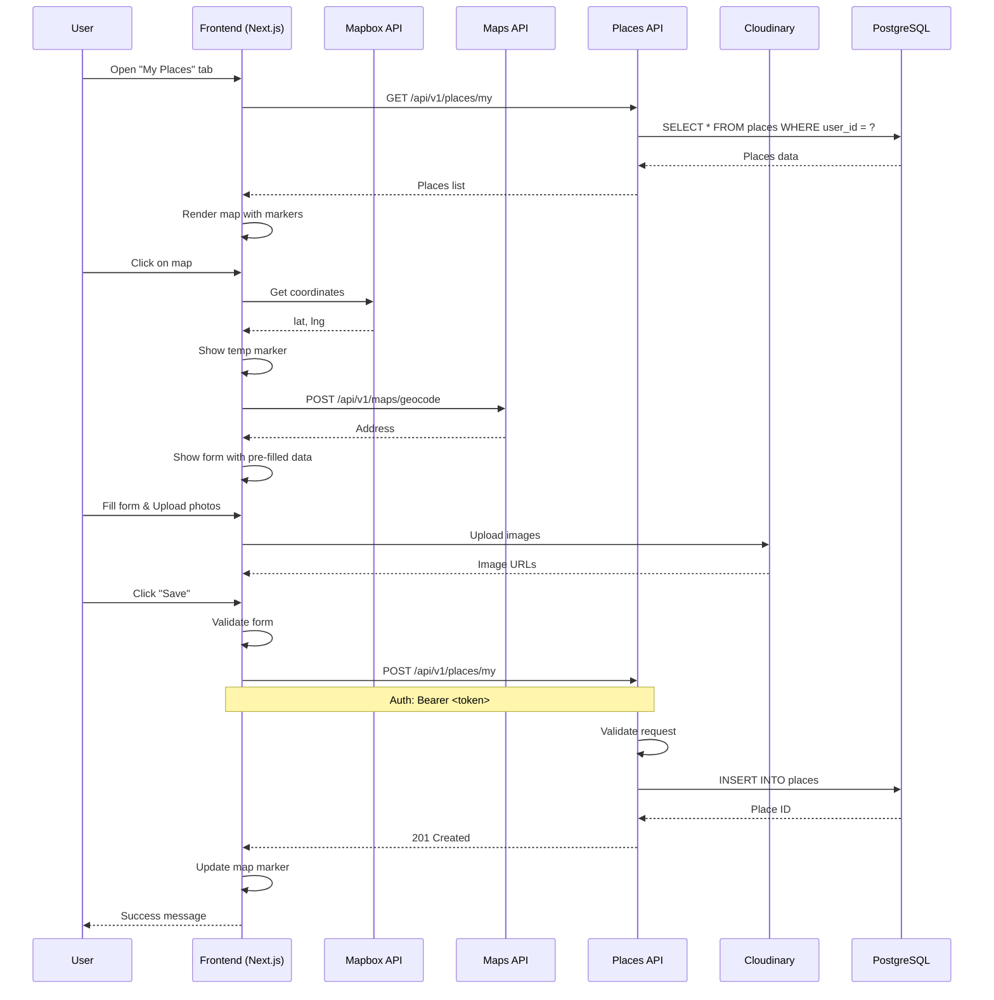

# Bug Fix Requirements: Мои места - Fix Frontend Integration

**Дата**: 2025-02-12
**Аналитик**: Business/System Analyst
**Статус**: Согласовано
**Версия**: 1.0 (Bug Fix)

---

## 1. Обзор проблемы

### 1.1. Описание бага

**Проблема**: Функциональность "Мои места" в профиле пользователя не работает. При нажатии на вкладку "Мои места" отображается только статичная заглушка. При клике на карту (выборе точки курсором) ничего не происходит.

**Текущее состояние**:
- Backend Places Service полностью реализован (API endpoints, CRUD операции, валидация)
- Frontend MyPlacesTab.tsx содержит только заглушку UI
- Нет интеграции с картой (Mapbox)
- Нет формы добавления места
- Нет обработки кликов на карту
- Нет API вызовов к бэкенду

### 1.2. Корневая причина

Frontend компонент `MyPlacesTab.tsx` не реализован согласно требованиям. Вместо полноценной функциональности с картой, формой добавления, фильтрами и API интеграцией - компонент показывает только статичное сообщение "Нет сохраненных мест" с неработающей кнопкой "Добавить место".

---

## 2. User Stories для фикса

### US-FIX-1: Реализация интерактивной карты для просмотра своих мест

**As a** зарегистрированный пользователь,
**I want to** видеть интерактивную карту со своими местами при открытии вкладки "Мои места",
**So that** я могу визуально определить, где находятся мои любимые места для рыбалки.

**Priority**: High (Critical Bug Fix)

**Actors**:
- [x] Зарегистрированный пользователь

**Acceptance Criteria**:

**AC1: Отображение интерактивной карты**
- **Given** пользователь авторизован
- **And** открывает вкладку "Мои места"
- **When** страница загружается
- **Then** отображается интерактивная карта (Mapbox)
- **And** карта центрируется на первом месте пользователя или на его геопозиции
- **And** на карте отображаются маркеры всех мест пользователя

**AC2: Загрузка мест пользователя**
- **Given** пользователь авторизован
- **And** открывает вкладку "Мои места"
- **When** компонент монтируется
- **Then** выполняется API запрос GET /api/v1/places/my
- **And** полученные данные используются для отображения маркеров на карте
- **And** показывается индикатор загрузки во время получения данных

**AC3: Обработка ошибок загрузки**
- **Given** пользователь открывает вкладку "Мои места"
- **When** API запрос не выполняется (ошибка сети, 500, 401)
- **Then** отображается сообщение об ошибке
- **And** пользователю предлагается повторить попытку

**Definition of Done**:
- [ ] Mapbox карта интегрирована в MyPlacesTab.tsx
- [ ] API запрос GET /api/v1/places/my реализован
- [ ] Маркеры мест отображаются на карте
- [ ] Индикаторы загрузки и ошибки реализованы
- [ ] API endpoint добавлен в frontend/app/lib/api.ts

---

### US-FIX-2: Добавление места по клику на карту

**As a** зарегистрированный пользователь,
**I want to** кликнуть на карту для выбора точки и добавить новое место,
**So that** я могу быстро сохранить интересное место для рыбалки.

**Priority**: High (Critical Bug Fix)

**Actors**:
- [x] Зарегистрированный пользователь

**Acceptance Criteria**:

**AC1: Обработка клика на карту**
- **Given** пользователь на вкладке "Мои места"
- **And** карта отображается
- **When** пользователь кликает на любую точку карты
- **Then** определяется координата клика (latitude, longitude)
- **And** на карте отображается временный маркер в месте клика
- **And** открывается форма добавления места

**AC2: Форма добавления места**
- **Given** пользователь кликнул на карту
- **When** открывается форма добавления места
- **Then** форма содержит следующие поля:
  - Название (обязательно)
  - Адрес (автозаполнен, редактируемый)
  - Широта/Долгота (автозаполнены, скрыты)
  - Тип места (select: wild/camping/resort, обязательно)
  - Тип подъезда (select: car/boat/foot, обязательно)
  - Виды рыбы (multiselect из справочника, минимум 1, обязательно)
  - Сезонность (multiselect: spring/summer/autumn/winter, опционально)
  - Описание (textarea, опционально)
  - Загрузка фото (1-4 фото, минимум 1, обязательно)
  - Видимость (radio: private/public, обязательно)

**AC3: Автозаполнение адреса**
- **Given** пользователь кликнул на карту
- **When** открывается форма
- **Then** адрес автоматически определяется через геокодер (API /api/v1/maps/geocode)
- **And** адрес отображается в поле "Адрес"
- **And** пользователь может редактировать адрес вручную

**AC4: Валидация формы**
- **Given** пользователь заполняет форму
- **When** пытается сохранить с незаполненными обязательными полями
- **Then** видит ошибки валидации под соответствующими полями
- **And** форма не отправляется

**AC5: Сохранение места**
- **Given** пользователь заполняет все обязательные поля
- **When** нажимает кнопку "Сохранить"
- **Then** отправляется API запрос POST /api/v1/places/my
- **And** если запрос успешен - место добавляется
- **And** маркер отображается на карте
- **And** показывается сообщение "Место успешно добавлено"
- **And** форма закрывается

**AC6: Отмена добавления**
- **Given** форма добавления открыта
- **When** пользователь нажимает "Отмена" или кликает вне формы
- **Then** форма закрывается
- **And** временный маркер удаляется с карты

**Definition of Done**:
- [ ] Обработчик клика на карту реализован
- [ ] Форма добавления места создана со всеми полями
- [ ] Интеграция с геокодером для автозаполнения адреса
- [ ] Валидация формы реализована
- [ ] API запрос POST /api/v1/places/my реализован
- [ ] Загрузка фото на Cloudinary реализована
- [ ] Обработка ошибок и уведомления

---

### US-FIX-3: Отображение информации о месте при наведении

**As a** зарегистрированный пользователь,
**I want to** видеть информацию о месте при наведении на маркер,
**So that** я могу быстро понять, что это за место без открытия деталей.

**Priority**: High (Critical Bug Fix)

**Actors**:
- [x] Зарегистрированный пользователь

**Acceptance Criteria**:

**AC1: Tooltip при наведении**
- **Given** пользователь просматривает карту со своими местами
- **When** наводит курсор на маркер места
- **Then** отображается всплывающее окно (tooltip) с информацией:
  - Название места
  - Первое фото (миниатюра)
  - Тип места с иконкой
  - Виды рыбы (до 3, остальные "еще X")
  - Видимость (личное/публичное)

**AC2: Анимация и дизайн**
- **Given** всплывающее окно отображается
- **Then** используется плавная анимация появления/исчезновения
- **And** компактный дизайн (3-4 строки)
- **And** не перекрывает другие маркеры

**AC3: Клик для открытия деталей**
- **Given** всплывающее окно отображается
- **When** пользователь кликает на маркер
- **Then** открывается модальное окно с детальной информацией о месте

**Definition of Done**:
- [ ] Tooltip компонент реализован
- [ ] API запрос GET /api/v1/places/my/:id реализован
- [ ] Анимации плавные
- [ ] Дизайн соответствует стандартам UX

---

### US-FIX-4: Управление местами (редактирование/удаление)

**As a** зарегистрированный пользователь,
**I want to** редактировать и удалять свои места,
**So that** я могу поддерживать актуальность информации.

**Priority**: Medium (Phase 2)

**Actors**:
- [x] Зарегистрированный пользователь (только свои места)

**Acceptance Criteria**:

**AC1: Редактирование места**
- **Given** пользователь открывает детали места
- **When** нажимает "Редактировать"
- **Then** открывается форма с текущими данными
- **And** может изменять поля
- **And** нажимает "Сохранить"
- **Then** отправляется API запрос PUT /api/v1/places/my/:id
- **And** информация обновляется
- **And** маркер обновляется на карте

**AC2: Удаление места**
- **Given** пользователь открывает детали места
- **When** нажимает "Удалить"
- **Then** отображается подтверждение удаления
- **And** при подтверждении отправляется API запрос DELETE /api/v1/places/my/:id
- **And** маркер исчезает с карты

**Definition of Done**:
- [ ] Форма редактирования создана
- [ ] API запросы PUT/DELETE /api/v1/places/my/:id реализованы
- [ ] Подтверждение удаления реализовано

---

### US-FIX-5: Фильтрация и поиск

**As a** зарегистрированный пользователь,
**I want to** фильтровать и искать свои места,
**So that** я могу быстро найти нужное место.

**Priority**: Medium (Phase 2)

**Actors**:
- [x] Зарегистрированный пользователь

**Acceptance Criteria**:

**AC1: Фильтры**
- **Given** пользователь на вкладке "Мои места"
- **When** применяет фильтры:
  - По типу места (дикое/кэмпинг/база отдыха)
  - По типу подъезда (машина/лодка/пешком)
  - По видам рыбы
  - По видимости (личное/публичное)
  - По сезону (весна/лето/осень/зень)
- **Then** на карте отображаются только соответствующие места
- **And** API запрос GET /api/v1/places/my отправляется с параметрами фильтров

**AC2: Поиск по названию**
- **Given** пользователь на вкладке "Мои места"
- **When** вводит текст в поле поиска
- **Then** выполняется поиск по названию места
- **And** результаты обновляются в реальном времени

**AC3: Сброс фильтров**
- **Given** пользователь применил фильтры
- **When** нажимает "Сбросить"
- **Then** все фильтры очищаются
- **And** отображаются все места пользователя

**Definition of Done**:
- [ ] Компоненты фильтров созданы
- [ ] Поле поиска реализовано
- [ ] API запросы с фильтрами реализованы
- [ ] Кнопка сброса реализована

---

## 3. API Specification Updates

### 3.1. Добавить API endpoints в frontend

Обновить файл `frontend/app/lib/api.ts`:

```typescript
export const API_ENDPOINTS = {
  AUTH: {
    LOGIN: `${API_URL}/api/v1/auth/login`,
    REGISTER: `${API_URL}/api/v1/auth/register`,
    VERIFY_EMAIL: `${API_URL}/api/v1/auth/verify-email`,
    RESET_PASSWORD: `${API_URL}/api/v1/auth/reset-password/request`,
  },
  USERS: {
    ME: `${API_URL}/api/v1/users/me`,
    UPDATE_PASSWORD: `${API_URL}/api/v1/users/me/password`,
  },
  MAPS: {
    GEOCODE: `${API_URL}/api/v1/maps/geocode`,
  },
  PLACES: {
    MY: `${API_URL}/api/v1/places/my`,
    MY_BY_ID: (id: string) => `${API_URL}/api/v1/places/my/${id}`,
    FISH_TYPES: `${API_URL}/api/v1/places/fish-types`,
    EQUIPMENT_TYPES: `${API_URL}/api/v1/places/equipment-types`,
    FAVORITES: `${API_URL}/api/v1/places/favorites`,
    FAVORITE_BY_PLACE_ID: (placeId: string) => `${API_URL}/api/v1/places/favorites/${placeId}`,
  },
};
```

### 3.2. Документация фронтенд API функций

#### GET /api/v1/places/my
Получение списка мест текущего пользователя

```typescript
interface PlaceResponse {
  id: string;
  owner_id: string;
  name: string;
  description?: string;
  latitude: number;
  longitude: number;
  address: string;
  place_type: "wild" | "camping" | "resort";
  access_type: "car" | "boat" | "foot";
  fish_types: Array<{
    id: string;
    name: string;
    icon?: string;
    category: string;
  }>;
  seasonality?: Array<"spring" | "summer" | "autumn" | "winter">;
  visibility: "private" | "public";
  images: string[];
  rating_avg: number;
  reviews_count: number;
  is_active: boolean;
  created_at: string;
  updated_at: string;
  is_favorite?: boolean;
}

interface PlaceListResponse {
  places: PlaceResponse[];
  total: number;
  page: number;
  page_size: number;
}

async function getMyPlaces(params: {
  visibility?: "private" | "public" | "all";
  place_type?: "wild" | "camping" | "resort";
  access_type?: "car" | "boat" | "foot";
  fish_type_id?: string;
  seasonality?: string;
  search?: string;
  page?: number;
  page_size?: number;
  sort?: string;
  order?: "asc" | "desc";
}): Promise<PlaceListResponse> {
  const token = localStorage.getItem("access_token");
  const queryParams = new URLSearchParams();
  Object.entries(params).forEach(([key, value]) => {
    if (value !== undefined) {
      queryParams.append(key, String(value));
    }
  });

  const response = await fetch(
    `${API_ENDPOINTS.PLACES.MY}?${queryParams.toString()}`,
    {
      headers: {
        Authorization: `Bearer ${token}`,
      },
    }
  );

  if (!response.ok) {
    throw new Error("Failed to fetch places");
  }

  return response.json();
}
```

#### POST /api/v1/places/my
Создание нового места

```typescript
interface PlaceCreate {
  name: string;
  description?: string;
  latitude: number;
  longitude: number;
  address: string;
  place_type: "wild" | "camping" | "resort";
  access_type: "car" | "boat" | "foot";
  fish_types: string[];
  seasonality?: Array<"spring" | "summer" | "autumn" | "winter">;
  visibility: "private" | "public";
  images: string[];
}

async function createPlace(data: PlaceCreate): Promise<PlaceResponse> {
  const token = localStorage.getItem("access_token");

  const response = await fetch(API_ENDPOINTS.PLACES.MY, {
    method: "POST",
    headers: {
      Authorization: `Bearer ${token}`,
      "Content-Type": "application/json",
    },
    body: JSON.stringify(data),
  });

  if (!response.ok) {
    throw new Error("Failed to create place");
  }

  return response.json();
}
```

#### PUT /api/v1/places/my/:id
Обновление места

```typescript
async function updatePlace(
  id: string,
  data: Partial<PlaceCreate>
): Promise<PlaceResponse> {
  const token = localStorage.getItem("access_token");

  const response = await fetch(API_ENDPOINTS.PLACES.MY_BY_ID(id), {
    method: "PUT",
    headers: {
      Authorization: `Bearer ${token}`,
      "Content-Type": "application/json",
    },
    body: JSON.stringify(data),
  });

  if (!response.ok) {
    throw new Error("Failed to update place");
  }

  return response.json();
}
```

#### DELETE /api/v1/places/my/:id
Удаление места

```typescript
async function deletePlace(id: string): Promise<void> {
  const token = localStorage.getItem("access_token");

  const response = await fetch(API_ENDPOINTS.PLACES.MY_BY_ID(id), {
    method: "DELETE",
    headers: {
      Authorization: `Bearer ${token}`,
    },
  });

  if (!response.ok) {
    throw new Error("Failed to delete place");
  }
}
```

---

## 4. Sequence Diagram: Создание места



---

## 5. Frontend Component Structure

### 5.1. Компоненты для создания

1. **MyPlacesTab.tsx** (update)
   - Основной компонент вкладки "Мои места"
   - Содержит карту и панель управления (фильтры, поиск, кнопка добавления)

2. **MapComponent.tsx** (new)
   - Компонент интерактивной карты Mapbox
   - Отображение маркеров мест
   - Обработка кликов на карту
   - Отображение tooltip при наведении

3. **PlaceForm.tsx** (new)
   - Форма добавления/редактирования места
   - Валидация полей
   - Загрузка фото
   - Отправка данных на API

4. **PlaceDetailsModal.tsx** (new)
   - Модальное окно с детальной информацией о месте
   - Кнопки редактирования и удаления

5. **FiltersPanel.tsx** (new)
   - Панель фильтров для поиска мест
   - Фильтры по типу места, подъезду, видам рыбы, видимости, сезону
   - Поле поиска по названию

6. **PlaceTooltip.tsx** (new)
   - Компонент всплывающего окна при наведении на маркер

### 5.2. Hooks

1. **usePlaces.ts** (new)
   - Хук для работы с API мест (get, create, update, delete)

2. **useMap.ts** (new)
   - Хук для работы с картой Mapbox

---

## 6. Non-Functional Requirements

### 6.1. Performance
- **Map Loading**: < 500ms при загрузке карты
- **Marker Rendering**: < 100ms при отображении маркеров
- **API Response**: < 200ms для операций чтения, < 500ms для операций записи
- **Form Validation**: Валидация в реальном времени (debounce 300ms)

### 6.2. UX/UI
- **Responsive**: Адаптивный дизайн для мобильных устройств
- **Accessibility**: WCAG 2.1 Level AA compliance
- **Loading States**: Индикаторы загрузки для всех асинхронных операций
- **Error Handling**: Понятные сообщения об ошибках и возможность повторной попытки

### 6.3. Browser Support
- Chrome/Edge (последние 2 версии)
- Firefox (последние 2 версии)
- Safari (последние 2 версии)
- Mobile Safari/iOS Chrome (последние 2 версии)

---

## 7. Priority Matrix (MoSCoW) для фикса

### Must Have (Critical Bug Fix - Week 1)
- US-FIX-1: Реализация интерактивной карты
- US-FIX-2: Добавление места по клику на карту
- US-FIX-3: Отображение информации о месте при наведении

### Should Have (Week 2)
- US-FIX-4: Управление местами (редактирование/удаление)
- US-FIX-5: Фильтрация и поиск

### Could Have (Phase 2)
- Списочный вид мест
- Избранное
- Экспорт/импорт мест

---

## 8. Dependencies

### 8.1. Требуемые зависимости (Frontend)

```json
{
  "dependencies": {
    "mapbox-gl": "^3.0.0",
    "@mapbox/mapbox-gl-geocoder": "^5.0.0",
    "react-hook-form": "^7.0.0",
    "zod": "^3.0.0",
    "@hookform/resolvers": "^3.0.0"
  }
}
```

### 8.2. Переменные окружения

```env
NEXT_PUBLIC_MAPBOX_ACCESS_TOKEN=your_mapbox_token
NEXT_PUBLIC_CLOUDINARY_CLOUD_NAME=your_cloud_name
NEXT_PUBLIC_CLOUDINARY_UPLOAD_PRESET=your_upload_preset
```

---

## 9. Testing Requirements

### 9.1. Unit Tests
- Тесты для хука usePlaces (get, create, update, delete)
- Тесты для компонентов формы (валидация)
- Тесты для API функций

### 9.2. Integration Tests
- Тесты для создания места (клик на карту → форма → сохранение)
- Тесты для загрузки и отображения мест
- Тесты для фильтрации

### 9.3. E2E Tests
- Тесты для полного потока: создание → просмотр → редактирование → удаление

---

## 10. Definition of Done

Считать задачу выполненной, когда:

**Must Have (Week 1)**:
- [ ] Mapbox карта интегрирована и работает
- [ ] Маркеры мест отображаются корректно
- [ ] Клик на карту открывает форму добавления
- [ ] Форма добавления работает со всеми полями
- [ ] Валидация формы работает
- [ ] API запросы реализованы (GET, POST)
- [ ] Автозаполнение адреса работает
- [ ] Загрузка фото работает
- [ ] Tooltip при наведении работает
- [ ] Unit тесты написаны (≥70% покрытие)
- [ ] Ручное QA тестирование завершено

**Should Have (Week 2)**:
- [ ] Редактирование мест работает
- [ ] Удаление мест работает
- [ ] Фильтры работают
- [ ] Поиск работает
- [ ] API запросы PUT/DELETE реализованы
- [ ] Unit тесты написаны (≥80% покрытие)

**Общие требования**:
- [ ] Код прошел code review
- [ ] Документация обновлена
- [ ] API endpoints добавлены в frontend/app/lib/api.ts
- [ ] Производительность соответствует NFR
- [ ] Баг исправлен (клик на карту работает)

---

## 11. Risk Analysis

| Risk | Probability | Impact | Mitigation Strategy |
|------|-------------|--------|---------------------|
| **Mapbox API quota exceeded** | Low | High | Implement caching, optimize map tile loading |
| **Image upload failures** | Medium | Medium | Retry logic, client-side validation |
| **Form validation errors** | Medium | Low | Clear error messages, validation in real-time |
| **Slow API response** | Medium | High | Implement pagination, caching, optimize queries |
| **Mobile UX issues** | Medium | Medium | Responsive design, test on mobile devices |

---

## 12. Резюме

### Проблема
Frontend компонент MyPlacesTab.tsx не реализован. Вместо функциональности с картой, формой добавления, фильтрами - отображается только заглушка.

### Решение
Полная реализация frontend функциональности согласно требованиям Требования_Мои_Места_v1.0.md:
1. Интеграция карты Mapbox
2. Реализация формы добавления/редактирования мест
3. Реализация фильтров и поиска
4. Интеграция с API Places Service
5. Реализация tooltip и модальных окон

### Сроки
- **Must Have (Week 1)**: 5-7 дней
- **Should Have (Week 2)**: 5-7 дней
- **Итого**: 2 недели

### Ожидаемый результат
- Пользователь может просматривать свои места на интерактивной карте
- Пользователь может добавлять новые места по клику на карту
- Пользователь может редактировать и удалять свои места
- Пользователь может фильтровать и искать свои места
- Функциональность соответствует требованиям Требования_Мои_Места_v1.0.md

---

**Конец документа**
**Статус**: ✅ Согласовано и готов к разработке
