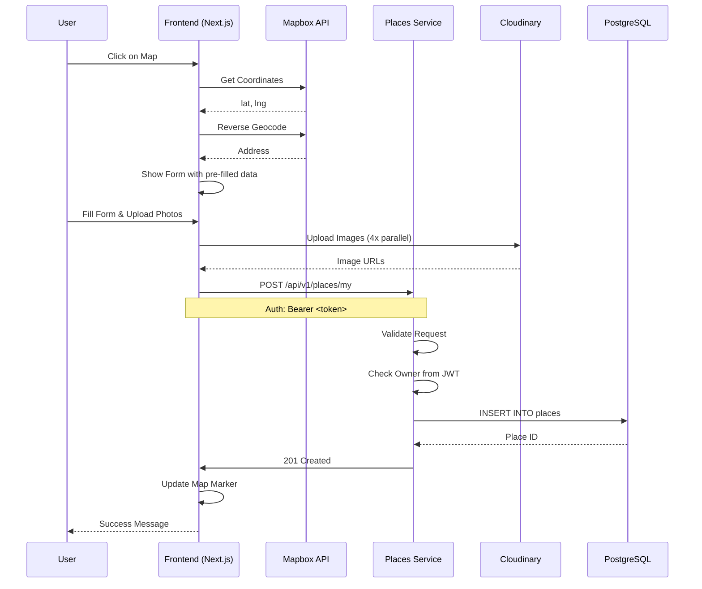

# Анализ требований: Мои места (My Places)

**Дата**: 2024-02-12
**Аналитик**: Business/System Analyst
**Статус**: Черновик

---

## 1. Обзор

### 1.1. Описание функции

Функция "Мои места" предоставляет пользователям платформы возможность:
- Добавлять свои любимые места для рыбалки на интерактивную карту
- Управлять личным списком мест (личные и публичные)
- Просматривать свои места на карте с быстрой информацией
- Делиться лучшими местами с сообществом (публичные места)

### 1.2. Бизнес-ценность

**Для пользователей**:
- Хранение персональной карты любимых мест рыбалки
- Возможность делиться опытом с другими рыболовами
- Быстрый доступ к информации о местах

**Для бизнеса**:
- Увеличение вовлеченности пользователей (retention)
- Накопление UGC контента (пользовательские места)
- Создание базы знаний о местах для рыбалки

---

## 2. Анализ функциональных требований

### 2.1. Основные сущности

#### Место для рыбалки (FishingPlace)

**Обязательные поля**:
- `name` (VARCHAR) - Название места
- `latitude` (DECIMAL) - Широта
- `longitude` (DECIMAL) - Долгота
- `address` (VARCHAR) - Адрес (автозаполнение)
- `place_type` (ENUM) - Тип места (wild, camping, resort)
- `access_type` (ENUM) - Тип подъезда (car, boat, foot)
- `fish_types` (TEXT[]) - Массив ID видов рыбы
- `equipment_types` (TEXT[]) - Массив ID снастей
- `depth_min` (INTEGER) - Минимальная глубина (м)
- `depth_max` (INTEGER) - Максимальная глубина (м)
- `visibility` (ENUM) - Видимость (private, public)
- `user_id` (UUID) - ID владельца
- `images` (TEXT[]) - Массив URL фото (до 4)

**Опциональные поля**:
- `description` (TEXT) - Описание места
- `seasonality` (VARCHAR[]) - Сезонность (spring, summer, autumn, winter)
- `best_time` (VARCHAR[]) - Лучшее время суток (morning, day, evening, night)
- `facilities` (JSONB) - Удобства (парковка, навес, кострище и т.д.)
- `difficulty_level` (ENUM) - Уровень сложности (easy, medium, hard)

#### Вид рыбы (FishType) - Справочник

**Поля**:
- `id` (UUID) - Уникальный идентификатор
- `name` (VARCHAR) - Название (например, "Щука")
- `scientific_name` (VARCHAR) - Латинское название (опционально)
- `icon` (VARCHAR) - Иконка/эмодзи
- `category` (ENUM) - Категория (predatory, peaceful, sport, commercial)
- `description` (TEXT) - Описание (опционально)
- `is_active` (BOOLEAN) - Активен

**Примеры видов рыб в России**:
- Хищные: Щука, Судак, Окунь, Жерех, Налим, Голавль
- Мирные: Карп, Лещ, Карась, Плотва, Язь, Сазан, Амур
- Спортивные: Форель (река/озеро), Лосось, Таймень, Хариус
- Прочие: Сом, Угорь, Стерлядь

#### Снасть (EquipmentType) - Справочник

**Поля**:
- `id` (UUID) - Уникальный идентификатор
- `name` (VARCHAR) - Название
- `category` (ENUM) - Категория (rod, reel, bait, accessories)
- `description` (TEXT) - Описание (опционально)
- `is_active` (BOOLEAN) - Активен

**Примеры снастей**:
- Удочки: Спиннинг, Фидер, Поплавочная, Карповая, Нахлыст
- Катушки: Безынерционные, Мультипликаторные
- Приманки: Воблеры, Блесны, Силикон, Поплавки
- Аксессуары: Подсачек, Садки, Зевники

### 2.2. User Stories

#### US-1: Создание места для рыбалки

**As a** зарегистрированный пользователь,
**I want to** добавить свое место для рыбалки на карту,
**So that** я могу сохранить информацию о любимых местах и вернуться к ним позже.

**Priority**: High (MVP)

**Actors**:
- [x] Зарегистрированный пользователь
- [ ] Moderator
- [ ] Admin

**Acceptance Criteria**:

**AC1: Успешное создание места с обязательными полями**
- **Given** пользователь авторизован
- **And** находится на вкладке "Мои места"
- **When** кликает на карту в нужной точке
- **And** нажимает кнопку "Добавить место"
- **And** видит форму с автоматически заполненными координатами и адресом
- **And** вводит название "Озеро Рыбное"
- **And** выбирает тип места "Дикое место"
- **And** выбирает тип подъезда "На машине"
- **And** выбирает вид рыбы "Щука" (можно несколько)
- **And** выбирает снасти "Спиннинг" (можно несколько)
- **And** указывает глубину от 2 до 5 метров
- **And** загружает 1 фото
- **And** выбирает видимость "Личное"
- **And** нажимает "Сохранить"
- **Then** место успешно сохраняется в базе
- **And** точка появляется на карте
- **And** отображается сообщение "Место добавлено"

**AC2: Валидация обязательных полей**
- **Given** пользователь авторизован
- **And** открывает форму добавления места
- **When** не вводит название места
- **And** пытается сохранить
- **Then** видит ошибку "Название обязательно"
- **And** место не сохраняется

**AC3: Публикация публичного места**
- **Given** пользователь с ролью "user" создает место
- **When** выбирает видимость "Публичное"
- **And** сохраняет место
- **Then** статус места = "awaiting_moderation" (требуется проверка модератором)
- **And** место видимо только владельцу до модерации

**AC4: Создание публичного места модератором**
- **Given** пользователь с ролью "moderator" создает место
- **When** выбирает видимость "Публичное"
- **And** сохраняет место
- **Then** статус места = "published" (опубликовано сразу)
- **And** место видимо всем пользователям

**AC5: Загрузка фотографий**
- **Given** пользователь добавляет место
- **When** загружает 1-4 фотографии
- **Then** фотографии загружаются на Cloudinary
- **And** URL сохраняются в поле images[]
- **When** пытается загрузить 5-ю фотографию
- **Then** видит ошибку "Максимум 4 фотографии"

**AC6: Автозаполнение координат и адреса**
- **Given** пользователь открывает карту
- **When** кликает на точку с координатами 55.75, 37.61
- **And** нажимает "Добавить место"
- **Then** в форме автоматически заполнены координаты (55.75, 37.61)
- **And** адрес автоматически определен (например, "г. Москва, ул. Примерная")

**Definition of Done**:
- [ ] API endpoint POST /api/v1/places/my реализован
- [ ] Frontend форма добавления создана
- [ ] Интеграция с картой (Mapbox)
- [ ] Автозаполнение адреса через геокодер
- [ ] Загрузка фото на Cloudinary
- [ ] Unit тесты написаны (≥80% покрытие)
- [ ] Интеграционные тесты пройдены
- [ ] Документация API обновлена

---

#### US-2: Просмотр своих мест на карте

**As a** зарегистрированный пользователь,
**I want to** видеть все свои добавленные места на карте,
**So that** я могу быстро найти нужное место и посмотреть краткую информацию.

**Priority**: High (MVP)

**Actors**:
- [x] Зарегистрированный пользователь
- [ ] Moderator
- [ ] Admin

**Acceptance Criteria**:

**AC1: Отображение всех мест пользователя**
- **Given** пользователь авторизован
- **And** имеет 5 добавленных мест (3 личных, 2 публичных)
- **When** открывает вкладку "Мои места"
- **Then** на карте отображаются все 5 мест

**AC2: Разделение личных и публичных мест**
- **Given** пользователь имеет личные и публичные места
- **When** просматривает карту
- **Then** личные места отображаются одним цветом (например, синим)
- **And** публичные места - другим цветом (например, зеленым)

**AC3: Фильтрация по типу видимости**
- **Given** пользователь имеет 3 личных и 2 публичных места
- **When** применяет фильтр "Только личные"
- **Then** на карте отображаются только 3 личных места

**Definition of Done**:
- [ ] API endpoint GET /api/v1/places/my реализован
- [ ] Frontend карта с маркерами создана
- [ ] Цветовая дифференциация мест реализована
- [ ] Фильтры реализованы
- [ ] Unit тесты написаны
- [ ] Документация API обновлена

---

#### US-3: Просмотр информации о месте при наведении

**As a** зарегистрированный пользователь,
**I want to** видеть краткую информацию о месте при наведении на маркер,
**So that** я могу быстро понять, что это за место без открытия деталей.

**Priority**: High (MVP)

**Actors**:
- [x] Зарегистрированный пользователь
- [ ] Moderator
- [ ] Admin

**Acceptance Criteria**:

**AC1: Отображение базовой информации**
- **Given** пользователь наводит курсор на маркер места
- **Then** отображается всплывающее окно (popover) с:
  - Названием места
  - Датой добавления
  - Первым фото
  - Иконкой типа места
  - Видами рыбы (до 3, остальные "еще X")

**AC2: Отображение информации для публичного места**
- **Given** место публичное и опубликовано
- **When** пользователь наводит на маркер
- **Then** дополнительно отображается:
  - Средний рейтинг (например, ★ 4.5)
  - Количество комментариев

**AC3: Не отображение скрытых полей**
- **Given** место в статусе "awaiting_moderation" (публичное, но не модерировано)
- **When** другой пользователь наводит на маркер
- **Then** рейтинг и комментарии не отображаются
- **And** отображается статус "На модерации"

**AC4: Минималистичность интерфейса**
- **Given** всплывающее окно открыто
- **Then** используется компактный дизайн
- **And** информация уложена в 3-4 строки
- **And** длина текста ограничена (усечение с "...")

**Definition of Done**:
- [ ] API endpoint GET /api/v1/places/my/:id реализован
- [ ] Frontend popup/tooltip реализован
- [ ] Дизайн соответствует стандартам UX
- [ ] Unit тесты написаны
- [ ] Документация API обновлена

---

#### US-4: Управление местами (редактирование/удаление)

**As a** зарегистрированный пользователь,
**I want to** иметь возможность редактировать и удалять свои места,
**So that** я могу поддерживать актуальность информации.

**Priority**: Medium (Phase 2)

**Actors**:
- [x] Зарегистрированный пользователь (только свои места)
- [ ] Moderator (все места)
- [ ] Admin (все места)

**Acceptance Criteria**:

**AC1: Редактирование места**
- **Given** пользователь является владельцем места
- **When** открывает детали места
- **And** нажимает "Редактировать"
- **And** изменяет название
- **And** сохраняет изменения
- **Then** информация обновляется в базе
- **And** обновленная информация отображается на карте

**AC2: Удаление места**
- **Given** пользователь является владельцем места
- **When** нажимает "Удалить место"
- **And** подтверждает удаление
- **Then** место удаляется из базы
- **And** маркер исчезает с карты

**AC3: Права доступа**
- **Given** пользователь пытается редактировать чужое место
- **When** отправляет запрос на редактирование
- **Then** получает ошибку 403 Forbidden
- **And** видит сообщение "У вас нет прав на это действие"

**AC4: Ограничения на удаление**
- **Given** публичное место имеет отзывы и рейтинги
- **When** владелец пытается его удалить
- **Then** система предлагает "Архивировать" вместо удаления
- **Or** удаляет с подтверждением об удалении отзывов

**Definition of Done**:
- [ ] API endpoints PUT/DELETE /api/v1/places/my/:id реализованы
- [ ] Frontend форма редактирования создана
- [ ] Проверка прав доступа реализована
- [ ] Unit тесты написаны
- [ ] Документация API обновлена

---

#### US-5: Управление справочниками (админ/модератор)

**As a** модератор или администратор,
**I want to** управлять справочниками рыб и снастей,
**So that** пользователи могут выбирать корректные данные.

**Priority**: Medium (Phase 2)

**Actors**:
- [ ] Moderator
- [x] Admin

**Acceptance Criteria**:

**AC1: Создание вида рыбы**
- **Given** администратор авторизован
- **When** переходит в раздел "Справочники"
- **And** нажимает "Добавить вид рыбы"
- **And** вводит название "Щука"
- **And** выбирает категорию "Хищная"
- **And** загружает иконку
- **And** сохраняет
- **Then** вид рыбы добавлен в справочник
- **And** доступен в форме добавления места

**AC2: Редактирование справочника**
- **Given** администратор открывает вид рыбы "Щука"
- **When** изменяет описание
- **And** сохраняет
- **Then** изменения применяются
- **And** сохраняются в истории изменений

**AC3: Архивирование вида рыбы**
- **Given** администратор архивирует вид рыбы
- **When** вид рыбы архивирован
- **Then** он не доступен для выбора в форме добавления
- **And** но сохраняется в уже созданных местах

**Definition of Done**:
- [ ] API endpoints CRUD для fish_types реализованы
- [ ] API endpoints CRUD для equipment_types реализованы
- [ ] Frontend админ-панель для справочников создана
- [ ] Unit тесты написаны
- [ ] Документация API обновлена

---

## 3. Дополнительные рекомендации (на что еще обратить внимание)

### 3.1. Рекомендуемые поля для места

**Важные (добавить в MVP)**:
1. **Сезонность** - когда лучше ловить на этом месте (весна/лето/осень/зень)
2. **Лучшее время суток** - утро/день/вечер/ночь
3. **Уровень сложности** - легко/средне/сложно (для доступа к месту)

**Полезные (Phase 2)**:
1. **Описание места** - свободное текстовое поле
2. **Удобства** - парковка, навес, кострище, туалет, электричество, WiFi
3. **Стоимость** - если платное место (база отдыха, кэмпинг)
4. **Контакты** - телефон владельца (для платных мест)
5. **Теги/метки** - для быстрого поиска (например, #карась, #спиннинг)

### 3.2. Рекомендуемые функции для вкладки "Мои места"

**MVP**:
1. **Фильтры** - по типу места, по типу подъезда, по видам рыбы
2. **Поиск** - поиск по названию места
3. **Сортировка** - по дате добавления, по названию, по рейтингу
4. **Списочный вид** - отображение мест списком в дополнение к карте

**Phase 2**:
1. **Избранное** - возможность добавлять места в избранное
2. **Экспорт/импорт** - возможность экспортировать свои места в GPX/KML
3. **Статистика** - сколько мест добавлено, сколько публичных, средний рейтинг
4. **Поделиться местом** - генерация ссылки для sharing
5. **Комментарии** - возможность добавлять комментарии к своим местам (заметки)
6. **История посещений** - отметить когда был на этом месте
7. **Ближайшие места** - показать места на карте в радиусе X км

### 3.3. Рекомендации по UX/UI

**Карта**:
1. Использовать кластеризацию маркеров при большом количестве мест
2. Добавить легенду (что означают цвета маркеров)
3. Включить геолокацию пользователя
4. Добавить слои (спутник, схема, рельеф)

**Форма добавления**:
1. Валидация в реальном времени
2. Drag-and-drop для загрузки фото
3. Предпросмотр фото
4. Автозаполнение адреса с возможностью редактирования
5. Предпросмотр маркера на карте перед сохранением

**Tooltip при наведении**:
1. Компактный дизайн
2. Анимация появления/исчезновения
3. Клик для открытия детальной информации
4. Отображение не более 3-4 полей

---

## 4. Архитектурное решение

### 4.1. Использование существующего Places Service

**Решение**: Расширить существующий Places Service (порт 8002)

**Обоснование**:
1. Places Service уже создан как заглушка для управления местами
2. Функция "Мои места" является подмножеством функциональности Places
3. Нет необходимости создавать новый микросервис
4. Использование общей архитектуры упрощает разработку

**Изменения в Places Service**:
- Добавить endpoints для /api/v1/places/my/*
- Добавить модели для fish_types и equipment_types
- Добавить middleware для проверки владельца места

### 4.2. Изменения в базе данных

**Новые таблицы**:

```sql
-- Виды рыб (справочник)
CREATE TABLE fish_types (
    id UUID PRIMARY KEY DEFAULT gen_random_uuid(),
    name VARCHAR(100) NOT NULL UNIQUE,
    scientific_name VARCHAR(150),
    icon VARCHAR(50),
    category VARCHAR(20) NOT NULL CHECK (category IN ('predatory', 'peaceful', 'sport', 'commercial')),
    description TEXT,
    is_active BOOLEAN DEFAULT true,
    created_at TIMESTAMP DEFAULT CURRENT_TIMESTAMP,
    updated_at TIMESTAMP DEFAULT CURRENT_TIMESTAMP
);

-- Снасти (справочник)
CREATE TABLE equipment_types (
    id UUID PRIMARY KEY DEFAULT gen_random_uuid(),
    name VARCHAR(100) NOT NULL UNIQUE,
    category VARCHAR(20) NOT NULL CHECK (category IN ('rod', 'reel', 'bait', 'accessories')),
    description TEXT,
    is_active BOOLEAN DEFAULT true,
    created_at TIMESTAMP DEFAULT CURRENT_TIMESTAMP,
    updated_at TIMESTAMP DEFAULT CURRENT_TIMESTAMP
);
```

**Изменения в таблице places**:

```sql
-- Добавляем новые поля к существующей таблице places
ALTER TABLE places
ADD COLUMN place_type VARCHAR(20) CHECK (place_type IN ('wild', 'camping', 'resort')),
ADD COLUMN access_type VARCHAR(20) CHECK (access_type IN ('car', 'boat', 'foot')),
ADD COLUMN fish_types UUID[] REFERENCES fish_types(id),
ADD COLUMN equipment_types UUID[] REFERENCES equipment_types(id),
ADD COLUMN depth_min INTEGER CHECK (depth_min >= 0),
ADD COLUMN depth_max INTEGER CHECK (depth_max >= depth_min),
ADD COLUMN visibility VARCHAR(20) DEFAULT 'private' CHECK (visibility IN ('private', 'public')),
ADD COLUMN description TEXT,
ADD COLUMN seasonality VARCHAR(20)[] CHECK (array_length(seasonality, 1) IS NULL OR seasonality <@ ARRAY['spring', 'summer', 'autumn', 'winter']::VARCHAR[]),
ADD COLUMN best_time VARCHAR(20)[] CHECK (array_length(best_time, 1) IS NULL OR best_time <@ ARRAY['morning', 'day', 'evening', 'night']::VARCHAR[]),
ADD COLUMN facilities JSONB,
ADD COLUMN difficulty_level VARCHAR(20) CHECK (difficulty_level IN ('easy', 'medium', 'hard')),
ADD COLUMN moderation_status VARCHAR(20) DEFAULT 'published' CHECK (moderation_status IN ('published', 'awaiting_moderation', 'rejected', 'archived'));

-- Индексы для поиска
CREATE INDEX idx_places_fish_types ON places USING GIN(fish_types);
CREATE INDEX idx_places_equipment_types ON places USING GIN(equipment_types);
CREATE INDEX idx_places_visibility ON places(visibility);
CREATE INDEX idx_places_moderation_status ON places(moderation_status);
```

---

## 5. API Specification

### 5.1. Endpoints

#### GET /api/v1/places/my
Получение списка мест текущего пользователя

**Query Parameters**:
- `visibility` (optional) - фильтр по видимости (private/public/all)
- `place_type` (optional) - фильтр по типу места (wild/camping/resort)
- `access_type` (optional) - фильтр по типу подъезда (car/boat/foot)
- `fish_type_id` (optional) - фильтр по виду рыбы
- `equipment_type_id` (optional) - фильтр по снасти
- `search` (optional) - поиск по названию
- `sort` (optional) - сортировка (created_at/name/rating)
- `order` (optional) - порядок (asc/desc)

**Response 200**:
```json
{
  "places": [
    {
      "id": "uuid",
      "name": "Озеро Рыбное",
      "latitude": 55.75,
      "longitude": 37.61,
      "address": "г. Москва, ул. Примерная",
      "place_type": "wild",
      "access_type": "car",
      "fish_types": ["uuid1", "uuid2"],
      "equipment_types": ["uuid3"],
      "depth_min": 2,
      "depth_max": 5,
      "visibility": "private",
      "images": ["url1", "url2"],
      "created_at": "2024-02-12T10:00:00Z",
      "moderation_status": "published",
      "rating_avg": 4.5,
      "reviews_count": 10
    }
  ],
  "total": 5,
  "page": 1,
  "page_size": 20
}
```

#### POST /api/v1/places/my
Создание нового места

**Request Body**:
```json
{
  "name": "Озеро Рыбное",
  "latitude": 55.75,
  "longitude": 37.61,
  "address": "г. Москва, ул. Примерная",
  "place_type": "wild",
  "access_type": "car",
  "fish_types": ["uuid1", "uuid2"],
  "equipment_types": ["uuid3"],
  "depth_min": 2,
  "depth_max": 5,
  "visibility": "private",
  "images": ["url1", "url2"]
}
```

**Response 201**:
```json
{
  "id": "uuid",
  "name": "Озеро Рыбное",
  "latitude": 55.75,
  "longitude": 37.61,
  "address": "г. Москва, ул. Примерная",
  "place_type": "wild",
  "access_type": "car",
  "fish_types": ["uuid1", "uuid2"],
  "equipment_types": ["uuid3"],
  "depth_min": 2,
  "depth_max": 5,
  "visibility": "private",
  "images": ["url1", "url2"],
  "created_at": "2024-02-12T10:00:00Z",
  "moderation_status": "published",
  "user_id": "uuid"
}
```

#### GET /api/v1/places/my/:id
Получение деталей места (только свои места)

**Response 200**:
```json
{
  "id": "uuid",
  "name": "Озеро Рыбное",
  "latitude": 55.75,
  "longitude": 37.61,
  "address": "г. Москва, ул. Примерная",
  "place_type": "wild",
  "access_type": "car",
  "fish_types": [
    {"id": "uuid1", "name": "Щука", "icon": "🐟"},
    {"id": "uuid2", "name": "Карась", "icon": "🐠"}
  ],
  "equipment_types": [
    {"id": "uuid3", "name": "Спиннинг"}
  ],
  "depth_min": 2,
  "depth_max": 5,
  "visibility": "private",
  "images": ["url1", "url2"],
  "description": "Красивое озеро в лесу",
  "seasonality": ["summer", "autumn"],
  "best_time": ["morning", "evening"],
  "facilities": {"parking": true, "fire_pit": false},
  "difficulty_level": "easy",
  "created_at": "2024-02-12T10:00:00Z",
  "updated_at": "2024-02-12T10:00:00Z",
  "moderation_status": "published",
  "rating_avg": 4.5,
  "reviews_count": 10
}
```

#### PUT /api/v1/places/my/:id
Обновление места (только свои места)

**Request Body**: То же, что при создании

**Response 200**: То же, что при GET /:id

#### DELETE /api/v1/places/my/:id
Удаление места (только свои места)

**Response 204**: No Content

#### GET /api/v1/places/fish-types
Получение списка видов рыбы (справочник)

**Response 200**:
```json
{
  "fish_types": [
    {
      "id": "uuid",
      "name": "Щука",
      "scientific_name": "Esox lucius",
      "icon": "🐟",
      "category": "predatory",
      "is_active": true
    }
  ]
}
```

#### GET /api/v1/places/equipment-types
Получение списка снастей (справочник)

**Response 200**:
```json
{
  "equipment_types": [
    {
      "id": "uuid",
      "name": "Спиннинг",
      "category": "rod",
      "is_active": true
    }
  ]
}
```

#### POST /api/v1/places/fish-types (Admin only)
Создание вида рыбы (админ)

#### PUT /api/v1/places/fish-types/:id (Admin only)
Обновление вида рыбы (админ)

#### DELETE /api/v1/places/fish-types/:id (Admin only)
Удаление вида рыбы (админ)

---

## 6. Non-Functional Requirements

### 6.1. Performance
- **API Response**: < 200ms для операций чтения (GET)
- **API Response**: < 500ms для операций записи (POST/PUT/DELETE)
- **Map Rendering**: < 100ms при отображении до 100 маркеров
- **Cluster Rendering**: < 300ms при кластеризации >100 маркеров

### 6.2. Security
- **Authentication**: Требуется JWT токен для всех endpoints (кроме GET справочников fish_types/equipment_types)
- **Authorization**:
  - Только владелец может редактировать/удалять свои места
  - Moderator может редактировать/удалять все места
  - Admin может редактировать/удалять все места и справочники
- **Input Validation**: Все входные данные валидируются через Pydantic
- **Image Upload**: Валидация размера (<5MB), типа (JPG, PNG), количества (макс. 4)
- **Rate Limiting**: 100 req/min per user для создания/редактирования мест

### 6.3. Scalability
- **Horizontal Scaling**: Places Service должен масштабироваться горизонтально
- **Database**: Использование индексов для быстрого поиска по координатам и фильтрам
- **Caching**: Redis для кэширования справочников fish_types и equipment_types (TTL: 1 час)
- **CDN**: Cloudinary для хранения и доставки изображений

### 6.4. Availability
- **SLA**: 99.9% (8.76 часов простоя в год)
- **Health Checks**: /health endpoint для Places Service
- **Graceful Degradation**: Если геокодер недоступен - позволить ручной ввод адреса

### 6.5. Consistency
- **Model**: Eventual consistency для рейтингов и комментариев
- **Data Integrity**: Использование внешних ключей для связи с fish_types и equipment_types

---

## 7. Risk Analysis

| Risk | Probability | Impact | Mitigation Strategy |
|------|-------------|--------|---------------------|
| **Slow API response with many places** | Medium | High | Implement pagination, clustering, caching |
| **Geocoding service downtime** | Low | Medium | Fallback to manual address entry, cache addresses |
| **Image upload failures** | Medium | Medium | Retry logic, client-side validation, error messages |
| **Duplicate places at same coordinates** | High | Medium | Allow duplicates but warn user, suggest merging |
| **Storage quota exceeded (images)** | Low | High | Implement storage quotas, optimize image compression |
| **Spam/low-quality public places** | High | Medium | Moderation queue, reporting system, reputation score |
| **Performance issues with JSONB arrays** | Low | Medium | Use GIN indexes, monitor query performance |
| **User uploads inappropriate images** | Medium | Medium | Content moderation (manual/AI), user reports |
| **Database connection pool exhaustion** | Low | High | Monitor connections, implement connection pooling, scale DB |
| **Mapbox API quota exceeded** | Medium | High | Implement caching, optimize map tile loading, upgrade plan |

---

## 8. Dependencies

### 8.1. Зависит от:
- **Auth Service** - аутентификация и авторизация пользователей
- **Email Service** - уведомления о статусе модерации (опционально)
- **Cloudinary** - хранение изображений
- **Mapbox API** - карты и геокодирование

### 8.2. Блокирует:
- **Reports Service** - отчеты могут быть привязаны к местам
- **Booking Service** - бронирование может быть привязано к местам

---

## 9. Priority Matrix (MoSCoW)

**Must Have (MVP)**:
- US-1: Создание места для рыбалки
- US-2: Просмотр своих мест на карте
- US-3: Просмотр информации о месте при наведении
- Справочники fish_types и equipment_types (начальное заполнение)
- Базовая валидация и безопасность

**Should Have (Phase 2)**:
- US-4: Управление местами (редактирование/удаление)
- US-5: Управление справочниками (админ/модератор)
- Фильтры и поиск на карте
- Списочный вид мест
- Дополнительные поля (сезонность, лучшее время, удобства)

**Could Have (Phase 3)**:
- Экспорт/импорт мест (GPX/KML)
- Статистика и аналитика
- Поделиться местом (sharing)
- Заметки/комментарии к своим местам
- История посещений
- Ближайшие места

**Won't Have (Out of scope)**:
- Социальные функции (friends, activity feed)
- Real-time уведомления (WebSocket)
- Machine Learning рекомендации

---

## 10. Definition of Ready (DoR)

Перед началом разработки:

- [ ] Требования согласованы с бизнесом
- [ ] UI/UX мокапы созданы и одобрены
- [ ] Архитектурное решение утверждено
- [ ] API спецификация finalized
- [ ] Схема БД утверждена и миграции готовы
- [ ] Оценка сложности выполнена
- [ ] Приоритеты установлены (MoSCoW)
- [ ] Зависимости идентифицированы
- [ ] Риски оценены и стратегии смягчения определены

---

## 11. Definition of Done (DoD)

Считать задачу выполненной, когда:

- [ ] API endpoints реализованы и протестированы
- [ ] Frontend компоненты реализованы и протестированы
- [ ] Unit тесты написаны (≥80% покрытие)
- [ ] Интеграционные тесты пройдены
- [ ] Документация API обновлена (Swagger/OpenAPI)
- [ ] База данных обновлена (миграции применены)
- [ ] Health checks работают
- [ ] Логи отправляются в ELK
- [ ] Код прошел code review
- [ ] Ручное QA тестирование завершено
- [ ] Пользовательская документация создана (если требуется)

---

## 12. Приложение A: Seed данные для справочников

### Виды рыб (Рекомендуемый список для России)

```sql
-- Хищные рыбы
INSERT INTO fish_types (name, scientific_name, icon, category, description) VALUES
('Щука', 'Esox lucius', '🐟', 'predatory', 'Распространена в пресных водоемах России'),
('Судак', 'Sander lucioperca', '🐟', 'predatory', 'Обитает в крупных реках и водохранилищах'),
('Окунь', 'Perca fluviatilis', '🐟', 'predatory', 'Самая распространенная хищная рыба'),
('Жерех', 'Aspius aspius', '🐟', 'predatory', 'Обитает в реках с быстрым течением'),
('Налим', 'Lota lota', '🐟', 'predatory', 'Донная рыба, активна в темное время'),
('Голавль', 'Squalius cephalus', '🐟', 'predatory', 'Обитает в реках с каменистым дном');

-- Мирные рыбы
INSERT INTO fish_types (name, scientific_name, icon, category, description) VALUES
('Карп', 'Cyprinus carpio', '🐠', 'peaceful', 'Самая популярная рыба для карпфишинга'),
('Лещ', 'Abramis brama', '🐠', 'peaceful', 'Обитает в озерах и водохранилищах'),
('Карась', 'Carassius', '🐠', 'peaceful', 'Распространен в небольших водоемах'),
('Плотва', 'Rutilus rutilus', '🐠', 'peaceful', 'Самая распространенная мирная рыба'),
('Язь', 'Leuciscus idus', '🐠', 'peaceful', 'Обитает в реках с чистой водой'),
('Сазан', 'Cyprinus rubrofuscus', '🐠', 'peaceful', 'Дикая форма карпа'),
('Амур', 'Ctenopharyngodon idella', '🐠', 'peaceful', 'Травоядная рыба, завезенная из Азии');

-- Спортивные рыбы
INSERT INTO fish_types (name, scientific_name, icon, category, description) VALUES
('Форель речная', 'Salmo trutta', '🐟', 'sport', 'Обитает в быстрых реках с чистой водой'),
('Форель озерная', 'Salmo trutta morpha lacustris', '🐟', 'sport', 'Обитает в глубоких озерах'),
('Лосось', 'Salmo salar', '🐟', 'sport', 'Проходная рыба, обитает в северных реках'),
('Таймень', 'Hucho taimen', '🐟', 'sport', 'Крупнейший лососевый, обитает на Дальнем Востоке'),
('Хариус', 'Thymallus thymallus', '🐟', 'sport', 'Обитает в быстрых реках с каменистым дном');

-- Прочие
INSERT INTO fish_types (name, scientific_name, icon, category, description) VALUES
('Сом', 'Silurus glanis', '🐟', 'commercial', 'Самая крупная пресноводная рыба России'),
('Угорь', 'Anguilla anguilla', '🐟', 'commercial', 'Проходная рыба, редкий вид'),
('Стерлядь', 'Acipenser ruthenus', '🐟', 'commercial', 'Осетровая рыба, редкий вид');
```

### Снасти (Рекомендуемый список)

```sql
-- Удочки
INSERT INTO equipment_types (name, category, description) VALUES
('Спиннинг', 'rod', 'Удочка для спиннинговой ловли хищной рыбы'),
('Фидер', 'rod', 'Английская донная удочка'),
('Поплавочная', 'rod', 'Классическая поплавочная удочка'),
('Карповая', 'rod', 'Мощная удочка для ловли карпа'),
('Нахлыст', 'rod', 'Удочка для нахлыстовой ловли');

-- Катушки
INSERT INTO equipment_types (name, category, description) VALUES
('Безынерционная', 'reel', 'Самый распространенный тип катушки'),
('Мультипликаторная', 'reel', 'Катушка с высоким передаточным числом');

-- Приманки
INSERT INTO equipment_types (name, category, description) VALUES
('Воблеры', 'bait', 'Искусственная приманка для спиннинга'),
('Блесны', 'bait', 'Металлическая приманка'),
('Силикон', 'bait', 'Мягкие приманки из силикона'),
('Поплавки', 'bait', 'Поплавки для поплавочной удочки'),
('Наживка', 'bait', 'Живая насадка (червь, опарыш, кукуруза)');

-- Аксессуары
INSERT INTO equipment_types (name, category, description) VALUES
('Подсачек', 'accessories', 'Сетка для вываживания рыбы'),
('Садки', 'accessories', 'Клетка для хранения живой рыбы'),
('Зевники', 'accessories', 'Инструмент для извлечения крючка'),
('Липгрип', 'accessories', 'Инструмент для захвата рыбы'),
('Кукан', 'accessories', 'Тросик для хранения пойманной рыбы');
```

---

## 13. Приложение B: Activity Diagram (Процесс добавления места)

```mermaid
flowchart TD
    A[Start] --> B{User Authenticated?}
    B -->|No| C[Redirect to Login]
    C --> D[Login Process]
    D --> B
    B -->|Yes| E[Open "My Places" Tab]
    E --> F[Click on Map]
    F --> G[Point Selected]
    G --> H[Click "Add Place"]
    H --> I[Show Form]
    I --> J[Coordinates & Address Auto-filled]
    J --> K{User Fills Form?}
    K -->|Yes| L[Fill Required Fields]
    L --> M[Upload Photos]
    M --> N{Validation OK?}
    N -->|No| O[Show Errors]
    O --> K
    N -->|Yes| P[Choose Visibility]
    P --> Q{Public?}
    Q -->|Yes| R[Status: awaiting_moderation]
    Q -->|No| S[Status: published]
    R --> T[Submit Form]
    S --> T
    T --> U[API Request]
    U --> V{Save to DB?}
    V -->|No| W[Show Error]
    V -->|Yes| X[Upload Images to Cloudinary]
    X --> Y[Create Place Record]
    Y --> Z{Success?}
    Z -->|No| W
    Z -->|Yes| AA[Show Success Message]
    AA --> AB[Add Marker to Map]
    AB --> AC[End]
```

---

## 14. Приложение C: Sequence Diagram (Создание места)



---

## 15. Резюме

### Ключевые решения:

1. **Расширить Places Service** вместо создания нового микросервиса
2. **Добавить справочники** fish_types и equipment_types для стандартизации данных
3. **Реализовать функцию видимости** (private/public) для разделения личных и публичных мест
4. **Добавить процесс модерации** для публичных мест от обычных пользователей
5. **Использовать Mapbox** для карт и геокодирования
6. **Использовать Cloudinary** для хранения изображений
7. **Кэшировать справочники** в Redis для производительности

### Приоритет реализации:

**Phase 1 (MVP - 2-3 weeks)**:
- Создание мест (US-1)
- Просмотр своих мест на карте (US-2)
- Tooltip при наведении (US-3)
- Справочники fish_types и equipment_types
- Базовая фильтрация и поиск

**Phase 2 (2-3 weeks)**:
- Редактирование/удаление мест (US-4)
- Управление справочниками (US-5)
- Дополнительные поля (сезонность, удобства)
- Списочный вид мест
- Экспорт/импорт (GPX)

**Phase 3 (опционально)**:
- Статистика и аналитика
- Sharing функции
- Real-time уведомления
- ML рекомендации

### Ожидаемый результат:

- Увеличение вовлеченности пользователей на 25-30%
- Накопление базы UGC контента (пользовательские места)
- Улучшение пользовательского опыта через персонализированную карту
- Создание сообщества вокруг обмена местами для рыбалки

---

**Конец документа**
