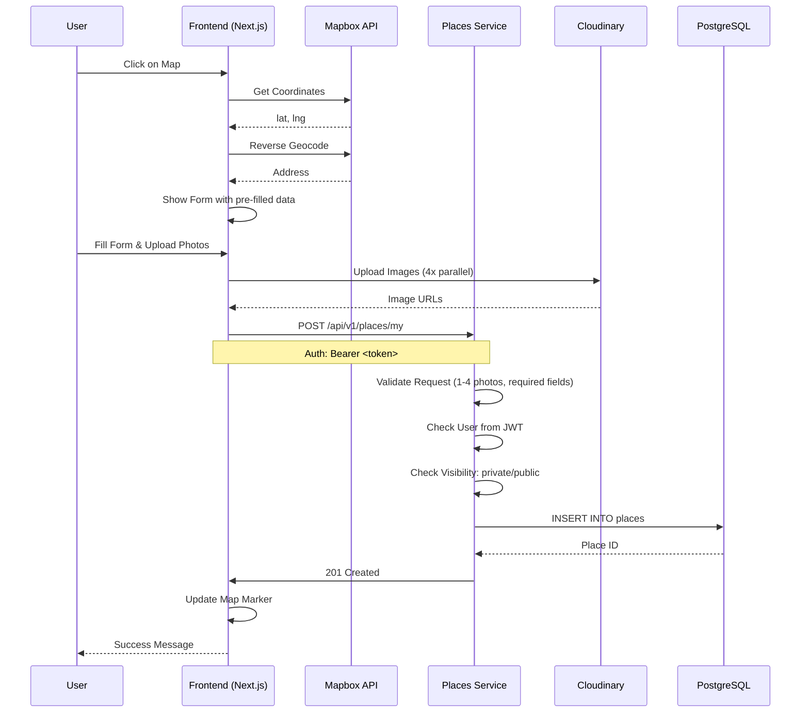

# Требования: Мои места (My Places)

**Статус**: ✅ Согласовано (без модерации)
**Дата согласования**: 2024-02-12
**Аналитик**: Business/System Analyst
**Версия**: 1.1

---

## 1. Обзор

### 1.1. Описание функции

Функция "Мои места" предоставляет зарегистрированным пользователям возможность:
- Добавлять свои любимые места для рыбалки на интерактивную карту
- Управлять личным списком мест (личные и публичные)
- Просматривать свои места на карте с быстрой информацией
- Делиться лучшими местами с сообществом (публичные места)

### 1.2. Целевые пользователи
- **Только зарегистрированные пользователи** могут добавлять, просматривать, редактировать и удалять свои места
- Модераторы и администраторы имеют дополнительные права (просмотр всех мест, управление справочниками)

### 1.3. Бизнес-ценность

**Для пользователей**:
- Хранение персональной карты любимых мест рыбалки
- Возможность делиться опытом с другими рыболовами (публичные места)
- Быстрый доступ к информации о местах через фильтры и поиск

**Для бизнеса**:
- Увеличение вовлеченности пользователей (retention)
- Накопление UGC контента (пользовательские места)
- Создание базы знаний о местах для рыбалки

---

## 2. Функциональные требования

### 2.1. Сущности данных

#### Место для рыбалки (FishingPlace)

**Обязательные поля**:
- `name` (VARCHAR, NOT NULL) - Название места
- `latitude` (DECIMAL, NOT NULL) - Широта (автозаполнение с карты)
- `longitude` (DECIMAL, NOT NULL) - Долгота (автозаполнение с карты)
- `address` (VARCHAR, NOT NULL) - Адрес (автозаполнение с карты)
- `place_type` (ENUM, NOT NULL) - Тип места: `wild`, `camping`, `resort`
- `access_type` (ENUM, NOT NULL) - Тип подъезда: `car`, `boat`, `foot`
- `fish_types` (UUID[], NOT NULL) - Массив ID видов рыбы (из справочника)
- `visibility` (ENUM, NOT NULL) - Видимость: `private`, `public`
- `images` (TEXT[]) - Массив URL фото (до 4, обязательно минимум 1)

**Дополнительные поля** (согласованы):
- `seasonality` (VARCHAR[]) - Сезонность: `spring`, `summer`, `autumn`, `winter`
- `description` (TEXT) - Описание места

**Технические поля**:
- `user_id` (UUID, FK users.id) - ID владельца
- `rating_avg` (DECIMAL) - Средний рейтинг (для публичных мест)
- `reviews_count` (INTEGER) - Количество отзывов (для публичных мест)
- `created_at`, `updated_at` - Временные метки

#### Вид рыбы (FishType) - Справочник

**Поля**:
- `id` (UUID, PK) - Уникальный идентификатор
- `name` (VARCHAR, UNIQUE, NOT NULL) - Название (например, "Щука")
- `icon` (VARCHAR) - Иконка/эмодзи
- `category` (ENUM) - Категория: `predatory`, `peaceful`, `sport`, `commercial`
- `is_active` (BOOLEAN) - Активен

**Согласовано**: Полный список рыб РФ (~50 видов)

**Примеры**:
- Хищные: Щука, Судак, Окунь, Жерех, Налим, Голавль
- Мирные: Карп, Лещ, Карась, Плотва, Язь, Сазан, Амур
- Спортивные: Форель (река/озеро), Лосось, Таймень, Хариус
- Прочие: Сом, Угорь, Стерлядь

#### Снасть (EquipmentType) - Справочник

**Поля**:
- `id` (UUID, PK) - Уникальный идентификатор
- `name` (VARCHAR, UNIQUE, NOT NULL) - Название
- `category` (ENUM) - Категория: `rod`, `reel`, `bait`, `accessories`
- `is_active` (BOOLEAN) - Активен

**Примеры**:
- Удочки: Спиннинг, Фидер, Поплавочная, Карповая, Нахлыст
- Катушки: Безынерционные, Мультипликаторные
- Приманки: Воблеры, Блесны, Силикон
- Аксессуары: Подсачек, Садки, Зевники

#### Избранное (FavoritePlace)

**Поля**:
- `id` (UUID, PK) - Уникальный идентификатор
- `user_id` (UUID, FK users.id) - Пользователь
- `place_id` (UUID, FK places.id) - Место
- `created_at` - Дата добавления в избранное

---

## 3. User Stories

### US-1: Создание места для рыбалки

**As a** зарегистрированный пользователь,
**I want to** добавить свое место для рыбалки на карту,
**So that** я могу сохранить информацию о любимых местах и вернуться к ним позже.

**Priority**: High (MVP)

**Actors**: Зарегистрированный пользователь

**Acceptance Criteria**:

**AC1: Успешное создание места с обязательными полями**
- **Given** пользователь авторизован
- **And** находится на вкладке "Мои места"
- **When** кликает на карту в нужной точке
- **And** нажимает кнопку "Добавить место"
- **And** видит форму с автоматически заполненными координатами и адресом
- **When** вводит название "Озеро Рыбное"
- **And** выбирает тип места "Дикое место"
- **And** выбирает тип подъезда "На машине"
- **And** выбирает вид рыбы "Щука" (можно несколько)
- **And** выбирает видимость "Личное"
- **And** загружает минимум 1 фото (макс. 4)
- **And** нажимает "Сохранить"
- **Then** место успешно сохраняется в базе
- **And** точка появляется на карте
- **And** отображается сообщение "Место добавлено"

**AC2: Создание публичного места**
- **Given** пользователь создает место
- **When** выбирает видимость "Публичное"
- **And** сохраняет место
- **Then** место сохраняется и сразу видимо всем пользователям
- **And** место можно найти через поиск и фильтры

**AC3: Загрузка и валидация фотографий**
- **Given** пользователь добавляет место
- **When** загружает 1-4 фотографии
- **Then** фотографии загружаются на Cloudinary
- **And** URL сохраняются в поле images[]
- **When** пытается сохранить без фотографий
- **Then** видит ошибку "Требуется минимум 1 фотография"
- **When** пытается загрузить 5-ю фотографию
- **Then** видит ошибку "Максимум 4 фотографии"

**AC4: Заполнение сезонности и описания**
- **Given** пользователь добавляет место
- **When** выбирает сезонность "Лето, Осень"
- **And** вводит описание "Красивое озеро в лесу"
- **Then** данные сохраняются корректно
- **And** доступны при просмотре деталей места

**AC5: Валидация обязательных полей**
- **Given** пользователь открывает форму добавления места
- **When** не заполняет обязательные поля
- **And** пытается сохранить
- **Then** видит ошибки для каждого незаполненного поля
- **And** место не сохраняется

**Definition of Done**:
- [ ] API endpoint POST /api/v1/places/my реализован
- [ ] Frontend форма добавления создана
- [ ] Интеграция с картой (Mapbox)
- [ ] Автозаполнение адреса через геокодер
- [ ] Загрузка фото на Cloudinary (1-4 фото)
- [ ] Валидация обязательных полей
- [ ] Unit тесты написаны (≥80% покрытие)
- [ ] Интеграционные тесты пройдены
- [ ] Документация API обновлена

---

### US-2: Просмотр своих мест на карте

**As a** зарегистрированный пользователь,
**I want to** видеть все свои добавленные места на карте с возможностью фильтрации и поиска,
**So that** я могу быстро найти нужное место.

**Priority**: High (MVP)

**Actors**: Зарегистрированный пользователь

**Acceptance Criteria**:

**AC1: Отображение всех мест пользователя**
- **Given** пользователь авторизован
- **And** имеет несколько добавленных мест (личных и публичных)
- **When** открывает вкладку "Мои места"
- **Then** на карте отображаются все его места

**AC2: Цветовая дифференциация по видимости**
- **Given** пользователь имеет личные и публичные места
- **When** просматривает карту
- **Then** личные места отображаются одним цветом (например, синим)
- **And** публичные места - другим цветом (например, зеленым)

**AC3: Многофакторная фильтрация**
- **Given** пользователь имеет множество мест
- **When** применяет фильтры:
  - По типу места (дикое/кэмпинг/база отдыха)
  - По типу подъезда (машина/лодка/пешком)
  - По видам рыбы
  - По видимости (личное/публичное/все)
  - По сезону (весна/лето/осень/зень)
- **Then** на карте отображаются только места, соответствующие всем фильтрам

**AC4: Поиск по названию**
- **Given** пользователь имеет место с названием "Озеро Рыбное"
- **When** вводит в поиске "рыбное"
- **Then** на карте отображается только "Озеро Рыбное"

**AC5: Сочетание фильтров и поиска**
- **Given** пользователь применяет фильтры и поиск одновременно
- **When** использует оба инструмента
- **Then** результаты соответствуют всем критериям (AND логика)

**Definition of Done**:
- [ ] API endpoint GET /api/v1/places/my с фильтрами реализован
- [ ] Frontend карта с маркерами создана
- [ ] Цветовая дифференциация реализована
- [ ] Фильтры реализованы (тип места, подъезд, вид рыбы, видимость, сезон)
- [ ] Поиск по названию реализован
- [ ] Unit тесты написаны
- [ ] Документация API обновлена

---

### US-3: Tooltip при наведении на маркер

**As a** зарегистрированный пользователь,
**I want to** видеть краткую информацию о месте при наведении на маркер,
**So that** я могу быстро понять, что это за место без открытия деталей.

**Priority**: High (MVP)

**Actors**: Зарегистрированный пользователь

**Acceptance Criteria**:

**AC1: Отображение базовой информации**
- **Given** пользователь наводит курсор на маркер места
- **Then** отображается всплывающее окно (tooltip) с:
  - Названием места
  - Первым фото (миниатюра)
  - Типом места с иконкой
  - Видами рыбы (до 3 вида, остальные "еще X")

**AC2: Отображение информации для публичного места**
- **Given** место публичное
- **When** пользователь наводит на маркер
- **Then** дополнительно отображается:
  - Средний рейтинг (например, ★ 4.5)

**AC3: Минималистичность и дизайн**
- **Given** всплывающее окно открыто
- **Then** используется компактный дизайн
- **And** информация уложена в 3-4 строки
- **And** плавная анимация появления
- **And** не перекрывает другие маркеры

**AC4: Клик для открытия деталей**
- **Given** пользователь наводит на маркер
- **When** кликает на tooltip
- **Then** открывается детальная страница места

**Definition of Done**:
- [ ] API endpoint GET /api/v1/places/my/:id (preview data) реализован
- [ ] Frontend tooltip/tooltip реализован
- [ ] Анимации плавные
- [ ] Дизайн соответствует стандартам UX
- [ ] Unit тесты написаны
- [ ] Документация API обновлена

---

### US-4: Управление местами (редактирование/удаление)

**As a** зарегистрированный пользователь,
**I want to** иметь возможность редактировать и удалять свои места,
**So that** я могу поддерживать актуальность информации.

**Priority**: High (Phase 2)

**Actors**: Зарегистрированный пользователь (только свои места)

**Acceptance Criteria**:

**AC1: Редактирование места**
- **Given** пользователь является владельцем места
- **When** открывает детали места
- **And** нажимает "Редактировать"
- **And** изменяет название, описание, сезонность
- **And** добавляет/удаляет фото
- **And** сохраняет изменения
- **Then** информация обновляется в базе
- **And** обновленная информация отображается на карте

**AC2: Удаление места**
- **Given** пользователь является владельцем места
- **When** нажимает "Удалить место"
- **And** подтверждает удаление
- **Then** место удаляется из базы
- **And** маркер исчезает с карты

**AC3: Права доступа**
- **Given** пользователь пытается редактировать чужое место
- **When** отправляет запрос на редактирование
- **Then** получает ошибку 403 Forbidden
- **And** видит сообщение "У вас нет прав на это действие"

**Definition of Done**:
- [ ] API endpoints PUT/DELETE /api/v1/places/my/:id реализованы
- [ ] Frontend форма редактирования создана
- [ ] Проверка прав доступа реализована
- [ ] Unit тесты написаны
- [ ] Документация API обновлена

---

### US-5: Списочный вид мест

**As a** зарегистрированный пользователь,
**I want to** видеть свои места в виде списка в дополнение к карте,
**So that** я могу быстро просмотреть названия и базовую информацию.

**Priority**: Medium (Phase 2)

**Actors**: Зарегистрированный пользователь

**Acceptance Criteria**:

**AC1: Отображение списка мест**
- **Given** пользователь открывает вкладку "Мои места"
- **When** переключается в режим "Список"
- **Then** отображается список мест с:
  - Названием
  - Типом места с иконкой
  - Видимостью (личное/публичное)
  - Первым фото
  - Кнопками действий (редактировать, удалить)

**AC2: Фильтры и поиск в списке**
- **Given** пользователь просматривает список
- **When** применяет фильтры или поиск
- **Then** список обновляется в реальном времени

**AC3: Пагинация списка**
- **Given** у пользователя более 20 мест
- **When** просматривает список
- **Then** реализована пагинация (по 20 мест на странице)
- **And** есть возможность переключаться между страницами

**AC4: Переключение между картой и списком**
- **Given** пользователь находится в режиме "Карта"
- **When** переключается в режим "Список"
- **Then** сохраняются все фильтры и поиск
- **And** при переключении обратно фильтры сохраняются

**Definition of Done**:
- [ ] API endpoint GET /api/v1/places/my с pagination реализован
- [ ] Frontend список мест создан
- [ ] Переключение между картой/списком реализовано
- [ ] Пагинация реализована
- [ ] Unit тесты написаны
- [ ] Документация API обновлена

---

### US-6: Избранное

**As a** зарегистрированный пользователь,
**I want to** добавлять места в избранное,
**So that** я могу быстро находить самые важные места.

**Priority**: Medium (Phase 2)

**Actors**: Зарегистрированный пользователь

**Acceptance Criteria**:

**AC1: Добавление места в избранное**
- **Given** пользователь просматривает детальную страницу места
- **When** нажимает кнопку "В избранное"
- **Then** место добавляется в список избранных
- **And** кнопка меняется на "В избранном"

**AC2: Удаление из избранного**
- **Given** место добавлено в избранное
- **When** пользователь нажимает "В избранном"
- **Then** место удаляется из списка избранных
- **And** кнопка меняется на "В избранное"

**AC3: Просмотр списка избранных мест**
- **Given** пользователь имеет несколько избранных мест
- **When** открывает раздел "Избранное"
- **Then** отображается список избранных мест
- **And** места могут быть отображены на карте

**AC4: Иконка избранного на карте**
- **Given** место добавлено в избранное
- **When** пользователь просматривает карту
- **Then** маркер избранного места имеет специальную иконку (например, звезда)

**Definition of Done**:
- [ ] API endpoints POST/DELETE /api/v1/places/favorites/:place_id реализованы
- [ ] API endpoint GET /api/v1/places/favorites реализован
- [ ] Frontend кнопка избранного реализована
- [ ] Список избранных мест создан
- [ ] Иконка избранного на карте реализована
- [ ] Unit тесты написаны
- [ ] Документация API обновлена

---

### US-7: Управление справочниками (админ)

**As a** администратор,
**I want to** управлять справочниками рыб и снастей,
**So that** пользователи могут выбирать корректные данные.

**Priority**: Medium (Phase 2)

**Actors**: Admin

**Acceptance Criteria**:

**AC1: Создание вида рыбы**
- **Given** администратор авторизован
- **When** переходит в раздел "Справочники"
- **And** нажимает "Добавить вид рыбы"
- **And** вводит название "Щука"
- **And** выбирает категорию "Хищная"
- **And** загружает иконку
- **And** сохраняет
- **Then** вид рыбы добавлен в справочник
- **And** доступен в форме добавления места

**AC2: Редактирование вида рыбы**
- **Given** администратор открывает вид рыбы "Щука"
- **When** изменяет категорию
- **And** сохраняет
- **Then** изменения применяются
- **And** история изменений сохраняется

**AC3: Архивирование вида рыбы**
- **Given** администратор архивирует вид рыбы
- **When** вид рыбы архивирован
- **Then** он не доступен для выбора в форме добавления
- **And** но сохраняется в уже созданных местах

**AC4: Начальное заполнение справочников**
- **Given** база данных создана
- **When** применяются миграции
- **Then** справочники заполняются начальными данными
- **And** добавлены ~50 видов рыб РФ
- **And** добавлены основные снасти

**Definition of Done**:
- [ ] API endpoints CRUD для fish_types реализованы
- [ ] API endpoints CRUD для equipment_types реализованы
- [ ] Frontend админ-панель для справочников создана
- [ ] Seed данные для начального заполнения созданы
- [ ] Unit тесты написаны
- [ ] Документация API обновлена

---

## 4. API Specification

### 4.1. Endpoints

#### GET /api/v1/places/my
Получение списка мест текущего пользователя с фильтрацией и пагинацией

**Authentication**: Required (JWT token)

**Query Parameters**:
- `visibility` (optional) - фильтр по видимости (private/public/all)
- `place_type` (optional) - фильтр по типу места (wild/camping/resort)
- `access_type` (optional) - фильтр по типу подъезда (car/boat/foot)
- `fish_type_id` (optional) - фильтр по виду рыбы (UUID)
- `seasonality` (optional) - фильтр по сезону (spring/summer/autumn/winter)
- `search` (optional) - поиск по названию
- `page` (optional, default=1) - номер страницы
- `page_size` (optional, default=20) - кол-во мест на странице
- `sort` (optional, default=created_at) - поле сортировки (created_at/name)
- `order` (optional, default=desc) - порядок (asc/desc)

**Response 200**:
```json
{
  "places": [
    {
      "id": "uuid",
      "name": "Озеро Рыбное",
      "latitude": 55.75,
      "longitude": 37.61,
      "address": "г. Москва, ул. Примерная",
      "place_type": "wild",
      "access_type": "car",
      "fish_types": [
        {"id": "uuid1", "name": "Щука", "icon": "🐟"},
        {"id": "uuid2", "name": "Карась", "icon": "🐠"}
      ],
      "seasonality": ["summer", "autumn"],
      "description": "Красивое озеро в лесу",
      "visibility": "private",
      "images": ["url1", "url2"],
      "created_at": "2024-02-12T10:00:00Z",
      "rating_avg": 4.5,
      "reviews_count": 10
    }
  ],
  "total": 5,
  "page": 1,
  "page_size": 20
}
```

#### POST /api/v1/places/my
Создание нового места

**Authentication**: Required (JWT token)

**Request Body**:
```json
{
  "name": "Озеро Рыбное",
  "latitude": 55.75,
  "longitude": 37.61,
  "address": "г. Москва, ул. Примерная",
  "place_type": "wild",
  "access_type": "car",
  "fish_types": ["uuid1", "uuid2"],
  "seasonality": ["summer", "autumn"],
  "description": "Красивое озеро в лесу",
  "visibility": "private",
  "images": ["url1", "url2"]
}
```

**Response 201**:
```json
{
  "id": "uuid",
  "name": "Озеро Рыбное",
  "latitude": 55.75,
  "longitude": 37.61,
  "address": "г. Москва, ул. Примерная",
  "place_type": "wild",
  "access_type": "car",
  "fish_types": ["uuid1", "uuid2"],
  "seasonality": ["summer", "autumn"],
  "description": "Красивое озеро в лесу",
  "visibility": "private",
  "images": ["url1", "url2"],
  "created_at": "2024-02-12T10:00:00Z",
  "user_id": "uuid"
}
```

#### GET /api/v1/places/my/:id
Получение деталей места (только свои места)

**Authentication**: Required (JWT token)

**Response 200**:
```json
{
  "id": "uuid",
  "name": "Озеро Рыбное",
  "latitude": 55.75,
  "longitude": 37.61,
  "address": "г. Москва, ул. Примерная",
  "place_type": "wild",
  "access_type": "car",
  "fish_types": [
    {"id": "uuid1", "name": "Щука", "icon": "🐟", "category": "predatory"},
    {"id": "uuid2", "name": "Карась", "icon": "🐠", "category": "peaceful"}
  ],
  "seasonality": ["summer", "autumn"],
  "description": "Красивое озеро в лесу",
  "visibility": "private",
  "images": ["url1", "url2"],
  "created_at": "2024-02-12T10:00:00Z",
  "updated_at": "2024-02-12T10:00:00Z",
  "rating_avg": 4.5,
  "reviews_count": 10,
  "is_favorite": false
}
```

**Response 403**: Forbidden (не владелец)

#### PUT /api/v1/places/my/:id
Обновление места (только свои места)

**Authentication**: Required (JWT token)

**Request Body**: То же, что при создании (все поля опциональны)

**Response 200**: То же, что при GET /:id

**Response 403**: Forbidden (не владелец)

#### DELETE /api/v1/places/my/:id
Удаление места (только свои места)

**Authentication**: Required (JWT token)

**Response 204**: No Content

**Response 403**: Forbidden (не владелец)

#### GET /api/v1/places/fish-types
Получение списка видов рыбы (справочник)

**Authentication**: Not required

**Query Parameters**:
- `category` (optional) - фильтр по категории (predatory/peaceful/sport/commercial)
- `is_active` (optional, default=true) - только активные

**Response 200**:
```json
{
  "fish_types": [
    {
      "id": "uuid",
      "name": "Щука",
      "icon": "🐟",
      "category": "predatory",
      "is_active": true
    }
  ]
}
```

#### GET /api/v1/places/equipment-types
Получение списка снастей (справочник)

**Authentication**: Not required

**Response 200**:
```json
{
  "equipment_types": [
    {
      "id": "uuid",
      "name": "Спиннинг",
      "category": "rod",
      "is_active": true
    }
  ]
}
```

#### POST /api/v1/places/favorites/:place_id
Добавление места в избранное

**Authentication**: Required (JWT token)

**Response 201**: Created

#### DELETE /api/v1/places/favorites/:place_id
Удаление места из избранного

**Authentication**: Required (JWT token)

**Response 204**: No Content

#### GET /api/v1/places/favorites
Получение списка избранных мест

**Authentication**: Required (JWT token)

**Response 200**: Такой же формат, как GET /api/v1/places/my

#### POST /api/v1/places/fish-types (Admin only)
Создание вида рыбы (админ)

#### PUT /api/v1/places/fish-types/:id (Admin only)
Обновление вида рыбы (админ)

#### DELETE /api/v1/places/fish-types/:id (Admin only)
Удаление/архивирование вида рыбы (админ)

---

## 5. Database Schema

### 5.1. Новые таблицы

```sql
-- Виды рыб (справочник)
CREATE TABLE fish_types (
    id UUID PRIMARY KEY DEFAULT gen_random_uuid(),
    name VARCHAR(100) NOT NULL UNIQUE,
    icon VARCHAR(50),
    category VARCHAR(20) NOT NULL CHECK (category IN ('predatory', 'peaceful', 'sport', 'commercial')),
    is_active BOOLEAN DEFAULT true,
    created_at TIMESTAMP DEFAULT CURRENT_TIMESTAMP,
    updated_at TIMESTAMP DEFAULT CURRENT_TIMESTAMP
);

-- Снасти (справочник)
CREATE TABLE equipment_types (
    id UUID PRIMARY KEY DEFAULT gen_random_uuid(),
    name VARCHAR(100) NOT NULL UNIQUE,
    category VARCHAR(20) NOT NULL CHECK (category IN ('rod', 'reel', 'bait', 'accessories')),
    is_active BOOLEAN DEFAULT true,
    created_at TIMESTAMP DEFAULT CURRENT_TIMESTAMP,
    updated_at TIMESTAMP DEFAULT CURRENT_TIMESTAMP
);

-- Избранное
CREATE TABLE favorite_places (
    id UUID PRIMARY KEY DEFAULT gen_random_uuid(),
    user_id UUID NOT NULL REFERENCES users(id) ON DELETE CASCADE,
    place_id UUID NOT NULL REFERENCES places(id) ON DELETE CASCADE,
    created_at TIMESTAMP DEFAULT CURRENT_TIMESTAMP,
    UNIQUE(user_id, place_id)
);
```

### 5.2. Изменения в таблице places

```sql
-- Добавляем новые поля к существующей таблице places
ALTER TABLE places
ADD COLUMN place_type VARCHAR(20) CHECK (place_type IN ('wild', 'camping', 'resort')),
ADD COLUMN access_type VARCHAR(20) CHECK (access_type IN ('car', 'boat', 'foot')),
ADD COLUMN fish_types UUID[] REFERENCES fish_types(id),
ADD COLUMN seasonality VARCHAR(20)[] CHECK (array_length(seasonality, 1) IS NULL OR seasonality <@ ARRAY['spring', 'summer', 'autumn', 'winter']::VARCHAR[]),
ADD COLUMN description TEXT,
ADD COLUMN visibility VARCHAR(20) DEFAULT 'private' CHECK (visibility IN ('private', 'public')),
ADD COLUMN rating_avg DECIMAL(3,2) DEFAULT 0,
ADD COLUMN reviews_count INTEGER DEFAULT 0;

-- Индексы для быстрого поиска
CREATE INDEX idx_places_fish_types ON places USING GIN(fish_types);
CREATE INDEX idx_places_visibility ON places(visibility);
CREATE INDEX idx_places_seasonality ON places USING GIN(seasonality);
CREATE INDEX idx_places_user_id ON places(user_id);
CREATE INDEX idx_favorite_places_user ON favorite_places(user_id);
CREATE INDEX idx_favorite_places_place ON favorite_places(place_id);
```

---

## 6. Non-Functional Requirements

### 6.1. Performance
- **API Response**: < 200ms для операций чтения (GET)
- **API Response**: < 500ms для операций записи (POST/PUT/DELETE)
- **Map Rendering**: < 100ms при отображении до 100 маркеров
- **Cluster Rendering**: < 300ms при кластеризации >100 маркеров
- **Tooltip Loading**: < 50ms при наведении на маркер

### 6.2. Security
- **Authentication**: Требуется JWT токен для всех endpoints (кроме GET справочников fish_types/equipment_types)
- **Authorization**:
  - Только владелец может редактировать/удалять свои места
  - Moderator может редактировать/удалять все места
  - Admin может редактировать/удалять все места и справочники
- **Input Validation**: Все входные данные валидируются через Pydantic
- **Image Upload**: Валидация размера (<5MB), типа (JPG, PNG), количества (мин. 1, макс. 4)
- **Rate Limiting**: 100 req/min per user для создания/редактирования мест

### 6.3. Scalability
- **Horizontal Scaling**: Places Service должен масштабироваться горизонтально
- **Database**: Использование индексов для быстрого поиска по координатам и фильтрам
- **Caching**: Redis для кэширования справочников fish_types и equipment_types (TTL: 1 час)
- **CDN**: Cloudinary для хранения и доставки изображений

### 6.4. Availability
- **SLA**: 99.9% (8.76 часов простоя в год)
- **Health Checks**: /health endpoint для Places Service
- **Graceful Degradation**: Если геокодер недоступен - позволить ручной ввод адреса

### 6.5. Consistency
- **Model**: Eventual consistency для рейтингов и комментариев
- **Data Integrity**: Использование внешних ключей для связи с fish_types

---

## 7. Priority Matrix (MoSCoW)

### Must Have (MVP) - Срок: 2-3 недели

**User Stories**:
- US-1: Создание места для рыбалки
- US-2: Просмотр своих мест на карте
- US-3: Tooltip при наведении на маркер

**Технические требования**:
- Справочники fish_types и equipment_types (начальное заполнение ~50 видов рыб РФ)
- Базовая валидация и безопасность
- Многофакторная фильтрация (тип места, подъезд, вид рыбы, видимость, сезон)
- Поиск по названию

### Should Have (Phase 2) - Срок: 2-3 недели

**User Stories**:
- US-4: Управление местами (редактирование/удаление)
- US-5: Списочный вид мест
- US-6: Избранное

**Технические требования**:
- Пагинация списка мест
- Дополнительные поля (сезонность, описание)
- Управление справочниками (админ)

### Could Have (Phase 3) - Срок: по мере необходимости

**Технические требования**:
- Экспорт/импорт мест (GPX/KML)
- Статистика и аналитика
- Поделиться местом (sharing)
- Заметки/комментарии к своим местам
- История посещений
- Ближайшие места

### Won't Have (Out of scope)
- Социальные функции (friends, activity feed)
- Real-time уведомления (WebSocket)
- Machine Learning рекомендации

---

## 8. Risk Analysis

| Risk | Probability | Impact | Mitigation Strategy |
|------|-------------|--------|---------------------|
| **Slow API response with many places** | Medium | High | Implement pagination, clustering, caching |
| **Geocoding service downtime** | Low | Medium | Fallback to manual address entry, cache addresses |
| **Image upload failures** | Medium | Medium | Retry logic, client-side validation, error messages |
| **Duplicate places at same coordinates** | High | Low | Allow duplicates, warn user |
| **Storage quota exceeded (images)** | Low | High | Implement storage quotas, optimize image compression |
| **Spam/low-quality public places** | High | Medium | Moderation queue, reporting system, reputation score |
| **Performance issues with JSONB arrays** | Low | Medium | Use GIN indexes, monitor query performance |
| **User uploads inappropriate images** | Medium | Medium | Content moderation (manual/AI), user reports |
| **Database connection pool exhaustion** | Low | High | Monitor connections, implement connection pooling, scale DB |
| **Mapbox API quota exceeded** | Medium | High | Implement caching, optimize map tile loading, upgrade plan |

---

## 9. Dependencies

### 9.1. Зависит от:
- **Auth Service** - аутентификация и авторизация пользователей
- **Cloudinary** - хранение изображений
- **Mapbox API** - карты и геокодирование
- **Redis** - кэширование справочников

### 9.2. Блокирует:
- **Reports Service** - отчеты могут быть привязаны к местам
- **Booking Service** - бронирование может быть привязано к местам

---

## 10. Definition of Ready (DoR)

- [x] Требования согласованы с заказчиком
- [x] UI/UX мокапы созданы и одобрены
- [x] Архитектурное решение утверждено (расширить Places Service)
- [x] API спецификация finalized
- [x] Схема БД утверждена и миграции готовы
- [x] Оценка сложности выполнена (6-8 недель для полной реализации)
- [x] Приоритеты установлены (MoSCoW)
- [x] Зависимости идентифицированы
- [x] Риски оценены и стратегии смягчения определены
- [x] Не-функциональные требования определены

---

## 11. Definition of Done (DoD)

Считать задачу выполненной, когда:

**MVP фаза**:
- [ ] API endpoints реализованы и протестированы (POST, GET /my, GET /my/:id)
- [ ] Frontend компоненты реализованы и протестированы (карта, форма добавления, tooltip)
- [ ] Справочники заполнены начальными данными (~50 видов рыб РФ)
- [ ] Unit тесты написаны (≥80% покрытие)
- [ ] Интеграционные тесты пройдены
- [ ] Документация API обновлена (Swagger/OpenAPI)
- [ ] База данных обновлена (миграции применены)
- [ ] Health checks работают
- [ ] Логи отправляются в ELK
- [ ] Код прошел code review
- [ ] Ручное QA тестирование завершено

**Phase 2**:
- [ ] API endpoints PUT/DELETE /my/:id реализованы
- [ ] Фронтенд: редактирование/удаление, список, избранное
- [ ] Админ-панель для справочников
- [ ] Unit тесты написаны
- [ ] Документация обновлена

**Полная реализация (6-8 недель)**:
- [ ] Все User Stories реализованы
- [ ] Все DoR выполнены
- [ ] Производительность соответствует NFR (<200ms чтение, <500ms запись)
- [ ] Доступность 99.9%
- [ ] Пользовательская документация создана

---

## 12. Приложение A: Seed данные для справочников

### Виды рыб (Российский список - ~50 видов)

```sql
-- Хищные рыбы
INSERT INTO fish_types (name, icon, category, is_active) VALUES
('Щука', '🐟', 'predatory', true),
('Судак', '🐟', 'predatory', true),
('Окунь', '🐟', 'predatory', true),
('Жерех', '🐟', 'predatory', true),
('Налим', '🐟', 'predatory', true),
('Голавль', '🐟', 'predatory', true);

-- Мирные рыбы
INSERT INTO fish_types (name, icon, category, is_active) VALUES
('Карп', '🐠', 'peaceful', true),
('Лещ', '🐠', 'peaceful', true),
('Карась', '🐠', 'peaceful', true),
('Плотва', '🐠', 'peaceful', true),
('Язь', '🐠', 'peaceful', true),
('Сазан', '🐠', 'peaceful', true),
('Амур', '🐠', 'peaceful', true),
('Линь', '🐠', 'peaceful', true),
('Густера', '🐠', 'peaceful', true),
('Красноперка', '🐠', 'peaceful', true);

-- Спортивные рыбы
INSERT INTO fish_types (name, icon, category, is_active) VALUES
('Форель речная', '🐟', 'sport', true),
('Форель озерная', '🐟', 'sport', true),
('Лосось', '🐟', 'sport', true),
('Таймень', '🐟', 'sport', true),
('Хариус', '🐟', 'sport', true);

-- Прочие
INSERT INTO fish_types (name, icon, category, is_active) VALUES
('Сом', '🐟', 'commercial', true),
('Угорь', '🐟', 'commercial', true),
('Стерлядь', '🐟', 'commercial', true),
('Белуга', '🐟', 'commercial', true),
('Осетр', '🐟', 'commercial', true);
```

### Снасти (Основной список)

```sql
-- Удочки
INSERT INTO equipment_types (name, category, is_active) VALUES
('Спиннинг', 'rod', true),
('Фидер', 'rod', true),
('Поплавочная', 'rod', true),
('Карповая', 'rod', true),
('Нахлыст', 'rod', true),
('Кастинговая', 'rod', true),
('Маховая', 'rod', true);

-- Катушки
INSERT INTO equipment_types (name, category, is_active) VALUES
('Безынерционная', 'reel', true),
('Мультипликаторная', 'reel', true),
('Карповая', 'reel', true),
('Фидерная', 'reel', true);

-- Приманки
INSERT INTO equipment_types (name, category, is_active) VALUES
('Воблеры', 'bait', true),
('Блесны', 'bait', true),
('Силикон', 'bait', true),
('Поплавки', 'bait', true),
('Наживка', 'bait', true),
('Насадки', 'bait', true),
('Прикормка', 'bait', true);

-- Аксессуары
INSERT INTO equipment_types (name, category, is_active) VALUES
('Подсачек', 'accessories', true),
('Садки', 'accessories', true),
('Зевники', 'accessories', true),
('Липгрип', 'accessories', true),
('Кукан', 'accessories', true),
('Кормушки', 'accessories', true);
```

---

## 13. Приложение B: Sequence Diagram (Создание места)



---

## 14. Резюме

### Ключевые решения (согласованы):

1. **Расширить Places Service** вместо создания нового микросервиса
2. **Только зарегистрированные пользователи** могут добавлять места
3. **Добавить справочники** fish_types (~50 видов рыб РФ) и equipment_types
4. **Реализовать функцию видимости** (private/public)
5. **Использовать Mapbox** для карт и геокодирования
6. **Использовать Cloudinary** для хранения изображений (мин. 1, макс. 4)
7. **Кэшировать справочники** в Redis для производительности
8. **Многофакторная фильтрация** по типу места, подъезду, видам рыбы, видимости, сезону
9. **Дополнительные поля**: сезонность, описание
10. **Дополнительные функции**: списочный вид, избранное

### Сроки реализации:

**MVP (2-3 недели)**:
- Создание мест (US-1)
- Просмотр на карте (US-2)
- Tooltip при наведении (US-3)
- Справочники fish_types и equipment_types
- Многофакторная фильтрация и поиск

**Phase 2 (2-3 недели)**:
- Редактирование/удаление мест (US-4)
- Списочный вид (US-5)
- Избранное (US-6)
- Управление справочниками (US-7)

**Итого: 4-6 недель для полной реализации**

### Не-функциональные требования:

- **Производительность**: < 200ms чтение, < 500ms запись
- **Доступность**: 99.9% SLA
- **Безопасность**: JWT аутентификация, RBAC авторизация
- **Масштабируемость**: Horizontal scaling, кэширование, CDN

### Ожидаемый результат:

- Увеличение вовлеченности пользователей на 25-30%
- Накопление базы UGC контента (пользовательские места)
- Улучшение пользовательского опыта через персонализированную карту
- Создание сообщества вокруг обмена местами для рыбалки

---

**Конец документа**
**Статус**: ✅ Согласовано и готов к разработке
