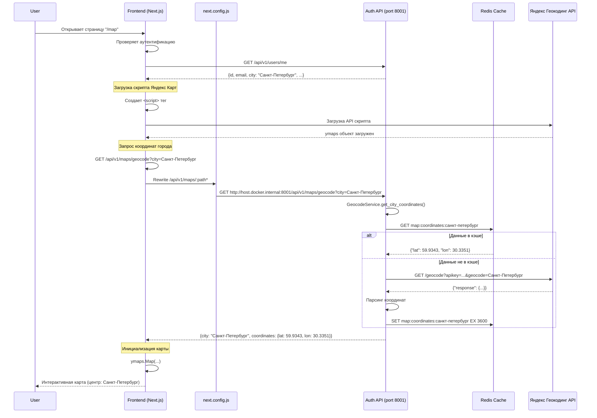

# Дополнительные требования для исправления отображения Яндекс Карт

**ID**: REQ-MAPS-FIX-001
**Версия**: 1.0
**Дата**: 2025-02-11
**Автор**: Business Analyst
**Статус**: Черновик
**Связанный документ**: REQ-MAPS-001

---

## 1. Обзор

### 1.1 Цель
Исправление проблемы с отображением Яндекс Карт на странице "Карта" и во вкладке "Мои места" для авторизованных пользователей. Текущая проблема: при авторизованном пользователе отображается белый экран вместо карты.

### 1.2 Анализ текущей ситуации

**Проблемы, выявленные при анализе:**

1. **Отсутствие проксирования API запросов**: В файле `frontend/next.config.js` отсутствует rewrite правило для проксирования запросов к `/api/v1/maps/*` на Auth Service (порт 8001). Это приводит к тому, что запросы к `/api/v1/maps/geocode` не доходят до бэкенда.

2. **Конфликт валидации API ключа**: API ключ Яндекс Карт `dfb59053-0011-47fb-a6f1-a14efb9160d1` используется как дефолтное значение в frontend компоненте YandexMap.tsx, но может не совпадать с ключом, настроенным в GeocodeService бэкенда.

3. **Отсутствие обработчиков ошибок**: В компоненте YandexMap.tsx отсутствует детальная обработка ошибок при неудачной загрузке скрипта Яндекс Карт или при ошибках API.

4. **Наличие city в модели пользователя**: Поле `city` уже существует в модели User (app/models/user.py:19) и в базе данных, что соответствует требованиям.

### 1.3 Область действия (Scope)

**Включает:**
- Добавление rewrite правила в next.config.js для /api/v1/maps/*
- Унификация API ключа Яндекс Карт между frontend и backend
- Улучшение обработки ошибок в YandexMap компоненте
- Добавление логирования для диагностики проблем с картой
- Проверка работы GeocodeService с Redis

**Исключает:**
- Изменение логики работы самой карты (маркеры, фильтры и т.д.)
- Добавление новых API эндпоинтов

---

## 2. User Story

## User Story: Исправление отображения карты для авторизованных пользователей

**As a** зарегистрированный пользователь,
**I want to** видеть интерактивную карту на странице "Карта" и во вкладке "Мои места" без белого экрана,
**So that** я могу пользоваться функционалом приложения для поиска мест для рыбалки.

### Priority
- [x] Critical (блокирующий баг для функциональности)

### Actors
- [x] Зарегистрированный пользователь
- [ ] Developer
- [ ] QA Engineer

### Acceptance Criteria

**AC1: Rewrite правило добавлено в next.config.js**
- **Given** файл next.config.js существует
- **When** разработчик добавляет rewrite правило для /api/v1/maps/*
- **Then** запросы к /api/v1/maps/geocode проксируются на http://host.docker.internal:8001/api/v1/maps/geocode
- **And** правило следует паттерну существующих правил для auth, users, places и т.д.

**AC2: Карта загружается для авторизованного пользователя с указанным городом**
- **Given** пользователь авторизован
- **And** у пользователя указан город "Санкт-Петербург"
- **When** пользователь открывает страницу "/map"
- **Then** загружается скрипт Яндекс Карт
- **And** делается запрос к /api/v1/maps/geocode?city=Санкт-Петербург
- **And** запрос успешно проксируется на бэкенд
- **And** API возвращает координаты Санкт-Петербурга
- **And** карта инициализируется с центром в Санкт-Петербурге
- **And** карта отображается без белого экрана

**AC3: Карта загружается для авторизованного пользователя без указанного города**
- **Given** пользователь авторизован
- **And** у пользователя не указан город (city = NULL)
- **When** пользователь открывает страницу "/map"
- **Then** карта инициализируется с центром в Москве (координаты: 55.7558, 37.6173)
- **And** карта отображается без белого экрана

**AC4: Карта загружается во вкладке "Мои места"**
- **Given** пользователь авторизован
- **When** пользователь открывает профиль и вкладку "Мои места"
- **Then** карта загружается и отображается
- **And** центр карты определяется на основе города пользователя или Москвы
- **And** карта интерактивна

**AC5: API ключ унифицирован**
- **Given** API ключ Яндекс Карт используется в frontend и backend
- **When** запрос делается к Geocode API
- **Then** используется один и тот же API ключ для геокодирования
- **And** ключ хранится в переменной окружения (не захардкожен)

**AC6: Ошибки корректно обрабатываются**
- **Given** происходит ошибка при загрузке карты
- **When** компонент YandexMap ловит ошибку
- **Then** отображается понятное сообщение об ошибке
- **And** предлагается кнопка "Попробовать снова"
- **And** ошибка логируется для отладки

**AC7: GeocodeService работает с Redis**
- **Given** запрос к /api/v1/maps/geocode выполняется
- **When** город не найден в кэше Redis
- **Then** GeocodeService делает запрос к Яндекс Геокодинг API
- **And** результат сохраняется в Redis с TTL 1 час
- **When** повторный запрос с тем же городом
- **Then** данные возвращаются из кэша

**AC8: Логирование для диагностики**
- **Given** компонент YandexMap загружается
- **When** происходит любое событие (загрузка скрипта, запрос API, ошибка)
- **Then** событие логируется в консоль браузера
- **And** при ошибках API логируется детальная информация

---

## 3. Technical Specifications

### 3.1 Изменение в frontend/next.config.js

Добавить rewrite правило для проксирования запросов к maps API:

```javascript
async rewrites() {
  return [
    // ... существующие правила ...
    {
      source: '/api/v1/maps/:path*',
      destination: 'http://host.docker.internal:8001/api/v1/maps/:path*',
    },
    // ... существующие правила ...
  ];
},
```

**Почему это необходимо:**
- Frontend (Next.js) работает в Docker контейнере
- Backend (Auth Service) работает на порту 8001
- Rewrite правила обеспечивают корректную маршрутизацию запросов между сервисами
- Без этого правила запросы к /api/v1/maps/* не доходят до бэкенда

### 3.2 Конфигурация API ключа Яндекс Карт

Добавить переменную окружения для API ключа:

**В frontend/.env.local:**
```
NEXT_PUBLIC_YANDEX_MAPS_API_KEY=dfb59053-0011-47fb-a6f1-a14efb9160d1
```

**В services/auth-service/.env:**
```
YANDEX_MAPS_API_KEY=dfb59053-0011-47fb-a6f1-a14efb9160d1
```

**Изменения в коде:**

1. В `frontend/components/YandexMap.tsx`:
```typescript
const YANDEX_API_KEY = process.env.NEXT_PUBLIC_YANDEX_MAPS_API_KEY;
```

2. В `services/auth-service/app/services/geocode.py`:
```python
self.yandex_api_key = settings.YANDEX_MAPS_API_KEY
```

3. В `services/auth-service/app/core/config.py`:
```python
YANDEX_MAPS_API_KEY: str = os.getenv("YANDEX_MAPS_API_KEY", "dfb59053-0011-47fb-a6f1-a14efb9160d1")
```

**Почему это необходимо:**
- Унификация ключа между frontend и backend
- Использование переменных окружения - лучшая практика безопасности
- Легкая смена ключа без изменения кода

### 3.3 Улучшение обработки ошибок в YandexMap.tsx

**Текущая проблема:** Ошибки API не обрабатываются детально, что затрудняет диагностику.

**Предлагаемое решение:** Добавить более детальную обработку ошибок и логирование:

```typescript
const initializeMap = async () => {
  const ymaps = (window as any).ymaps;
  if (!ymaps || !mapRef.current) {
    console.error("[YandexMap] ymaps not loaded or mapRef not available");
    return;
  }

  try {
    setLoading(true);
    setError(null);

    let center = [55.7558, 37.6173];
    const zoom = 10;

    if (city && city.trim()) {
      console.log(`[YandexMap] Geocoding city: ${city}`);
      try {
        const response = await fetch(`/api/v1/maps/geocode?city=${encodeURIComponent(city)}`);
        console.log(`[YandexMap] Geocode response status: ${response.status}`);

        if (response.ok) {
          const data = await response.json();
          console.log(`[YandexMap] Geocode response data:`, data);

          if (data.coordinates) {
            center = [data.coordinates.lat, data.coordinates.lon];
            setCoordinates({ lat: data.coordinates.lat, lon: data.coordinates.lon });
            console.log(`[YandexMap] Map center set to:`, center);
          } else {
            console.warn(`[YandexMap] No coordinates in response, using default center`);
          }
        } else {
          const errorText = await response.text();
          console.error(`[YandexMap] Geocode API error: ${response.status} - ${errorText}`);
          setError(`Ошибка геокодирования: ${response.status}`);
        }
      } catch (err) {
        console.error("[YandexMap] Error geocoding city:", err);
        setError("Не удалось получить координаты города");
      }
    } else {
      console.log("[YandexMap] No city specified, using default center (Moscow)");
    }

    ymaps.ready(() => {
      if (!mapRef.current) {
        console.error("[YandexMap] mapRef not available in ymaps.ready");
        return;
      }

      console.log("[YandexMap] Initializing Yandex Map");
      const myMap = new ymaps.Map(mapRef.current, {
        center,
        zoom,
        controls: ["zoomControl", "fullscreenControl"],
      });

      const circle = new ymaps.Circle(
        [center, 25000],
        {
          balloonContent: "Радиус 25 км",
        },
        {
          fillColor: "#00FF0033",
          strokeColor: "#00FF00",
          strokeOpacity: 1,
          strokeWidth: 2,
        }
      );

      myMap.geoObjects.add(circle);
      console.log("[YandexMap] Map initialized successfully");
      setLoading(false);
    });
  } catch (err) {
    console.error("[YandexMap] Fatal error initializing map:", err);
    setError("Не удалось создать карту. Попробуйте обновить страницу.");
    setLoading(false);
  }
};
```

### 3.4 Проверка работоспособности GeocodeService

**Проверка подключения к Redis:**

1. Добавить health check для Redis в GeocodeService:
```python
async def check_redis_connection(self) -> bool:
    try:
        if not self.redis_client:
            logger.warning("Redis client not configured")
            return False
        await self.redis_client.ping()
        logger.info("Redis connection OK")
        return True
    except Exception as e:
        logger.error(f"Redis connection failed: {e}")
        return False
```

2. Добавить endpoint для проверки:
```python
@router.get("/health")
async def health_check(redis: Redis = Depends(get_redis)):
    geocode_service = GeocodeService(redis_client=redis)
    redis_status = await geocode_service.check_redis_connection()

    return {
        "service": "maps",
        "redis": "ok" if redis_status else "error",
        "status": "healthy" if redis_status else "degraded"
    }
```

**Почему это необходимо:**
- Диагностика проблем с подключением к Redis
- Проверка работоспособности сервиса перед началом геокодирования
- Мониторинг состояния сервиса

### 3.5 Добавление заглушки для fallback

Если API Яндекс Карт недоступен или возвращает ошибку, использовать дефолтные координаты:

```python
async def get_city_coordinates(self, city: str) -> Optional[dict]:
    try:
        # ... существующая логика ...
        if coordinates:
            return coordinates

        logger.warning(f"Using fallback coordinates for city {city}")
        return await self.get_default_coordinates()
    except Exception as e:
        logger.error(f"Error in get_city_coordinates: {e}")
        return await self.get_default_coordinates()
```

---

## 4. Sequence Diagram

## Sequence Diagram: Исправленный поток загрузки карты



---

## 5. Database Schema Changes

**Изменения не требуются.**

Поле `city` уже существует в таблице `users` (VARCHAR(100), nullable).

Проверка выполнена:
```sql
\d users

-- Результат:
city | character varying(100) |
```

---

## 6. API Specification Updates

### 6.1 Изменение: Добавление health check endpoint

**Service**: Auth Service
**Версия**: v1
**Base URL**: http://localhost:8001/api/v1

#### GET /maps/health

**Description**: Проверка работоспособности Maps API

**Request**:
```http
GET /api/v1/maps/health HTTP/1.1
Host: localhost:8001
```

**Response 200 (Success)**:
```json
{
  "service": "maps",
  "redis": "ok",
  "status": "healthy"
}
```

**Response 503 (Service Unavailable)**:
```json
{
  "service": "maps",
  "redis": "error",
  "status": "degraded"
}
```

---

## 7. Non-Functional Requirements

### 7.1 Performance

- Загрузка карты: < 2 секунд
- Геокодирование города: < 500ms (с кэшем < 50ms)
- Rewrite правила: не должны влиять на производительность

### 7.2 Reliability

- Graceful degradation при недоступности API
- Fallback на дефолтные координаты (Москва)
- Retry логика для временных сбоев сети

### 7.3 Maintainability

- Конфигурация через переменные окружения
- Подробное логирование для диагностики
- Health checks для мониторинга

---

## 8. Testing Strategy

### 8.1 Unit Tests

1. **Test YandexMap Component**:
   - Тест рендеринга компонента
   - Тест загрузки скрипта Яндекс Карт
   - Тест обработки ошибок
   - Тест отображения loading state

2. **Test GeocodeService**:
   - Тест успешного геокодирования
   - Тест кэширования в Redis
   - Тест использования дефолтных координат при ошибке
   - Тест проверки подключения к Redis

### 8.2 Integration Tests

1. **Test API Proxying**:
   - Проверка работы rewrite правил
   - Проверка проксирования запросов к /api/v1/maps/*
   - Проверка CORS

2. **Test End-to-End**:
   - Загрузка страницы "/map" авторизованным пользователем
   - Загрузка вкладки "Мои места" авторизованным пользователем
   - Проверка отображения карты

### 8.3 Manual Testing

1. **Test Scenario 1: Авторизованный пользователь с городом**
   - Войти в систему
   - Указать город в профиле (настройках)
   - Открыть страницу "/map"
   - Проверить, что карта отображается с центром на указанном городе

2. **Test Scenario 2: Авторизованный пользователь без города**
   - Войти в систему
   - Убрать город из профиля
   - Открыть страницу "/map"
   - Проверить, что карта отображается с центром на Москве

3. **Test Scenario 3: Вкладка "Мои места"**
   - Войти в систему
   - Открыть профиль и вкладку "Мои места"
   - Проверить, что карта отображается

4. **Test Scenario 4: Незарегистрированный пользователь**
   - Выйти из системы
   - Открыть страницу "/map"
   - Проверить, что карта отображается в размытом состоянии

---

## 9. Risk Analysis

| Risk | Probability | Impact | Mitigation Strategy |
|------|-------------|--------|---------------------|
| Rewrite правила не работают | Low | High | Тестирование после добавления, проверка логов |
| Redis недоступен из Auth Service | Low | Medium | Проверка docker network, health check |
| API ключ недействителен | Medium | High | Тестирование API ключа, graceful degradation |
| Яндекс API лимиты | Low | Medium | Кэширование, мониторинг |
| Разные API ключи в frontend/backend | Low | Medium | Унификация через переменные окружения |

---

## 10. Definition of Ready (DoR)

- [x] Requirements clearly defined
- [x] Root cause analysis completed
- [x] Acceptance criteria defined
- [x] Technical specifications documented
- [x] Dependencies identified
- [x] Testing strategy defined
- [x] Approved by Tech Lead

---

## 11. Definition of Done (DoD)

- [ ] Rewrite правило добавлено в next.config.js
- [ ] API ключ унифицирован через переменные окружения
- [ ] Логирование добавлено в YandexMap компонент
- [ ] Health check endpoint добавлен для maps API
- [ ] Graceful degradation реализован
- [ ] Unit тесты написаны (≥80% покрытие)
- [ ] Integration тесты пройдены
- [ ] Manual testing завершено
- [ ] Логи проверены (нет ошибок)
- [ ] Карта отображается для авторизованных пользователей

---

## 12. Checklist для реализации

### Frontend (Next.js)

- [ ] Добавить rewrite правило в next.config.js
- [ ] Добавить NEXT_PUBLIC_YANDEX_MAPS_API_KEY в .env.local
- [ ] Обновить YandexMap.tsx с улучшенным логированием
- [ ] Добавить детальную обработку ошибок
- [ ] Проверить загрузку скрипта Яндекс Карт

### Backend (Auth Service)

- [ ] Добавить YANDEX_MAPS_API_KEY в .env
- [ ] Обновить config.py с переменной для API ключа
- [ ] Обновить GeocodeService для использования переменной окружения
- [ ] Добавить check_redis_connection() метод
- [ ] Добавить /maps/health endpoint
- [ ] Добавить graceful degradation в get_city_coordinates()
- [ ] Проверить подключение к Redis

### Testing

- [ ] Написать unit тесты для YandexMap компонента
- [ ] Написать unit тесты для GeocodeService
- [ ] Написать integration тесты для rewrite правил
- [ ] Выполнить manual testing для всех сценариев
- [ ] Проверить логи браузера и бэкенда

### Documentation

- [ ] Обновить README с инструкцией по настройке
- [ ] Добавить заметку о переменных окружения
- [ ] Обновить docker-compose.yml при необходимости

---

## 13. Приложение: Диагностика

### Как диагностировать проблему с картой:

1. **Проверить консоль браузера (F12 → Console):**
   - Ищите сообщения об ошибках
   - Проверьте сообщения логирования `[YandexMap]`

2. **Проверить Network tab (F12 → Network):**
   - Проверьте, что скрипт Яндекс Карт загружен
   - Проверьте запрос к `/api/v1/maps/geocode`
   - Проверьте статус ответа (должен быть 200)
   - Проверьте тело ответа

3. **Проверить логи frontend контейнера:**
   ```bash
   docker logs website_for_fishing-frontend-1
   ```

4. **Проверить логи auth-service контейнера:**
   ```bash
   docker logs website_for_fishing-auth-service-1
   ```

5. **Проверить rewrite правила:**
   - Открыть frontend/next.config.js
   - Проверить наличие правила для `/api/v1/maps/:path*`

6. **Проверить работоспособность maps API:**
   ```bash
   curl http://localhost:8001/api/v1/maps/health
   ```

7. **Проверить подключение к Redis:**
   ```bash
   docker exec website_for_fishing-auth-service-1 python -c "import asyncio; from app.services.geocode import GeocodeService; asyncio.run(GeocodeService().check_redis_connection())"
   ```

---

## 14. Версии документа

| Версия | Дата | Автор | Изменения |
|--------|------|-------|-----------|
| 1.0 | 2025-02-11 | Business Analyst | Создание документа на основе анализа проблем |

---

## 15. Согласование

| Роль | Имя | Дата | Подпись |
|------|-----|------|---------|
| Business Analyst | - | 2025-02-11 | ✅ |
| Tech Lead | - | - | ⏳ |
| Frontend Developer | - | - | ⏳ |
| Backend Developer | - | - | ⏳ |
| QA Engineer | - | - | ⏳ |
