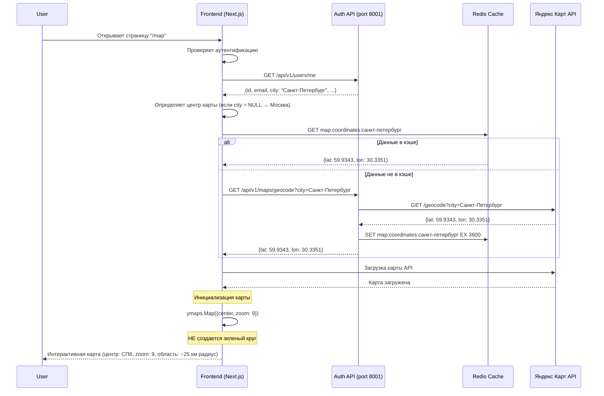

# Требования для исправления масштаба карты

**ID**: REQ-MAPS-SCALE-001
**Версия**: 1.0
**Дата**: 2025-02-11
**Автор**: Business Analyst
**Статус**: Черновик
**Связанные документы**: REQ-MAPS-001, REQ-MAPS-FIX-001

---

## 1. Обзор

### 1.1 Цель
Исправление интерпретации требований для отображения Яндекс Карт. Текущая проблема: в требованиях было указано "радиус 25 км вокруг города", что было интерпретировано как создание зеленого круга на карте. На самом деле требовалось установить масштаб карты так, чтобы при открытии отображалась область примерно 25 км вокруг города пользователя.

### 1.2 Корневой анализ проблемы

**Проблема в формулировке требований:**

1. **Неточная формулировка**: "Установка радиуса отображения (25 км вокруг города)" в REQ-MAPS-001 (строка 29)
2. **Примеры кода с кругом**: В технической спецификации (строки 825-836 REQ-MAPS-001) показан код создания зеленого круга:
   ```javascript
   const circle = new ymaps.Circle([[55.7558, 37.6173], 25000], {
       balloonContent: "Радиус 25 км"
   }, {
       fillColor: "#00FF0033",
       strokeColor: "#00FF00",
       strokeOpacity: 1,
       strokeWidth: 2
   });
   myMap.geoObjects.add(circle);
   ```
3. **Реализация масштаба**: Текущий zoom = 10 в YandexMap.tsx (строка 53) уже показывает примерно 50 км в ширину (~25 км радиус)

**Интерпретация разработчиков:**
- Создать визуальный зеленый круг радиусом 25 км на карте

**Намерение заказчика:**
- Установить масштаб карты так, чтобы при открытии была видна область 25 км вокруг города
- Зеленый круг не нужен

### 1.3 Область действия (Scope)

**Включает:**
- Уточнение требований для масштаба карты
- Удаление примеров кода с созданием зеленого круга из требований
- Уточнение zoom level для отображения 25 км вокруг города
- Обновление текстовых описаний в UI (строка 50 в map/page.tsx)

**Исключает:**
- Изменение существующей логики загрузки карты
- Изменение логики геокодирования
- Изменение структуры компонента YandexMap

---

## 2. User Story

## User Story: Исправление масштаба карты (удаление зеленого круга)

**As a** зарегистрированный пользователь,
**I want to** видеть карту с масштабом, который показывает область 25 км вокруг моего города без зеленого круга,
**So that** карта выглядела чистой и показывала нужный регион для поиска мест для рыбалки.

### Priority
- [x] High (исправление неверной интерпретации требований)

### Actors
- [x] Зарегистрированный пользователь
- [x] Product Owner
- [x] Frontend Developer
- [ ] QA Engineer

### Acceptance Criteria

**AC1: Карта открывается с масштабом, показывающим 25 км вокруг города**
- **Given** пользователь авторизован
- **And** у пользователя указан город "Санкт-Петербург" в профиле
- **When** пользователь открывает страницу "/map"
- **Then** карта инициализируется с центром в Санкт-Петербурге
- **And** масштаб карты установлен так, чтобы была видна область примерно 25 км в радиусе от центра
- **And** на карте НЕ отображается зеленый круг радиусом 25 км

**AC2: Масштаб карты соответствует 25 км радиусу**
- **Given** карта инициализирована
- **And** центр карты находится в Санкт-Петербурге (59.9343, 30.3351)
- **When** пользователь просматривает карту
- **Then** границы карты составляют примерно 50 км в ширину (25 км в каждую сторону от центра)
- **And** zoom level установлен на значение 9 (для отображения 25 км радиус)

**AC3: Зеленый круг не отображается**
- **Given** пользователь авторизован
- **When** карта загружается
- **Then** на карте НЕ отображается визуальный зеленый круг
- **And** на карте НЕ отображается всплывающее сообщение "Радиус 25 км"
- **And** карта выглядит чистой без лишних геометрических фигур

**AC4: Пользователь может менять масштаб**
- **Given** карта загружена
- **When** пользователь использует контрол zoom на карте
- **Then** масштаб карты плавно меняется
- **And** зеленый круг не появляется при изменении масштаба

**AC5: Масштаб для пользователя без города**
- **Given** пользователь авторизован
- **And** у пользователя не указан город (city = NULL)
- **When** пользователь открывает страницу "/map"
- **Then** карта инициализируется с центром в Москве
- **And** масштаб карты установлен так, чтобы была видна область примерно 25 км в радиусе от центра Москвы

**AC6: Текст на странице соответствует требованиям**
- **Given** пользователь открывает страницу "/map"
- **When** карта отображается
- **Then** текст "Карта показывает места в радиусе 25 км от вашего города" остается актуальным
- **And** текст описывает масштаб карты, а не наличие круга

---

## 3. Техническая спецификация

### 3.1 Масштаб карты для отображения 25 км радиус

Для Яндекс Карт API:
- **Zoom level 9** показывает примерно 50 км в ширину (~25 км радиус)
- **Zoom level 10** показывает примерно 25 км в ширину (~12.5 км радиус)
- **Zoom level 8** показывает примерно 100 км в ширину (~50 км радиус)

**Рекомендуемый zoom level: 9**

| Zoom Level | Примерная ширина видимой области | Радиус | Примечание |
|------------|----------------------------------|--------|------------|
| 8          | ~100 км                          | ~50 км | Слишком широкий |
| **9**      | **~50 км**                       | **~25 км** | **Рекомендуется** |
| 10         | ~25 км                           | ~12.5 км | Слишком узкий |
| 11         | ~12 км                           | ~6 км | Очень узкий |

### 3.2 Изменение в YandexMap.tsx

**Текущий код (строка 53):**
```typescript
const zoom = 10;
```

**Изменить на:**
```typescript
const zoom = 9;
```

**Почему:**
- Zoom level 9 показывает примерно 50 км в ширину, что соответствует радиусу 25 км
- Текущий zoom level 10 слишком узкий (показывает только 12.5 км радиус)

### 3.3 Удаление зеленого круга (если был реализован)

Если в коде есть создание круга (например, в других ветках или в других компонентах), удалить:

```typescript
// УДАЛИТЬ этот код:
const circle = new ymaps.Circle(
  [center, 25000],
  {
    balloonContent: "Радиус 25 км",
  },
  {
    fillColor: "#00FF0033",
    strokeColor: "#00FF00",
    strokeOpacity: 1,
    strokeWidth: 2,
  }
);
myMap.geoObjects.add(circle);
```

### 3.4 Обновление требований в документах

**Изменения в REQ-MAPS-001:**

1. **Строка 29**: Изменить:
   - Было: "Установка радиуса отображения (25 км вокруг города)"
   - Станет: "Установка масштаба карты для отображения области 25 км в радиусе вокруг города"

2. **Строки 825-836**: Удалить пример кода с созданием круга:
   ```javascript
   // УДАЛИТЬ этот блок:
   const circle = new ymaps.Circle([[55.7558, 37.6173], 25000], {
       balloonContent: "Радиус 25 км"
   }, {
       fillColor: "#00FF0033",
       strokeColor: "#00FF00",
       strokeOpacity: 1,
       strokeWidth: 2
   });
   myMap.geoObjects.add(circle);
   ```

3. **Строка 400 (в sequence diagram)**: Изменить:
   - Было: "Интерактивная карта (центр: Санкт-Петербург, радиус: 25 км)"
   - Станет: "Интерактивная карта (центр: Санкт-Петербург, zoom: 9, область: ~25 км радиус)"

**Изменения в REQ-MAPS-FIX-001:**

1. **Строки 247-260**: Удалить пример кода с созданием круга

---

## 4. Sequence Diagram

## Sequence Diagram: Исправленная инициализация карты



**Описание**: Диаграмма показывает исправленный процесс инициализации карты. Карта инициализируется с zoom: 9, что показывает область примерно 25 км в радиусе от центра. Зеленый круг не создается.

---

## 5. Бизнес-правила

| Правило | Описание |
|---------|----------|
| Правило 1 | Масштаб карты по умолчанию = zoom level 9 (показывает ~50 км ширину / ~25 км радиус) |
| Правило 2 | Зеленый круг радиусом 25 км НЕ отображается на карте |
| Правило 3 | Пользователь может менять масштаб карты через контрол zoom |
| Правило 4 | Масштаб карты определяется только параметром zoom, не созданием геометрических фигур |

---

## 6. Non-Functional Requirements

### Performance
- Загрузка карты: < 2 секунд
- Изменение масштаба карты: мгновенно (< 50ms)

### Usability
- Масштаб карты по умолчанию должен быть удобным для обзора региона
- Пользователь должен легко понимать область поиска (через масштаб карты)

---

## 7. Testing Strategy

### 7.1 Unit Tests

1. **Test YandexMap Component - Initial Zoom**:
   - Тест проверки начального zoom level
   - Ожидаемый результат: zoom = 9

2. **Test YandexMap Component - No Circle**:
   - Тест проверки отсутствия зеленого круга
   - Ожидаемый результат: на карте нет объекта Circle

### 7.2 Integration Tests

1. **Test Map Loading**:
   - Проверка загрузки страницы "/map"
   - Проверка масштаба карты при открытии

### 7.3 Manual Testing

1. **Test Scenario 1: Зарегистрированный пользователь с городом**
   - Войти в систему
   - Указать город "Санкт-Петербург" в профиле
   - Открыть страницу "/map"
   - Проверить: масштаб карты показывает примерно 25 км в радиусе от центра
   - Проверить: зеленый круг НЕ отображается

2. **Test Scenario 2: Проверка масштаба**
   - Открыть карту с центром в Санкт-Петербурге
   - Измерить ширину видимой области (можно через линейку)
   - Ожидаемый результат: примерно 50 км в ширину

3. **Test Scenario 3: Изменение масштаба**
   - Открыть карту
   - Использовать контрол zoom для приближения/отдаления
   - Проверить: масштаб меняется плавно
   - Проверить: зеленый круг не появляется

---

## 8. Risk Analysis

| Risk | Probability | Impact | Mitigation Strategy |
|------|-------------|--------|---------------------|
| Zoom level 9 не соответствует 25 км радиусу для всех широт | Low | Medium | Тестирование для разных городов, настройка по необходимости |
| Пользователи привыкнут к зеленому кругу (если он отображался) | Low | Low | Общение с пользователями, объяснение изменений |
| Текстовые описания в UI вводят в заблуждение | Low | Low | Обновление текста для ясности |

---

## 9. Definition of Ready (DoR)

- [x] Requirements четко определены
- [x] Корневой анализ проблемы выполнен
- [x] Acceptance Criteria определены
- [x] Техническая спецификация документирована
- [x] Зависимости идентифицированы
- [x] Стратегия тестирования определена
- [x] Утверждено Product Owner

---

## 10. Definition of Done (DoD)

- [ ] Zoom level изменен на 9 в YandexMap.tsx
- [ ] Зеленый круг удален (если был реализован)
- [ ] Требования REQ-MAPS-001 обновлены (удален пример кода с кругом)
- [ ] Требования REQ-MAPS-FIX-001 обновлены (удален пример кода с кругом)
- [ ] Текстовые описания в UI проверены на точность
- [ ] Unit тесты написаны
- [ ] Integration тесты пройдены
- [ ] Manual testing завершено
- [ ] Масштаб карты соответствует 25 км радиусу

---

## 11. Checklist для реализации

### Frontend (Next.js)

- [ ] Изменить zoom с 10 на 9 в YandexMap.tsx (строка 53)
- [ ] Удалить код создания зеленого круга (если есть)
- [ ] Проверить текстовые описания в map/page.tsx на точность

### Документация

- [ ] Обновить REQ-MAPS-001:
  - [ ] Изменить строку 29: "Установка масштаба карты..."
  - [ ] Удалить строки 825-836 (пример кода с кругом)
  - [ ] Обновить строку 400 в sequence diagram

- [ ] Обновить REQ-MAPS-FIX-001:
  - [ ] Удалить строки 247-260 (пример кода с кругом)

- [ ] Создать REQ-MAPS-SCALE-001 (текущий документ)

### Testing

- [ ] Unit тест для zoom level
- [ ] Unit тест для отсутствия круга
- [ ] Manual testing для всех сценариев

---

## 12. Версии документа

| Версия | Дата | Автор | Изменения |
|--------|------|-------|-----------|
| 1.0 | 2025-02-11 | Business Analyst | Создание документа - исправление интерпретации требований |

---

## 13. Согласование

| Роль | Имя | Дата | Подпись |
|------|-----|------|---------|
| Business Analyst | - | 2025-02-11 | ✅ |
| Product Owner | - | - | ⏳ |
| Tech Lead | - | - | ⏳ |
| Frontend Developer | - | - | ⏳ |
| QA Engineer | - | - | ⏳ |
