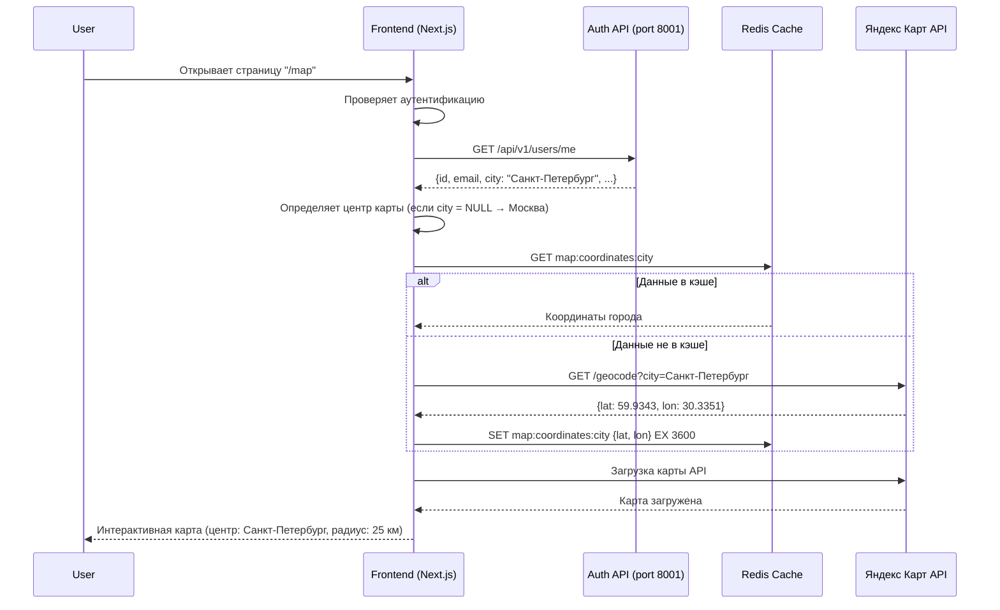
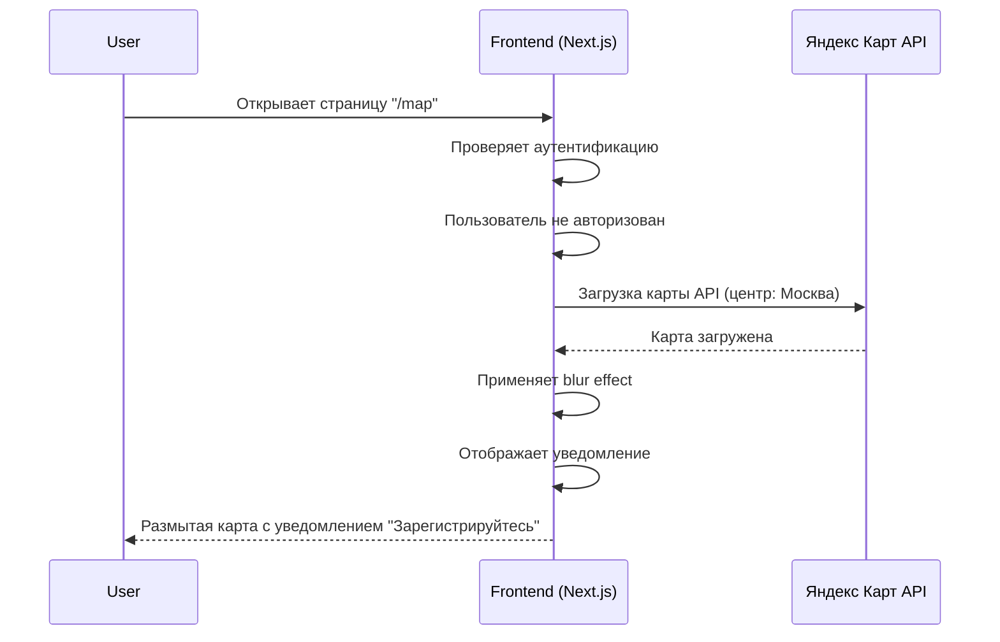

# Требования по интеграции с Яндекс Картами

**ID**: REQ-MAPS-001
**Версия**: 1.0
**Дата**: 2024-02-11
**Автор**: Business Analyst
**Статус**: Черновик

---

## 1. Обзор

### 1.1 Цель
Интеграция Яндекс Карт для отображения интерактивной карты в приложении FishMap. Карта должна отображаться в двух местах:
- Вкладка "Мои места" в профиле пользователя
- Страница "Карта"

### 1.2 Бизнес-ценность
- Улучшение UX для зарегистрированных пользователей
- Визуализация мест для рыбалки на карте
- Персонализация карты на основе местоположения пользователя

### 1.3 Область действия (Scope)
**Включает:**
- Интеграция Яндекс Карт API (ключ: dfb59053-0011-47fb-a6f1-a14efb9160d1)
- Отображение карты во вкладке "Мои места"
- Отображение карты на странице "Карта"
- Определение начального центра карты (город пользователя или Москва)
- Установка радиуса отображения (25 км вокруг города)
- Кэширование данных карты в Redis
- Размытие карты для незарегистрированных пользователей

**Исключает:**
- Добавление мест на карту (будет в следующих версиях)
- Фильтрация мест (будет в следующих версиях)
- Детализация мест (будет в следующих версиях)
- Маркеры мест (будет в следующих версиях)

---

## 2. User Story

## User Story: Отображение Яндекс Карты

**As a** зарегистрированный пользователь,
**I want to** видеть интерактивную карту на странице "Карта" и во вкладке "Мои места",
**So that** я могу визуально ориентироваться в местах для рыбалки и видеть свое местоположение.

### Priority
- [x] High (MVP, критично для первого релиза)

### Actors
- [x] Зарегистрированный пользователь
- [x] Незарегистрированный посетитель (с ограничениями)
- [ ] Moderator
- [ ] Admin
- [ ] System

### Acceptance Criteria

**AC1: Зарегистрированный пользователь видит карту на странице "Карта"**
- **Given** пользователь авторизован
- **And** у пользователя указан город "Санкт-Петербург" в профиле
- **When** пользователь переходит на страницу "/map"
- **Then** отображается Яндекс Карта
- **And** центр карты находится в Санкт-Петербурге
- **And** радиус отображения составляет 25 км вокруг города
- **And** карта интерактивна (можно двигать, приближать/отдалять)
- **And** загружаются данные из кэша Redis или API Яндекс Карт

**AC2: Зарегистрированный пользователь без указанного города видит карту на Москве**
- **Given** пользователь авторизован
- **And** у пользователя не указан город в профиле (city = NULL)
- **When** пользователь переходит на страницу "/map"
- **Then** отображается Яндекс Карта
- **And** центр карты находится в Москве
- **And** радиус отображения составляет 25 км вокруг Москвы
- **And** карта интерактивна

**AC3: Незарегистрированный пользователь видит размытую карту**
- **Given** пользователь не авторизован
- **When** пользователь переходит на страницу "/map"
- **Then** отображается Яндекс Карта в размытом состоянии (blur effect)
- **And** поверх карты отображается уведомление: "Для просмотра публичных мест рыбалки зарегистрируйтесь"
- **And** уведомление содержит кнопку "Регистрация"

**AC4: Зарегистрированный пользователь видит карту во вкладке "Мои места"**
- **Given** пользователь авторизован
- **And** у пользователя указан город "Краснодар" в профиле
- **When** пользователь переходит на страницу "/profile" и открывает вкладку "Мои места"
- **Then** отображается Яндекс Карта
- **And** центр карты находится в Краснодаре
- **And** радиус отображения составляет 25 км вокруг города
- **And** карта интерактивна

**AC5: Пользователь может указать город в профиле**
- **Given** пользователь авторизован
- **When** пользователь переходит на страницу "/profile"
- **And** открывает вкладку "Settings"
- **And** вводит город "Казань" в поле "Город"
- **And** нажимает "Сохранить"
- **Then** город сохраняется в базе данных (users.city)
- **And** возвращается сообщение "Профиль успешно обновлен"
- **And** при следующем открытии карты центр карты находится в Казани

**AC6: Валидация города в профиле**
- **Given** пользователь авторизован
- **When** пользователь пытается сохранить город с названием "!@#$%^&*()"
- **Then** возвращается ошибка "Название города должно содержать только буквы, цифры, пробелы и дефисы"
- **And** город не сохраняется

**AC7: Кэширование данных карты**
- **Given** пользователь авторизован
- **When** пользователь открывает карту
- **Then** данные карты сохраняются в Redis
- **And** при повторном открытии карты данные загружаются из кэша
- **And** время жизни кэша - 1 час

**AC8: Производительность загрузки карты**
- **Given** пользователь авторизован
- **When** пользователь открывает карту
- **Then** карта загружается в течение 2 секунд
- **And** интерактивность карты доступна после полной загрузки

### Non-Functional Requirements
- **Performance**: Карта загружается в течение 2 секунд
- **Security**: Только зарегистрированные пользователи видят полную карту
- **Scalability**: Поддержка до 1000 одновременных пользователей
- **Availability**: API Яндекс Карт доступен 99.9% времени
- **Cache**: Кэширование в Redis с TTL 1 час
- **Responsive**: Адаптивная верстка для мобильных устройств

### Dependencies
- Зависит от: Auth Service (аутентификация)
- Зависит от: Places Service (будущие маркеры мест)
- Зависит от: Яндекс Карт API (внешний сервис)
- Зависит от: Redis (кэширование)
- Блокирует: User Story "Добавление маркеров мест на карту"
- Блокирует: User Story "Фильтрация мест на карте"

### Definition of Done
- [ ] Фронтенд компонент карты реализован
- [ ] Карта отображается на странице "/map"
- [ ] Карта отображается во вкладке "Мои места"
- [ ] Размытие карты для незарегистрированных пользователей
- [ ] Поле city добавлено в таблицу users
- [ ] API для обновления city пользователя реализован
- [ ] Кэширование в Redis настроено
- [ ] Unit тесты написаны (≥80% покрытие)
- [ ] Integration тесты пройдены
- [ ] Документация обновлена
- [ ] Ручное тестирование завершено

---

## 3. Use Cases

## Use Case: Просмотр карты зарегистрированным пользователем

**ID**: UC-MAPS-001
**Версия**: 1.0
**Автор**: Business Analyst
**Дата**: 2024-02-11

### Overview
Зарегистрированный пользователь просматривает интерактивную карту на странице "Карта" или во вкладке "Мои места". Карта центрируется на городе пользователя или на Москве (если город не указан).

### Primary Actor
Зарегистрированный пользователь

### Preconditions
- [ ] Пользователь авторизован
- [ ] Пользователь имеет доступ к приложению
- [ ] Яндекс Карт API доступен

### Main Flow (Happy Path)

| Step | Actor | System | Description |
|------|-------|--------|-------------|
| 1    | User  |        | Переходит на страницу "/map" или вкладку "Мои места" |
| 2    |       | Frontend | Проверяет статус аутентификации пользователя |
| 3    |       | Frontend | Запрашивает данные пользователя через Auth Service |
| 4    |       | Backend | Возвращает данные пользователя (включая city) |
| 5    |       | Frontend | Проверяет наличие города в профиле пользователя |
| 6    |       | Frontend | Определяет центр карты (город пользователя или Москва) |
| 7    |       | Frontend | Проверяет кэш Redis для данных карты |
| 8    |       | Cache   | Возвращает кэшированные данные (если есть) |
| 9    |       | Frontend | Инициализирует Яндекс Карту API с указанным центром |
| 10   |       | Map API | Загружает карту и данные |
| 11   |       | Frontend | Сохраняет данные в кэш Redis |
| 12   |       | Frontend | Отображает интерактивную карту |
| 13   | User  |        | Взаимодействует с картой (двигает, приближает) |

### Alternative Flows

**Alt Flow 1: Город не указан**
- Предусловие: У пользователя поле city = NULL
- Действия:
  - System: Определяет центр карты на Москве (координаты: 55.7558, 37.6173)
  - System: Устанавливает радиус 25 км
  - System: Продолжает основной flow с шага 7

**Alt Flow 2: Данные в кэше Redis**
- Предусловие: Данные карты уже кэшированы
- Действия:
  - System: Шаги 9-10 пропускаются
  - System: Данные загружаются из кэша Redis
  - System: Продолжает основной flow с шага 12

**Alt Flow 3: Ошибка API Яндекс Карт**
- Предусловие: Яндекс Карт API недоступен
- Действия:
  - System: Показывает ошибку "Не удалось загрузить карту"
  - System: Предлагает повторить попытку
  - System: Логирует ошибку в ELK

**Alt Flow 4: Ошибка сети**
- Предусловие: Проблемы с интернет-соединением
- Действия:
  - System: Показывает ошибку "Проверьте интернет-соединение"
  - System: Предлагает повторить попытку

### Postconditions
- [ ] Карта успешно загружена
- [ ] Данные сохранены в кэш Redis
- [ ] Пользователь может взаимодействовать с картой

### Business Rules
- Правило 1: Если город пользователя не указан, карта центрируется на Москве
- Правило 2: Радиус отображения всегда составляет 25 км вокруг центра
- Правило 3: Кэш данных карты имеет TTL 1 час
- Правило 4: Название города должно содержать только буквы, цифры, пробелы и дефисы

### Error Conditions
- Ошибка API Яндекс Карт: Показать сообщение об ошибке
- Ошибка сети: Показать сообщение о проверке соединения
- Ошибка кэша Redis: Игнорировать, загружать из API
- Ошибка Auth Service: Перенаправить на страницу входа

---

## Use Case: Просмотр карты незарегистрированным пользователем

**ID**: UC-MAPS-002
**Версия**: 1.0
**Автор**: Business Analyst
**Дата**: 2024-02-11

### Overview
Незарегистрированный пользователь пытается просмотреть карту, но видит размытую версию с приглашением к регистрации.

### Primary Actor
Незарегистрированный посетитель

### Preconditions
- [ ] Пользователь не авторизован
- [ ] Пользователь имеет доступ к приложению
- [ ] Яндекс Карт API доступен

### Main Flow (Happy Path)

| Step | Actor | System | Description |
|------|-------|--------|-------------|
| 1    | User  |        | Переходит на страницу "/map" |
| 2    |       | Frontend | Проверяет статус аутентификации пользователя |
| 3    |       | Frontend | Определяет, что пользователь не авторизован |
| 4    |       | Frontend | Инициализирует Яндекс Карту API с центром на Москве |
| 5    |       | Map API | Загружает карту |
| 6    |       | Frontend | Применяет размытие (blur effect) к карте |
| 7    |       | Frontend | Отображает уведомление поверх карты |
| 8    |       | Frontend | Уведомление: "Для просмотра публичных мест рыбалки зарегистрируйтесь" |
| 9    |       | Frontend | Кнопка "Регистрация" ведет на страницу "/register" |
| 10   | User  |        | Видит размытую карту с уведомлением |
| 11   | User  |        | Может нажать кнопку "Регистрация" |

### Alternative Flows

**Alt Flow 1: Пользователь нажимает "Регистрация"**
- Предусловие: Пользователь нажал кнопку "Регистрация"
- Действия:
  - System: Перенаправляет на страницу "/register"

### Postconditions
- [ ] Размытая карта отображена
- [ ] Уведомление отображено
- [ ] Пользователь имеет возможность зарегистрироваться

### Business Rules
- Правило 1: Незарегистрированные пользователи не видят полную карту
- Правило 2: Уведомление должно быть четким и понятным
- Правило 3: Кнопка "Регистрация" ведет на страницу регистрации

### Error Conditions
- Ошибка API Яндекс Карт: Показать сообщение об ошибке
- Ошибка сети: Показать сообщение о проверке соединения

---

## Use Case: Указание города в профиле пользователя

**ID**: UC-MAPS-003
**Версия**: 1.0
**Автор**: Business Analyst
**Дата**: 2024-02-11

### Overview
Пользователь указывает город в своем профиле для персонализации карты.

### Primary Actor
Зарегистрированный пользователь

### Preconditions
- [ ] Пользователь авторизован
- [ ] Пользователь находится на странице "/profile"
- [ ] Вкладка "Settings" открыта

### Main Flow (Happy Path)

| Step | Actor | System | Description |
|------|-------|--------|-------------|
| 1    | User  |        | Переходит на страницу "/profile" |
| 2    | User  |        | Открывает вкладку "Settings" |
| 3    | User  |        | Вводит название города в поле "Город" |
| 4    | User  |        | Нажимает кнопку "Сохранить" |
| 5    |       | Frontend | Валидирует название города (regex) |
| 6    |       | Frontend | Отправляет PUT запрос на /api/v1/users/me |
| 7    |       | Backend | Проверяет валидацию (regex) |
| 8    |       | Backend | Обновляет поле city в таблице users |
| 9    |       | Backend | Возвращает обновленные данные пользователя |
| 10   |       | Frontend | Обновляет состояние пользователя |
| 11   |       | Frontend | Показывает уведомление "Профиль успешно обновлен" |
| 12   | User  |        | Видит обновленное значение города |

### Alternative Flows

**Alt Flow 1: Неверный формат города**
- Предусловие: Пользователь ввел "!@#$%^&*()"
- Действия:
  - System: Frontend валидация отклоняет ввод
  - System: Показывает ошибку "Название города должно содержать только буквы, цифры, пробелы и дефисы"
  - System: Поле не сохраняется

**Alt Flow 2: Ошибка сети при сохранении**
- Предусловие: Проблемы с интернет-соединением
- Действия:
  - System: Показывает ошибку "Не удалось сохранить изменения. Проверьте соединение"
  - System: Предлагает повторить попытку

**Alt Flow 3: Пустое поле города**
- Предусловие: Пользователь очистил поле "Город"
- Действия:
  - System: Сохраняет NULL в поле city
  - System: При следующем открытии карты центр будет на Москве

### Postconditions
- [ ] Город сохранен в базе данных
- [ ] Пользователь видит обновленное значение
- [ ] При следующем открытии карты центр будет на указанном городе

### Business Rules
- Правило 1: Название города должно содержать только буквы, цифры, пробелы и дефисы
- Правило 2: Пустое поле допустимо (NULL)
- Правило 3: Максимальная длина названия города - 100 символов
- Правило 4: Город сохраняется в нижнем регистре (normalization)

### Error Conditions
- Ошибка валидации: Показать сообщение об ошибке
- Ошибка сети: Показать сообщение о проверке соединения
- Ошибка API: Показать сообщение об ошибке

---

## 4. Sequence Diagram

## Sequence Diagram: Загрузка карты зарегистрированным пользователем



**Описание**: Диаграмма показывает процесс загрузки карты зарегистрированным пользователем. Система проверяет аутентификацию, получает данные пользователя, определяет город, проверяет кэш Redis для координат, загружает данные из Яндекс Карт API (если нет в кэше), и отображает карту.

---

## Sequence Diagram: Просмотр карты незарегистрированным пользователем



**Описание**: Диаграмма показывает процесс просмотра карты незарегистрированным пользователем. Система проверяет аутентификацию, определяет, что пользователь не авторизован, загружает карту с центром на Москве, применяет размытие, и отображает уведомление о регистрации.

---

## 5. Database Schema Change

## Database Schema Change: Добавление поля city в таблицу users

**Service**: Auth Service
**Date**: 2024-02-11
**Author**: Business Analyst
**Reason**: Хранение города пользователя для персонализации Яндекс Карт

### Changes

#### Alter Table: users

```sql
-- Add city column to users table
ALTER TABLE users
ADD COLUMN city VARCHAR(100);

-- Create index for search by city
CREATE INDEX idx_users_city ON users(city);

-- Check constraint for city format (optional, can be done in application layer)
ALTER TABLE users
ADD CONSTRAINT chk_city_format
CHECK (city ~ '^[a-zA-Zа-яА-ЯёЁ0-9\s\-]+$' OR city IS NULL);
```

#### Migration Script

```sql
-- Migration: add_city_column_to_users
-- Date: 2024-02-11

BEGIN;

-- Add city column
ALTER TABLE users
ADD COLUMN city VARCHAR(100);

-- Create index
CREATE INDEX idx_users_city ON users(city);

-- Add check constraint
ALTER TABLE users
ADD CONSTRAINT chk_city_format
CHECK (city ~ '^[a-zA-Zа-яА-ЯёЁ0-9\s\-]+$' OR city IS NULL);

COMMIT;
```

### Rollback Script

```sql
-- Rollback: add_city_column_to_users
-- Date: 2024-02-11

BEGIN;

-- Drop check constraint
ALTER TABLE users
DROP CONSTRAINT IF EXISTS chk_city_format;

-- Drop index
DROP INDEX IF EXISTS idx_users_city;

-- Drop column
ALTER TABLE users
DROP COLUMN IF EXISTS city;

COMMIT;
```

### Impact Analysis
- **Affected services**: Auth Service (таблица users)
- **Breaking changes**: No (добавление новой колонки без значения по умолчанию)
- **Data migration required**: No
- **Estimated downtime**: 0 seconds (ALTER TABLE ADD COLUMN без значения по умолчанию в PostgreSQL не блокирует таблицу)

---

## 6. API Specification

## API Specification: Обновление города пользователя

**Service**: Auth Service
**Версия**: v1
**Base URL**: http://localhost:8001/api/v1

### Authentication
- Required: Yes
- Method: JWT token
- Header: Authorization: Bearer <token>

### Endpoints

#### 1. PUT /users/me

**Description**: Обновление профиля пользователя (включая город)

**Request**:
```http
PUT /api/v1/users/me HTTP/1.1
Host: localhost:8001
Authorization: Bearer <token>
Content-Type: application/json

{
  "first_name": "Иван",
  "last_name": "Иванов",
  "phone": "+79001234567",
  "city": "Санкт-Петербург"
}
```

**Request Body**:
```json
{
  "first_name": {"type": "string", "required": false, "maxLength": 100, "description": "Имя"},
  "last_name": {"type": "string", "required": false, "maxLength": 100, "description": "Фамилия"},
  "phone": {"type": "string", "required": false, "maxLength": 20, "description": "Телефон"},
  "city": {"type": "string", "required": false, "maxLength": 100, "pattern": "^[a-zA-Zа-яА-ЯёЁ0-9\\s\\-]+$", "description": "Город"}
}
```

**Response 200 (Success)**:
```json
{
  "id": "uuid",
  "email": "ivan@example.com",
  "username": "ivanov",
  "first_name": "Иван",
  "last_name": "Иванов",
  "phone": "+79001234567",
  "avatar_url": "https://example.com/avatar.jpg",
  "city": "Санкт-Петербург",
  "is_active": true,
  "is_verified": true,
  "role": "user",
  "created_at": "2024-02-01T00:00:00Z",
  "updated_at": "2024-02-11T12:00:00Z"
}
```

**Response 400 (Bad Request)**:
```json
{
  "error": {
    "code": "VALIDATION_ERROR",
    "message": "Invalid input data",
    "details": {
      "city": ["Название города должно содержать только буквы, цифры, пробелы и дефисы"]
    }
  }
}
```

**Response 401 (Unauthorized)**:
```json
{
  "error": {
    "code": "UNAUTHORIZED",
    "message": "Authentication required"
  }
}
```

**Response 500 (Internal Server Error)**:
```json
{
  "error": {
    "code": "INTERNAL_ERROR",
    "message": "Internal server error"
  }
}
```

### Error Codes
- `VALIDATION_ERROR` - Ошибка валидации входных данных
- `UNAUTHORIZED` - Требуется аутентификация
- `INTERNAL_ERROR` - Внутренняя ошибка сервера

---

## 7. Non-Functional Requirements

### Performance (Производительность)

**Latency (время отклика)**:
- Загрузка карты: < 2 секунд (критично для UX)
- Получение данных пользователя: < 200ms
- Геокодирование города: < 500ms (с кэшем < 50ms)

**Throughput (пропускная способность)**:
- Поддержка до 1000 одновременных пользователей
- 100-500 req/s для API Auth Service

**Caching Strategy**:
- Кэш координат городов в Redis (TTL: 1 час)
- Ключ кэша: `map:coordinates:{city}` (city в нижнем регистре)
- Структура кэша: `{"lat": 59.9343, "lon": 30.3351}`

### Security (Безопасность)

**Аутентификация**:
- JWT токен для аутентификации (текущий подход)
- Требуется для просмотра полной карты

**Авторизация**:
- Role-Based (RBAC): user/moderator/admin
- Незарегистрированные пользователи: размытая карта + уведомление

**Валидация данных**:
- Регулярное выражение для названия города: `^[a-zA-Zа-яА-ЯёЁ0-9\s\-]+$`
- Максимальная длина: 100 символов
- Trim и нормализация (lowercase) перед сохранением

**Rate Limiting**:
- Per-IP: 100 req/min для публичных эндпоинтов
- Per-user: 60 req/min для эндпоинтов с аутентификацией

**Шифрование**:
- HTTPS в transit (обязательно для production)

### Scalability (Масштабируемость)

**Horizontal Scaling**:
- Frontend (Next.js): горизонтальное масштабирование
- Auth Service: горизонтальное масштабирование
- Redis: мастер-реплика конфигурация (будущее)

**Sharding**:
- Не требуется для текущей нагрузки

### Availability (Доступность)

**SLA**:
- API Яндекс Карт: 99.9% (зависит от внешнего сервиса)
- Auth Service: 99.9%
- Redis: 99.9%

**Disaster Recovery**:
- Active-Passive с автоматическим failover (будущее)
- Регулярные бэкапы базы данных

### Consistency (Согласованность)

**Модель согласованности**:
- Eventual consistency для кэша Redis
- Strong consistency для базы данных PostgreSQL

---

## 8. Risk Analysis

### Матрица рисков

| Risk | Probability | Impact | Mitigation Strategy |
|------|-------------|--------|---------------------|
| API Яндекс Карт недоступен | Medium | High | Graceful degradation, fallback на кэшированные данные, уведомление пользователя |
| Производительность кэша Redis | Low | Medium | Мониторинг Redis, альтернативное кэширование (localStorage) |
| Валидация названия города | Low | Low | Regex на frontend и backend, unit тесты |
| Размытие карты обходитcя | Low | Medium | Server-side check для полных данных карты, rate limiting |
| Превышение лимитов API Яндекс Карт | Medium | Medium | Кэширование, мониторинг использования, оптимизация запросов |
| Проблемы с геокодированием | Low | Medium | Fallback на базу данных с предустановленными координатами крупных городов |

### Детальный анализ рисков

#### Risk: API Яндекс Карт недоступен

**Category**: Technical
**Probability**: Medium
**Impact**: High

**Description**:
Внешний API Яндекс Карт может быть временно недоступен или работать с перебоями.

**Potential Impact**:
1. Пользователи не могут загрузить карту
2. UX ухудшается
3. Потенциальная потеря пользователей

**Mitigation Strategies**:
1. **Prevent**: Graceful degradation - показывать заглушку или альтернативное решение
2. **Mitigate**: Использовать кэшированные данные из Redis (если есть)
3. **Mitigate**: Retry с экспоненциальным backoff
4. **Accept**: Показать понятное уведомление пользователю

**Owner**: Frontend Developer
**Review Date**: 2024-03-11

---

#### Risk: Превышение лимитов API Яндекс Карт

**Category**: Technical
**Probability**: Medium
**Impact**: Medium

**Description**:
API Яндекс Карт имеет лимиты на количество запросов. Превышение лимитов приведет к блокировке API.

**Potential Impact**:
1. API заблокирован
2. Пользователи не могут загрузить карту
3. Финансовые потери (если платный тариф)

**Mitigation Strategies**:
1. **Prevent**: Активное кэширование в Redis (TTL: 1 час)
2. **Prevent**: Мониторинг использования API (alerting при 80% лимита)
3. **Mitigate**: Оптимизация запросов (батчинг)
4. **Mitigate**: Retry с backoff при получении 429 кода

**Owner**: Backend Developer
**Review Date**: 2024-03-11

---

#### Risk: Валидация названия города

**Category**: Security
**Probability**: Low
**Impact**: Low

**Description**:
Пользователь может ввести невалидные данные для города (SQL injection, XSS).

**Potential Impact**:
1. Уязвимость безопасности
2. Некорректное сохранение данных
3. Ошибки при геокодировании

**Mitigation Strategies**:
1. **Prevent**: Regex валидация на frontend и backend
2. **Prevent**: Использование параметризованных запросов (SQLAlchemy)
3. **Mitigate**: Sanitization входных данных
4. **Accept**: Unit и integration тесты для валидации

**Owner**: Backend Developer
**Review Date**: 2024-03-11

---

## 9. Definition of Ready (DoR)

**Перед началом разработки требования должны быть:**

- [x] **Clear**: Понятны всем членам команды
- [x] **Testable**: Можно протестировать
- [x] **Feasible**: Технически выполнимы
- [x] **Valuable**: Приносят ценность бизнесу
- [x] **Sized**: Размер позволяет реализовать за 1 спринт
- [x] **Dependencies**: Все зависимости идентифицированы
- [x] **Acceptance Criteria**: Полностью определены
- [x] **UI/UX**: Мокапы/прототипы созданы (простая карта без маркеров)
- [x] **Approved**: Утверждены стейкхолдерами
- [x] **Prioritized**: Приоритет установлен (High)

---

## 10. Definition of Done (DoD)

**Считать выполненным, когда:**

- [ ] **Code**: Код написан и прошел code review
- [ ] **Tests**: Unit тесты написаны (≥80% покрытие)
- [ ] **Integration**: Интеграционные тесты прошли
- [ ] **Documentation**: README, API docs обновлены
- [ ] **Health Checks**: /health endpoint работает
- [ ] **Logging**: Логи отправляются в ELK
- [ ] **Deployment**: Развернуто в dev environment
- [ ] **Manual Testing**: Ручное тестирование завершено
- [ ] **Acceptance**: Все критерии приемки выполнены
- [ ] **Documentation**: Пользовательская документация создана

---

## 11. Приложение: Техническая спецификация Яндекс Карт

### 11.1 Яндекс Карт API

**API Key**: dfb59053-0011-47fb-a6f1-a14efb9160d1
**Документация**: https://yandex.ru/dev/maps/jsapi/

### 11.2 Инициализация карты

```javascript
// Пример инициализации Яндекс Карты
ymaps.ready(init);

function init() {
    const myMap = new ymaps.Map("map-container", {
        center: [55.7558, 37.6173], // Москва по умолчанию
        zoom: 10,
        controls: ['zoomControl', 'fullscreenControl']
    });

    // Установка радиуса 25 км
    const circle = new ymaps.Circle([[55.7558, 37.6173], 25000], {
        balloonContent: "Радиус 25 км"
    }, {
        fillColor: "#00FF0033",
        strokeColor: "#00FF00",
        strokeOpacity: 1,
        strokeWidth: 2
    });

    myMap.geoObjects.add(circle);
}
```

### 11.3 Геокодирование (получение координат по названию города)

```javascript
// Пример геокодирования
ymaps.geocode('Санкт-Петербург').then(function (res) {
    const firstGeoObject = res.geoObjects.get(0);
    const coords = firstGeoObject.geometry.getCoordinates();
    console.log(coords); // [59.9343, 30.3351]
});
```

### 11.4 Размытие карты (Blur Effect)

```css
/* CSS для размытия карты */
.map-blur {
    filter: blur(5px);
    pointer-events: none;
    user-select: none;
}

.map-overlay {
    position: absolute;
    top: 50%;
    left: 50%;
    transform: translate(-50%, -50%);
    text-align: center;
    z-index: 10;
}
```

### 11.5 Кэширование координат в Redis

```python
# Пример сохранения координат в Redis
import redis
import json

r = redis.Redis(host='redis', port=6379, db=0)

def cache_city_coordinates(city: str, lat: float, lon: float):
    key = f"map:coordinates:{city.lower()}"
    value = json.dumps({"lat": lat, "lon": lon})
    r.setex(key, 3600, value)  # TTL: 1 час

def get_city_coordinates(city: str):
    key = f"map:coordinates:{city.lower()}"
    value = r.get(key)
    if value:
        return json.loads(value)
    return None
```

---

## 12. Версии документа

| Версия | Дата | Автор | Изменения |
|--------|------|-------|-----------|
| 1.0 | 2024-02-11 | Business Analyst | Создание документа |

---

## 13. Согласование

| Роль | Имя | Дата | Подпись |
|------|-----|------|---------|
| Business Analyst | - | 2024-02-11 | ✅ |
| Product Owner | - | - | ⏳ |
| Tech Lead | - | - | ⏳ |
| Frontend Developer | - | - | ⏳ |
| Backend Developer | - | - | ⏳ |
